## 网卡桥接配置

首先，我们登录 ESXI 8.02u web 管理页面，找到左侧 菜单栏 中的网络，然后点击右侧的物理网卡，看 ESXI 有几个网卡

**下图默认有 6 个物理网卡，分别为：**
-  **网卡1：vmnic0**；
-  **网卡2：vmnic1**；
-  **网卡3：vmnic2**；
-  **网卡4：vmnic3**；
-  **网卡5：vmnic4**；
-  **网卡6：vmnic5**；

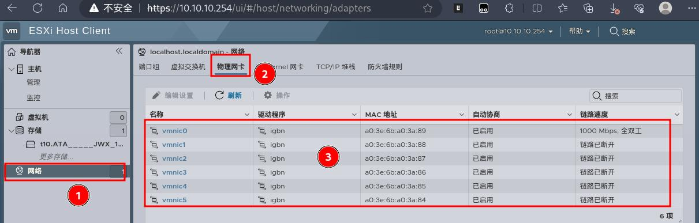

其次，我们的网络规划如下：**vmnic0~vmnic4** 为 **Lan** ，**vmnic5** 为 **Wan** 。所以接下来我们先要将所有网卡都添加成独立的虚拟交换机，然后再将创建的虚拟交换机创建成独立的端口组

### 虚拟交换机的配置

#### 默认虚拟交换机 mnic0 设置

之所有有默认虚拟交换机，是因为我们已经使用网线将 ESXI 主机和我们的电脑连接了，否则你也不会在电脑上访问到 ESXI  web 管理页面了：

1.点击 网络 菜单栏 中的 虚拟交换机，点击默认创建的交换机：
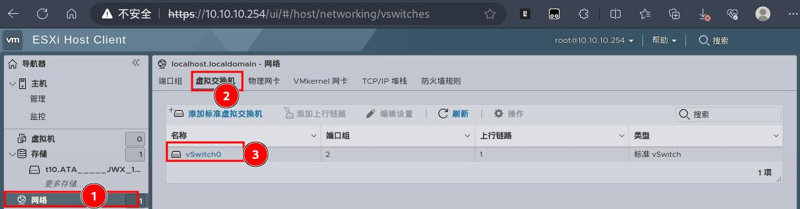

2.进入交换机详情页面后，点击上面的 编辑设置：
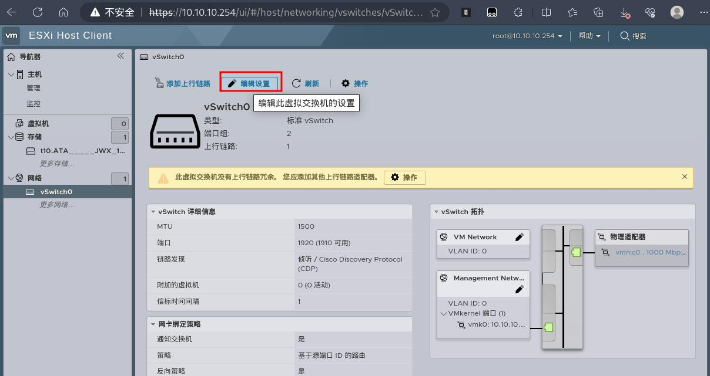

3.在 编辑标准虚拟交换机窗口，将安全设置下面的三个属性都设置为 接受，然后点击保存！
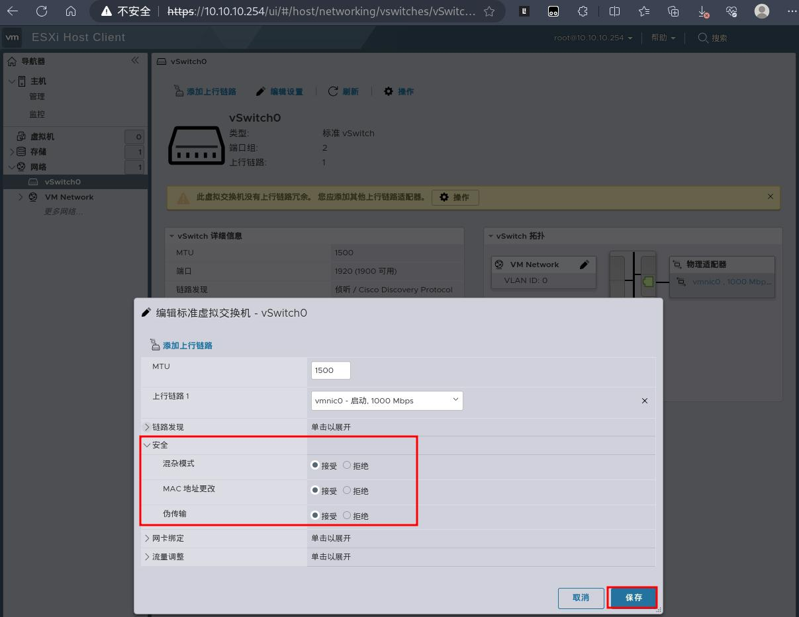

#### 添加其它 Lan 口虚拟交换机

1.回到 网络 菜单，点击网络页面下的 虚拟交换机，然后点击下面的 添加标准虚拟交换机：
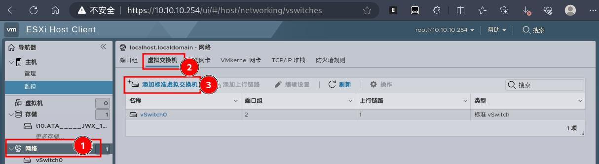

2.在添加标准虚拟交换机窗口，按照顺序依次将网卡添加成独立的交换机，且安全模式都要设置为接受

2.1.**网卡2：vmnic1** 的添加：

2.2.**网卡3：vmnic2** 的添加：
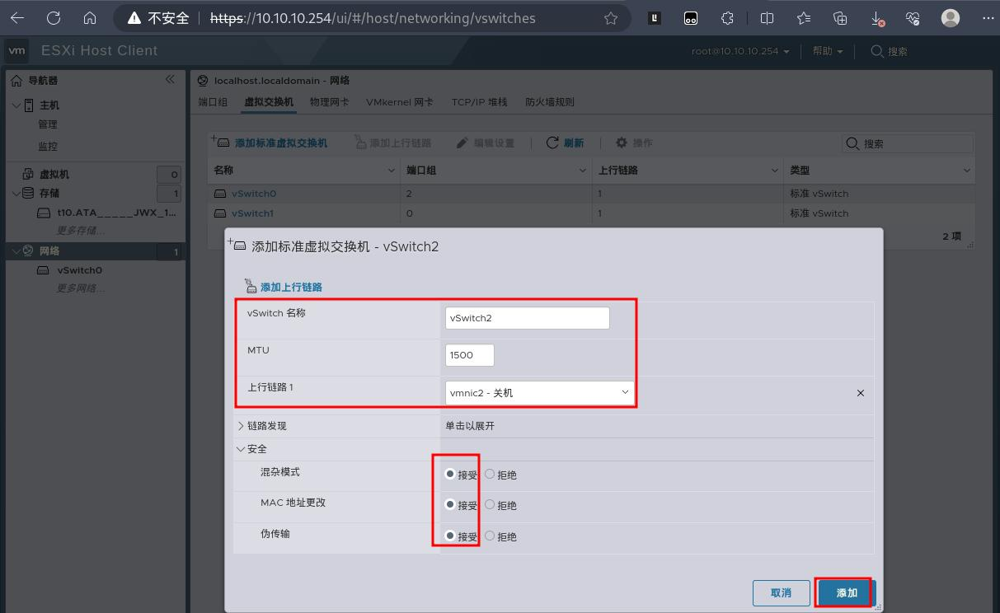

2.3.**网卡4：vmnic3** 的添加：
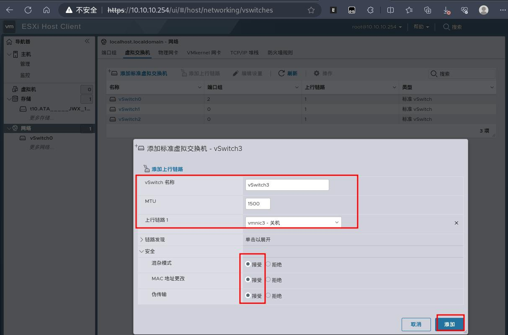

2.4.**网卡5：vmnic4** 的添加：
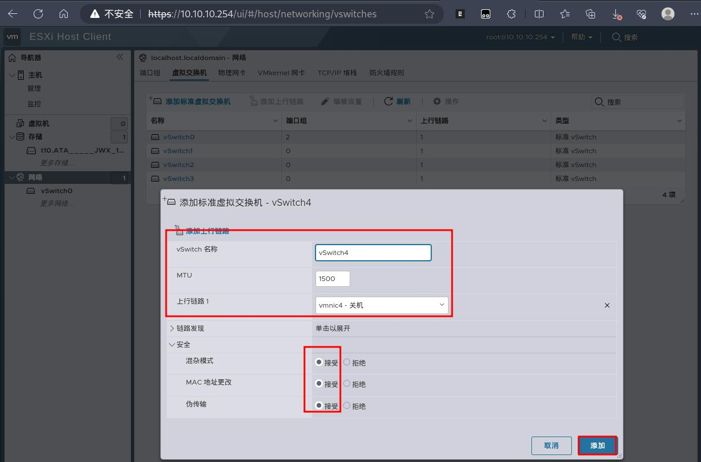

2.5.**网卡6：vmnic45** 的添加：
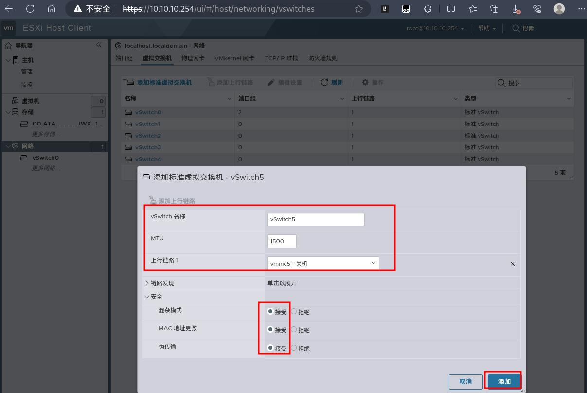

**为什么这里不添加 网卡1：vmnic0？ 那是因为默认第一个口已经在上面配置了,所以不需要额外在这里添加了** 

3.到此，已经为所有网卡都单独配置了虚拟交换机了，回到网络菜单主页可以看到：
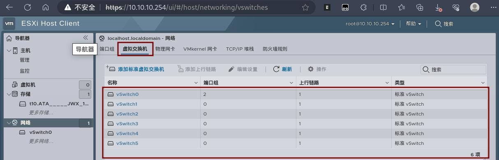

### 端口组的配置

1.回到 网络 菜单，点击网络页面下的 端口组，然后点击下面的 添加端口组：
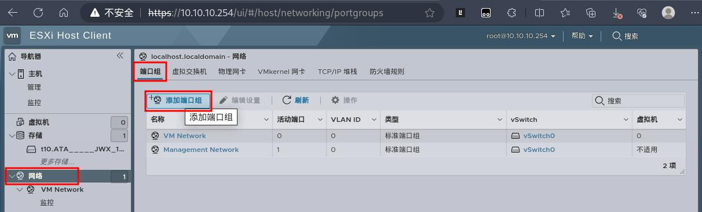

2.在添加标端口组窗口，按照顺序依次手动选择将上面创建的标准虚拟交换机添加成独立的端口组中，这里的安全模式都不需要手动额外设置：

2.1.标准虚拟交换机2（**标准虚拟交换机1 ： VM Network 为默认系统自动添加的，所以不需要手动额外添加**）：
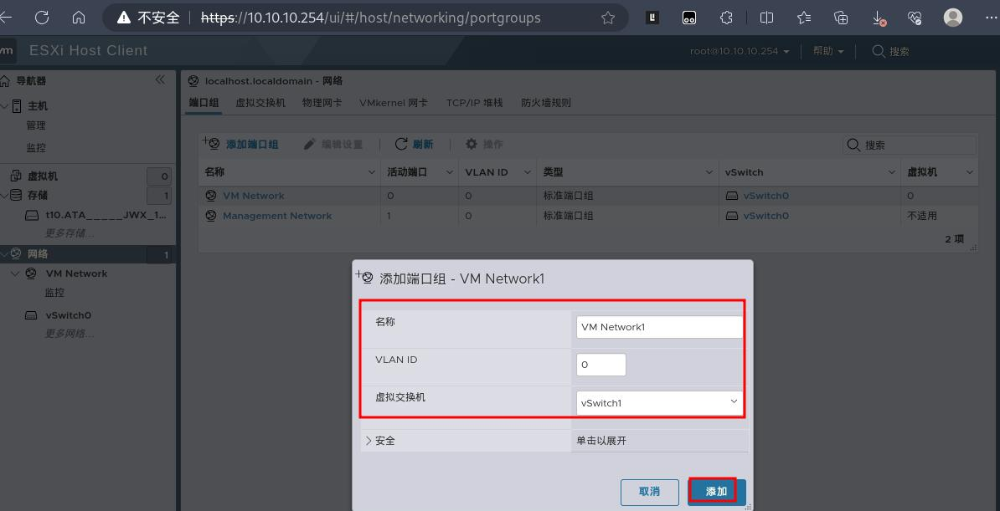

2.1.标准虚拟交换机3
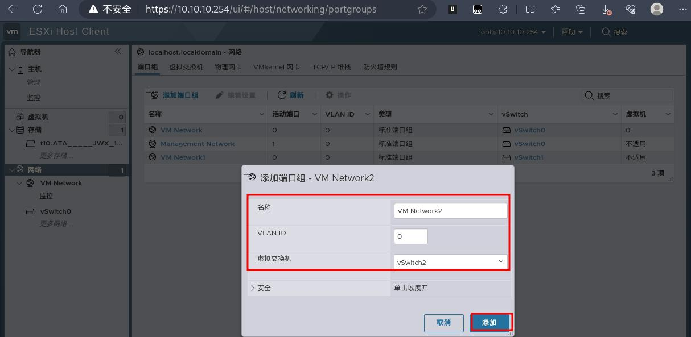

2.1.标准虚拟交换机4
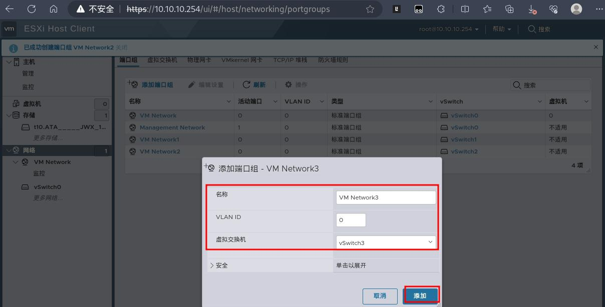

2.1.标准虚拟交换机5
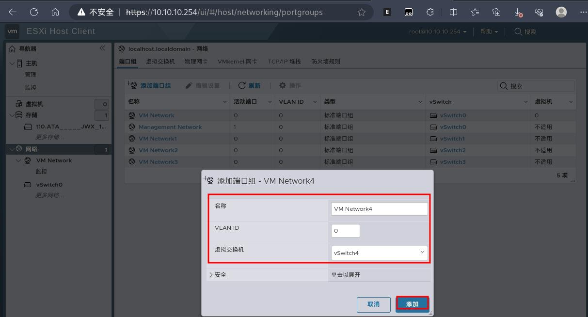

2.1.标准虚拟交换机6
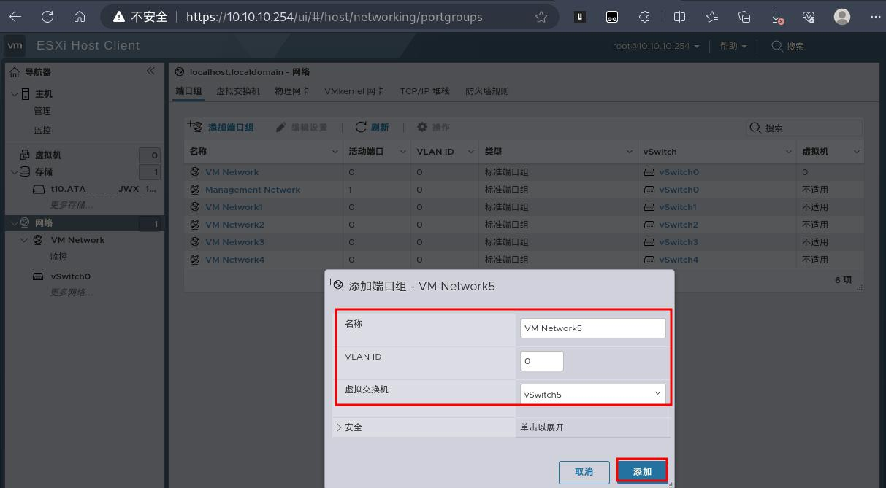

3.到此，已经为所有网卡都单独配置了虚拟交换机了，回到网络菜单主页可以看到：
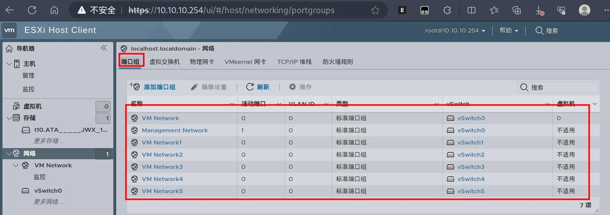