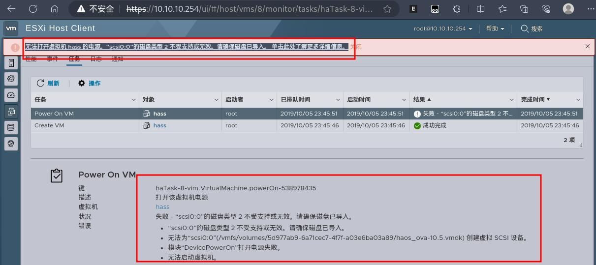
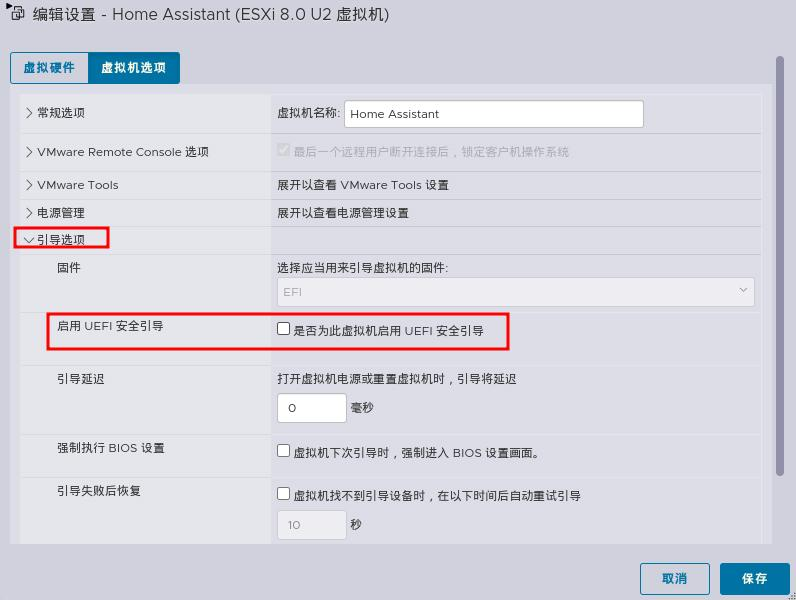

## ESXI 8.0U2 安装 HomeAssistant 无法启动：

按照官方提供的安装方式：[Install Home Assistant Operating System](https://www.home-assistant.io/installation/linux)

由于我使用的是 ESXI 8.0U2 ,所以按照官方给出的安装方式，没有找到兼容性 Workstation 和 ESXI （`compatible with the default of Workstation and ESX`）的选项  ，而使用其它选项启动虚拟机都会报：**无法打开虚拟机 Home-Assistant 的电源。“scsi0:0”的磁盘类型 2 不受支持或无效。请确保磁盘已导入。 单击此处了解更多详细信息。**导致虚拟机无法启动




## 解决方法

使用 ssh 方式登录 ESXI ,将官方提供的 vmdk 文件转换成 ESXI 兼容的类型，如下：

```bash
┌──(leazhi㉿kali-desktop)-[~]
└─$ ssh root@10.10.10.254                             
(root@10.10.10.254) Password: 
The time and date of this login have been sent to the system logs.

WARNING:
   All commands run on the ESXi shell are logged and may be included in
   support bundles. Do not provide passwords directly on the command line.
   Most tools can prompt for secrets or accept them from standard input.

VMware offers powerful and supported automation tools. Please
see https://developer.vmware.com for details.

The ESXi Shell can be disabled by an administrative user. See the
vSphere Security documentation for more information.

# 查找上传的  home assistant 官方解压出来的虚拟硬盘
[root@localhost:~] find /* -type f -iname  'haos*'
/vmfs/volumes/5d977ab9-6a71cec7-4f7f-a03e6ba03a89/haos_ova-10.5.vmdk

# 进入查找到的目录
[root@localhost:~] cd /vmfs/volumes/5d977ab9-6a71cec7-4f7f-a03e6ba03a89/

# 格式转换
[root@localhost:/vmfs/volumes/5d977ab9-6a71cec7-4f7f-a03e6ba03a89] vmkfstools -i haos_ova-10.5.vmdk haos_ova-10.5_exsi.v
mdk
Destination disk format: VMFS zeroedthick
Cloning disk 'haos_ova-10.5.vmdk'...
Clone: 100% done.
```

然后在创建新的虚拟机时删除创建虚拟机时自带的磁盘，将转换后的虚拟磁盘加入到虚拟机。在开机之前，还需要去掉 引导选项下面 启用 UEFI 安全引导属性的勾 才行，否则会出现在启动的时候找不到磁盘的情况！：
