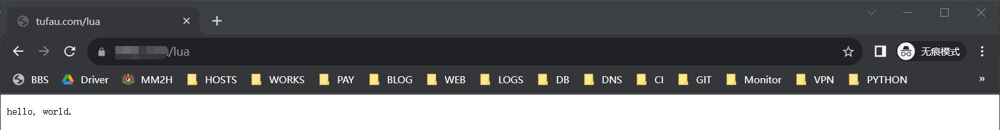
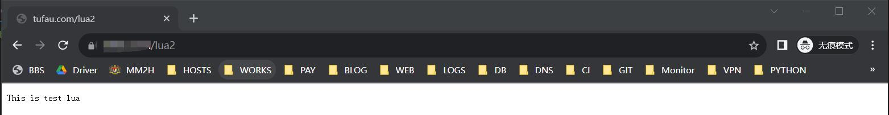

前面我们已经成功为 tengine 添加了 lua 模块。现在我们就来测试下，看能否能被正吃识别。

## 将 lua 代码写在 nginx 配置文件中

1.在 nginx 的 conf.d 目录下添加一个测试的域名文件 test.damo.com.conf ,内容为：
```bash
server {
    listen 80;
    listen 443 ssl;
    server_name test.damo.com;

    index index.htm index.html;
    root /usr/local/nginx/html;
    ssl_certificate  /usr/local/ssl/test.damo/test.damo.pem;
    ssl_certificate_key  /usr/local/ssl/test.damo/test.damo.key;
    ssl_session_cache    shared:SSL:1m;
    ssl_session_timeout  5m;
    ssl_ciphers  HIGH:!aNULL:!MD5;
    ssl_prefer_server_ciphers  on;

    charset utf-8;

    if ( $ssl_protocol = "" ) {
        rewrite ^ https://$host$request_uri?;
    }


    location / {
        root /usr/local/nginx/html;
	    index index.htm index.html;
    }

    # 将 lua 代码写在 nginx 配置文件中
    location /lua {
        default_type 'text/plain';
        content_by_lua 'ngx.say("Hello, Lua!")';
    }
}
```

2.执行命令 `nginx -t` 检查下 nginx 配置是否有误：
```bash
root@vultr:/usr/local/nginx# nginx -t
nginx: the configuration file /usr/local/nginx/conf/nginx.conf syntax is ok
nginx: configuration file /usr/local/nginx/conf/nginx.conf test is successful
```

3.执行命令 `nginx -s reload` 重载下 nginx 服务。
```bash
root@vultr:/usr/local/nginx# nginx -s reload
```

4.在浏览器中输入: test.damo.com/lua ，查看能否访问，如：


## 将 lua 代码单独写在一个文件中，然后 nginx 调用

1.在 nginx 安装目录下创建 lua 目录，用于存放 lua 脚本文件：
```bash
mkdir /usr/local/nginx/lua
```

2.在创建的 lua 目录下新建 lua 脚本文件 test.lua,内容为：
```lua
ngx.say("This is test lua");
```

4.编辑测试的域名文件 test.damo.com.conf，将其修改成：
```bash
server {
    listen 80;
    listen 443 ssl;
    server_name test.damo.com;

    index index.htm index.html;
    root /usr/local/nginx/html;
    ssl_certificate  /usr/local/ssl/test.damo/test.damo.pem;
    ssl_certificate_key  /usr/local/ssl/test.damo/test.damo.key;
    ssl_session_cache    shared:SSL:1m;
    ssl_session_timeout  5m;
    ssl_ciphers  HIGH:!aNULL:!MD5;
    ssl_prefer_server_ciphers  on;

    charset utf-8;

    if ( $ssl_protocol = "" ) {
        rewrite ^ https://$host$request_uri?;
    }


    location / {
        root /usr/local/nginx/html;
	index index.htm index.html;
    }

    # 将 lua 代码单独写在一个文件中，然后 nginx 调用
    location /lua2 {
        default_type 'text/html';                   # 这里一定要添加默认类型，否则访问该文件会变成下载
	    content_by_lua_file lua/test.lua;
    }
}

```

5.执行命令 `nginx -t` 检查下 nginx 配置是否有误：
```bash
root@vultr:/usr/local/nginx# nginx -t
nginx: the configuration file /usr/local/nginx/conf/nginx.conf syntax is ok
nginx: configuration file /usr/local/nginx/conf/nginx.conf test is successful
```

6.执行命令 `nginx -s reload` 重载下 nginx 服务。
```bash
root@vultr:/usr/local/nginx# nginx -s reload
```

7.在浏览器中输入: test.damo.com/lua ，查看能否访问，如：

