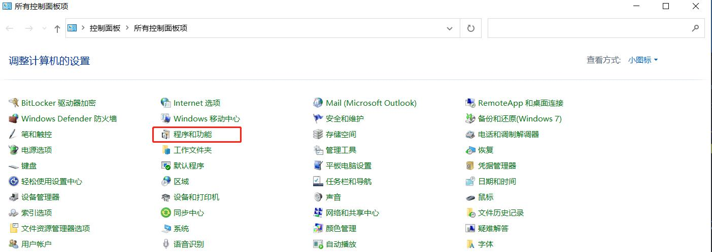
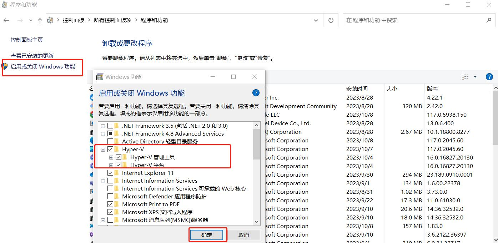
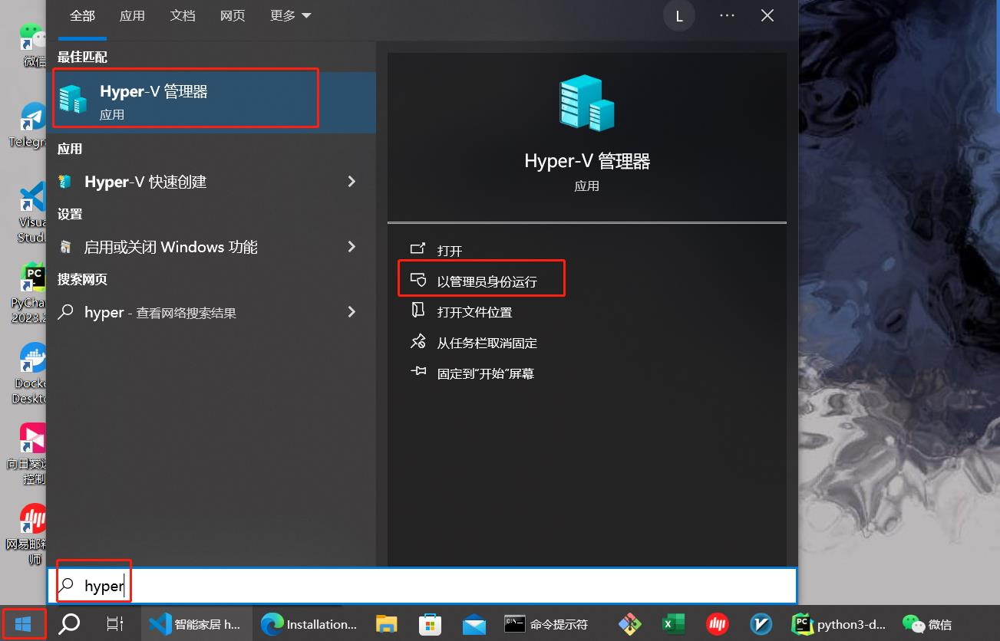
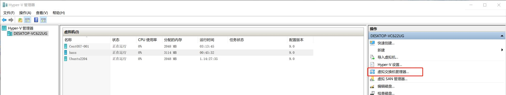
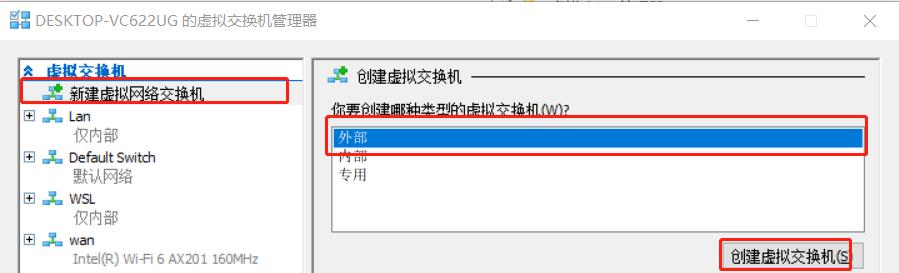
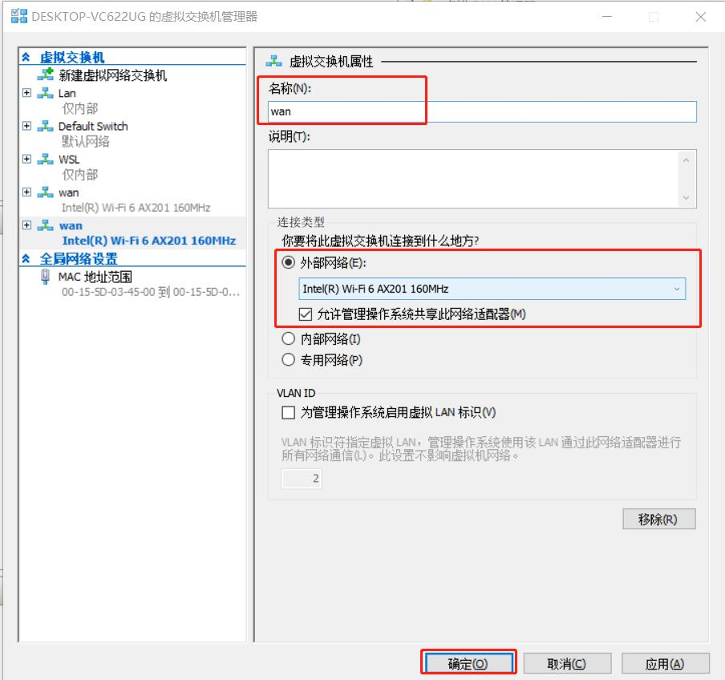
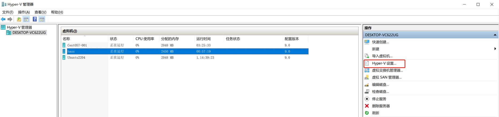
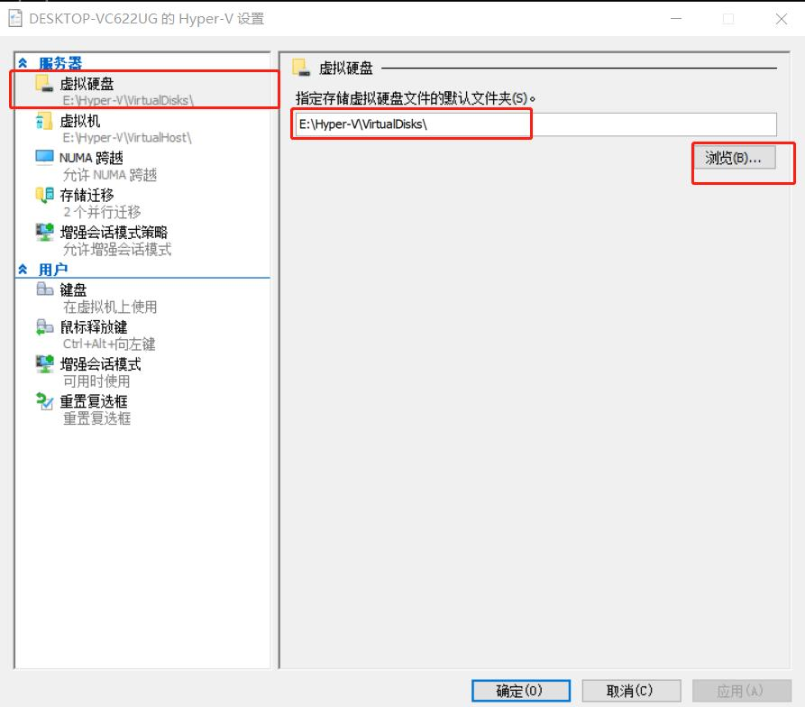
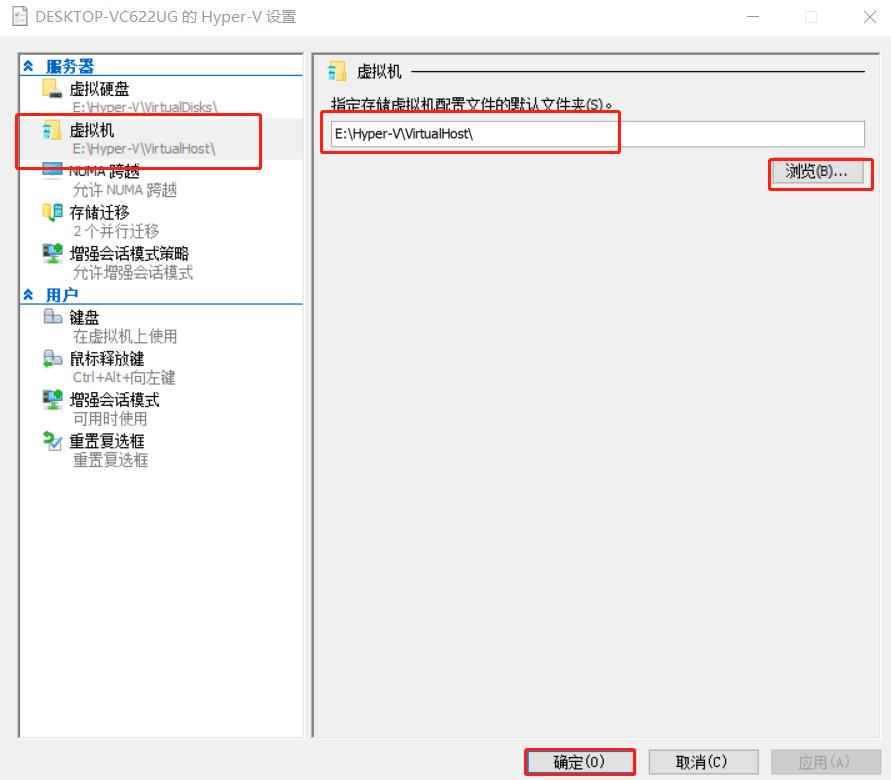

## 系统环境
- OS：Windows 10 专业版 22H2
- CPU：11th Gen Intel(R) Core(TM) i7-1195G7 @ 2.90GHz   2.92 GHz
- 内存：16.0 GB (15.8 GB 可用)
- Hyper-V：版本: 10.0.19041.1

## 安装配置 Hyper-V

由于我使用的是 windows 10 专业版 22H2，默认没有安装 Hyper-V，所以需要先安装 Hyper-V。

### 安装 Hyper-V

1.双击桌面控制面板，打开控制面板窗口，在里面进行安装：

1.1.点击控制面板窗口里面的 `程序和功能`：

1.2.进入`程序和功能` 窗口后，点击 `启用或关闭Windows功能`，然后在弹出的 `Windows 功能` 窗口里面找到并勾选Hyper-V 相关的选项。

1.3.点击确定后。系统后自动安装 Hyper-V 相关组件。安装完成，重启下系统！

### 配置 Hyper-V

Hyper-V 安装完成后，我们就可以对其进行相关配置

点击电脑左下角的 windows 图标，输入关键字 `hyper` , 然后在搜到到的 hyper-v 图标上点击以管理员身份打开：

#### 创建桥接网络

1.点击 `创建虚拟交换机` 按钮，创建虚拟交换机。

2.在打开的 `虚拟交换机管理器` 窗口点击 `新建虚拟网络交换机`， 在 `你要创建哪种类型的虚拟交换机` 窗口中点击 `外部` ，然后点击下面的 `创建虚拟交换机` ：

3.在打开的 `虚拟交换机属性` 窗口中，输入虚拟交换机的名称，链接类型选择 `外部网络` 模式，且选中你电脑中的网卡名称，同时，勾选下面的 `允许管理操作系统共享此网络适配器`，最后点击确定（忽略下图中已创建好的 wan）：

#### Hyper-V 设置

为了便于管理虚拟机，以减少 Hyper-V 对系统盘空间的占用，我们将虚拟机存放目录修改到指定的盘符下面

1.点击 Hyper-V 管理器 窗口右侧操作菜单栏里面的 `Hyper-V 设置`：

2.在打开的 Hyper-V 设置窗口中，点击左侧 `服务器` 菜单栏下的 `虚拟硬盘`，然后再右侧的虚拟硬盘属性中指定虚拟机磁盘存放的目录：

3.同理，点击左侧 `服务器` 菜单栏下的 `虚拟机`，然后在右侧的虚拟机属性中指定虚拟机配置文件存放的目录：

