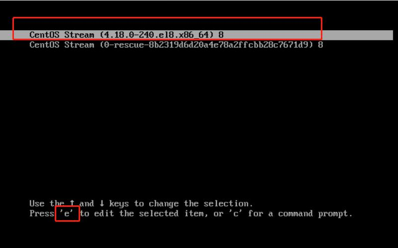
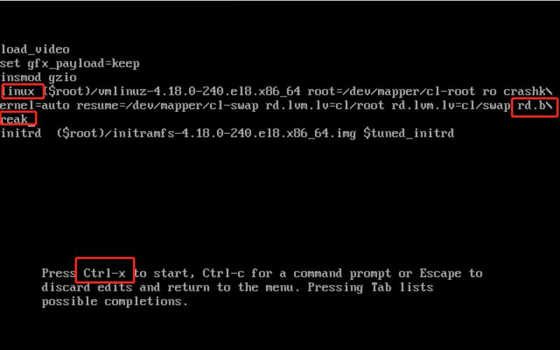
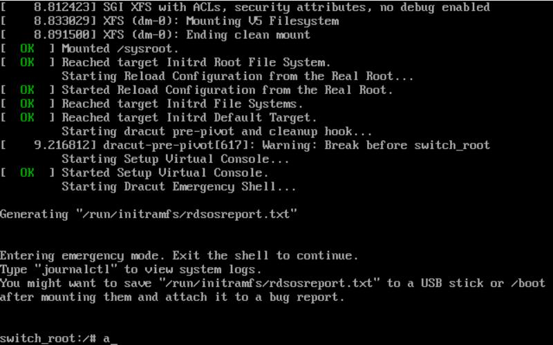
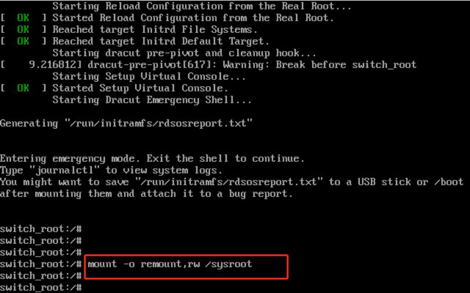
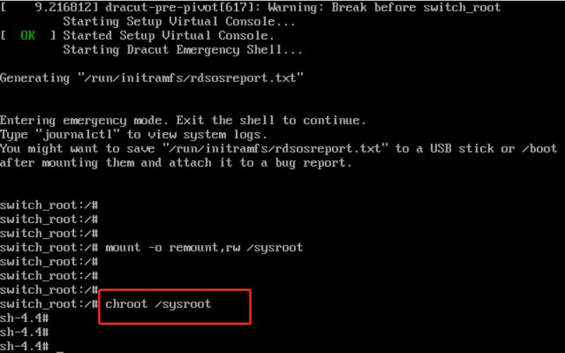
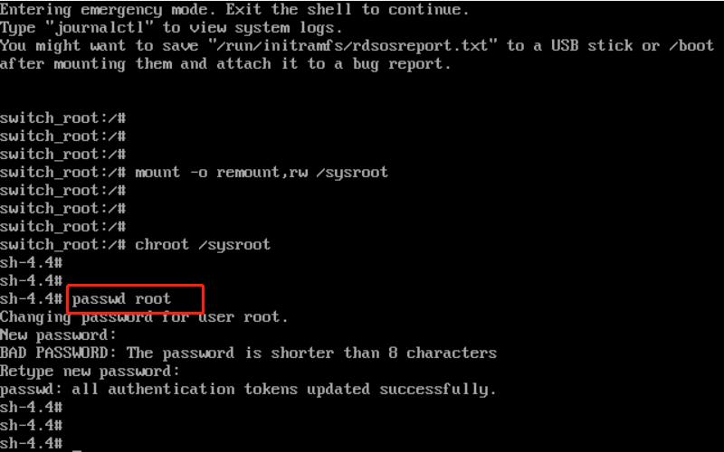
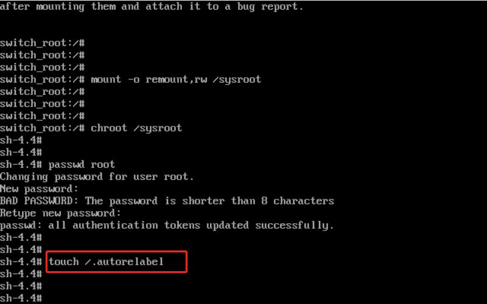
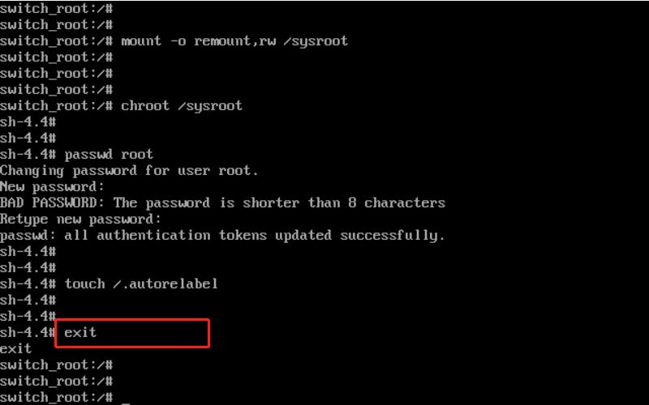
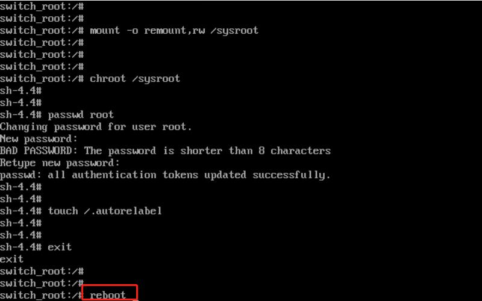
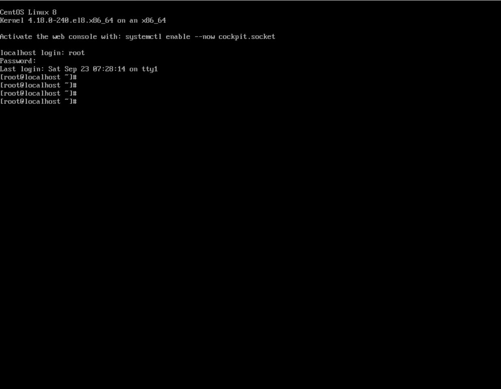

## 系统环境：
- OS：CentOS-8.3.2011-x86_64-minimal
- Kernal：4.18.0-240.el8.x86_64 #1 SMP Fri Sep 25 19:48:47 UTC 2020 x86_64 x86_64 x86_64 GNU/Linux

**系统安装说明：**
- 1.采用的最小化安装；
- 2.安装时没有进行手动分区，而是采用自动分区模式（默认就 2 个分区，一个为 swap ,一个为 root）;
- 3.系统安装完成后，默认的文件系统类型为 lvm ,分区格式为 xfs;

## 故障模拟

假设忘记了 root 密码，需要修改密码。

## 解决方法

1.重启系统， 在启动过程中，当GRUB引导菜单出现时，按下任意键以停止自动引导。 

2.在GRUB菜单中，选择要启动的CentOS内核，并按下 "e" 键进入编辑模式。   
 

3.在编辑模式中，找到以 "linux" 开头的行，并在行尾添加 "rd.break"，然后按下 "Ctrl + x" 启动系统。 

4.此时，系统将进入紧急模式（emergency mode），并会挂载根文件系统为只读。

5.输入命令 `mount -o remount,rw /sysroot` 以重新挂载根文件系统为可写模式：

6.接着输入 `chroot /sysroot` 命令以切换到根文件系统：

7.接下来，就可以输入命令 `passwd root` 修改 root 用户密码了.密码需要输入2 次，下面的警告是因为我输入的密码长度不够，不用理会：

8.**这一步，貌似可以省略**：执行命令 `touch /.autorelabel` 以生成SELinux策略：

9.输入命令 `exit` 以退出chroot环境：

10.最后，输入 `reboot` 命令， 回车重启系统。

11.系统重启好后，就可以使用修改的密码进行登录了！

