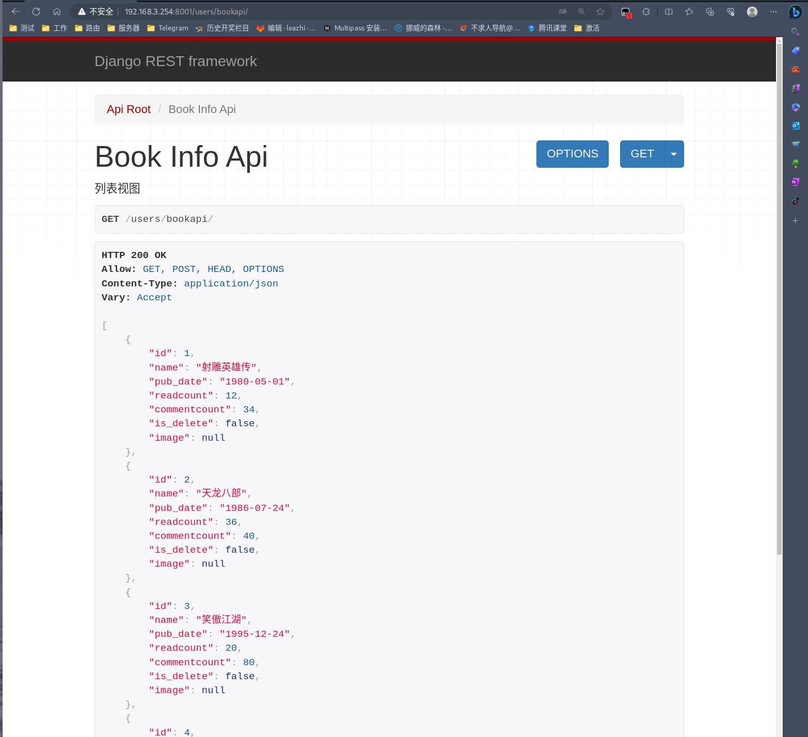
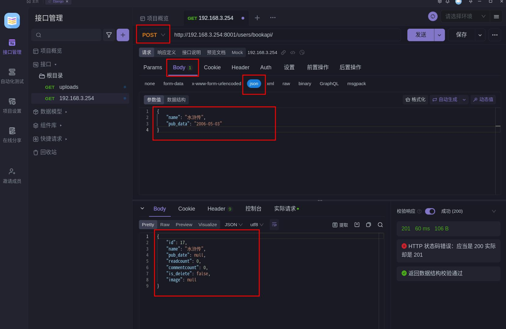
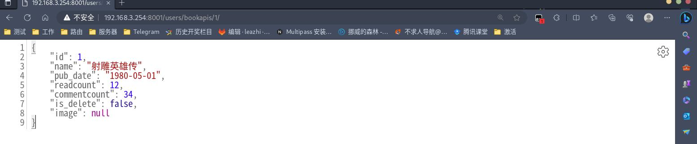
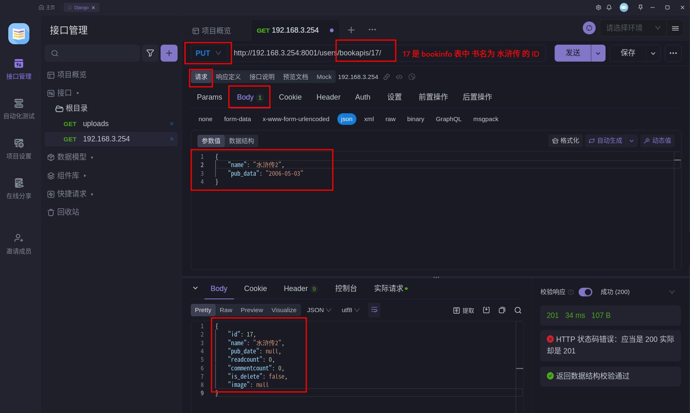
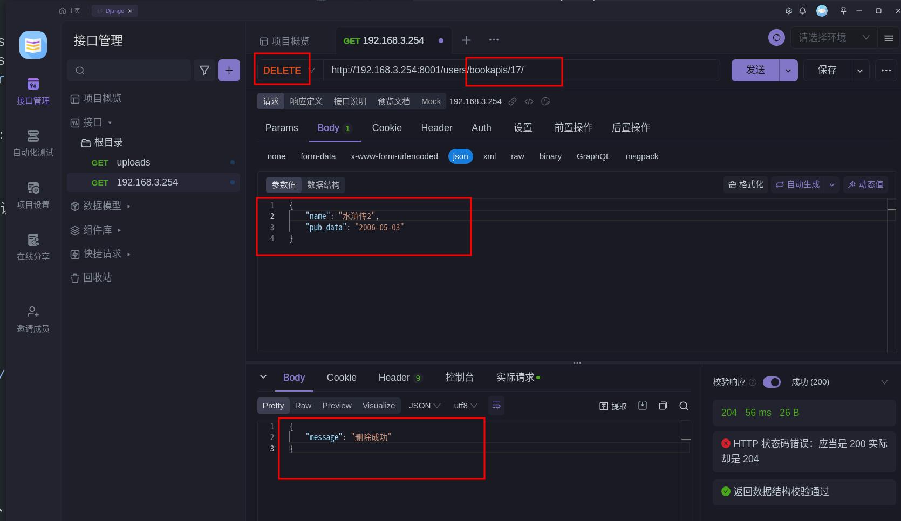
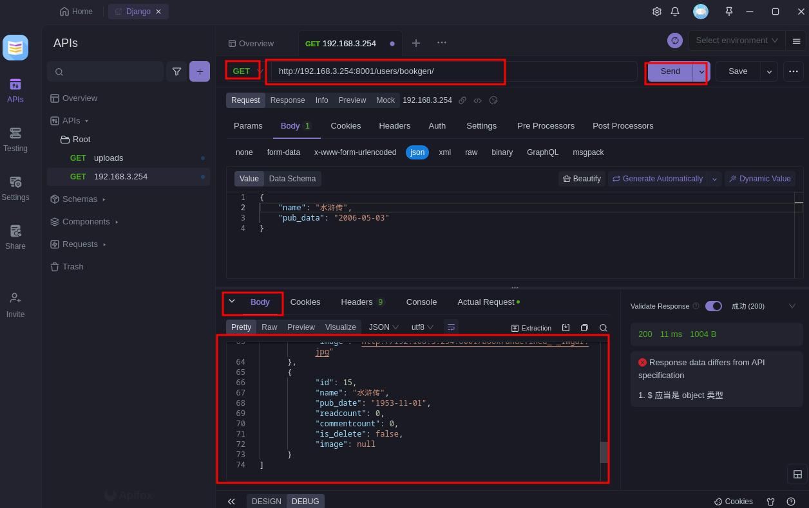
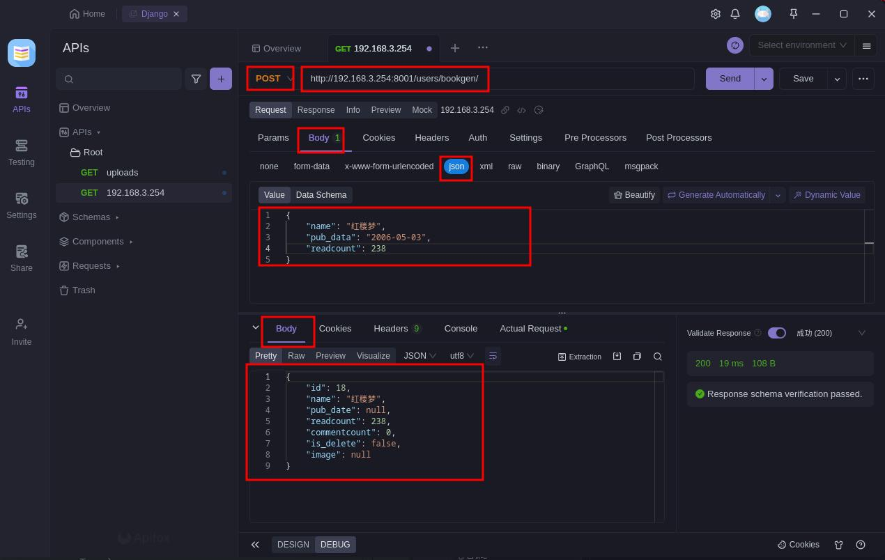
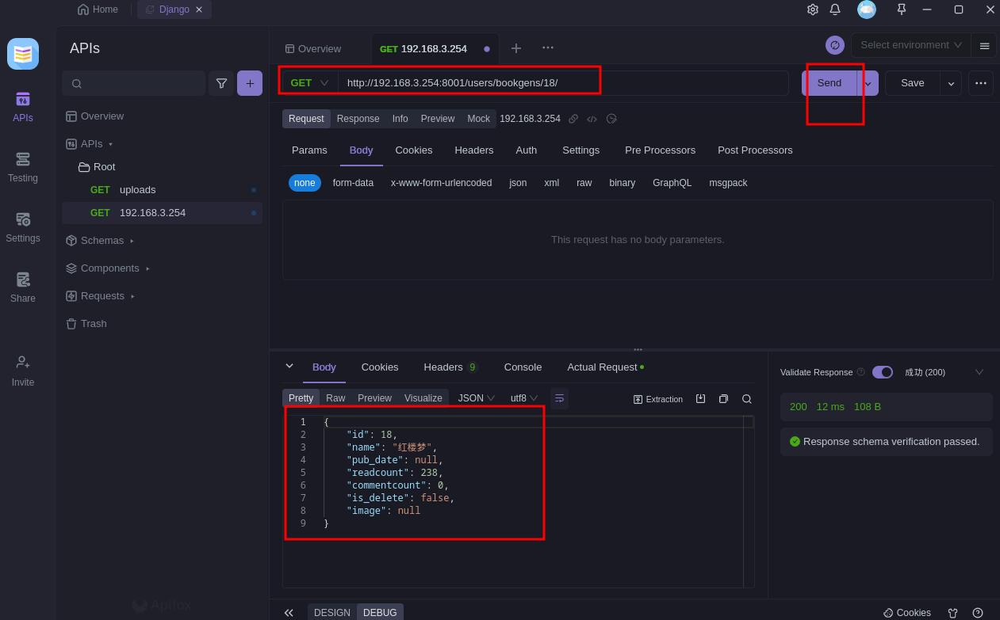
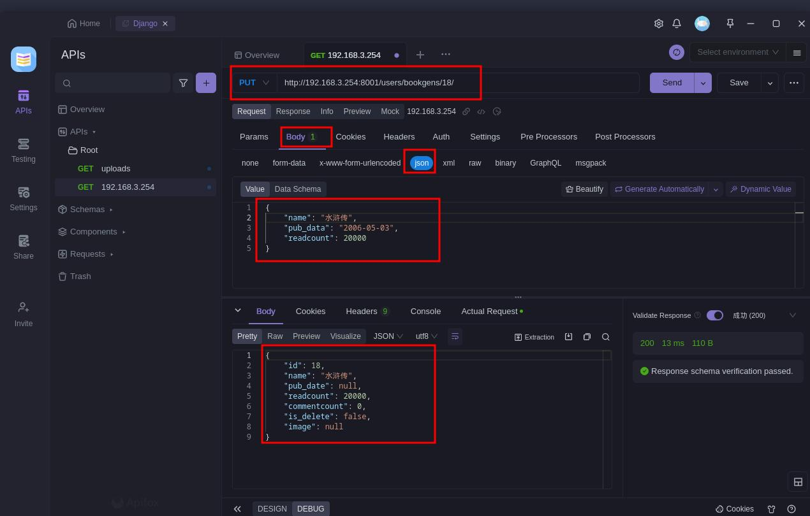
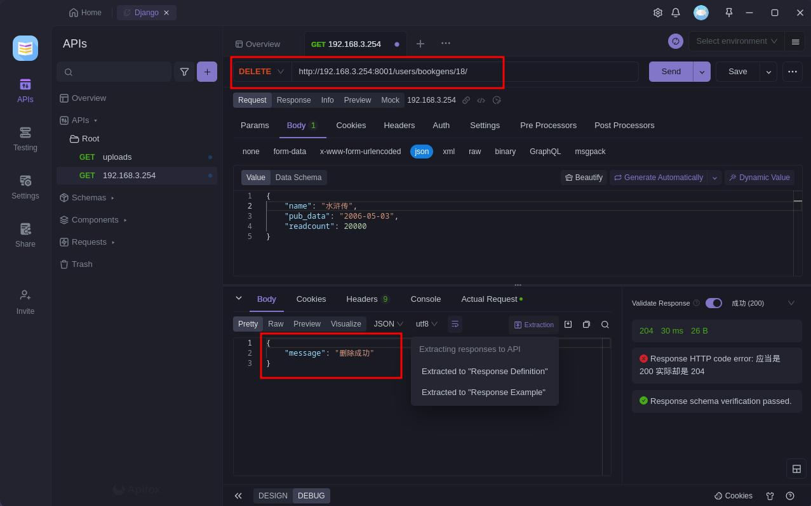

             
APIView是Django REST framework中一个非常重要的抽象基类视图,它提供了一些功能:

1.继承自Django的View类,保留了View原有的属性和方法。
2.提供了更多针对API的方法,比如定义各个请求方法的响应(get, post等)。
3.对请求进行身份认证、权限校验、流量控制等。
4.内容协商,选择合适的renderer来序列化输出。
5.处理常见的异常,提供统一的错误响应。
6.请求解析,包括验证、转换请求内容。
7.模型对象和queryset的处理。

**要实现一个API视图,我们需要:**

1.继承APIView
2.指定renderer_classes、parser_classes等设置
3.实现get、post等方法,编写视图逻辑
4.加入认证、权限、限流等特性

这样就可以快速构建一个功能完备的API视图了。

相比普通的Django View,APIView提供了更多面向API的特性,可以大大简化视图的编写。如果需要的话,还可以进一步继承GenericAPIView等基类,获得更多功能。所以APIView是一个非常有用的基类,是构建API不可或缺的部分。

## APIView 的使用

### APIView 列表视图

1.编辑子应用目录下的 views.py 文件，从 rest_framework.views 中导入 APIView 模块，同时，也导入 rest_framework 中响应模块，同时，在该文件中编写 APIView development试图类，如下：
```python
# users/views.py

...

from rest_framework.views import APIView
from rest_framework.response import Response

...

# APIView 继承自 View
class BookInfoAPIView(APIView):
    """
    列表视图
    """
    def get(self, request):
        """
        查询所有的图书数据并返回
        :param request: 序列化
        :return:
        """
        # 查询所有的图书数据 --- 准备一个模型类对象
        qs = BookInfo.objects.all()

        # 使用序列化器 --- 对模型类对象进行序列化
        # 注意：上面查询的是所有数据，需要使用 many=True 参数（多个数据）
        ser= BookInfoSerializers(instance=qs, many=True)

        # 获取序列化后的数据
        # ser.data

        # FRAMEWAOK 响应方式进行返回数据
        # return JsonResponse(ser.data, safe=False)  

        # 使用 DRF 中的响应方式进行返回数据
        return Response(ser.data)


    def post(self, request):
        """
        添加数据
        步骤：
        1.获取数据；
        2.对数据进行解码；
        3.校验及保存数据；
        4.返回新增的数据。
        :param request:
        :return:
        """
        print(request)              # 打上断点，执行 DEBU.然后使用APIFOX 传入数据。可以看到用户输入的数据在 data 字典中

        # 从请求的 data 字段中获取数据 --- 因为我们用的 DRF中的视图类
        book = request.data

        # 数据校验  --- 反序列化 -- 校验
        ser = BookInfoSerializers(data=book)

        # 验证校验的数据是否成功（成功写入数据库，失败则提示）
        ser.is_valid(raise_exception=True)          # raise_exception=True 输出报错信息

        # 使用序列化对象的 save() 方法保存数据
        ser.save()

        # 返回新增的数据  validated_dat --- 序列化通过的的数据，该数据是没有保存到数据库中的
        # 那么我们该如何返回数据呢？当然是从模型类 BookInfoSerializers() 里面拿了.
        # 问题来了。我们怎么从序列化器里面拿新增的数据呢？从上面序列化 ser 里面的 data 属性里面拿
        # 使用 DRF中的响应方式进行数据返回
        return Response(data=ser.data, status=201)
```

2.编辑子应用目录下的 urls.py 文件，在默认的 `urlpatterns = [..]` 中添加访问路由（注意：非 DRF 路由），如下：
```python
# users/urls.py

...

urlpatterns = [
    ...
    path('bookapi/', views.BookInfoAPIView.as_view()),
]

...
```

3.打开浏览器，访问路由：

3.1.查询数据：


3.2.增加数据（使用 Apifox 接口调试工具模拟数据），如下图：



### APIView 详情视图

1.编辑子应用目录下的 views.py 文件，接上新建一个详情视图类，代码如下：
```python
# users/views.py

...

class BookInfoDetailAPIView(APIView):
    """
    详情视图
    """
    def get(self, request, pk):
        """
        查询单个数据
        :param request:
        :param pk: 去查询是否有要查询的数据
        :return: 返回序列化数据
        """
        try:
            book = BookInfo.objects.get(id=pk)
        except BookInfo.DoesNotExist:
            return JsonResponse({'error': '没有这个数据！'})
        # 把
        ser =BookInfoSerializers(instance=book)
        # ser.data

        return JsonResponse(ser.data, status=200 ,json_dumps_params={'ensure_ascii': False})        # json_dumps_params={'ensure_ascii': False} 将中文文字原内容返回，否则会自动转码

    # 修改顺据
    def put(self, request, pk):
        """
        :param request:
        :param pk:
        :return:
        """
        try:
            book = BookInfo.objects.get(id=pk)
        except BookInfo.DoesNotExist:
            return JsonResponse({'error': '没有这个数据！'})

        # 获取要修改的数据,数据在 DRF APIView 视图 request 方式中的 data 字典里
        json_data = request.data

        # 修改数据交给序列化 ---update 方法
        # 为什么要多传一个 instance = book ? 因为我们这个是修改，本质就是在原本的数据基础上进行的修改
        ser = BookInfoSerializers(instance=book, data=json_data)

        # 校验数据（否则会报需要在 django settings.py 中设置： APPEND_SLASH=False)
        ser.is_valid(raise_exception=True)

        # 保存数据
        ser.save()

        # 返回修改后的数据
        return Response(ser.data ,status=201)

    # 删除数据
    def delete(self,request,pk):
        try:
            book = BookInfo.objects.get(id=pk)
        except BookInfo.DoesNotExist:
            return Response({'error': '没有这个数据！！！'})

        book.delete()
        return Response({'message':'删除成功'}, status=204)

```

2.编辑子应用目录下的 urls.py 文件，在默认的 `urlpatterns = [..]` 中添加访问路由（注意：非 DRF 路由），如下：
```python
# users/urls.py

...

urlpatterns = [
    ...
    re_path('^bookapis/(?P<pk>\d+)/$', views.BookInfoDetailAPIView.as_view() ),
]

...
```

3.打开浏览器，访问路由(注意：这里需要传入 pk 参数的值，即数据库表中数据的 ID 值)：

3.1.查询单个数据：


3.2.修改数据：


3.3.删除数据：



## GenericAPIView  的使用

GenericAPIView是DRF中一个非常有用的抽象视图基类,它提供了典型的REST框架所需要的核心功能,可以用来快速构建自定义的API视图。

**主要特点包括:**

- 提供了通用的方法处理函数,如get()、post()等。这些方法会根据请求方法调用相应的处理函数,如get()会调用get方法。
- 处理authentication、permissions、throttling、content_negotiation等功能。
- 提供了操作serializer的方法,如get_serializer、get_serializer_class等。
- 处理pagination,提供了paginate_queryset和get_paginated_response方法。
- 提供了操作queryset的方法,如filter_queryset等。
- 提供了操作response的方法,如response、error_response等。
- 支持通过类属性设置queryset、serializer_class、pagination_class等。

**使用GenericAPIView的主要步骤:**

1.从GenericAPIView继承,设置queryset、serializer_class等类属性。
2.根据需要定制get()、post()等方法的逻辑处理。
3.在视图使用GenericAPIView提供的各种操作queryset、serializer、pagination、response等方法。

所以GenericAPIView是一个非常强大的抽象基类,使用它可以快速构建自定义的REST风格的API。配合Mixins可以构建CRUD视图,或进一步封装出各种通用视图基类。


### GenericAPIView 列表视图
1.编辑子应用目录下的 views.py 文件，从 rest_framework.generics 中导入 GenericAPIView 模块，同时，也导入 rest_framework 中的状态模块 status，同时，在该文件中编写 APIView development试图类，如下：
```python
# users/views.py

...

from rest_framework.generics import GenericAPIView      # GenericAPIView 集成自 APIView
from rest_framework import status

...

class BookInfoGenericAPIView(GenericAPIView):
    """
    列表试图
    """
    # 两个必要的参数：queryset 指定使用的查询集， serializer_class 指定使用的序列化器
    queryset = BookInfo.objects.all()
    serializer_class = BookInfoSerializers

    def get(self,request):

        # 获取指定的查询集
        qs = self.get_queryset()

        # 这种方式还是通过 APIView 进行访问的，违背了 GenericAPIView 思想
        # ser = BookInfoSerializers(instance=qs , many=True)

        # GenericAPIView 思想：
        # 获取指定的序列化器
        # ser = self.get_serializer_class()
        ser = self.get_serializer(instance=qs, many = True)

        return Response(ser.data ,status=status.HTTP_200_OK)


    def post(self, request):

        book = request.data

        ser = self.get_serializer(data=book)
        ser.is_valid()
        ser.save()
        return  Response(data=ser.data, status=status.HTTP_200_OK)
```

2.编辑子应用目录下的 urls.py 文件，在默认的 `urlpatterns = [..]` 中添加访问路由（注意：非 DRF 路由），如下：
```python
# users/urls.py

...

urlpatterns = [
    ...
    path('bookgen/', views.BookInfoGenericAPIView.as_view()),    
]

...
```

3.打开浏览器，访问路由：

3.1.查询所有数据：


3.2.添加数据：



### GenericAPIView 详情视图

1.继上，编辑子应用目录下的 views.py 文件，在最底部添加 GenericAPIView() 详情视图类，如下：
```python
# users/views.py

...

class BookInfoDetailGenericAPIView(GenericAPIView):
    """
    详情视图集
    """

    queryset = BookInfo.objects.all()   # 这里为什么不用 get() 方法，因为 下面使用的 get_object() 方法有封装
    serializer_class =  BookInfoSerializers
    def get(self,request, pk):
        # 查询单个数据。 get_object() 查询集数据，接收 pk
        book = self.get_object()
        ser = self.get_serializer(book)
        return Response(ser.data, status=status.HTTP_200_OK)

    def put(self,request, pk):
        book = self.get_object()
        ser = self.get_serializer(book, request.data)
        ser.is_valid()
        ser.save()
        return Response(ser.data, status = status.HTTP_200_OK)

    def delete(self,request, pk):
        book = self.get_object()
        book.delete()
        return Response({'message': '删除成功'}, status=204)
```

2.编辑子应用目录下的 urls.py 文件，在默认的 `urlpatterns = [..]` 中添加访问路由（注意：非 DRF 路由），如下：
```python
# users/urls.py

...

urlpatterns = [
    ...
    re_path('^bookgens/(?P<pk>\d+)/$', views.BookInfoDetailGenericAPIView.as_view()),
]

...
```

3.打开浏览器，访问路由：

3.1.查询单个数据：


3.2.修改数据：


3.3.删除数据：
