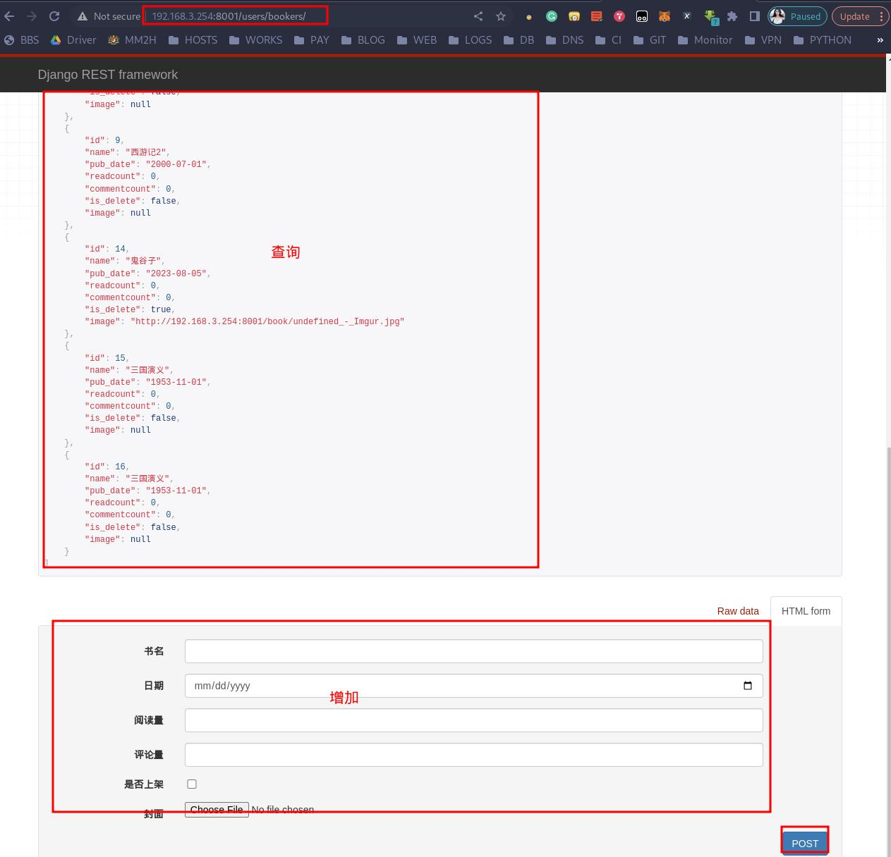
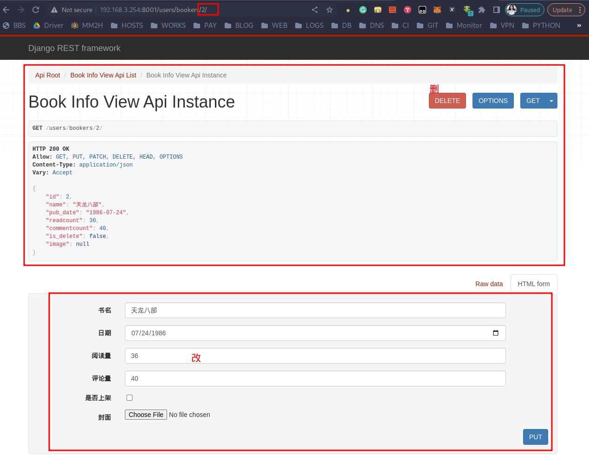
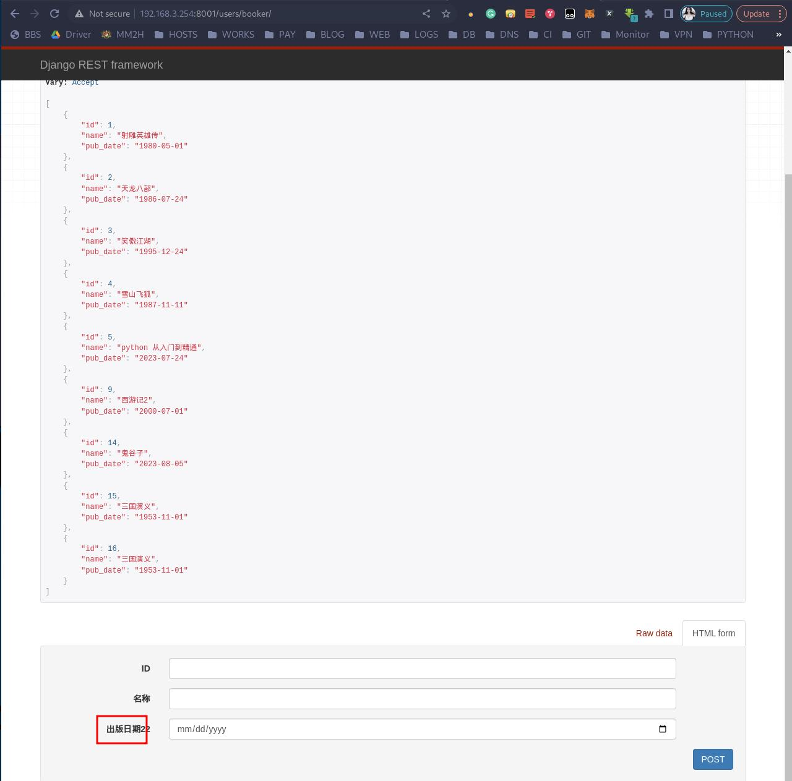

## 安装配置 DRF

### 安装 DRF

打开终端，进入 django 开发的python 虚拟环境中，执行下面的命令安装 DRF：
```bash
leazhi@ubuntuhome:~$ workon web12
(web12) leazhi@ubuntuhome:~$ pip3 install djangorestframework
Looking in indexes: https://pypi.tuna.tsinghua.edu.cn/simple
Collecting djangorestframework
  Downloading https://pypi.tuna.tsinghua.edu.cn/packages/ff/4b/3b46c0914ba4b7546a758c35fdfa8e7f017fcbe7f23c878239e93623337a/djangorestframework-3.14.0-py3-none-any.whl (1.1 MB)
     ━━━━━━━━━━━━━━━━━━━━━━━━━━━━━━━━━━━━━━━━ 1.1/1.1 MB 3.2 MB/s eta 0:00:00
Requirement already satisfied: django>=3.0 in ./.env/web12/lib/python3.10/site-packages (from djangorestframework) (3.1.7)
Requirement already satisfied: pytz in ./.env/web12/lib/python3.10/site-packages (from djangorestframework) (2023.3)
Requirement already satisfied: asgiref<4,>=3.2.10 in ./.env/web12/lib/python3.10/site-packages (from django>=3.0->djangorestframework) (3.7.2)
Requirement already satisfied: sqlparse>=0.2.2 in ./.env/web12/lib/python3.10/site-packages (from django>=3.0->djangorestframework) (0.4.4)
Requirement already satisfied: typing-extensions>=4 in ./.env/web12/lib/python3.10/site-packages (from asgiref<4,>=3.2.10->django>=3.0->djangorestframework) (4.7.0)
Installing collected packages: djangorestframework
Successfully installed djangorestframework-3.14.0
(web12) leazhi@ubuntuhome:~$ 
```

### 注册 DRF

编辑项目目录下的 settings.py 文件，在 `INSTALLED_APPS = []` 中添加 DRF 的注册配置，如下：
```python
# settings.py

...

INSTALLED_APPS = [
    'django.contrib.admin',
    'django.contrib.auth',
    'django.contrib.contenttypes',
    'django.contrib.sessions',
    'django.contrib.messages',
    'django.contrib.staticfiles',
    'users.apps.UsersConfig',
    'rest_framework',   # 注册 DRF
]
...
```

## DRF 的使用

### 序列化器 ModelSerializer 和 Serializer


**1.序列化器的作用：**
- 对数据进行转换；
- 对数据进行校验；

**2.ModelSerializer 和 Serializer 的区别：**
- ModelSerializer 需要知道模型类，他提供了增删改查的功能；
- Serializer 不需要知道模型类，他不提供增删改功能


#### ModelSerializer 序列化器

1.编辑子应用目录下的 views.py 文件，导入 rest_framework 中的 ModelViewSet 模块，代码如下：
```python
# users/views.py

...

 # 提供了一个全方位的增删该查--特点就所写路由的时候必须使用自带的路由系统
from users.serializer import BookInfoSerializers, PeopleInfoSerializers
from rest_framework.viewsets import ModelViewSet       

...

class BookInfoViewAPIS(ModelViewSet):

    # 指定查询集 --- all
    queryset = BookInfo.objects.all()

    # 指定使用的序列化器
    serializer_class = BookInfoSerializers
```

2.编辑子应用目录下的路由文件 urls.py,在原有路由下面新些 DRF 路由代码（DRF 需要使用自带的路由格式，而不是使用 django 自带的路由），代码如下：
```python
# users/urls.py

...
# 导入 DRF 路由模块：
from rest_framework.routers import DefaultRouter

...

urlpatterns = [
    ...
]

# BookInfoViewAPI
router = DefaultRouter()        # 使用路由器
router.register('bookers', viewset=views.BookInfoViewAPIS)      # 向路由器里面注册视图集

# 为了 django 能够访问到 --- 添加到路由里面
urlpatterns+= router.urls
```

3.在子应用 users 目录目录下创建序列化文件 serializer.py 文件，导入 serializers 模块，编写代码，实现模型类的序列化，内容为：
```python
# users/serializer.py 

from rest_framework import serializers              # 导入序列化器模块
from .models import BookInfo, PeopleInfo                        # 导入模块类


# 定义序列化器 --- 和定义模型类相似 -- 因为他和模型类进行交互的
class BookInfoSerializers(serializers.ModelSerializer):
    # ModelSerializer  -- 指定使用的模型类进行交互的

    class Meta:
        # 使用的模型类
        model = BookInfo

        # 序列化和反序列 --- 把模型类对象数据转化为 json 类型
        # fileds 参数 接收要序列化的字段 --- 哪些字段是要返回出去的
        # '__all__'  返回所有字段
        fields = '__all__'
```

4.打开浏览器，访问路由 bookers ，如下图：


需要注意的是：修改、删除数据只需要在查询接口后面输入数据 id 即可操作！


#### Serializer 序列化器

1.编辑子应用目录下的 serializer.py 文件，最下面加入如下代码：
```python
# users/serializer.py

...
class BookInfoSerializer(serializers.Serializer):
    # Serializer 序列化器不需要知道模型类，所有的数据都可以进行校验。序列化器的校验。校验是否符合模型类要求（字段类型校验）
    # 校验要和模型类中的字段名子类型一致
    # label 显示在 API 的界面中的名称
    id = serializers.IntegerField(label='ID', min_value=1)
    name = serializers.CharField(label='名称')
    pub_date = serializers.DateField(label='出版日期22')
```

2.编辑子应用目录下的 views.py 文件，最下面加入如下代码：
```python
# users/views.py

...

# 序列化器：
# from users.serializer import BookInfoSerializers
class BookInfoViewAPI(ModelViewSet):

    # 指定查询集 --- all
    queryset = BookInfo.objects.all()

    # 指定使用的序列化器
    serializer_class = BookInfoSerializer

```

3.编辑子应用目录下的 urls.py 文件，在 DRF 路由里面添加入如下代码：
```python
# users/urls.py

...

# BookInfoViewAPI
router = DefaultRouter()        # 使用路由器

...

router.register('booker', viewset=views.BookInfoViewAPI)      # 向路由器里面注册视图集

# 为了 django 能够访问到 --- 添加到路由里面
urlpatterns+= router.urls
```

4.打开浏览器，访问路由 booker （注意却分路由 bookers ），如下：


注意：虽然这里也可以查询数据，有增、删、改的功能，但是不能使用。提交会报错！