django admin 是 django 自带的后台管理系统

## 创建后台超级管理员账号密码

django 虽然自带 django 管理后台，但是，它默认没有为后台管理创建账号密码。而是需要我们手动去创建：

### 创建超管账户

1.打开命令行终端，进入项目根目录，执行下面的命令创建超管账户：
```python
(web12) leazhi@ubuntuhome:~/web12$ python3 manage.py createsuperuser
用户名 (leave blank to use 'leazhi'): leazhi
电子邮件地址: leazhi@outlook.com
Password: 
Password (again): 
Superuser created successfully.
(web12) leazhi@ubuntuhome:~/web12$ 
```

2.创建成功后，我们就可以打开浏览器，输入 django 项目运行的访问地址： http://IP:PORT/admin 进行访问登陆了，如下图：
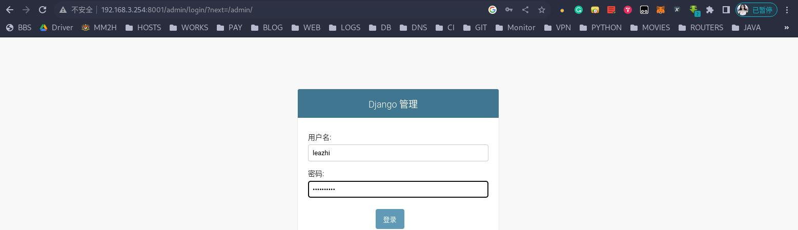


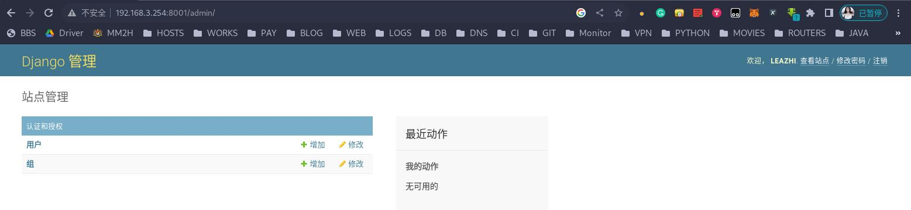


### 修改超管密码

修改超管密码有两种方式：一是你自己记得超管密码，这种方式就直接在 django 管理后台进行修改；二是忘记了超管密码，这种方式就需要使用到下面的命令行进行修改：
```python
(web12) leazhi@ubuntuhome:~/web12$ python3 manage.py changepassword leazhi
Changing password for user 'leazhi'
Password: 
Password (again): 
Password changed successfully for user 'leazhi'
(web12) leazhi@ubuntuhome:~/web12$ 
```

## 用户和组的管理

### 用户管理

用户管理主要是添加、删除用户，以及授权（授权用户的访问权限）

### 组管理

组管理是将用户划分到一个集合，并修改组内所有用户的权限


## 注册模型类

就是把我们自定义写的模型类注册到 django 管理后台，让我们的后台管理人员通过管理后台来对数据进行增、删、改、查的操作（而不是直接在命令行对数据进行操作）

1.编辑子应用下的 admin.py 文件，先将模型类导入到该文件中，然后注册导入的模型类，如下：
```python
# users/admin.py

from django.contrib import admin
from users.models import BookInfo, PeopleInfo
# Register your models here.

admin.site.register(BookInfo)
admin.site.register(PeopleInfo)
```

2.注册完成之后，就可以在后台看到注册的模型类了，如图：

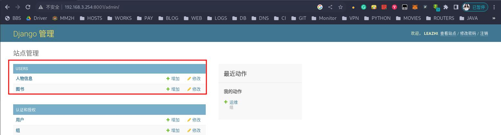

3.编辑子应用下的 apps.py 文件，修改子应用名称（从上图我们可以看到，注册进去的模型类是在 USERS 子应用下）：
```python
# users/apps.py

from django.apps import AppConfig


class UsersConfig(AppConfig):
    name = 'users'
    verbose_name = '图书管理'     # 修改后台显示的名称
```

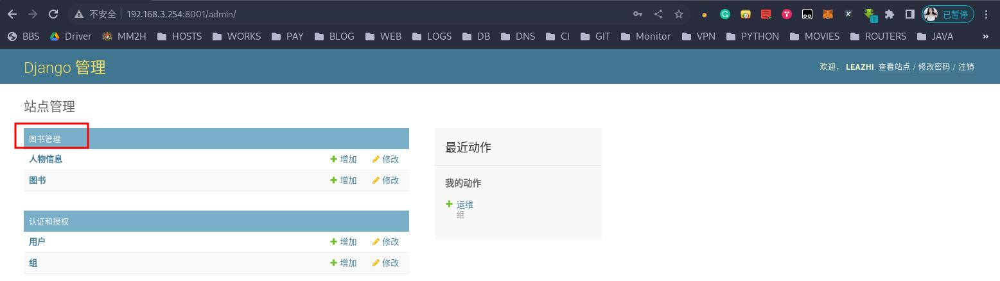

4.注册好模型类后，我们就可以在后台对模型类进行管理了。比如，我们在后台的图书模型类中添加一本名为 《鬼谷子》的图书：
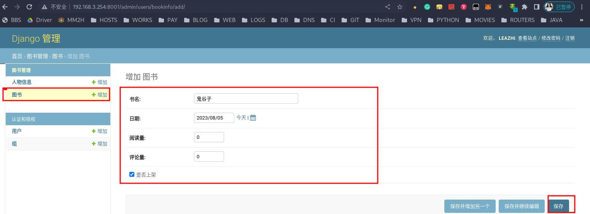

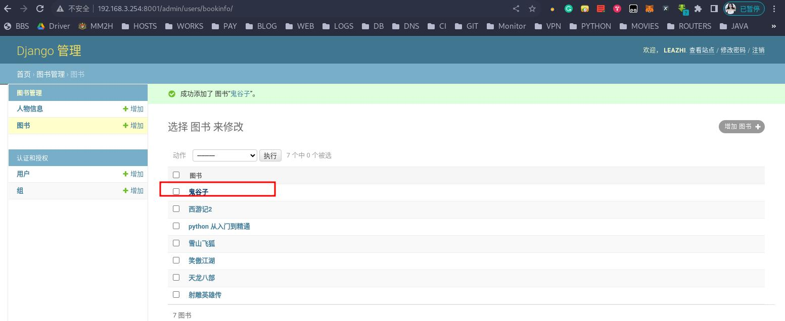


## 自定义 admin 管理类


### 自带的管理类

#### 设置页头
1.编辑子应用下的 admin.py 文件，修改网页头部信息：

```python
# users/admin.py

from django.contrib import admin
from users.models import BookInfo, PeopleInfo
# Register your models here.

admin.site.register(BookInfo)
admin.site.register(PeopleInfo)

# 修改网页头部信息
admin.site.site_header = '书城'
```

2.修改完成后，重新刷新下页面（和上图中的网页头部信息下相比）：      

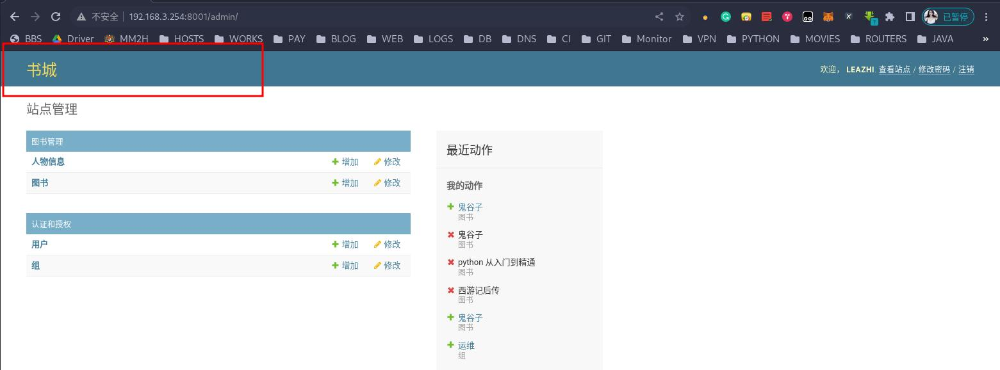

#### 设置标题

1.编辑子应用下的 admin.py 文件，修改网页头部信息：
```python
# users/admin.py

from django.contrib import admin
from users.models import BookInfo, PeopleInfo
# Register your models here.

admin.site.register(BookInfo)
admin.site.register(PeopleInfo)

# 修改网页页头
admin.site.site_header = '书城'

# 修改网页标题
admin.site.site_title = '书城 MIS'

```

2.修改完成后，重新刷新下页面（和上图中的网页顶部信息下相比）：      
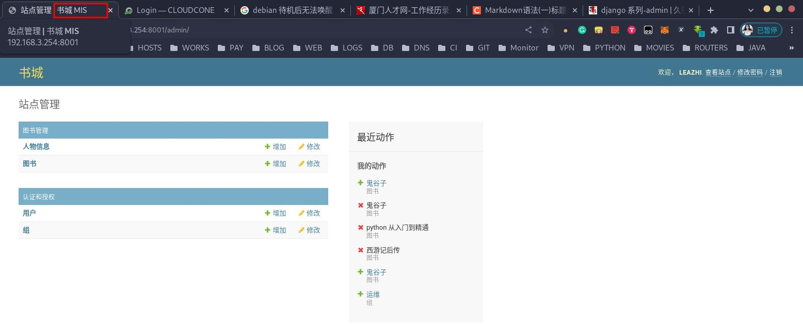


#### 设置首页标题
1.编辑子应用下的 admin.py 文件，修改网页头部信息：
```python
# users/admin.py

from django.contrib import admin
from users.models import BookInfo, PeopleInfo
# Register your models here.

admin.site.register(BookInfo)
admin.site.register(PeopleInfo)


# 修改网页页头
admin.site.site_header = '书城'

# 修改网页标题
admin.site.site_title = '书城 MIS'

# 修改首页标题：
admin.site.index_title = '欢迎来到书城'
```

2.修改完成后，重新刷新下页面（和上图中的网页标记部分相比）：    
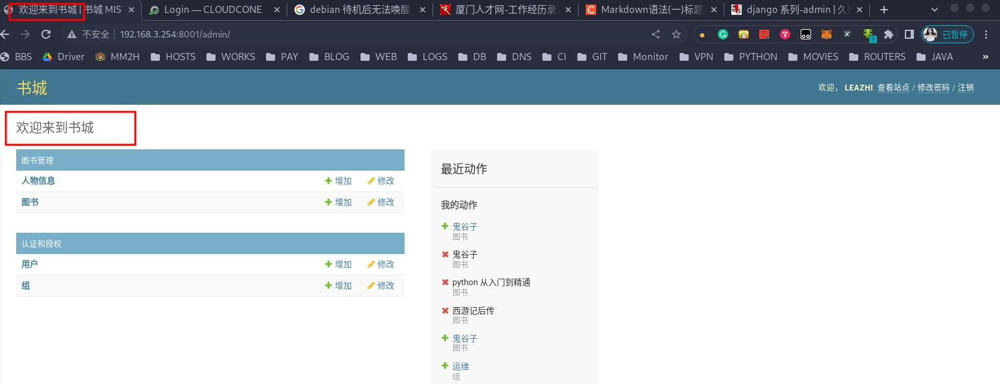


### 自定义管理类


**自定义的 admin 模型管理类需要继承 admin.ModelAdmin**


#### 分页展示

1.我们现在 django 后台查看下图书模型类的数据，如图：   
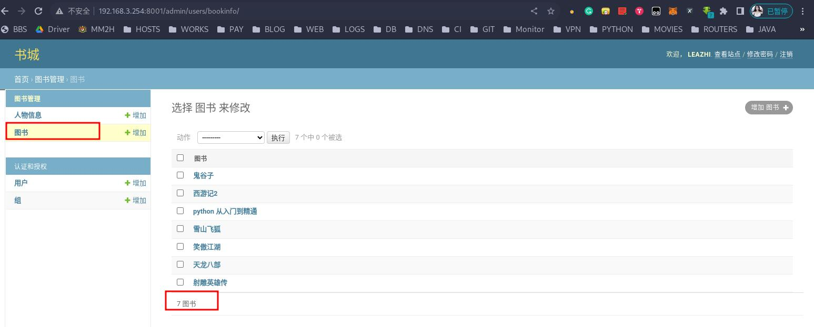

2.编辑子应用下的 admin.py 文件，添加一个自定义的图书模型管理类 BookInfoAdmin()，并在该类下是使用 `list_per_page = 4` 属性对数据进行分页展示：
```python
# users/admin.py

from django.contrib import admin
from users.models import BookInfo, PeopleInfo
# Register your models here.

# admin.ModelAdmin  admin管理模型类
class BookInfoAdmin(admin.ModelAdmin):
    """
    管理图书的模型类
    """

    # 图书模型类分也展示的数量（一页显示 4 条），默认一页显示 100 条数据
    list_per_page = 4

# 注册模型类到 admin 中，注册自定义的模型管理类
admin.site.register(BookInfo,BookInfoAdmin)

admin.site.register(PeopleInfo)

# 修改网页页头
admin.site.site_header = '书城'

# 修改网页标题
admin.site.site_title = '书城 MIS'

# 修改首页标题：
admin.site.index_title = '欢迎来到书城'
```

3.刷新下网页： 
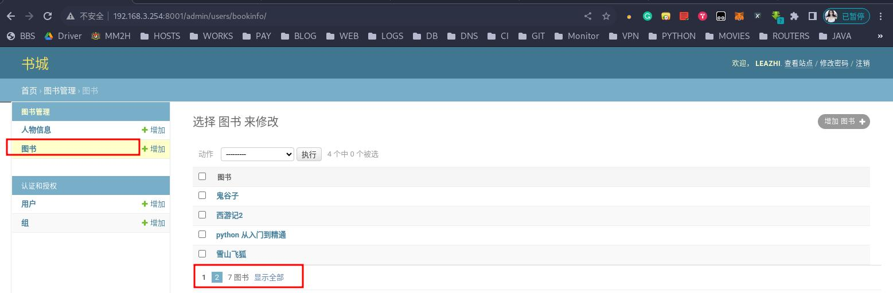


#### 添加动作

默认对数据的操作动作是在数据的线面显示，如果数据过多，我们就需要先将网页滑到顶部，然后通过动作对数据进行操作，这样效率不高。此时，我们可以在数据展示的下面也添加操作动作，如下：

1.编辑子应用下的 admin.py 文件，在自定义的 BookInfoAdmin() 类下是使用 `actions_on_bottom = True` 属性展示模型类 BookInfo() 中的其它字段，如下：
```python
# users/admin.py

from django.contrib import admin
from users.models import BookInfo, PeopleInfo
# Register your models here.

# admin.ModelAdmin  admin管理模型类
class BookInfoAdmin(admin.ModelAdmin):
    """
    管理图书的模型类
    """

    # 图书模型类分也展示的数量（一页显示 4 条），默认一页显示 100 条数据
    list_per_page = 4

    # 在展示的数据下面添加操作动作
    actions_on_bottom = True

# 注册模型类到 admin 中，注册自定义的模型管理类
admin.site.register(BookInfo,BookInfoAdmin)

admin.site.register(PeopleInfo)

# 修改网页页头
admin.site.site_header = '书城'

# 修改网页标题
admin.site.site_title = '书城 MIS'

# 修改首页标题：
admin.site.index_title = '欢迎来到书城'
```

2.刷新页面，就可以在展示的数据下面新增了动作栏：   
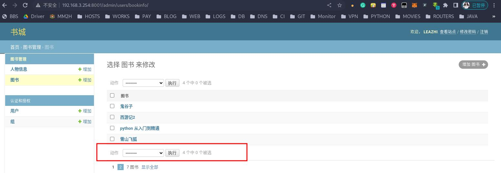


#### 展示模型类中的详细信息

默认情况，后台不对数据进行更加详细的展示，比如上面的 bookinfo 类，我们进入图书管理页面后，只能看到图书的名字，而看不到图书的出版日期，评论量，阅读量、是否上架等。


**list_display = ('__str__'),这里传入的是模型类字段名称，它必须以元组或列表的方式进行传值；且在后端展示的数据默认还带排序功能；它还可以是模型方法，但是必须要有返回值**


##### 模型类字段
1.编辑子应用下的 admin.py 文件，在自定义的 BookInfoAdmin() 类下是使用 `list_display = ('__str__')` 属性展示模型类 BookInfo() 中的其它字段，如下：
```python
# users/admin.py

from django.contrib import admin
from users.models import BookInfo, PeopleInfo
# Register your models here.

# admin.ModelAdmin  admin管理模型类
class BookInfoAdmin(admin.ModelAdmin):
    """
    管理图书的模型类
    """

    # 图书模型类分也展示的数量（一页显示 4 条），默认一页显示 100 条数据
    list_per_page = 4

    # 在展示的数据下面添加操作动作
    actions_on_bottom = True

    # 展示图书的详细信息(用元组或列表的形式传入)：
    # list_display = ('name', 'pub_date', 'readcount', 'commentcount', 'is_delete',)
    list_display = ['name', 'pub_date', 'readcount', 'commentcount', 'is_delete',]

# 注册模型类到 admin 中，注册自定义的模型管理类
admin.site.register(BookInfo,BookInfoAdmin)

admin.site.register(PeopleInfo)

# 修改网页页头
admin.site.site_header = '书城'

# 修改网页标题
admin.site.site_title = '书城 MIS'

# 修改首页标题：
admin.site.index_title = '欢迎来到书城'
```

2.刷新下网页，就可以看到模型类 BookInfo() 中的其它字段都被展示出来了：  
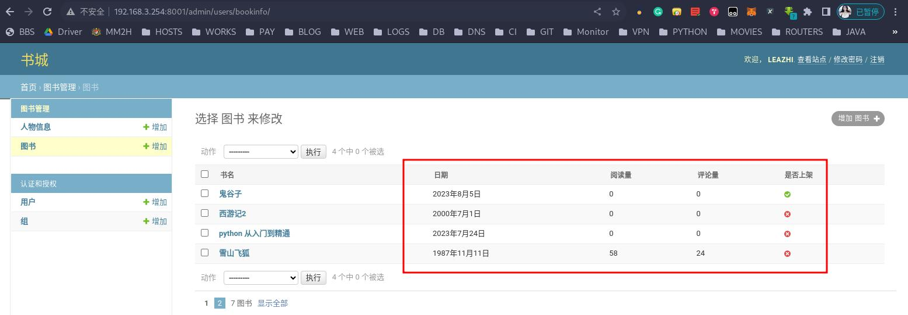

##### 模型类方法


**模型类方法在后台展示的时候是无法进行排序的,因为它不是模型类中的字段**


1.编辑子应用下的 models.py 文件，在图书模型类下添加方法 sun_count,如下：
```python
# users/models.py

...

class BookInfo(models.Model):           # 继承
    # 在模型类里面， ID 是不需要去指定的。它默认会设置为主键 且自增长
    ...

    # 模型类方法，用与在 admin 管理后台展示
    def sum_count(self):
        """
        评论量和阅读量相加
        :return:
        """
        return self.readcount + self.commentcount

    # 设置方法 sum_count 在 admin 中显示（如果不设置，则直接显示为 SUM_COUNT）
    sum_count.short_description = '总量'

    ...    
```

2.编辑子应用下的 admin.py 文件，在自定义的 BookInfoAdmin() 类下是使用 `list_display = ('__str__')` 属性展示模型类 BookInfo() 中的方法 sun_count，如下：
```python
# users/admin.py

from django.contrib import admin
from users.models import BookInfo, PeopleInfo
# Register your models here.

# admin.ModelAdmin  admin管理模型类
class BookInfoAdmin(admin.ModelAdmin):
    """
    管理图书的模型类
    """

    # 图书模型类分也展示的数量（一页显示 4 条），默认一页显示 100 条数据
    list_per_page = 4

    # 在展示的数据下面添加操作动作
    actions_on_bottom = True

    # 展示图书的详细信息(用元组或列表的形式传入)：
    # 模型类 sum_count 方法，必须要有返回值（阅读量和评论量的总和）：
    # list_display = ('name', 'pub_date', 'readcount', 'commentcount', 'is_delete',)
    list_display = ['name', 'pub_date', 'readcount', 'commentcount', 'sum_count', 'is_delete',]

# 注册模型类到 admin 中，注册自定义的模型管理类
admin.site.register(BookInfo,BookInfoAdmin)

admin.site.register(PeopleInfo)

# 修改网页页头
admin.site.site_header = '书城'

# 修改网页标题
admin.site.site_title = '书城 MIS'

# 修改首页标题：
admin.site.index_title = '欢迎来到书城'
```

3.刷新下网页，如下图：
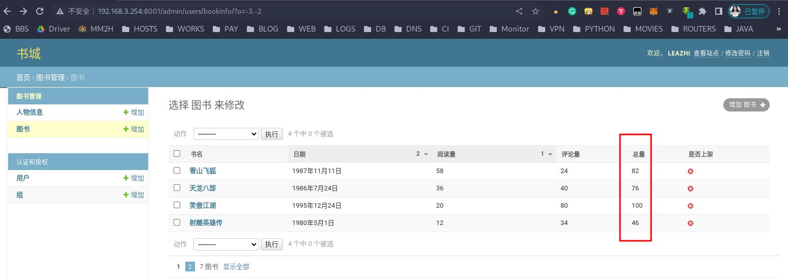


##### 模型类方法关联查询

同上。在后台展示模型类 PeopleInfo() 中的数据：

1.编辑子应用下的 admin.py 文件，新增一个人物模型管理类 PeopleInfoAdmin()，用于数据展示：
```python
# users/admin.py

...
# 自定义 admin 模型管理类 PeopleInfoAdmin（），在该类中添加 'read' 模型类方法，用于展示对应图书的阅读量
class PeopleInfoAdmin(admin.ModelAdmin):
    list_per_page = 8
    actions_on_bottom = True
    list_display = ['name', 'gender', 'description', 'book','read','is_delete']

# 注册模型类到 admin 中，注册自定义的模型管理类
admin.site.register(BookInfo,BookInfoAdmin)
admin.site.register(PeopleInfo,PeopleInfoAdmin)
...
```

2.编辑子应用下的 models.py,在模型类 PeopleInfo() 下添加模型类方法 read(),用于与模型类 BookInfo() 关联查询，如下：
```python
# users/models.py

...

class PeopleInfo(models.Model):

    # 定义一个性别的数组，供后面 Choices 方法传值
    GENDER_CHOICE = (
        (0, 'male'),
        (1, 'female'),
    )
    # 属性名 = 属性类型（选项）
    # 名称：
    name = models.CharField(max_length=20, verbose_name='名称')
    # 性别：
    # choices 默认为空，也就是可以不传值。它接收的值类型为 元祖（元祖的特征，去重）
    # SmallIntegerField: 小型的整数类型
    gender = models.SmallIntegerField(choices=GENDER_CHOICE ,default=0, verbose_name='性别')
    # 描述信息：
    description = models.CharField(max_length=200, verbose_name='描述信息', null=True)
    # 外键
    # on_delete：级联删除（指明主表删除数据时，对于外键引用表数据如何处理）
    # CASCADE 表示删除主表数据时与之关联的副表数据（连接的外键）一并删除 ，常用；
    # PROTECT 阻止删除主表中被外键应用的数据（阻止用户删除关联的数据）
    book = models.ForeignKey(BookInfo,on_delete=models.CASCADE, verbose_name='书名')
    # 逻辑删除，删除的状态，并非真正删除
    is_delete = models.BooleanField(verbose_name='逻辑删除', default=0)

    class Meta:
        db_table = 'peopleinfo'
        # admin：django 自带的后台管理模块
        verbose_name = '人物信息'  # 在 admin 里面显示 人物信息S 名称
        verbose_name_plural = verbose_name  # 这样就在后台管理里面显示 人物信息 名称
    def __str__(self):
        return self.name

    # 模型类方法
    def read(self):
        # self.book  --- 多的一方对应的模型类名.属性
        return self.book.readcount

    read.short_description = '图书阅读量'
```

3.刷新下网页，如下：
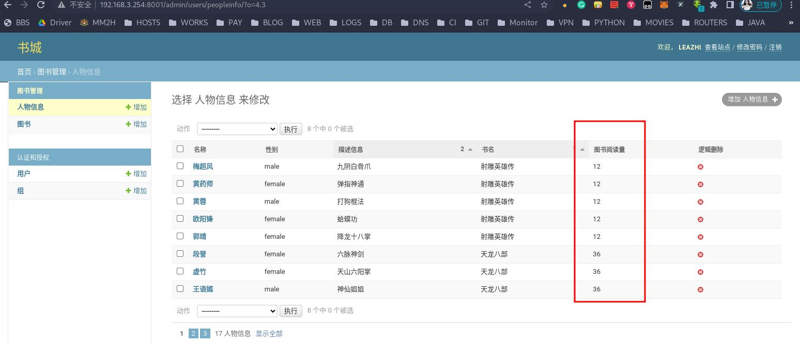

#### 过滤器

1.编辑子应用下的 admin.py 文件，在自定义的 BookInfoAdmin() 类下是使用 `list_filter = ['name']` 属性展示模型类 BookInfo() 过滤器，如下：
```python
# users/admin.py

...

class BookInfoAdmin(admin.ModelAdmin):
    """
    管理图书的模型类
    """
    ...

    # 过滤器，只能接收模型类的字段，实现快速的过滤 --- 查询（过滤条件）
    list_filter = ['name']

# 注册模型类到 admin 中，注册自定义的模型管理类
admin.site.register(BookInfo,BookInfoAdmin)
admin.site.register(PeopleInfo,PeopleInfoAdmin)

...
```

2.刷新页面，如下图：  
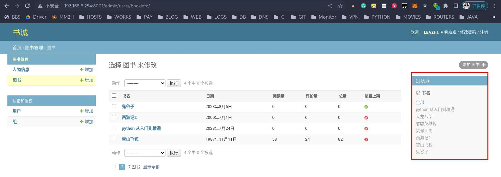

#### 搜索框
1.编辑子应用下的 admin.py 文件，在自定义的 BookInfoAdmin() 类下是使用 `search_fields = ['name']` 属性展示模型类 BookInfo()搜索框 ，如下：
```python
# users/admin.py

...

class BookInfoAdmin(admin.ModelAdmin):
    """
    管理图书的模型类
    """
    ...

    # 搜索框,不传值的话不会显示
    search_fields = ['name']

# 注册模型类到 admin 中，注册自定义的模型管理类
admin.site.register(BookInfo,BookInfoAdmin)
admin.site.register(PeopleInfo,PeopleInfoAdmin)

...
```
 
2.刷新页面，如下图：     
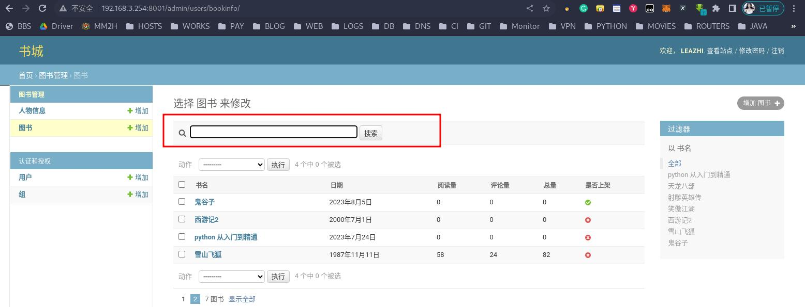


#### 修改信息展示

1.修改数据前，我们先来看下默认的字段展示：
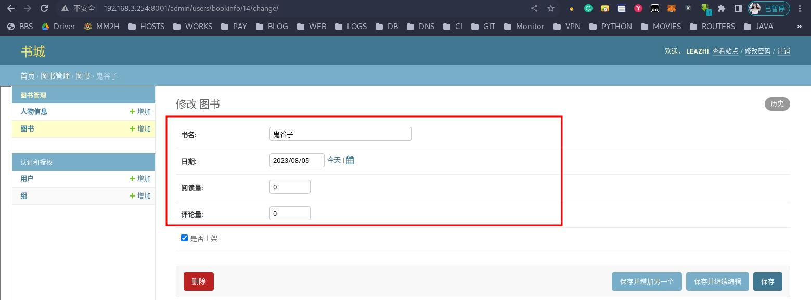

2.编辑子应用下的 admin.py 文件，在自定义的 BookInfoAdmin() 类下是使用 `fields = ['name','readcount']` 属性展示模型类 BookInfo() 修改字段，如下：
```python
# users/admin.py

...

class BookInfoAdmin(admin.ModelAdmin):
    """
    管理图书的模型类
    """
    ...

    # 展示修改信息中的指定字段
    fields = ['name','readcount']

# 注册模型类到 admin 中，注册自定义的模型管理类
admin.site.register(BookInfo,BookInfoAdmin)
admin.site.register(PeopleInfo,PeopleInfoAdmin)

...
```

2.刷新页面，如下图：     
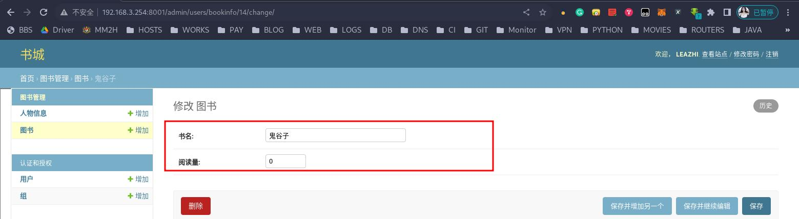


#### 图片上传

1.编辑子应用下的 models.py 文件，在模型类 BookInfo() 中添加字段 image，如下：
```python
# users/models.py

...

class BookInfo(models.Model):           # 继承
    ...

    # 添加一个图书封面的字段.ImageField() 传入的参数为图片的路径
    # upload_to = 'book', 指定存储的文件夹（这里的 book 目录不需要我们手动创建），即所上传的文件都会保存到 media/book 目录下
    # 新增字段后，需要重新迁移数据：
    # blank=True ,由于我们上传数据是以 form 表单 POST 提交,所以，即使在这里将 null 设置 Ture, 在后台进行数据保存的时候，也不允许为空。如果非要留空，则可以加参数 blank=True
    image = models.ImageField(verbose_name='封面', null=True,blank=True, upload_to='book')

    ...
```

2.由于图片上传需要依赖 Pillow 模块，所以在进行数据迁移之前还需要在项目开发的环境中安装好 Pillow 包：
```pythhon
(web12) leazhi@ubuntuhome:~/web12$ pip3 install Pillow 
Looking in indexes: https://pypi.tuna.tsinghua.edu.cn/simple
Collecting Pillow
  Downloading https://pypi.tuna.tsinghua.edu.cn/packages/3d/36/e78f09d510354977e10102dd811e928666021d9c451e05df962d56477772/Pillow-10.0.0-cp310-cp310-manylinux_2_28_x86_64.whl (3.4 MB)
     ━━━━━━━━━━━━━━━━━━━━━━━━━━━━━━━━━━━━━━━━ 3.4/3.4 MB 8.2 MB/s eta 0:00:00
Installing collected packages: Pillow
Successfully installed Pillow-10.0.0
```

3.执行下面的命令，进行数据迁移：
```python
(web12) leazhi@ubuntuhome:~/web12$ python3 manage.py makemigrations
Migrations for 'users':
  users/migrations/0002_auto_20230805_1721.py
    - Add field image to bookinfo
    - Alter field book on peopleinfo

(web12) leazhi@ubuntuhome:~/web12$ python3 manage.py migrate
Operations to perform:
  Apply all migrations: admin, auth, contenttypes, sessions, users
Running migrations:
  Applying users.0002_auto_20230805_1721... OK
```

4.登陆 mysql,进行验证：
```sql
(web12) leazhi@ubuntuhome:~/web12$ mysql -uroot -p
Enter password: 
Welcome to the MariaDB monitor.  Commands end with ; or \g.
Your MariaDB connection id is 463
Server version: 10.10.2-MariaDB-log MariaDB Server

Copyright (c) 2000, 2018, Oracle, MariaDB Corporation Ab and others.

Type 'help;' or '\h' for help. Type '\c' to clear the current input statement.

(root@localhost (none) 05:22:)>desc book.bookinfo;
+--------------+--------------+------+-----+---------+----------------+
| Field        | Type         | Null | Key | Default | Extra          |
+--------------+--------------+------+-----+---------+----------------+
| id           | int(11)      | NO   | PRI | NULL    | auto_increment |
| name         | varchar(20)  | NO   |     | NULL    |                |
| pub_date     | date         | YES  |     | NULL    |                |
| readcount    | int(11)      | NO   |     | NULL    |                |
| commentcount | int(11)      | NO   |     | NULL    |                |
| is_delete    | tinyint(1)   | NO   |     | NULL    |                |
| image        | varchar(100) | YES  |     | NULL    |                |
+--------------+--------------+------+-----+---------+----------------+
7 rows in set (0.001 sec)
```

5.编辑子应用下的 admin.py 文件，在自定义的管理模型类 BookInfoAdmin() 下的 `list_display = [...]` 中添加上面新增的字段名 image，如下：
```python
# users/admin.py

...

class BookInfoAdmin(admin.ModelAdmin):
    ...

    list_display = ['name', 'pub_date', 'readcount', 'commentcount', 'sum_count', 'is_delete', 'image']

    ...

...
```

6.刷新下网页，然后进入图书模型类，可以看到已经新增了 封面，同时，随意点击进入一本书的修改页面，在下面可以看到多出了上传属性。在此，我们上传一张图片。如图：
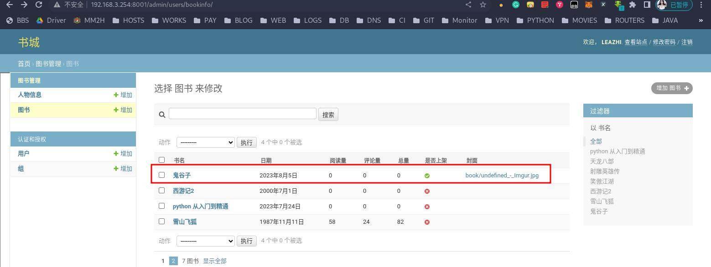


**值得注意的是：**这里我们不能直接去点击图片连接去访问图片，因为这里图片的路径是一个相对路径（非绝对路径）



同时，我们可以在项目的 media 目录下查看是否有创建 book 目录，且该目录下是否有我们上传的图片： 
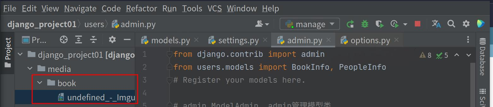


