
pycharm 一定要专业版！专业版！专业版！


## 本地 pycharm

### 配置 pycharm 映射

1.打开 pycharm ,找到并点击导航栏中的 Tools ---> Deployment ---> Configure..,如下图：
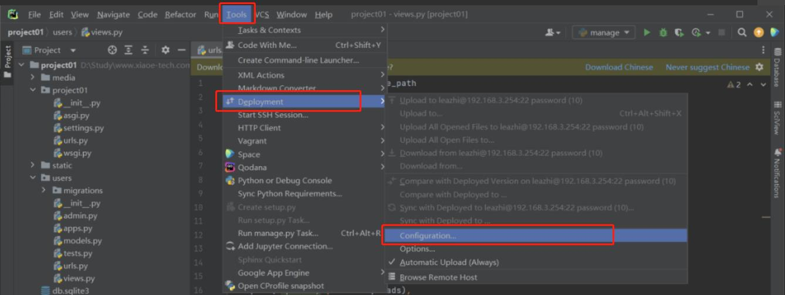

2.在新打开的 Deployment 弹窗框中点击左上角的 + 号，然后点选 SFTP 选项，如下图：
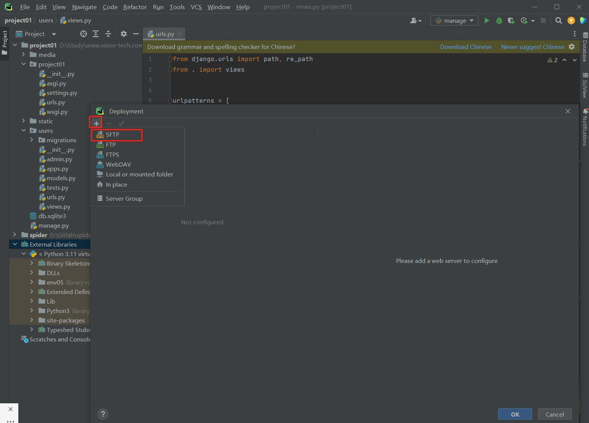

3.在 Create New Server 属性框中自定义输入名称（比如我这里要连接的远程服务器地址为： 192.168.3.254,所以名称就直接以这个 IP 为名了），如下图：


注意：这里的 192.168.3.254 换成你自己的服务器IP 地址。同时，这个名称也会贯穿整个文档


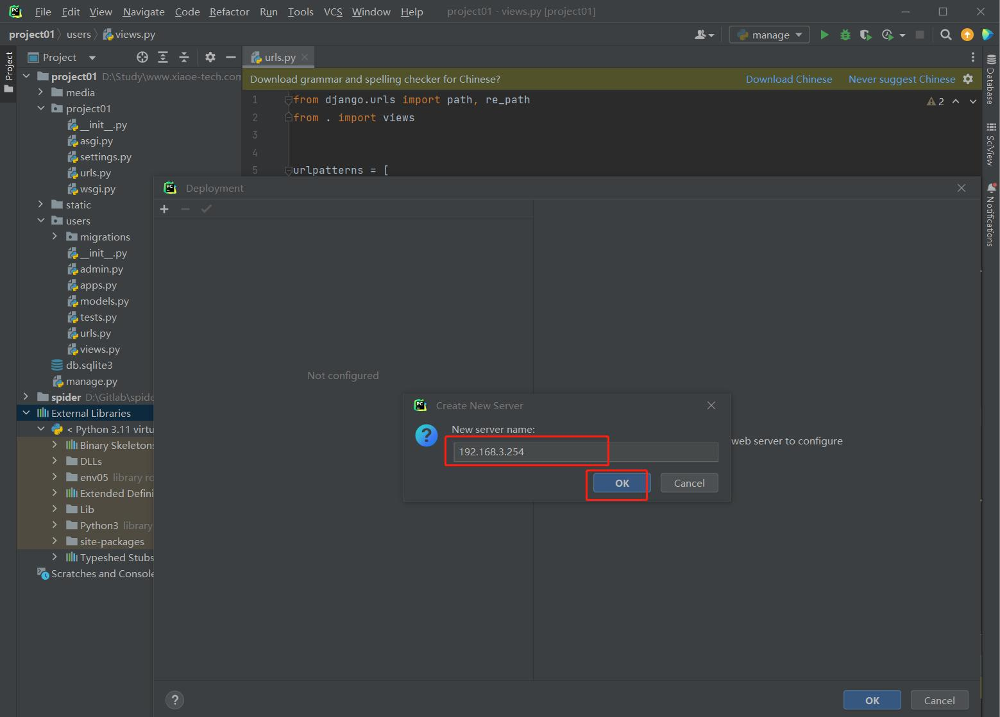

4.接下来，在回到的 Deployment 窗口中选择刚刚创建的服务器名，在右侧的 Connection 属性配置中点击 SSH Configuration 后面的 ... ,打开 SSH Configurations 配置窗口，如下：   
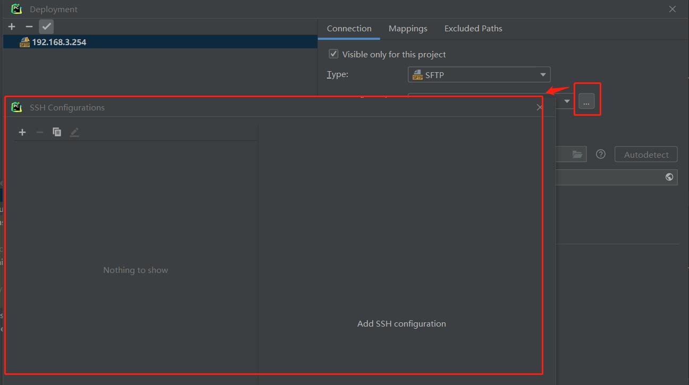

5.在打开的 SSH Configurations 窗口点击左上角的 + 号，然后按照给出的提示正确输入远程服务器信息，然后点击下 Test Connection（测试连接），最后点击Apply 和 Ok .如：  
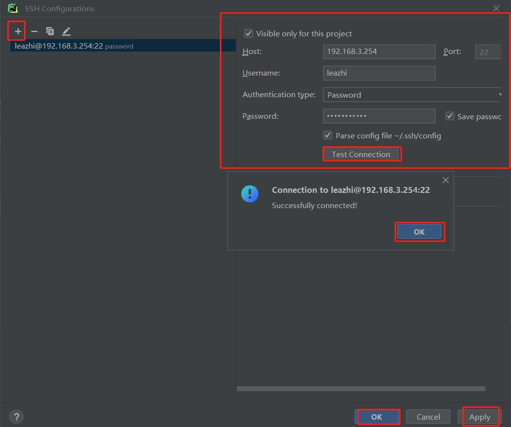

6.在回到的 Deployment 窗口中选择刚刚创建的服务名，然后点击右侧的 Connection, 配置下面的 Root path（也就是代码存放在服务器上的路径，该路径需要事先在远程服务器上创建，比如我远程服务器上的路径为 /home/leazhi/web12）。如下图：


注意：这里的路径请根据自身情况修改。同时，这个路径会贯穿整个文档


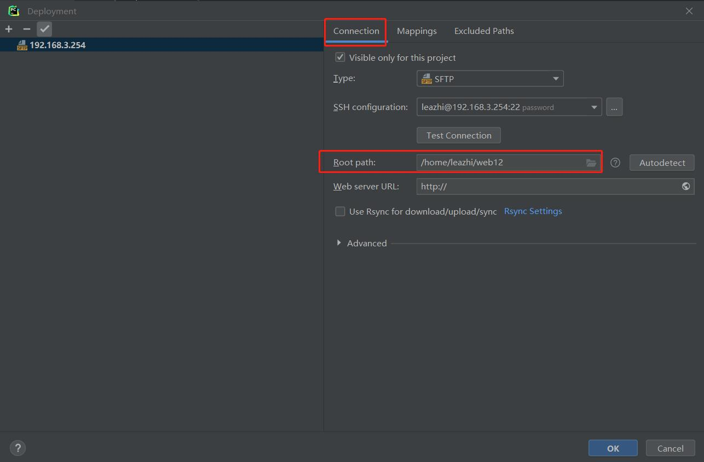

7.接着点击 Connection 旁边的 Mappings，将本地开发目录和远程服务器目录进行映射，配置如下，最后点击 OK。如下图：    
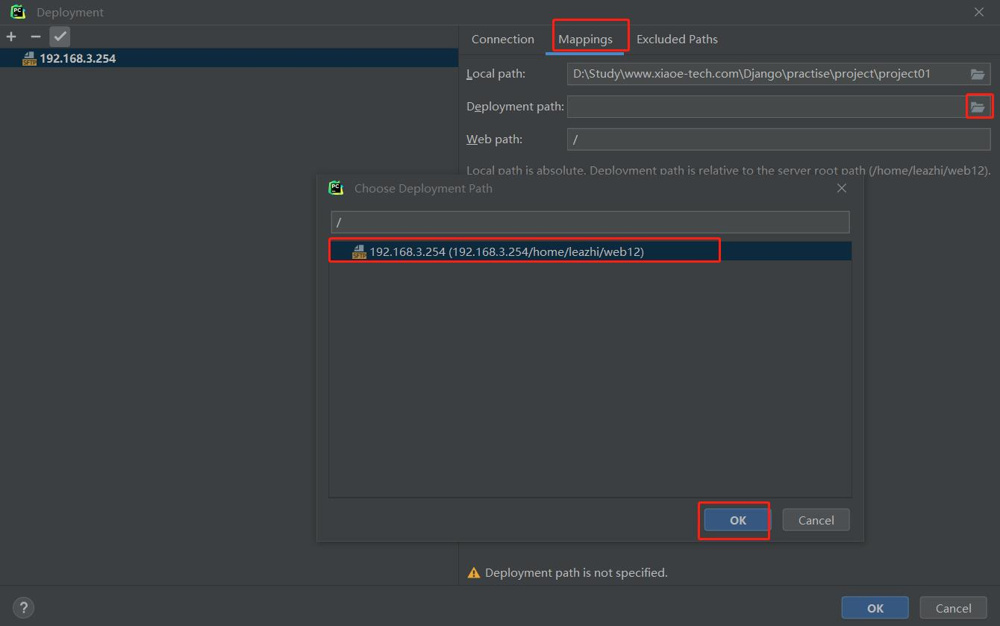  



说明： 
Local path：为项目在你本地的目录路径；
Deployment path: 项目要存放到远程服务器上的路径， 这里只所有为 /(根目录)， 是因为我们在配置 Connection 时指定了 Root path. 这里的 / 就等于 Root path 指定的目录，无需在手动去添加指定；
    
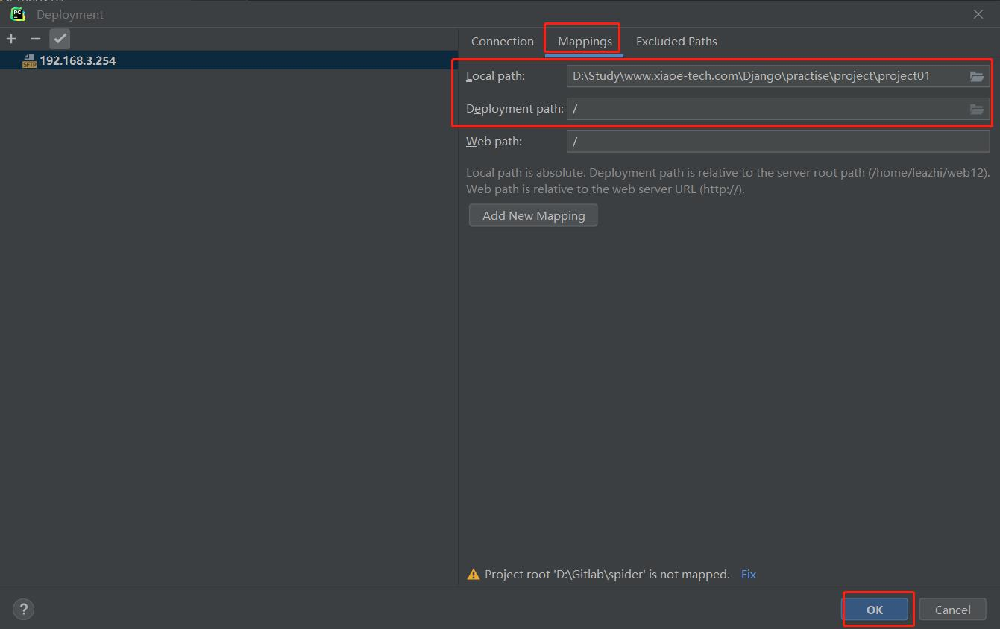  


8.使用 SSH 工具连接到远程服务器，先查看 /home/leazhi/web12 目录下是否有文件：
```bash
leazhi@ubuntuhome:~$ ls web12/
leazhi@ubuntuhome:~$
```

9.鼠标右键点击 pycharm 项目目录，然后在弹出的属性列表中点选 Deployment ---> Up to 192.168.3.254：   

这里的 192.168.3.254 是上面创建的远程服务名
   

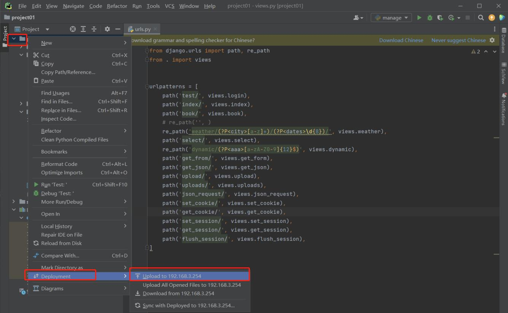


10.再次回到远程服务器，查看路径 /home/leazhi/web12 目录下是否有文件，且可以对比 pycharm 里面的项目结构，如下图：  
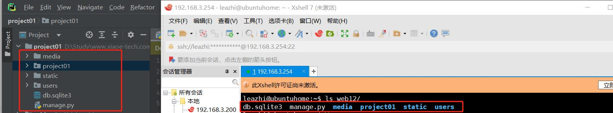

### 配置远程 python 解释器


参考文章：[django 系列002:ubuntu 22.04 下安装配置 python 虚拟环境](https://hexo.linuser.com/2023/07/20/c14f4ee39603/) 中的方法一配置好远程服务器上的 python 虚拟环境并安装好 django 和 django-redis 开发包


1.鼠标左键点击本地 pycharm 导航栏中的 File ---> Settings，打开 Settings 配置窗口 。然后在 Settings 窗口中找到 Project:<项目名称>并点击展开，选择下面的 Python Interpreter, 如下图：   
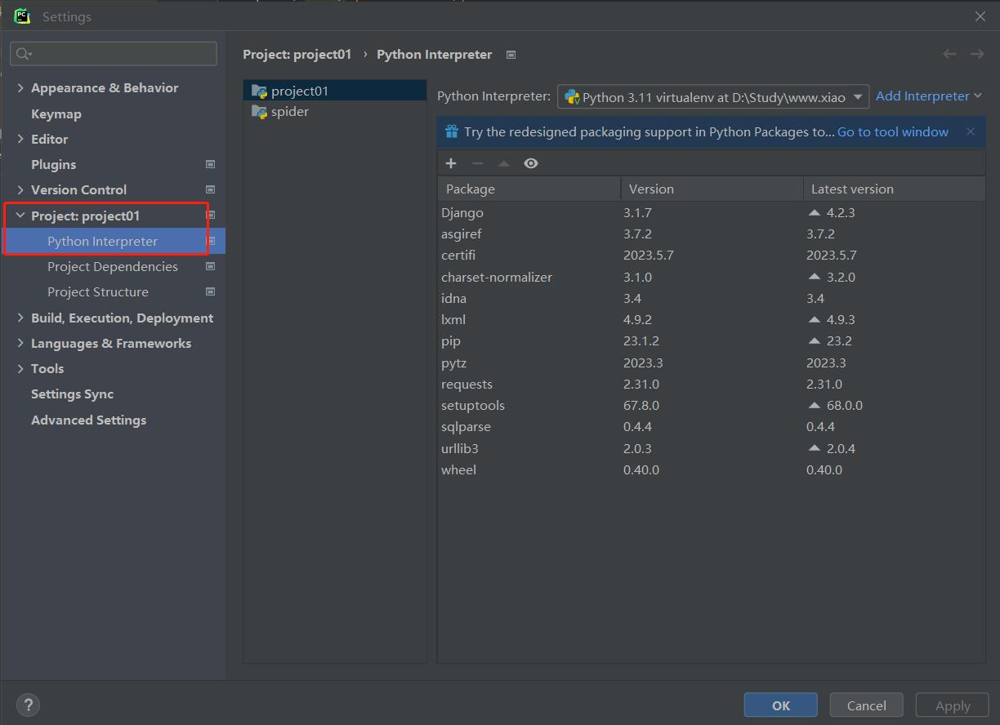

2.在 Settings 窗口的中间栏中选择需要远程开发的 django 项目(比如我这里的 project01) ,然后点击右侧栏中 Python Interpreter（默认使用的是本地的 python 解释器） 后面的 Add Interpreter，在下拉列表中点击 SSH,如图：  
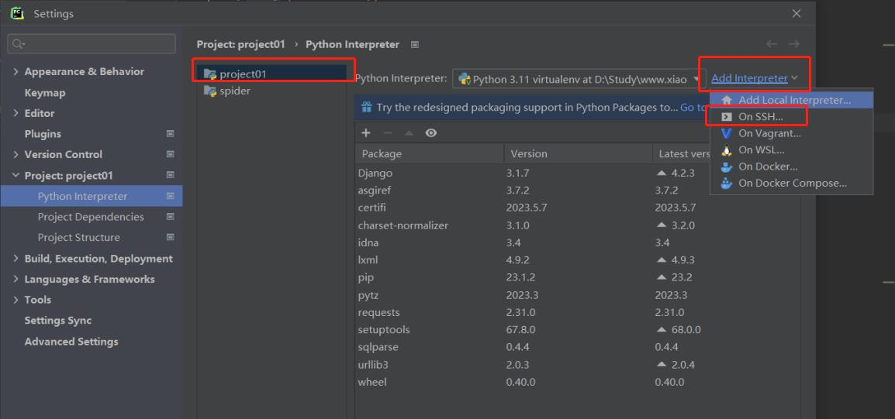

3.在弹出的 New Target: SSH 窗口中做如下配置： SSH Connection 选择后面的 Existing ; SSh Server 就可以选择我们在上面配置好了的远程服务器了 ，然后点击下 Move, 最后点击 Next ,如下图：  
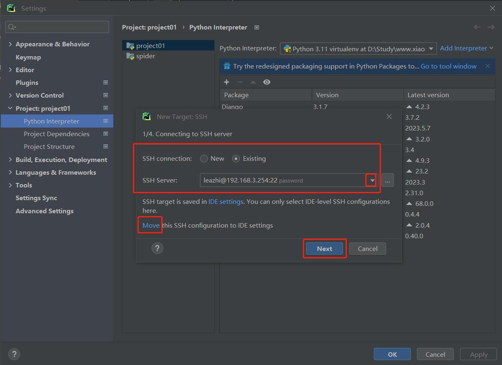

4.python 解释器配置的第二步，继续点击 Next，如下图：  


5.进入 python 解释器配置的第三步。在该窗口中选择左侧的 virtualenv environment ,然后再右侧的 environment 属性中点选 Existing; 在下面的 Interpreter 中点击后面的 ... , 然后在新弹出的 Python Interpreter Executable Path 中指定我们之前配置好的 python 虚拟环境路径目录下的 python 可执行文件（非目录，否则会提示权限不足，添加失败）; Sync folders 这里是同步目录，也就是第一部分中配置的映射，最后点击 Create ,如下图：  
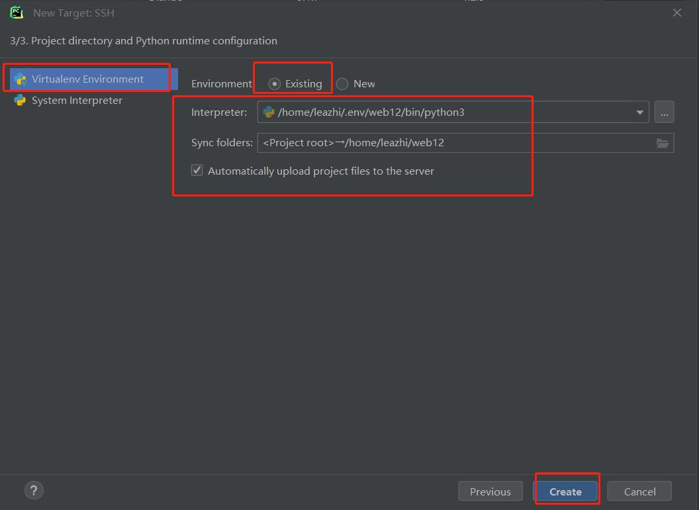

6.最后，配置完成应该如下图：  
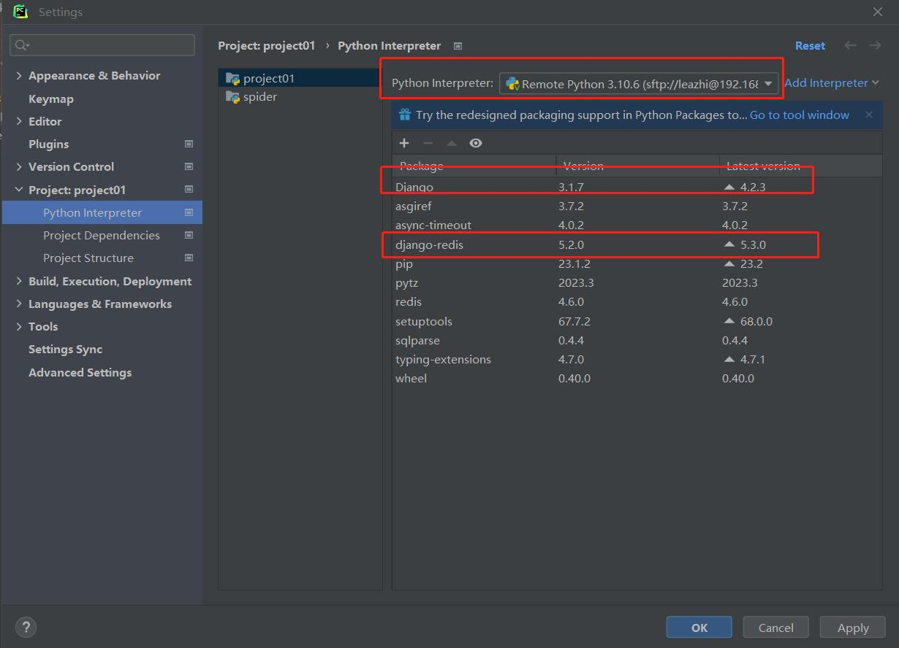


### 配置项目远程访问路径

既然项目已经在远程开发了，那么我们在边开发的时候，也需要项目运行在远程，这样才能方便我们进行测试。所以，接下来，我们还需要配置项目的启动参数：

1.鼠标左键点击 pycharm 中运行的 manage.py 视图（一定要是运行状态），然后在下拉菜单中点击 Edit Configurations ...,如下图：  
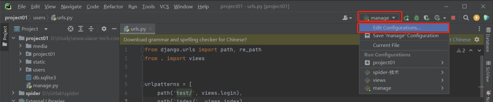


2.在新打开的 Run/Debug Configuration 窗口点击左侧窗口下 Python ---> manage, 然后在其右侧配置栏中找到 Parameters，输入：  `runserver 192.168.3.254:8001`，最后点击 OK， 如下图：  
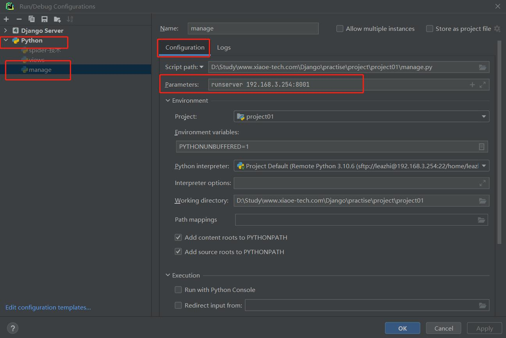

3.编辑项目包下的 settings.py 文件，找到 ALLOWED_HOST = [] 的配置，将其修改成：
```bash
ALLOWED_HOSTS = ['*']
```

4.重新运行 pycharm 中的 manage ,开 pycharm 窗口下面 Run 属性窗口中的信息是否有变成远程服务器的 IP 和端口：  
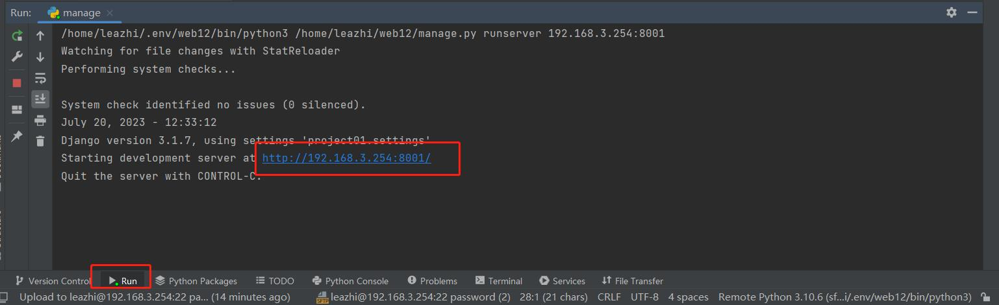

5.测试使用服务器的地址:端口访问，如果能正常访问到 django 中的文件，则代表成功，比如：  
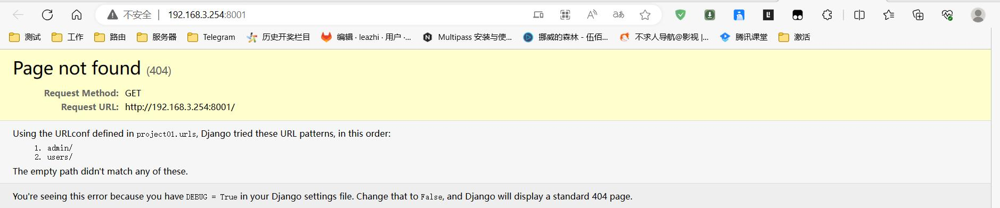