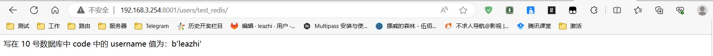

## 安装 django-redis 环境

1.先确认下是否有安装 django-redis:
```bash
$ (web12) leazhi@ubuntuhome:~$ pip3 list
Package           Version
----------------- -------
asgiref           3.7.2
async-timeout     4.0.2
Django            3.1.7
django-redis      5.2.0
pip               23.1.2
pytz              2023.3
redis             4.6.0
setuptools        67.7.2
sqlparse          0.4.4
typing_extensions 4.7.0
wheel             0.40.0
```

如果没有安装，则直接使用命令：
```bash
$ pip3 install django-redis -y https://pypi.douban.com/simple
```

## 项目配置

编辑 django 项目主目录下的 settings.py 文件，在 DATABASE 的配置下面添加 redis 的配置，如下：

### redis 无密码验证：

无密码的 redis 配置：
```bash
CACHES = {
    'default': {
        'BACKEND': 'django_redis.cache.RedisCache',
        'LOCATION': 'redis://127.0.0.1:6379/0',
        'OPTIONS': {
            'CLIENT_CLASS':'django_redis.client.DefaultClient',
        }
    },
    'code': {
        'BACKEND': 'django_redis.cache.RedisCache',
        'LOCATION': 'redis://127.0.0.1:6379/1',
        'OPTIONS': {
            'CLIENT_CLASS':'django_redis.client.DefaultClient',
        }
    },
}
```


### redis 有密码验证：

有密码的 redis 配置：参考文档: [django-redis 中文文档](https://django-redis-chs.readthedocs.io/zh_CN/latest/)
```bash
CACHES = {
    'default': {
        'BACKEND': 'django_redis.cache.RedisCache',
        'LOCATION': 'redis://192.168.3.254:22652/9',
        'OPTIONS': {
            'CLIENT_CLASS':'django_redis.client.DefaultClient',
            "PASSWORD": "Zmi2hU4hGkdroBl7wWm/DszVaWWqrgNuWwD2tmHO",         # 密码用 PASSWORD 键值对的方式，写在 OPTIONS 下面 
        }
    },
    'code': {
        'BACKEND': 'django_redis.cache.RedisCache',
        'LOCATION': 'redis://192.168.3.254:22652/10',
        'OPTIONS': {
            'CLIENT_CLASS':'django_redis.client.DefaultClient',
            "PASSWORD": "Zmi2hU4hGkdroBl7wWm/DszVaWWqrgNuWwD2tmHO",
        }
    },
}
```

## 测试 redis


以下部分都在 django 子应用下配置

... 代表文件中的原数据


1.编辑子应用下的视图函数文件 views.py ,先导入 django_redis ,然后写一个 django_redis 的视图函数，如：
```python
...
from django_redis import get_redis_connection

...

def test_redis(request):

    conn = get_redis_connection('code')     # 创建 redis 连接对象
    # print(conn)

    conn.set('username', 'leazhi')          # 添加数据 （K, V)
    conn.save                               # 保存数据

    res = conn.get('username')
    return HttpResponse(f'写在 10 号数据库中 code 中的 username 值为：{res}' )

```

2.同理，编辑子应用下的路由文件 urls.py, 在列表 `urlpatterns = [ ]` 中添加访问测试 redis 的路由，如下：
```python
    path('test_redis/', views.test_redis)
```

3.在浏览器中输入远程服务器 django 项目运行指定的 IP 和端口进行访问，如下：  
