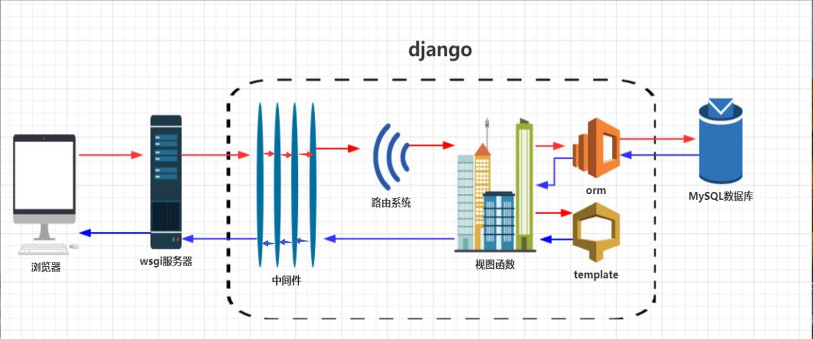
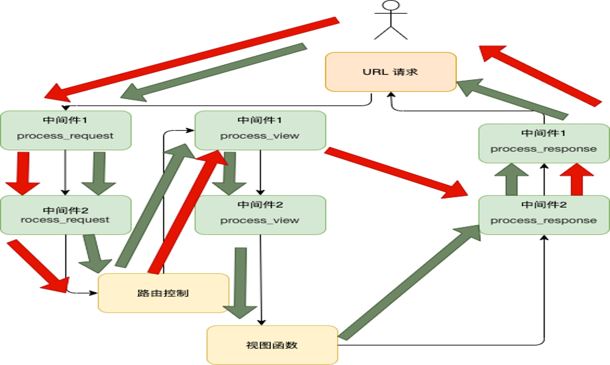


1.中间件是直接在 django 中进行调用的，不需要再去写路由和视图函数，只需要将其在 django 项目的 settings.py 文件中注册即可！
2.中间件 middlewarse.py 一般创建在子应用中;  
3.中间件是一个底层的插件系统。它是用来控制请求和响应的顺序（访问流程），它的本质是在请求和响应的处理过程中加了一层处理


## 中间件执行顺序

### 中间的执行顺序说明：  
浏览器到服务器端的请求方式（Request）: 从左（上）往右（下）执行；    
服务器到浏览器端的响应方式（Response）: 从右（下）往左（上）执行



### 中间件执行过程顺序说明：

当用户发送请求时，先执行第一个中间件的请求，然后执行第二个中间件的请求，依次类推；然后通过路由的控制，执行第一个中间件的视图函数，接着执行第二个中间件的视图函数，依此类推；就下来就是响应，它的顺序则为：先执行最后一个中间件的响应，然后执行倒数第二个，依此类型，直到第一个中间件的响应，如下图：


## 中间件的配置

1.在子应用目录下新建中间价文件 middlewarse.py,测试内容如下：
```python
from django.utils.deprecation import MiddlewareMixin

class MD1(MiddlewareMixin):
    def process_request(self, request):
        print('process1_request', id(request))               # 在视图函数之前调用

    def process_reponse(self, request, response):
        print('process1_response', id(request))
        return response

    def process_view(self, request, view_func, view_args, view_kwargs):
        print('process1_view', id(request))


class MD2(MiddlewareMixin):
    def process_request(self, request):
        print('process2_request', id(request))               # 在视图函数之前调用

    def process_reponse(self, request, response):
        print('process2_response', id(request))
        return response

    def process_view(self, request, view_func, view_args, view_kwargs):
        print('process2_view', id(request))
```


2.编辑 django 项目主包目录下的 settings.py 文件，MIDDLEWARE = [...] 配置列表中注册自定义的中间件类名，如下：
```python
# 中间件执行顺序：请求：是从上到下；响应：是从下到上
MIDDLEWARE = [
    'django.middleware.security.SecurityMiddleware',
    'django.contrib.sessions.middleware.SessionMiddleware',
    'django.middleware.common.CommonMiddleware',
    # 'django.middleware.csrf.CsrfViewMiddleware',
    'django.contrib.auth.middleware.AuthenticationMiddleware',
    'django.contrib.messages.middleware.MessageMiddleware',
    'django.middleware.clickjacking.XFrameOptionsMiddleware',
    # 注册中间件。请求先执行 MD1, 然后执行 MD2; 响应则是先调用 MD2 ,然后 MD1
    'users.middlewarse.MD1',
    'users.middlewarse.MD2',
]
```

## 测试：

在浏览器中输入 url: http://192.168.3.254:8001/users/register/ （注意：这里的IP 和 任意路由根据自己的实际情况进行修改）, 访问如下：

pycharm 控制台输出：
```python
System check identified no issues (0 silenced).
July 22, 2023 - 11:42:18
Django version 3.1.7, using settings 'project01.settings'
Starting development server at http://192.168.3.254:8001/
Quit the server with CONTROL-C.
process1_request 140108404590000                # 看这部分的请求、视图 及响应顺序
process2_request 140108404590000
process1_view 140108404590000
process2_view 140108404590000
process2_response 140108404590000
process1_response 140108404590000
[22/Jul/2023 11:42:19] "GET /users/register/ HTTP/1.1" 200 338
```