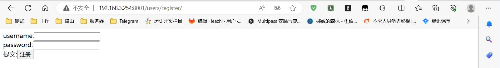
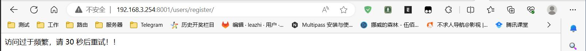

1.在子应用目录下创建黑白名单中间件文件 web_secure.py ，内容为：
```python
from django.utils.deprecation import MiddlewareMixin
from django.http import HttpResponse
import time

white = ['127.0.0.1']           # 白名单列表
black = ['127.0.0.2']           # 黑名单列表
ban = {}                        # 定义的小黑屋
ban_seconds = 3                 # 时间频率（在一定的时间内）
ban_limit = 5                   # 访问频率（在指定的时间内能够访问多少次，假设正常用户 3秒内访问5次，超出视为不正常访问）
ban_time = 30                   # 封禁时间

class White_Black(MiddlewareMixin):
    def process_request(self, request):

        # 从浏览器获取客户访问IP地址
        ip = str(request.META.get('REMOTE_ADDR'))

        # 如果客户的IP 在黑名单中，则直接返回 禁止访问，并给出访问状态码 403
        if ip in black:
            return HttpResponse('禁止访问', status=403)

        # 如果小黑屋中没有客户IP（也就是客户第一次访问），则记录一下该IP的访问次数，访问时间
        if not ban.get(ip):
            ban[ip] = {'total': 1, 'time': int(time.time()), "banTime":''}

        # 打印下客户IP及访问次数
        print(ip, ban[ip].get('total'))

        # 如果不是第一次请求 则判断上次请求和这次请求是否在合法时间内。 如果访问时间合法（也就是3秒内），则判断一下访问次数
        if ban[ip]['time'] + ban_seconds > int(time.time()):

            # 如果访问次数大于限制次数 直接return 将ip关小黑屋 设置限制时间
            if ban[ip]['total'] > ban_limit:
                ban[ip]['banTime'] = int(time.time()) + ban_time
                return self.ban_response()

            # 如果没有大于限制次数
            ban[ip]['total'] += 1
            print(ban)

        # 如果不是在合法时间内请求
        else:
            
            # 先根据此ip找封的时间
            limit_timie = ban[ip]['banTime']

            # 如果已经禁止，则过ban_seconds秒后才可以解除
            if limit_timie and limit_timie > int(time.time()):
                return self.ban_response()

            # 过了限制时间，解除限制
            del ban[ip]


    def ban_response(self):
        return HttpResponse(f'访问过于频繁，请 {ban_time} 秒后重试！！')

    def process_response(self, request, resonse):
        return resonse
```

2.编辑 django 项目主包目录下的 settings.py 文件，在 MIDDLEWARE = [...] 配置列表中注册自定义的中间件类名，如下：
```python
MIDDLEWARE = [
    'django.middleware.security.SecurityMiddleware',
    'django.contrib.sessions.middleware.SessionMiddleware',
    'django.middleware.common.CommonMiddleware',
    # 'django.middleware.csrf.CsrfViewMiddleware',
    'django.contrib.auth.middleware.AuthenticationMiddleware',
    'django.contrib.messages.middleware.MessageMiddleware',
    'django.middleware.clickjacking.XFrameOptionsMiddleware',
    # 注册中间件。请求先执行 MD1, 然后执行 MD2; 响应则是先调用 MD2 ,然后 MD1
    'users.middlewarse.MD1',
    'users.middlewarse.MD2',
    'users,web_secure,White_Black',
]
```

3.测试。在浏览器中输入 url: http://192.168.3.254:8001/users/register/ （注意：这里的IP 和 任意路由根据自己的实际情况进行修改）,效果如下：

3.1.正常访问：  


3.2.快速刷新，访问：   
