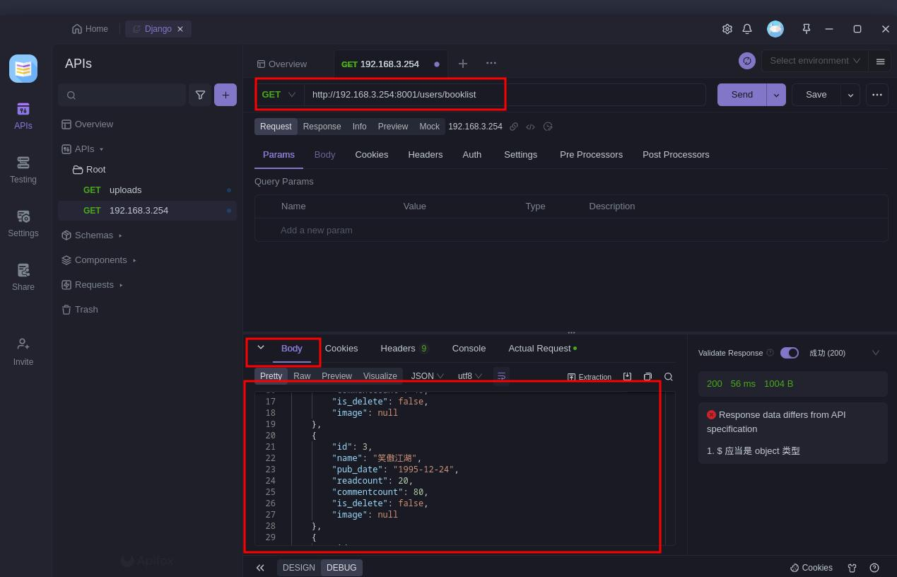
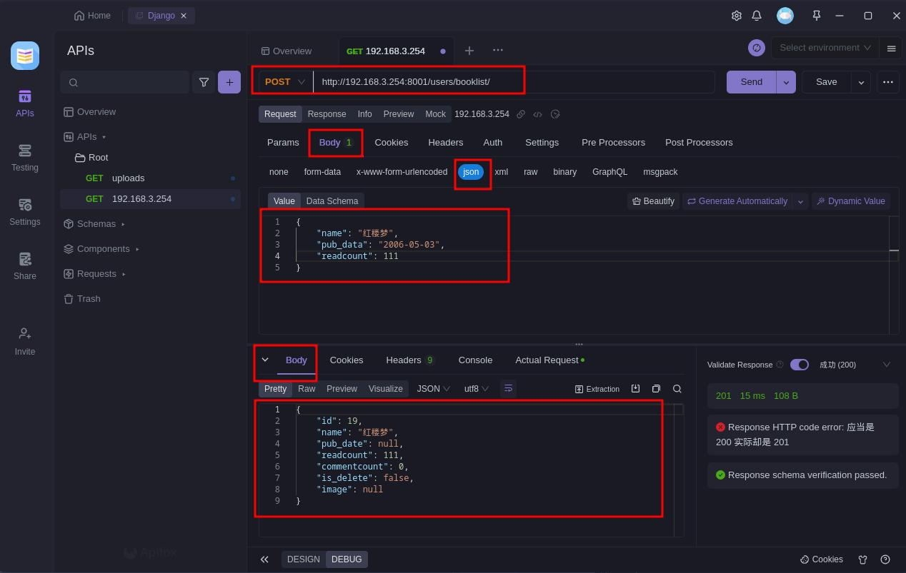
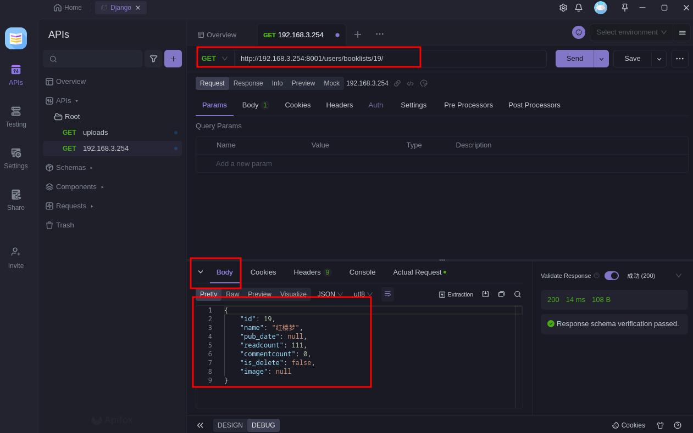
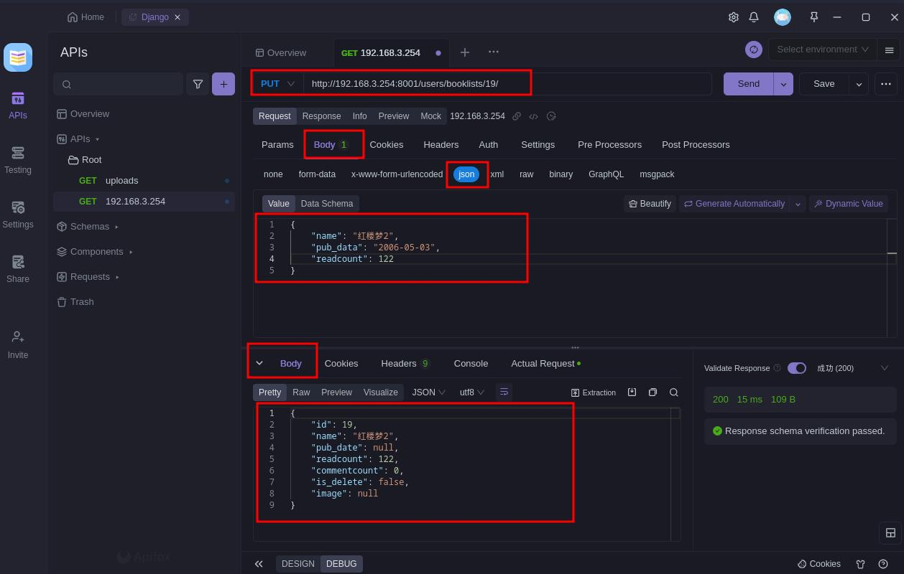
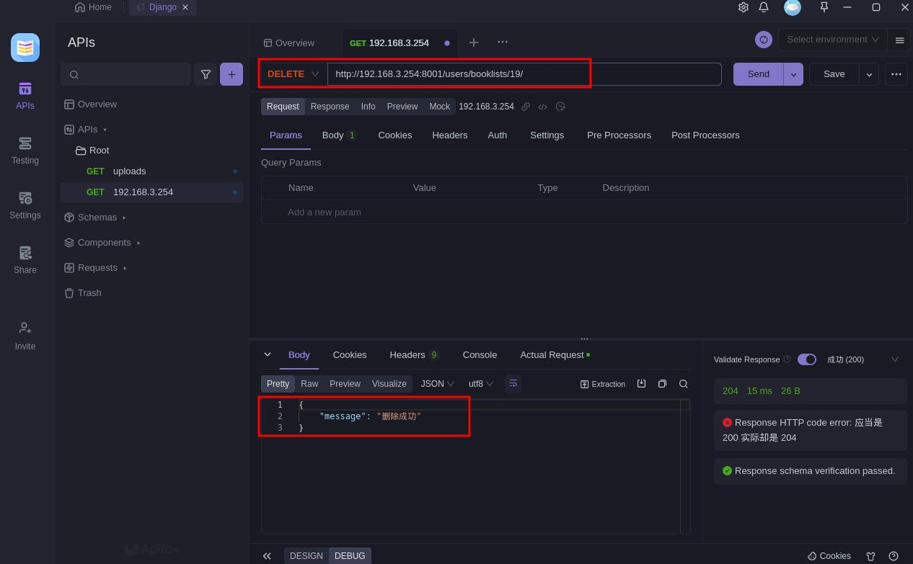
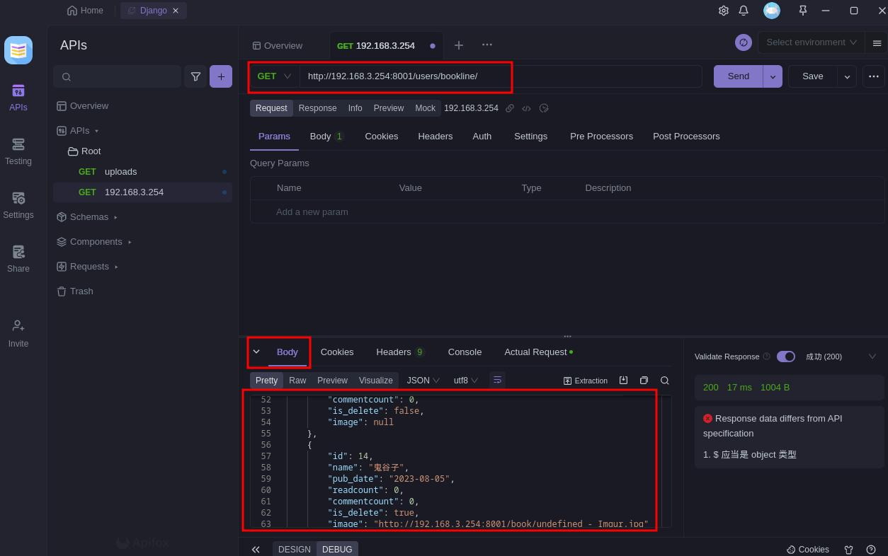
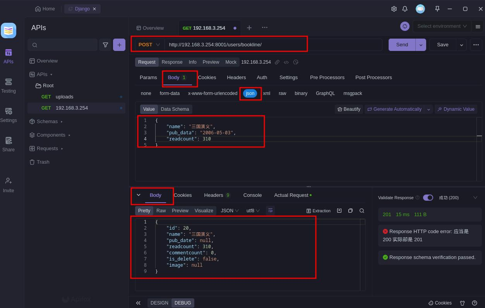

## 5 大扩展类

扩展类：就是在基类上进行了封装,使用前，都需要集成 `GenericAPIView` 基类

### 列表视图 ListModelMixin 和 CreateModelMixin

**1.在Django Rest Framework (DRF) 中,ListModelMixin是一个非常有用的类,它封装了列出查询集合的常逻辑。**

ListModelMixin的主要作用有:   
- 提供list()方法,用来返回一个查询集合。
- 提供paginate_queryset()方法进行分页。
- 提供get_queryset()钩子方法,用于定制查询集。
- 提供filter_queryset()方法进行过滤。
- 提供get_serializer_class()方法,用于指定序列化类。
- 提供get_serializer()方法,用于序列化查询集。   
   
使用ListModelMixin的主要步骤:  
- 继承ListModelMixin
- 指定queryset属性,或重写get_queryset()方法
- 可选重写get_serializer_class()和get_serializer()
- 在list()方法中调用self.paginate_queryset()进行分页
- 在list()方法中调用self.get_serializer()进行序列化   
 
所以ListModelMixin可以很好地提取ListView的公共逻辑,使用它可以快速构建出列表视图,提高代码复用性,是DRF框架中很有用的一个类。它通常会和GenericAPIView、ViewSetMixin一起使用,构建自定义的ViewSet。


**2.在Django Rest Framework中,CreateModelMixin是一个非常有用的类,它封装了创建模型实例的通用逻辑。**

CreateModelMixin的主要提供了以下功能:
- create()方法,用于处理POST请求,创建并保存新的模型实例。
- get_serializer_class()方法,用于指定序列化器类。
- get_serializer()方法,用于实例化序列化器。
- perform_create()钩子方法,在保存模型实例前进行定制操作。

使用CreateModelMixin的主要步骤是:
- 继承CreateModelMixin。
- 指定serializer_class属性,或重写get_serializer_class()。
- 在create()方法中调用get_serializer()获得序列化器实例。
- 在create()方法中调用perform_create()进行定制操作。
- 在create()方法中调用serializer.save()保存到数据库。
- 处理异常并返回适当的状态码。
- 根据需要重写perform_create自定义创建前逻辑。  

所以CreateModelMixin封装了创建模型的典型流程,使用它可以避免重复代码,帮助快速构建创建视图,是DRF框架中很有用的一个类。它通常会配合GenericAPIView、ViewSetMixin使用,构建自定义的CreateModelViewSet。



1.编辑子应用目录下的 views.py，从 rest_framework.mixins 中导入 ListModelMixin 和 CreateModelMixin 模块，然后编写该模块使用的代码，如下：
```python
# users/views.py

... 

from rest_framework.mixins import ListModelMixin,CreateModelMixin

...

class BookInfoListModelMixin(ListModelMixin, GenericAPIView, CreateModelMixin):

    """
    列表视图
    """
    queryset = BookInfo.objects.all()
    serializer_class = BookInfoSerializers

    def get(self,request):
        return self.list(request)

    def post(self, request):
        return self.create(request)
```

2.编辑子应用目录下的路由文件  urls.py, 在默认的 `urlpatterns = [..]` 中添加访问路由（注意：非 DRF 路由），如下：
```python
# users/urls.py

...

urlpatterns = [
    ...
    path('booklist/', views.BookInfoListModelMixin.as_view()),
]

...
```

3.打开浏览器，访问路由：

3.1.查询数据：


3.1.增加数据：


### 详情视图 RetrieveModelMixin、UpdateModelMixin 及 DestroyModelMixin


在Django Rest Framework (DRF) 中,还有另外3种常用的Model Mixins:

1.RetrieveModelMixin:封装模型实例详情获取逻辑。

- 提供retrieve()方法处理GET请求,返回一个模型实例。
- 提供get_object()方法获取实例。
- 可以配合GenericAPIView构建详情视图。


2.UpdateModelMixin:封装模型实例更新逻辑。

- 提供update()方法处理PUT请求,更新实例。
- 提供partial_update()方法处理PATCH请求。
- 提供get_object()获取实例,perform_update()方法定制修改前逻辑。
- 可以配合GenericAPIView构建更新视图。


3.DestroyModelMixin:封装模型实例删除逻辑。

- 提供destroy()方法处理DELETE请求,删除实例。
- 提供get_object()方法获取实例。
- 提供perform_destroy()方法定制删除前逻辑。
- 可以配合GenericAPIView构建删除视图。

这3个Mixin与CreateModelMixin类似,分别封装了CRUD流程中的获取、更新、删除逻辑,使用它们可以避免重复代码,帮助快速构建RESTful API。通常配合ViewSet一起使用。


1.编辑子应用目录下的 views.py，从 rest_framework.mixins 中导入 RetrieveModelMixin、 UpdateModelMixin 及 DestroyModelMixin 模块，然后编写该模块使用的代码，如下：
```python
# users/views.py 

...

from rest_framework.mixins import RetrieveModelMixin, UpdateModelMixin, DestroyModelMixin

...

class BookInfoRetrieveModelMixin(GenericAPIView, RetrieveModelMixin, UpdateModelMixin, DestroyModelMixin):

    """
    详情视图
    """
    queryset = BookInfo.objects.all()
    serializer_class = BookInfoSerializers
    def get(self,request ,pk):
        return self.retrieve(request)

    def put(self,request,pk):
        return self.update(request)

    def delete(self,request,pk):
        return self.delete(request)
```

2.编辑子应用目录下的路由文件  urls.py, 在默认的 `urlpatterns = [..]` 中添加访问路由（注意：非 DRF 路由），如下：
```python
# users/urls.py

...

urlpatterns = [
    ...
    re_path('^booklists/(?P<pk>\d+)/$', views.BookInfoDetailGenericAPIView.as_view()),
]

...
```

3.打开浏览器，访问路由：

3.1.查询单个数据：


3.2.修改数据：


3.3.删除数据：


## 9个子类


Django Rest Framework (DRF) 中,GenericAPIView有9个常用的子类视图,它们是构建API的基石:

1.CreateAPIView: 封装了创建模型的逻辑。   
2.ListAPIView: 封装了查询集列表的逻辑。   
3.RetrieveAPIView: 封装了获取单个模型的逻辑。   
4.DestroyAPIView: 封装了删除单个模型的逻辑。   
5.UpdateAPIView: 封装了更新单个模型的逻辑。   
6.ListCreateAPIView: 结合了列表和创建逻辑。   
7.RetrieveUpdateAPIView: 结合了获取和更新逻辑。   
8.RetrieveDestroyAPIView: 结合了获取和删除逻辑。   
9.RetrieveUpdateDestroyAPIView: 结合获取、更新、删除逻辑。    

这9个视图类使用了Mixin设计模式,内部复用了通用的mixins,而GenericAPIView提供了核心基类能力。

使用时,仅需要继承对应类,设置queryset、serializer_class等属性即可快速构建CRUD接口。

这种设计极大地提高了API视图的可复用性,是DRF框架强大与简洁的重要原因。它们是RESTful API的最佳实践。


1.编辑子应用目录下的 views.py，从 rest_framework.generics 中导入  CreateAPIView 及ListAPIView 模块，然后编写该模块使用的代码，如下：
```python
# users/views.py 

...

from rest_framework.generics import CreateAPIView, ListAPIView

...

class BookInfoCreateView(CreateAPIView, ListAPIView):
    queryset = BookInfo.objects.all()
    serializer_class = BookInfoSerializers
```

2.编辑子应用目录下的路由文件  urls.py, 在默认的 `urlpatterns = [..]` 中添加访问路由（注意：非 DRF 路由），如下：
```python
# users/urls.py

...

urlpatterns = [
    ...
    path('bookline/', views.BookInfoCreateView.as_view()),
]

...
```

3.打开浏览器，访问路由：

3.1.查询数据：


3.1.增加数据：
