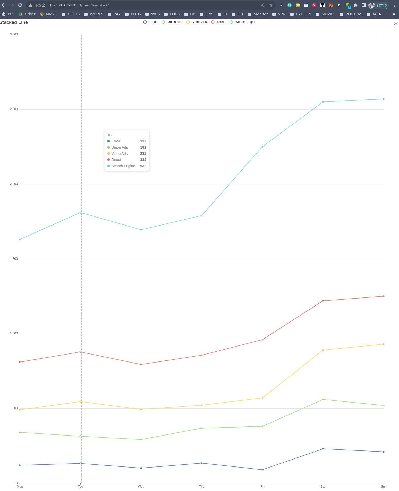
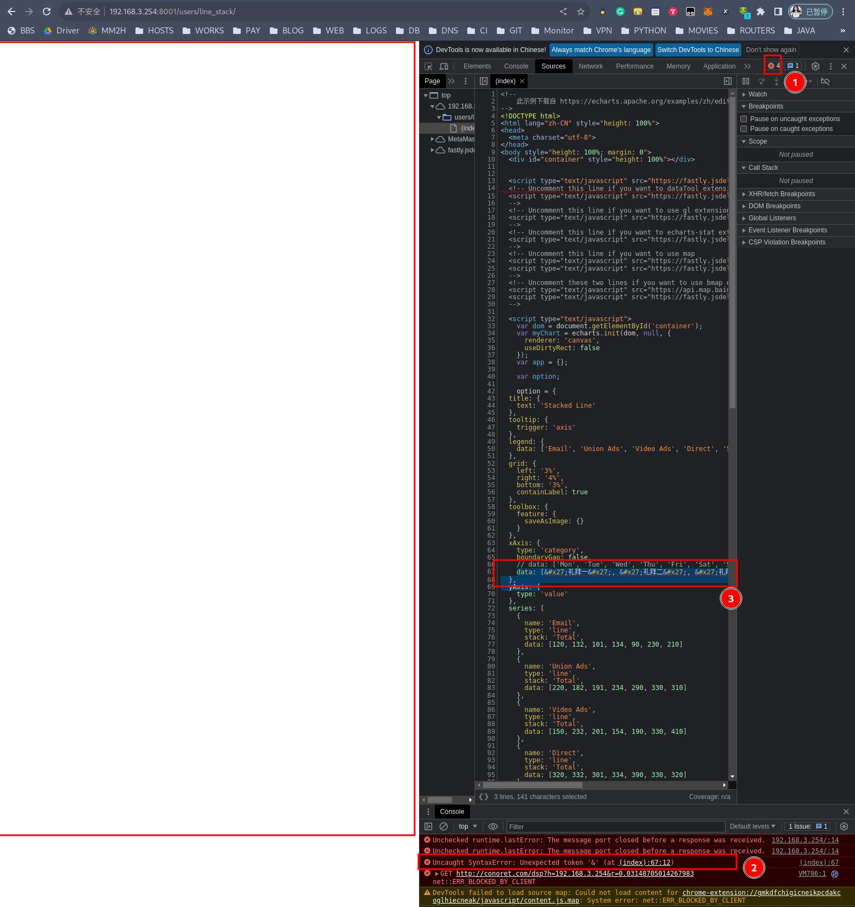
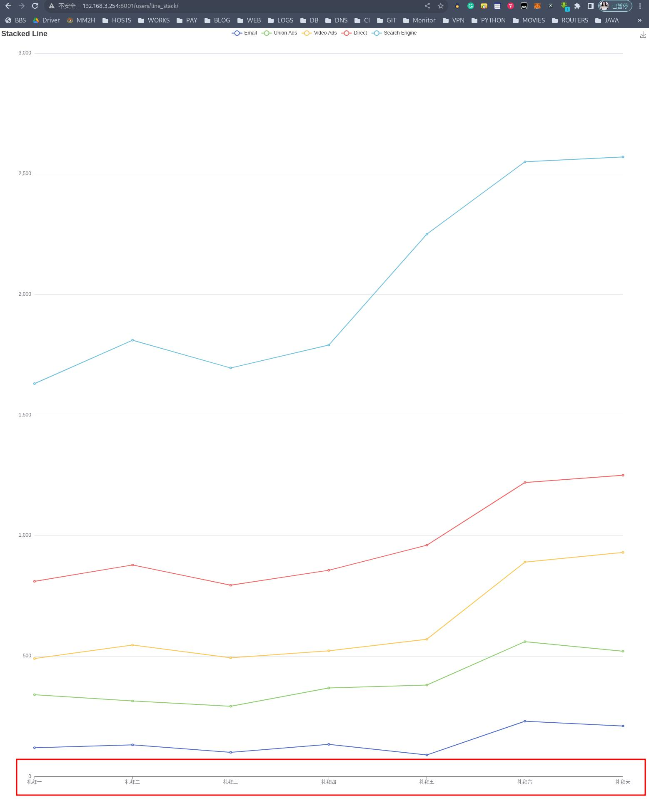
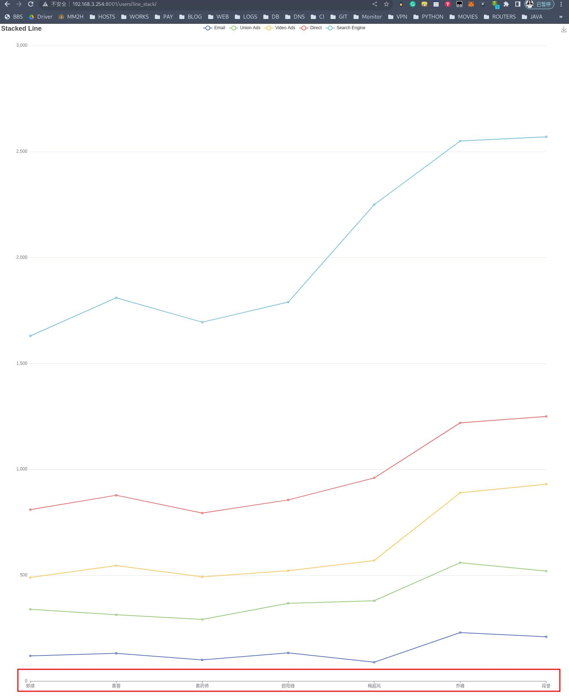
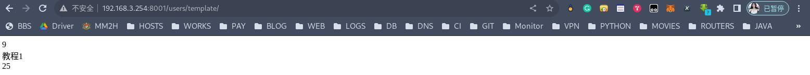
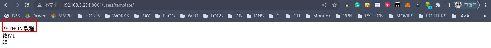
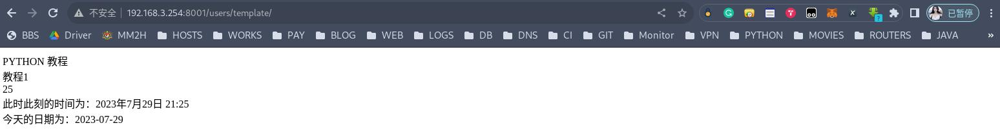
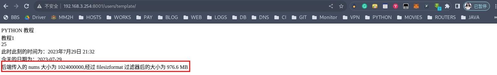
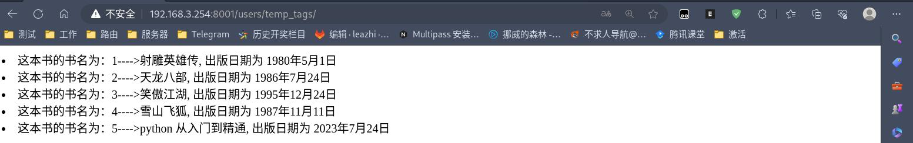
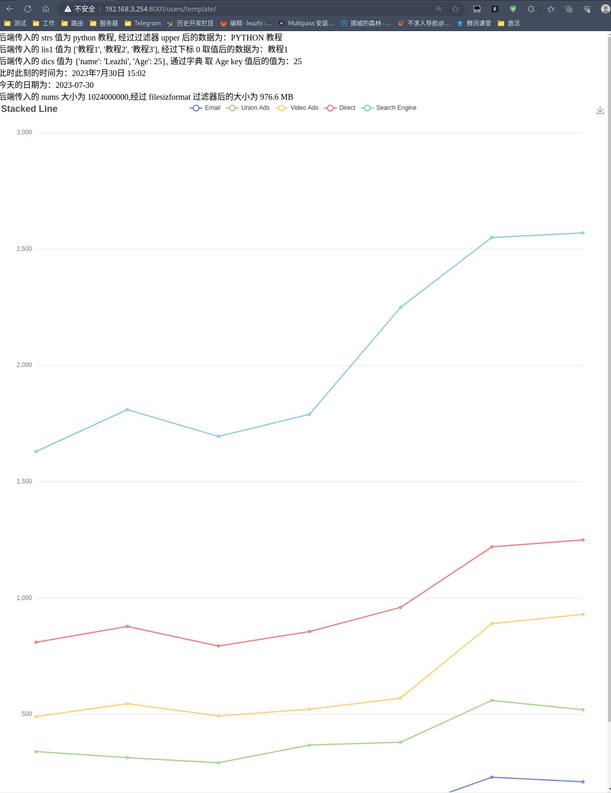

## 模板的配置

1.编辑项目下的 settings.py 文件，在该文件中找到关键字 `TEMPLATES = [...]` ，修改其中的 `DIRS` 关键字后的值，指定模板文件存放的目录路径，比如：
```python
TEMPLATES = [
    {
        'BACKEND': 'django.template.backends.django.DjangoTemplates',
        # 指定使用的模板文件夹 --- 存放 html 文件目录， 写创建的目录路径
        'DIRS': [BASE_DIR / 'templates'],
        'APP_DIRS': True,
        'OPTIONS': {
            'context_processors': [
                'django.template.context_processors.debug',
                'django.template.context_processors.request',
                'django.contrib.auth.context_processors.auth',
                'django.contrib.messages.context_processors.messages',
            ],
        },
    },
]
```

2.根据配置，在项目根目录下创建模板目录 templates:

3.接下来，我们就在创建的 templates 目录中创建前端 html 文件进行使用

## 模板的使用


为了便于测试，我们先去 [ECHARTS](https://echarts.apache.org/examples/zh/index.html) 站点下载一个 html 文件，比如： line-stack.html，将其存放到上面创建的 templates 目录中：

1.编辑子应用下的视图文件 views.py，在最下面添加访问目录文件的视图函数 line_stack,内容如下：
```python
def line_stack(request):

    return render(request, 'line-stack.html')
```

2.编辑子应用下的路由文件 urls.py ，在路由配置段 `urlpatterns = [...]` 中添加访问模板文件的路由，如下：
```python
urlpatterns = [
  ...
  path('line_stack/', views.line_stack),
]
```

3.在浏览器中输入 django 访问地址：http://192.168.3.254:8001/users/line_stack/， 如下图：



## 模板语法


1.Django 模板方法是 Djang 模板语言中的一种语法结构，用于在模板中调用函数。
2.模板方法的语法是：
```python
{{ function_name(argument1, argument2)|过滤器 }} 或 {{ 变量名|过滤器 }};
```
3.利用 render() 方法把后端的数据通过 context 参数以字典传参的形式(默认 ceontext 参数为空)，将数据显示到前端 html;



​**以\{\{ user.uname \}\}为例**
```python
首先把 user 当成一个字典，把 uname 当成键名，即对user['uname']进行取值
把 user 当成一个对象，把 uname 当成属性，即对user.uname进行取值
把 user 当成一个对象，把 uname 当成对象的方法，即对user.uname()进行取值
```

​**再以\{\{ user.0 \}\}为例**
```python
首先把 user 当成一个字典，把 0 当成键名，即对user['0']进行取值
把 user 当成一个列表，把 0 当成下标，即对user[0]进行取值
```
​如果解析失败，则产生内容时用空字符串填充模板变量

​使用模板变量时，.前面的可能是一个字典，可能是一个对象，还可能是一个列表



### 列表类型数据

#### 实例一：展示自定义在视图函数中的数据

**比如，我们要修改模板文件 line-stack.html 中字典 `xAxis: {...}` 中 data 的值：['Mon', 'Tue', 'Wed', 'Thu', 'Fri', 'Sat', 'Sun']**

1.编辑子应用的视图文件 views.py,修改视图汉书 line_stack 为：
```python
def line_stack(request):
    # 自定义一个字典，KEY 随意定义，后面模板中将使用这个 key 名称作为变量名进行传值
    # 展示自定义的数据
    data = {
        'test': ['礼拜一', '礼拜二','礼拜三','礼拜四','礼拜五','礼拜六','礼拜天']
    }
    return render(request, 'line-stack.html', context=data)
```

2.编辑模板文件 line-stack.html ，修改字典 `xAxis: {...}` 中 data 的值为 模板语法，变量名为子视图文件 views.py 中定义的字典 key 名称：
```html
...
xAxis: {
    type: 'category',
    boundaryGap: false,
    <!-- 这里的 test 是视图函数中定义的字典 data 中的 key 名 -->
    data: {{ test }}    
  },
...
```

3.刷新下浏览器，发现 url 访问正常，但是没有数据展示。F12 打开浏览器开发者模式，可以看到调试窗口有报错信息，如图：



4.此时，我们就需要使用**模板中的过滤器 `|safe`** ，如何使用呢？如下。继续修改模板文件，在修改的模板文件中的模板语法处加上过滤器即可，如下：
```html
  xAxis: {
    type: 'category',
    boundaryGap: false,
    // data: ['Mon', 'Tue', 'Wed', 'Thu', 'Fri', 'Sat', 'Sun']
    data: {{ test|safe }}
  },
```


过滤器：|safe ，将字符串标记为安全，不需要转义。但是，要保证 views.py 传过来的数据绝对安全，才能用 safe。
Django 会自动对 views.py 传到HTML文件中的标签语法进行转义，令其语义失效。加 safe 过滤器是告诉 Django 该数据是安全的，不必对其进行转义，可以让该数据语义生效。



5.再次刷新浏览，就可以看到底部的名称变成了我们在视图函数中定义的字典 'test' 对应的值中的内容了：



#### 实例二：展示模型类中的数据

1.首先在子视图文件 views.py 中导入模型类，然后将模型类中的数据查询出来：
```python
# users/views.py
...
from users.models import PeopleInfo
...

def line_stack(request):
    # 展示自定义的数据
    # data = {
    #     'test': ['礼拜一', '礼拜二','礼拜三','礼拜四','礼拜五','礼拜六','礼拜天']
    # }

    # 展示模型类中的数据
    # 创建一个空的列表，因为前端要去后段传递列表类型的数据
    list1 = []
    # 查询模型类中的所有数据，并赋值给 quest
    quest = PeopleInfo.objects.all()      # 此时的 quest 结果为 QuerySet 列表.此时的数据不能直接拿去使用，还需要转换
    # 通过 for 循环，调用模型类中的 name 属性取出 QuerySet 列表中每一个类属性 name 的值，然后将取出的值添加到自定义的列表 list1 中进行传递：
    for i in quest:
        list1.append(i.name)
    data = {
        'quest': list1[0:7]
    }
    return render(request, 'line-stack.html', context=data)
```


2.再次编辑模板文件 line-stack.html ，修改字典 `xAxis: {...}` 中 data 的值为 模板语法，变量名为子视图文件 views.py 中定义的字典 key 名称：
```html
...
xAxis: {
    type: 'category',
    boundaryGap: false,
    <!-- 这里的 quest 是视图函数中定义的字典 data 中的 key 名 -->
    data: {{ quest|fase }}    
  },
...
```

3.刷新下浏览器，如下图;


### 字符串、字典数据类型

1.编辑子应用下的视图文件 views,在最底部添加一个 template 的视图函数，内容为：
```python
def templates(request):
    # 字符串类型
    strs = 'python 教程'

    # 字典类型
    dics = {'name': 'Leazhi', 'Age': 25}

    # 列表类型
    lis1 = ['教程1', '教程2', '教程3']

    data = {
        'strs': strs,
        'lis1': lis1,
        'dics': dics
    }

    return render(request, 'template.html', context=data)
```
2.编辑子应用下的路由文件 urls.py ，添加访问视图函数 template 的路由，如下：
```python
...
urlpatterns = [
    ...
    path('template/', views.templates),
]
```

3.在模板目录 templates 目录创建一个模板文件，这里命名为 template.html ，内容为：


**模板文件中的变量 strs、lis1 及 dics 都是后端在视图文件 views.py 中定义在 data 数据库中的 key 名称，而不是在 template 函数中定义的标量**


```html
<!DOCTYPE html>
<html lang="en">
<head>
    <meta charset="UTF-8">
    <title>Title</title>
</head>
<body>

<!-- 通过过滤器 length 获取后端视图中传入的 字符串 strs 数据的长度 -->
{{ strs|length }}<br>

<!-- 通过下标取值的方式，获取后端视图中传入的 列表 lis1 中的指定下标的值 -->
{{ lis1.0 }}<br>

<!-- 通过字典键值对使用 key 取值的方式，获取后端视图值中传入字典 dics 中 key 为 Age 的值 -->
{{ dics.Age }}<br>
</body>
</html>
```

4.打开浏览器，访问视图函数如下图：



## 模板过滤器

### upper 过滤器

upper 过滤器是将后端传入过来的小写转换成大写:

1.修改模板文件 template.html（其它都不用动）,将其修改为：
```html
<!DOCTYPE html>
<html lang="en">
<head>
    <meta charset="UTF-8">
    <title>Title</title>
</head>
<body>

<!-- 通过过滤器 length 获取后端视图中传入的 字符串 strs 数据的长度 -->
{{ strs|upper }}<br>

<!-- 通过下标取值的方式，获取后端视图中传入的 列表 lis1 中的指定下标的值 -->
{{ lis1.0 }}<br>

<!-- 通过字典键值对使用 key 取值的方式，获取后端视图值中传入字典 dics 中 key 为 Age 的值 -->
{{ dics.Age }}<br>
</body>
</html>
```

2.刷新下浏览器，如下图：


### date 过滤器

格式：
```python
Y-m-d H:i:s   返回 年-月-日 时:分:秒
```

1.编辑子应用下的视图文件 views.py, 导入 datetime 模块，然后修改视图函数 template 为：
```python
# users/views.py
import datetime
...

def templates(request):
    # 字符串类型
    strs = 'python 教程'

    # 字典类型
    dics = {'name': 'Leazhi', 'Age': 25}

    # 列表类型
    lis1 = ['教程1', '教程2', '教程3']

    # date 类型
    now = datetime.datetime.now()
    data = {
        'strs': strs,
        'lis1': lis1,
        'dics': dics,
        'time': now       # 传入时间
    }

    return render(request, 'template.html', context=data)
```

2.编辑模板目录下的 template.html 文件，将其修改为：
```html
<!DOCTYPE html>
<html lang="en">
<head>
    <meta charset="UTF-8">
    <title>Title</title>
</head>
<body>
{{ strs|upper }}<br>
{{ lis1.0 }}<br>
{{ dics.Age }}<br>
此时此刻的时间为：{{ time }}<br>
今天的日期为：{{ time|date:"Y-m-d" }}
</body>
</html>
```

3.刷新浏览器，如下图：


### filesizeformat 过滤器

filesizeformat 以更易读的方式显示文件的大小（如 1KB, 976.6 MB 等）

1.编辑子应用下的视图文件 views.py, 导入 datetime 模块，然后修改视图函数 template 为：
```python
# users/views.py
import datetime
...

def templates(request):
    # 字符串类型
    strs = 'python 教程'

    # 字典类型
    dics = {'name': 'Leazhi', 'Age': 25}

    # 列表类型
    lis1 = ['教程1', '教程2', '教程3']

    # date 类型
    nows = datetime.datetime.now()

    # filesizeformat
    nums = 1024000000

    data = {
        'strs': strs,
        'lis1': lis1,
        'dics': dics,
        'time': nows,
        'nums': nums,
    }

    return render(request, 'template.html', context=data)
```

2.编辑模板目录下的 template.html 文件，将其修改为：
```html
<!DOCTYPE html>
<html lang="en">
<head>
    <meta charset="UTF-8">
    <title>Title</title>
</head>
<body>
{{ strs|upper }}<br>
{{ lis1.0 }}<br>
{{ dics.Age }}<br>
此时此刻的时间为：{{ time }}<br>
今天的日期为：{{ time|date:"Y-m-d" }}<br>
后端传入的 nums 大小为 {{ nums }},经过 filesizformat 过滤器后的大小为 {{ nums |filesizeformat }}
</body>
</html>
```
3.刷新浏览器，如下图：


## 模板标签


```python
标签语法：不同于模板语法，模板语法双 {} 号，而标签语法是单 {}


...

```


### 实例：

1.编辑子应用目录下的视图文件 views.py， 导入模型类 BookInfo ,然后添加视图函数 temp_tags,如下：
```python
...
from users.models import BookInfo

...

def temp_tags(request):
    books = BookInfo.objects.all()
    print(books)
    data = {
        'books': books
    }
    print(data)

    return render(request, 'temp_tags.html', context=data)
```

2.编辑子应用下的路由文件 urls.py ，添加访问视图函数 temp_tags 的路由：
```python
...

urlpatterns = [
    ...
    path('temp_tags/', views.temp_tags),
]
```

3.在模板目录下新建模板文件 temp_tags.html, 内容为：
```html
<!DOCTYPE html>
<html lang="en">
<head>
    <meta charset="UTF-8">
    <title>Title</title>


</head>
<body>


    
        <li>这本书的书名为：{{ book.id }}---->{{ book.name }}, 出版日期为 {{ book.pub_date}}</li>
    


</body>
</html>
```

4.打开浏览器，访问 temp_tags:


## 模板的继承与应用

模板的继承是指前端的 html 内容继承，而不是后端的数据也继承（也就是说只继承父模板文件中的内容，如果父模板中有后端传入的数据则不会被继承）

现在，我的 template 目录下有 3 个 html 页面，分别为：register.html 、template.html 以及 line_stack.html 。现在的需求是：要 template.html 继承 line_stack.html,将 line_stack.html 上的内容在 template.html 上面显示。这个时候，我们就需要使用模板标签：


父模板文件中需要先使用下面的标签语法预区域，该区域留给子模板填充差异性的内容，不同预留区域名字不能相同：

```html

...

```




子模板中则使用下面的标签语法指定继承的父模板文件路径，
```html
<!-- 必须放在子模板文件中的第一行 -->

```

且该标签必须放在模板文件中的首行。否则会报：
```python
django.template.exceptions.TemplateSyntaxError: <ExtendsNode: extends 'line-stack.html'> must be the first tag in the template.
```


### 实例一：只在子模板中使用 extends ,而不在父模板中划区域的继承

1.先修改下父模板（因为我们上面父模板中有后端传入的数据，这里要还原回去）：
```html
<!-- # 父模板 line-stack.html -->
<!--
	此示例下载自 https://echarts.apache.org/examples/zh/editor.html?c=line-stack
-->
<!DOCTYPE html>
<html lang="zh-CN" style="height: 100%">
<head>
  <meta charset="utf-8">
</head>
<body style="height: 100%; margin: 0">

<!-- 
 -->
  <div id="container" style="height: 100%"></div>

  
  <script type="text/javascript" src="https://fastly.jsdelivr.net/npm/echarts@5.4.3/dist/echarts.min.js"></script>
  <!-- Uncomment this line if you want to dataTool extension
  <script type="text/javascript" src="https://fastly.jsdelivr.net/npm/echarts@5.4.3/dist/extension/dataTool.min.js"></script>
  -->
  <!-- Uncomment this line if you want to use gl extension
  <script type="text/javascript" src="https://fastly.jsdelivr.net/npm/echarts-gl@2/dist/echarts-gl.min.js"></script>
  -->
  <!-- Uncomment this line if you want to echarts-stat extension
  <script type="text/javascript" src="https://fastly.jsdelivr.net/npm/echarts-stat@latest/dist/ecStat.min.js"></script>
  -->
  <!-- Uncomment this line if you want to use map
  <script type="text/javascript" src="https://fastly.jsdelivr.net/npm/echarts@4.9.0/map/js/china.js"></script>
  <script type="text/javascript" src="https://fastly.jsdelivr.net/npm/echarts@4.9.0/map/js/world.js"></script>
  -->
  <!-- Uncomment these two lines if you want to use bmap extension
  <script type="text/javascript" src="https://api.map.baidu.com/api?v=3.0&ak=YOUR_API_KEY"></script>
  <script type="text/javascript" src="https://fastly.jsdelivr.net/npm/echarts@5.4.3/dist/extension/bmap.min.js"></script>
  -->

  <script type="text/javascript">
    var dom = document.getElementById('container');
    var myChart = echarts.init(dom, null, {
      renderer: 'canvas',
      useDirtyRect: false
    });
    var app = {};
    
    var option;

    option = {
  title: {
    text: 'Stacked Line'
  },
  tooltip: {
    trigger: 'axis'
  },
  legend: {
    data: ['Email', 'Union Ads', 'Video Ads', 'Direct', 'Search Engine']
  },
  grid: {
    left: '3%',
    right: '4%',
    bottom: '3%',
    containLabel: true
  },
  toolbox: {
    feature: {
      saveAsImage: {}
    }
  },
  xAxis: {
    type: 'category',
    boundaryGap: false,
    data: ['Mon', 'Tue', 'Wed', 'Thu', 'Fri', 'Sat', 'Sun']
    // data: {{ quest|safe }}
  },
  yAxis: {
    type: 'value'
  },
  series: [
    {
      name: 'Email',
      type: 'line',
      stack: 'Total',
      data: [120, 132, 101, 134, 90, 230, 210]
    },
    {
      name: 'Union Ads',
      type: 'line',
      stack: 'Total',
      data: [220, 182, 191, 234, 290, 330, 310]
    },
    {
      name: 'Video Ads',
      type: 'line',
      stack: 'Total',
      data: [150, 232, 201, 154, 190, 330, 410]
    },
    {
      name: 'Direct',
      type: 'line',
      stack: 'Total',
      data: [320, 332, 301, 334, 390, 330, 320]
    },
    {
      name: 'Search Engine',
      type: 'line',
      stack: 'Total',
      data: [820, 932, 901, 934, 1290, 1330, 1320]
    }
  ]
};

    if (option && typeof option === 'object') {
      myChart.setOption(option);
    }

    window.addEventListener('resize', myChart.resize);
  </script>
</body>
</html>
```


2.编辑子模板，在子模板顶部添加继承：
```html
<!-- # 子模板 template.html -->

<!DOCTYPE html>
<html lang="en">
<head>
    <meta charset="UTF-8">
    <title>Title</title>
</head>
<body>
<!---->
后端传入的 strs 值为 {{ strs}}, 经过过滤器 upper 后的数据为：{{ strs|upper }}<br>
后端传入的 lis1 值为 {{ lis1}}, 经过下标 0 取值后的数据为：{{ lis1.0 }}<br>
后端传入的 dics 值为 {{ dics }}, 通过字典 取 Age key 值后的值为：{{ dics.Age }}<br>
此时此刻的时间为：{{ time }}<br>
今天的日期为：{{ time|date:"Y-m-d" }}<br>
后端传入的 nums 大小为 {{ nums }},经过 filesizformat 过滤器后的大小为 {{ nums |filesizeformat }}<br>
<!---->
</body>
</html>
```

3.刷新浏览器，如图：
