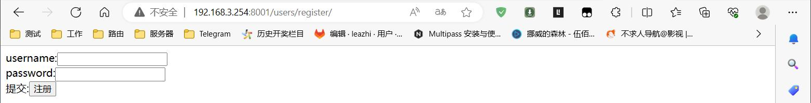
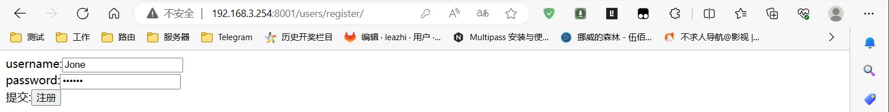
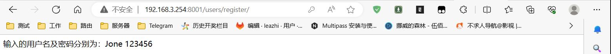

## 子应用视图函数文件 views.py

编辑子应用视图函数文件 views.py, 导入 View 木块 及添加类视图：
```python
from django.views import View
...

...

# 创建类视图
class RegisterView(View):            # 这里要继承 View
    """
    http_method_names = ['get', 'post', 'delete', ...]
    定义的视图函数名，必须遵循 http_method_names 里面的方法
  
    """

    # get 请求方式：
    # 当浏览器访问 -- 请求方式 -- 到这个类的时候，会根据 Http_method_names 里面的请求方式去进行调用
    # as_view() 方法会进行判断请求方式是哪个？ get? post? ...
    def get(self, requeest):

        # 使用 django 自带的 render() 方法调用模板文件，不用在去返回响应了（render() 方法自动会返回响应）
        return render(requeest, 'register.html')

    # post 请求方式：
    def post(self, request):
        username = request.POST.get('username')
        password = request.POST.get('password')
        return HttpResponse('输入的用户名及密码分别为：%s %s'%(username, password))
```

## 子应用路由文件 urls.py

编辑子应用下的路由文件 urls.py, 在 urlpatterns 列表中添加 ：
```python
from django.urls import path, re_path
from . import views


urlpatterns = [
    path('test/', views.login),
    ...
    path('register/', views.RegisterView.as_view()),            # 类视图路由，调用 as_view()方法
]
```
## 模板文件

### 创建模板目录

在 django 项目目录下（注意：非任何子应用目录，而是主项目目录下）创建目录  templates:

### 创建模板文件

在上面创建的 templates 目录下创建模板文件 register.html ,内容如下：
```html
<!DOCTYPE html>
<html lang="en">
<head>
    <meta charset="UTF-8">
    <title>Title</title>
</head>
<body>
<form method="post">
    username:<input type="text" id="username" name="username"><br>
    password:<input type="password" id="password" name="password"><br>
    提交:<button type="submit">注册</button>
</form>
</body>
</html>
```

## 项目主目录下的 settings.py

编辑 django 主项目项目包下的 settings.py 文件，在 TEMPLATES 列表中添加创建的模板目录路径，如：
```python
...

TEMPLATES = [
    {
        'BACKEND': 'django.template.backends.django.DjangoTemplates',
        # 指定使用的模板文件夹 --- 存放 html 文件目录， 写创建的目录路径
        'DIRS': [BASE_DIR / 'templates'],           # 在项目目录下（非子应用目录，非主项目包下）创建的模板目录
        'APP_DIRS': True,
        'OPTIONS': {
            'context_processors': [
                'django.template.context_processors.debug',
                'django.template.context_processors.request',
                'django.contrib.auth.context_processors.auth',
                'django.contrib.messages.context_processors.messages',
            ],
        },
    },
]

...
```

## 测试

在浏览器中输入 url: http://192.168.3.254:8001/users/register/ （注意：这里的IP 和 路由根据自己的实际情况进行修改）, 访问如下：

1.打开上面 URL. 如果能访问到上面写的 html 页面，则代表模板、路由及类视图中的 get 调用都正常，如下图：  


2.随意对 username 和 password 输入内容，然后点击下面的注册按钮：  


3.点击注册按钮后，如果页面有跳转且正确的输出了你上面输入的内容，则代表调用类视图函数中的 Post 成功，如图：  



