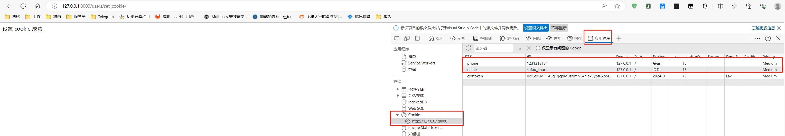
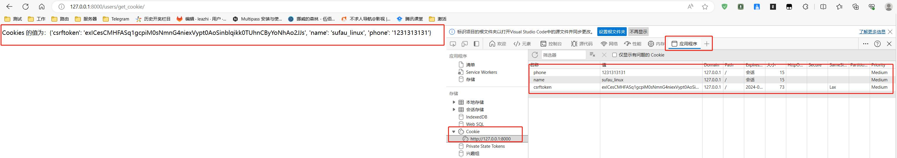

## django 设置 cookie

### 添加路由

1.编辑子应用下的路由文件 urls.py, 在 urlpatterns 列表中添加 设置 cookie 的路由：
```python
    path('set_cookie/', views.set_cookie),
```

### 添加视图函数

1.编辑子应用下的视图函数文件 views.py, 在 最下面添加设置 cookie 的视图函数代码：
```python
def set_cookie(request):
    '''
    设置 cookie
    '''

    response = HttpResponse('设置 cookie 成功')
    response.set_cookie('name', 'sufau_linux')
    response.set_cookie('phone', '1231313131')
    return response
```

### 访问测试：

打开浏览，输入 http://127.0.0.1:8000/users/set_cookie/ 访问，如下图：



## django 获取 cookie

### 添加路由

1.编辑子应用下的路由文件 urls.py, 在 urlpatterns 列表中添加 获取 cookie 的路由：
```python
    path('get_cookie/', views.get_cookie)
```

### 添加视图函数

1.编辑子应用下的视图函数文件 views.py, 在 最下面添加 获取 cookie 的视图函数代码：
```python
# 获取 cookie 视图函数
def get_cookie(request):
    cookies = request.COOKIES
    # return HttpResponse('Cookies 的值为: %s'%cookies)                # 可以返回
    # return HttpResponse('Cookies 的值为：', cookies)                  # 无法返回
    return HttpResponse(f'Cookies 的值为：{cookies}')                   # 可以返回
```

### 访问测试：

打开浏览，输入 http://127.0.0.1:8000/users/get_cookie/ 访问，如下图：

