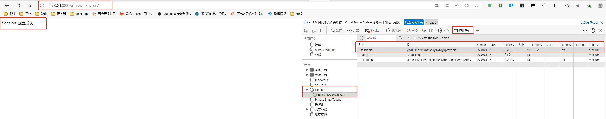
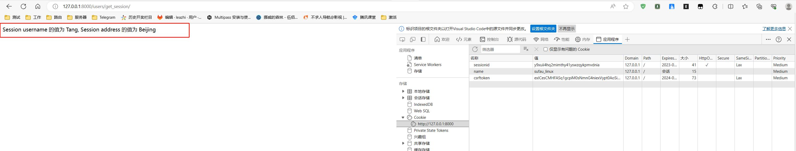
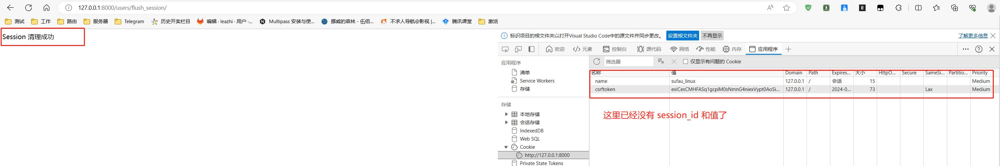


session 是以字典类型进行存储的


## django 设置 session

### 添加路由

1.编辑子应用下的路由文件 urls.py, 在 urlpatterns 列表中添加 设置 session 的路由：
```python
    path('set_session/', views.set_session),
```

### 添加视图函数

1.编辑子应用下的视图函数文件 views.py, 在 最下面添加设置 session 的视图函数代码：
```python
def set_session(request):
    print(request)
    request.session['username'] = 'Tang'
    request.session['address'] = 'Beijing'
    return HttpResponse('Session 设置成功')
```

### 访问测试：

打开浏览，输入 http://127.0.0.1:8000/users/set_session/ 访问，如下图：




需要注意的是：如果在访问时报如下错误：
```python
django.db.utils.OperationalError: no such table: Tang 错误。
```

那么，请确保有执行过下面命令生成相关的 sqlite 表：
```python
python manager.py migrate
```


## django 获取 session

### 添加路由

1.编辑子应用下的路由文件 urls.py, 在 urlpatterns 列表中添加 获取 session 的路由：
```python
    path('get_session/', views.get_session)
```

### 添加视图函数

1.编辑子应用下的视图函数文件 views.py, 在 最下面添加 获取 session 的视图函数代码：
```python
# 获取 session 视图函数
def get_session(request):
    username = request.session['username']          # 通过字典 key 取值
    address = request.session['address']

    return HttpResponse('Session username 的值为 %s, Session address 的值为 %s'%(username, address))
```

### 访问测试：

打开浏览，输入 http://127.0.0.1:8000/users/get_session/ 访问，如下图：



## django 清除 session

### 添加路由

1.编辑子应用下的路由文件 urls.py, 在 urlpatterns 列表中添加 获取 session 的路由：
```python
    path('flush_session/', views.flush_session),
```

### 添加视图函数

1.编辑子应用下的视图函数文件 views.py, 在 最下面添加 获取 session 的视图函数代码：
```python
def flush_session(request):
    request.session.flush()

    return HttpResponse('Session 清理成功')
```

### 访问测试：

打开浏览，输入 http://127.0.0.1:8000/users/flush_session/ 访问，如下图：

