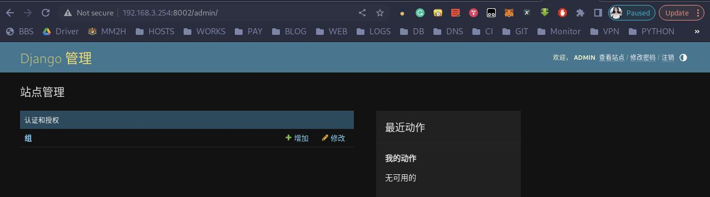

## django 认证系统

Django是一个流行的Python Web框架，提供了一个强大的认证系统，用于处理用户认证和授权的功能。Django的认证系统提供了一种简单且安全的方式来管理用户的身份验证、登录和访问控制。 
 
Django认证系统的主要组件包括： 
 
1. 用户模型（User Model）：Django提供了一个内置的用户模型，您可以使用它来管理用户的身份验证和基本信息。您可以通过 django.contrib.auth.models.User 访问用户模型，并使用其提供的属性和方法来处理用户相关的操作。 
2. 身份验证视图（Authentication Views）：Django提供了一些内置的视图，用于处理用户认证相关的任务，例如用户注册、登录、注销等。您可以通过 django.contrib.auth.views 模块来访问这些视图，并根据需要进行自定义。
3. 装饰器和Mixin：Django提供了一些装饰器和Mixin，用于限制对特定视图的访问权限。例如， @login_required 装饰器可以用于要求用户在访问某个视图之前进行身份验证。 
4. 权限系统（Permission System）：Django的认证系统还包括一个权限系统，用于管理用户对不同资源的访问权限。您可以定义自己的权限，并将其分配给用户或用户组。然后，您可以使用 user.has_perm() 方法来检查用户是否具有特定权限。 
 
通过使用Django的认证系统，您可以轻松地处理用户认证和授权的需求，确保只有经过身份验证和授权的用户才能访问您的应用程序的特定功能。 

## 用户认证的使用
### 创建 users 子应用

1. 在项目子目录 haoke/ 目录下创建 apps 包目录，用于集中存放后期项目的子应用，创建完目录后，现在的目录结构应该是：
```bash
(haoke_small) leazhi@ubuntuhome:~/small$ tree haoke/
haoke/
├── haoke
│   ├── apps
│   │   └── __init__.py
│   ├── asgi.py
│   ├── __init__.py
│   ├── logs
│   │   └── haoke.log
│   ├── __pycache__
│   │   ├── __init__.cpython-310.pyc
│   │   ├── urls.cpython-310.pyc
│   │   └── wsgi.cpython-310.pyc
│   ├── settings
│   │   ├── dev.py
│   │   ├── __init__.py
│   │   ├── pro.py
│   │   └── __pycache__
│   │       ├── dev.cpython-310.pyc
│   │       └── __init__.cpython-310.pyc
│   ├── settings.py
│   ├── urls.py
│   └── wsgi.py
├── logs
└── manage.py

7 directories, 16 files
```

2.在 apps 包目录下创建子应用 users, 用于处理用户认证相关的任务：
```bash
(haoke_small) leazhi@ubuntuhome:~/small$ cd haoke/haoke/apps/
(haoke_small) leazhi@ubuntuhome:~/small/haoke/haoke/apps$ python ../../manage.py startapp users
```

创建完成后，目录结构为：
```bash
(haoke_small) leazhi@ubuntuhome:~/small/haoke/haoke/apps$ cd ../../../
(haoke_small) leazhi@ubuntuhome:~/small$ tree haoke/
haoke/
├── haoke
│   ├── apps
│   │   ├── __init__.py
│   │   └── users
│   │       ├── admin.py
│   │       ├── apps.py
│   │       ├── __init__.py
│   │       ├── migrations
│   │       │   └── __init__.py
│   │       ├── models.py
│   │       ├── tests.py
│   │       └── views.py
│   ├── asgi.py
│   ├── __init__.py
│   ├── logs
│   │   └── haoke.log
│   ├── __pycache__
│   │   ├── __init__.cpython-310.pyc
│   │   ├── urls.cpython-310.pyc
│   │   └── wsgi.cpython-310.pyc
│   ├── settings
│   │   ├── dev.py
│   │   ├── __init__.py
│   │   ├── pro.py
│   │   └── __pycache__
│   │       ├── dev.cpython-310.pyc
│   │       └── __init__.cpython-310.pyc
│   ├── settings.py
│   ├── urls.py
│   └── wsgi.py
├── logs
└── manage.py

9 directories, 23 files
```

### 注册创建的 users 子应用

1.编辑项目目录下的 haoke/settings/dev.py 文件，在 INSTALL 列表中注册创建的 users 子应用：
```python
# haoke/settings/dev.py 

...

import os 
import sys

BASE_DIR = Path(__file__).resolve().parent.parent
sys.path.insert(0, os.path.join(BASE_DIR, 'apps'))      # 要放在 BASE_DIR 的下面

...

INSTALLED_APPS = [
    ...
    # 'users.apps.UsersConfig',       # 注册创建的 users 子应用
    'users',
]

...
```

### 创建用户模型类，并往 Django 自带模型类 AbstractUser() 模型类中添加字段 mobile

1.编辑项目目录下的 haoke/apps/users/models.py 文件，创建用户模型类 User 并继承 AbstractUser 模型类，内容为：
```python
# haoke/apps/users/models.py

from django.db import models
from django.contrib.auth.models import AbstractUser     # 导入用户抽象模型类
# Create your models here.


class User(AbstractUser):       # 继承 AbstractUser
    '''
    用户模型类
    '''
    # 往django 自带的 AbstractUser() 模型类中添加字段 mobile 
    mobile = models.CharField(max_length=11, verbose_name='手机号',unique=True)
    class Meta:
        db_table = 'tb_users'   # 表名
        verbose_name = '用户'
        verbose_name_plural = verbose_name
```
**注意**：这里如果没有在 dev.py （也就是 settings.py）文件中告知 Django 认证系统使用我们自定义的模型类则会报错：
```python
ERRORS:
auth.User.groups: (fields.E304) Reverse accessor 'Group.user_set' for 'auth.User.groups' clashes with reverse accessor for 'users.User.groups'.
	HINT: Add or change a related_name argument to the definition for 'auth.User.groups' or 'users.User.groups'.
auth.User.user_permissions: (fields.E304) Reverse accessor 'Permission.user_set' for 'auth.User.user_permissions' clashes with reverse accessor for 'users.User.user_permissions'.
	HINT: Add or change a related_name argument to the definition for 'auth.User.user_permissions' or 'users.User.user_permissions'.
users.User.groups: (fields.E304) Reverse accessor 'Group.user_set' for 'users.User.groups' clashes with reverse accessor for 'auth.User.groups'.
	HINT: Add or change a related_name argument to the definition for 'users.User.groups' or 'auth.User.groups'.
users.User.user_permissions: (fields.E304) Reverse accessor 'Permission.user_set' for 'users.User.user_permissions' clashes with reverse accessor for 'auth.User.user_permissions'.
	HINT: Add or change a related_name argument to the definition for 'users.User.user_permissions' or 'auth.User.user_permissions'.
```

**解决方法**：编辑项目目录下的 haoke/settings/dev.py 文件，在该文件最后添加如下代码：
```python
# haoke/settings/dev.py

...

# 注意:后面不能跟 , 号，否则会报：TypeError: ForeignKey(('users.User',)) is invalid. First parameter to ForeignKey must be either a model, a model name, or the string 'self'
AUTH_USER_MODEL = 'users.User'      
```

### 数据迁移

1.切换到命令下，执行下列命令生成迁移记录：
```bash
(haoke_small) leazhi@ubuntuhome:~/small$ cd haoke/haoke/apps/
(haoke_small) leazhi@ubuntuhome:~/small/haoke/haoke/apps$ python ../../manage.py makemigrations
Migrations for 'users':
  users/migrations/0001_initial.py
    - Create model User
```

2.执行命令进行数据迁移：
```bash
(haoke_small) leazhi@ubuntuhome:~/small/haoke/haoke/apps$ python ../../manage.py migrate
Operations to perform:
  Apply all migrations: admin, auth, contenttypes, sessions, users
Running migrations:
  Applying contenttypes.0001_initial... OK
  Applying contenttypes.0002_remove_content_type_name... OK
  Applying auth.0001_initial... OK
  Applying auth.0002_alter_permission_name_max_length... OK
  Applying auth.0003_alter_user_email_max_length... OK
  Applying auth.0004_alter_user_username_opts... OK
  Applying auth.0005_alter_user_last_login_null... OK
  Applying auth.0006_require_contenttypes_0002... OK
  Applying auth.0007_alter_validators_add_error_messages... OK
  Applying auth.0008_alter_user_username_max_length... OK
  Applying auth.0009_alter_user_last_name_max_length... OK
  Applying auth.0010_alter_group_name_max_length... OK
  Applying auth.0011_update_proxy_permissions... OK
  Applying auth.0012_alter_user_first_name_max_length... OK
  Applying users.0001_initial... OK
  Applying admin.0001_initial... OK
  Applying admin.0002_logentry_remove_auto_add... OK
  Applying admin.0003_logentry_add_action_flag_choices... OK
  Applying sessions.0001_initial... OK
```

3.登录 mysql 验证数据表;
```bash
(haoke_small) leazhi@ubuntuhome:~/small/haoke/haoke/apps$ mysql -uroot -p
Enter password: 
Welcome to the MariaDB monitor.  Commands end with ; or \g.
Your MariaDB connection id is 816
Server version: 10.10.2-MariaDB-log MariaDB Server

Copyright (c) 2000, 2018, Oracle, MariaDB Corporation Ab and others.

Type 'help;' or '\h' for help. Type '\c' to clear the current input statement.

(root@localhost (none) 09:24:)>show databases;
+--------------------+
| Database           |
+--------------------+
| blog               |
| book               |
| dangdang           |
| db1                |
| db2                |
| information_schema |
| mysql              |
| performance_schema |
| small              |
| sys                |
| test               |
+--------------------+
11 rows in set (0.001 sec)

(root@localhost (none) 09:24:)>use small;
Reading table information for completion of table and column names
You can turn off this feature to get a quicker startup with -A

Database changed
(root@localhost small 09:24:)>show tables;
+---------------------------+
| Tables_in_small           |
+---------------------------+
| auth_group                |
| auth_group_permissions    |
| auth_permission           |
| django_admin_log          |
| django_content_type       |
| django_migrations         |
| django_session            |
| tb_users                  |
| tb_users_groups           |
| tb_users_user_permissions |
+---------------------------+
10 rows in set (0.000 sec)

(root@localhost small 09:25:)>exit;
Bye
```

### 创建后台管理帐号

1.执行命令：
```bash
(haoke_small) leazhi@ubuntuhome:~/small/haoke/haoke/apps$ python ../../manage.py createsuperuser
用户名: admin
电子邮件地址: 1@2.com
Password:               # 12345678
Password (again): 
这个密码太常见了。
密码只包含数字。
Bypass password validation and create user anyway? [y/N]: y
Superuser created successfully.
```

2.创建成功后，就可以登录后台管理界面了。


### 帐号注册时用户名校验

1.编辑子应用 users 目录下的 views.py 文件，在该文件中添加用户名校验试图类：
```python
# users/views.py

class UsernameCountView(APIView)

```

2.添加路由：

2.1.主路由的配置：
2.1.1.编辑项目子目录 haoke/ 目录下的 urls.py 文件，在该文件中添加如下内容：
```python
# haoke/urls.py

from django.contrib import admin
from django.urls import path, include, re_path

urlpatterns = [
    path('admin/', admin.site.urls),
    path('', include('users.urls'))     # 添加子路由文件
]
```

2.2.子路由的配置：
2.2.1 在子应用 users 目录下创建 urls.py 文件，并写入如下内容：
```python
# users/urls.py

from django.urls import path, re_path
from . import views

urlpatterns = [
    # path('register/', views.RegisterView.as_view(), name='register'),
    re_path(r'^usernames/(?P<username>\w{5,20})/count/$', views.UsernameCountView.as_view()),
]
```

### 帐号注册时手机号校验

1.编辑子应用 users 目录下的 views.py 文件，在该文件中添加手机号校验试图类：
```python
# users/views.py

...

class MobileCountView(APIView):
    '''
    手机号校验
    '''
    def get(self, request, mobile):
        count = User.objects.filter(mobile=mobile).count()
        data = {
            'username': mobile,
            'count': count
        }

        return Response(data)
```

2.编辑子应用 users 目录下创建 urls.py 文件，添加访问校验手机号的路由代码，如下：
```python
# users/urls.py

from django.urls import path, re_path
from . import views

urlpatterns = [
    # 用户名校验路由
    re_path(r'^usernames/(?P<username>\w{5,20})/count/$', views.UsernameCountView.as_view()),

    # 手机号校验路由
    re_path(r'^mobiles/(?P<mobile>)1[3-9]\d{9}/count/$', views.MobileCountView.as_view()),
]
```


