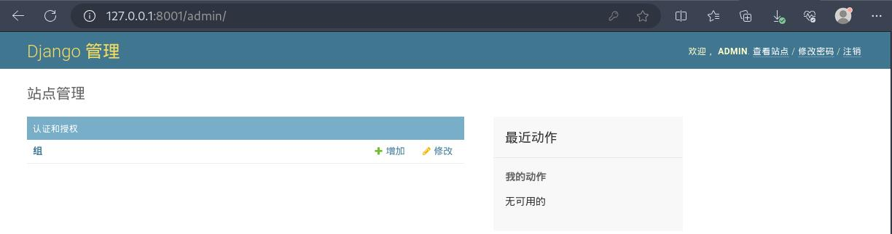
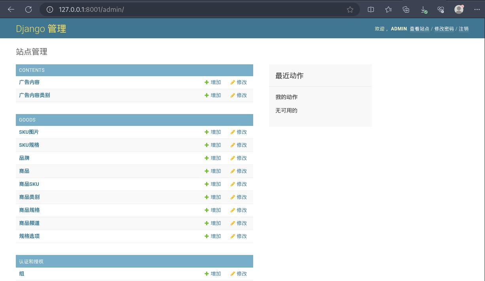
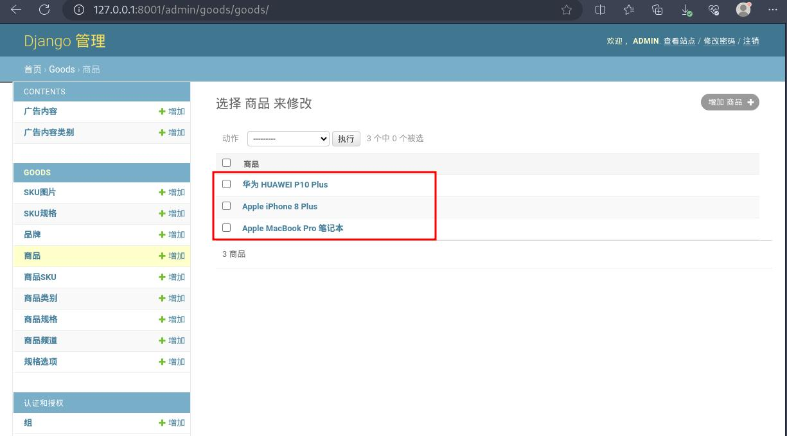

## ckeditor 模块安装配置

### 安装富文本编辑器模块

直接在命令行终端执行：
```bash
pip install django-ckeditor
```

### 注册富文本编辑器

编辑配置文件 settings/dev.py，在 `INSTALLED_APPS = [ .. ]` 列表中添加注册富文本编辑器的代码.同时，还需在该配置文件最后面添加富文本编辑器编辑框的配置：
```python
# settings/dev.py

...

INSTALLED_APPS = [
    ...
    # 注册富文本编辑器
    'ckeditor',
    'ckeditor_uploader',
]

...

# 添加富文本编辑器编辑框的配置
CKEDITOR_CONFIGS = {
    'default': {
        'height': 300,
        'width': '100%',
        'toolbar': 'full',
    },
}

# 由于我们改写了上传文件的存储路径（上传在 fastdfs 里面），所以需要将富文本编辑器上传文件的存储路径也改写一下
CKEDITOR_UPLOAD_PATH = ''
```

### 添加访问富文本编辑器的路由

编辑项目总路由配置文件 haoke/urls.py，在 `urlpatterns = [ .. ]` 列表中添加：
```python
# haoke/urls.py

from django.contrib import admin
from django.urls import path, include

urlpatterns = [
    path('admin/', admin.site.urls),
    path('', include('users.urls')),
    path('', include('verifications.urls')),
    path('', include('areas.urls')),
    # 添加访问富文本编辑器的路由
    path('ckeditor/', include('ckeditor_uploader.urls')),
]
```

## 为商品表添加富文本编辑器字段：

- cheditor.fields.RichTextField 不支持上传文件的富文本字段
- cheditor_uploader.fields.RichTextUploadingField 支持上传文件的富文本字段

### 修改商品表模型类

1.编辑子应用 goods 下的 models.py 文件，在 Goods 模型类中添加富文本编辑器字段：
```python
# goods/models.py

...
from ckeditor_uploader.fields import RichTextUploadingField
from ckeditor.fields import RichTextField

...

class Goods(BaseModel):
    """商品SPU"""
    name = models.CharField(max_length=50, verbose_name="名称")
    brand = models.ForeignKey(Brand, on_delete=models.PROTECT, verbose_name="品牌")
    category1 = models.ForeignKey(GoodsCategory, on_delete=models.PROTECT, related_name='cat1_goods', verbose_name="一级类别")
    category2 = models.ForeignKey(GoodsCategory, on_delete=models.PROTECT,related_name='cat2_goods', verbose_name="二级类别")
    category3 = models.ForeignKey(GoodsCategory, on_delete=models.PROTECT, related_name='cat3_goods', verbose_name="三级类别")
    sales = models.IntegerField(default=0, verbose_name="销量")
    comments = models.IntegerField(default=0, verbose_name='评价数')

    # 添加富文本编辑器字段
    desc_detail = RichTextField(verbose_name='详细介绍', default='')
    desc_pack = RichTextField(verbose_name='包装信息', default='')
    desc_service = RichTextUploadingField(verbose_name='售后服务', default='')

    class Meta:
        db_table = 'tb_goods'
        verbose_name = "商品"
        verbose_name_plural = verbose_name

    def __str__(self):
        return self.name

...
```

2.修改完模型类后，执行命令进行数据迁移：
```bash
┌──(leazhi㉿kali-desktop)-[/data/gitlab/python3-django-small_haoke/haoke]
└─$ python manage.py makemigrations
Migrations for 'goods':
  haoke/apps/goods/migrations/0003_auto_20230917_0926.py
    - Add field desc_detail to goods
    - Add field desc_pack to goods
    - Add field desc_service to goods
```

3.执行命令生成数据表：
```bash
┌──(leazhi㉿kali-desktop)-[/data/gitlab/python3-django-small_haoke/haoke]
└─$ python manage.py migrate
Operations to perform:
  Apply all migrations: admin, areas, auth, contents, contenttypes, goods, sessions, users
Running migrations:
  Applying areas.0002_auto_20230917_0914... OK
  Applying contents.0002_auto_20230917_0914... OK
  Applying goods.0002_auto_20230917_0923... OK
  Applying goods.0003_auto_20230917_0926... OK
  Applying users.0004_auto_20230917_0914... OK
```

4.登录 mysql ，验证表字段：
```sql
(root@localhost small 09:21:)>describe tb_goods;
+--------------+-------------+------+-----+---------+----------------+
| Field        | Type        | Null | Key | Default | Extra          |
+--------------+-------------+------+-----+---------+----------------+
| id           | int(11)     | NO   | PRI | NULL    | auto_increment |
| create_time  | datetime(6) | NO   |     | NULL    |                |
| update_time  | datetime(6) | NO   |     | NULL    |                |
| name         | varchar(50) | NO   |     | NULL    |                |
| sales        | int(11)     | NO   |     | NULL    |                |
| comments     | int(11)     | NO   |     | NULL    |                |
| brand_id     | int(11)     | NO   | MUL | NULL    |                |
| category1_id | int(11)     | NO   | MUL | NULL    |                |
| category2_id | int(11)     | NO   | MUL | NULL    |                |
| category3_id | int(11)     | NO   | MUL | NULL    |                |
| desc_detail  | longtext    | NO   |     | NULL    |                |
| desc_pack    | longtext    | NO   |     | NULL    |                |
| desc_service | longtext    | NO   |     | NULL    |                |
+--------------+-------------+------+-----+---------+----------------+
13 rows in set (0.001 sec)
```

5.将项目运行起来。同时使用 django 管理员登录后台.可以看到，现在后台没有注册商品相关信息：



**管理员相关命令**

生成超级管理员命令：
```bash
python manage.py createsuperuser
```

修改超管密码：
```bash
python manage.py changepassword admin
```

### 注册商品信息到管理后台

1.编辑子应用 goods 目录下的 admin.py 文件，注册商品模型到后台管理：
```python
# goods/admin.py

from django.contrib import admin
from .models import *
# Register your models here.

admin.site.reigster(Goods)
admin.site.register(Brand)
admin.site.register(SKU)
admin.site.register(SKUImage)
admin.site.register(SKUSpecification)
admin.site.register(GoodsChannel)
admin.site.register(GoodsCategory)
admin.site.register(GoodsSpecification)
admin.site.register(SpecificationOption)
```

### 注册广告信息到管理后台

1.编辑子应用 contents 目录下的 admin.py 文件，注册广告模型到后台管理：
```bash
# contents/admin.py

from django.contrib import admin
# from .models import *
from . import models
# Register your models here.

admin.site.register(models.ContentCategory)
admin.site.register(models.Content)
```

### 管理后台添加商品

1.将商品信息和广告信息添加到后台管理后，刷新下 django 管理后台，就可以看到相应的表字段信息了：


2.将测试 fastdfs 时上传的数据目录 storage/data 删除，然后导入商品图片：
```bash
# 删除 storage/data 目录
┌──(leazhi㉿kali-desktop)-[/data/docker/mounts/fastdfs/storage]
└─$ sudo rm -rf /data/docker/mounts/fastdfs/storage/data
[sudo] leazhi 的密码：

# 重新导入商品图片
┌──(leazhi㉿kali-desktop)-[/data/docker/mounts/fastdfs/storage]
└─$ sudo tar -zxf /data/gitlab/python3-django-small_haoke/haoke/docs/data.tar.gz -C /data/docker/mounts/fastdfs/storage
                                                                                                # 确保导入正确                        
┌──(leazhi㉿kali-desktop)-[/data/docker/mounts/fastdfs/storage]
└─$ ls
data  logs

```

3.接下来，就可以点击goods 应用，点击goods 模型，点击goods 模型下方的添加按钮，添加商品信息了（我这里就不一个一个添加了，直接使用 sql 文件导入）。

3.1.导入商品信息 sql 文件之前，使用 vim 编辑器打开商品信息 sql 文件，在命令行模式下批量修改下 sql 中写死的 fastdfs 访问 URL ，将 `192.168.1.103` 修改成自己的 fastdfs 访问IP，比如我这里的 `192.168.3.200`：
```bash
:1,$s/192.168.1.103/192.168.3.200/g
```

3.2.然后导入商品信息 sql 文件到数据库中：
```sql
┌─[leazhi@ubuntuhome] - [~] - [2023-09-17 10:10:05]
└─[0] mysql -uroot -p -D small < /tmp/goods_data.sql
Enter password: 
```

3.数据导入后，刷新下 django 管理后台，可以看到商品信息已经添加到后台管理中了：
