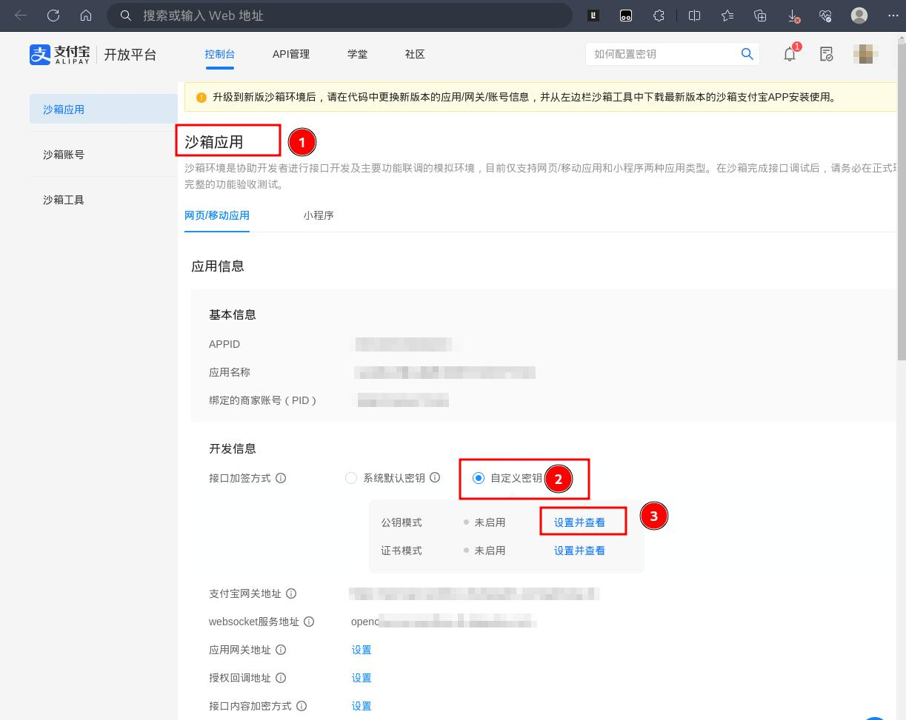
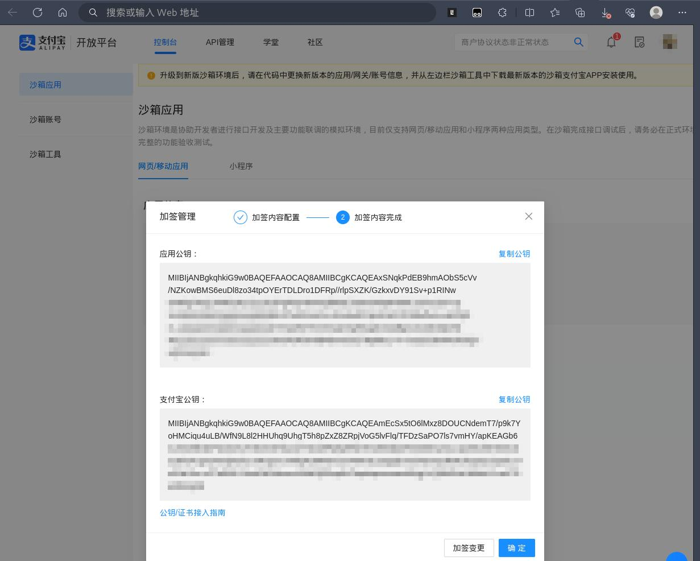

## 创建及注册支付子应用

### 创建子应用

进入项目目录，在 apps 目录下创建子应用 payment
```bash
┌──(leazhi㉿kali-desktop)-[/data/gitlab/python3-django-small_haoke/haoke]
└─$ cd haoke/apps                          
                                                                                                   
┌──(leazhi㉿kali-desktop)-[/data/…/python3-django-small_haoke/haoke/haoke/apps]
└─$ python ../../manage.py startapp payment
```

### 注册子应用

编辑项目主配置文件，将创建的子应用 payment 注册到项目中：
```python
# settings./dev.py

...

INSTALLED_APPS = [
    ...
    'payment'
]

...
```

### 创建支付表

1.编辑子应用 payment 下的 modules.py 文件，在该文件中加入：
```python
# payment/models.py

from django.db import models

# Create your models here.
from haoke.utils.models import BaseModel
from orders.models import OrderInfo


class Payment(BaseModel):
    """
    支付信息
    """
    order = models.ForeignKey(OrderInfo, on_delete=models.CASCADE, verbose_name='订单')
    trade_id = models.CharField(max_length=100, unique=True, null=True, blank=True ,verbose_name='支付编号')
    
    class Meta:
        db_table = 'tb_payment'
        verbose_name = '支付信息'
        verbose_name_plural = verbose_name
```

2.执行命令生成迁移记录：
```bash
┌──(leazhi㉿kali-desktop)-[/data/…/python3-django-small_haoke/haoke/haoke/apps]
└─$ python ../../manage.py makemigrations  
Migrations for 'payment':
  payment/migrations/0001_initial.py
    - Create model Payment
```

3.执行命令，生成数据表：
```bash
┌──(leazhi㉿kali-desktop)-[/data/…/python3-django-small_haoke/haoke/haoke/apps]
└─$ python ../../manage.py migrate       
Operations to perform:
  Apply all migrations: admin, areas, auth, contents, contenttypes, goods, orders, payment, sessions, users
Running migrations:
  Applying payment.0001_initial... OK
```

## 支付宝开发者平台

1.打开 https://openhome.alipay,.com ，注册成为支付宝开发者；

2.进入支付宝沙箱页面（支付宝专门提供给开发者进行测试的支付接口）：https://open.alipay.com/develop/sandbox/app


## 支付宝接入

### 生成密钥对

1.在本地先安装支付宝 SDK：
```bash
┌──(leazhi㉿kali-desktop)-[/data/…/python3-django-small_haoke/haoke/haoke/apps]
└─$ pip install python-alipay-sdk --upgrade     
Defaulting to user installation because normal site-packages is not writeable
Looking in indexes: https://pypi.tuna.tsinghua.edu.cn/simple
Collecting python-alipay-sdk
  Downloading https://pypi.tuna.tsinghua.edu.cn/packages/c8/72/429d6fc158fb56573bf7197375d9d3220e6a63c532d337e891658e91e1f9/python-alipay-sdk-3.3.0.tar.gz (10 kB)
  Installing build dependencies ... done
  Getting requirements to build wheel ... done
  Preparing metadata (pyproject.toml) ... done
Collecting pycryptodomex>=3.15.0 (from python-alipay-sdk)
  Downloading https://pypi.tuna.tsinghua.edu.cn/packages/23/23/3f3d042c96ff7bece5b126365593b1f9c8e3ae62ce80d44e9da39c5e8a73/pycryptodomex-3.19.0-cp35-abi3-manylinux_2_17_x86_64.manylinux2014_x86_64.whl (2.1 MB)
     ━━━━━━━━━━━━━━━━━━━━━━━━━━━━━━━━━━━━━━━━ 2.1/2.1 MB 9.3 MB/s eta 0:00:00
Collecting pyOpenSSL>=22.0.0 (from python-alipay-sdk)
  Downloading https://pypi.tuna.tsinghua.edu.cn/packages/f0/e2/f8b4f1c67933a4907e52228241f4bd52169f3196b70af04403b29c63238a/pyOpenSSL-23.2.0-py3-none-any.whl (59 kB)
     ━━━━━━━━━━━━━━━━━━━━━━━━━━━━━━━━━━━━━━━━ 59.0/59.0 kB 21.2 MB/s eta 0:00:00
Collecting cryptography!=40.0.0,!=40.0.1,<42,>=38.0.0 (from pyOpenSSL>=22.0.0->python-alipay-sdk)
  Downloading https://pypi.tuna.tsinghua.edu.cn/packages/eb/4b/f86cc66c632cf0948ca1712aadd255f624deef1cd371ea3bfd30851e188d/cryptography-41.0.4-cp37-abi3-manylinux_2_28_x86_64.whl (4.4 MB)
     ━━━━━━━━━━━━━━━━━━━━━━━━━━━━━━━━━━━━━━━━ 4.4/4.4 MB 11.5 MB/s eta 0:00:00
Collecting cffi>=1.12 (from cryptography!=40.0.0,!=40.0.1,<42,>=38.0.0->pyOpenSSL>=22.0.0->python-alipay-sdk)
  Downloading https://pypi.tuna.tsinghua.edu.cn/packages/c9/7c/43d81bdd5a915923c3bad5bb4bff401ea00ccc8e28433fb6083d2e3bf58e/cffi-1.16.0-cp310-cp310-manylinux_2_17_x86_64.manylinux2014_x86_64.whl (443 kB)
     ━━━━━━━━━━━━━━━━━━━━━━━━━━━━━━━━━━━━━━━━ 443.9/443.9 kB 11.8 MB/s eta 0:00:00
Collecting pycparser (from cffi>=1.12->cryptography!=40.0.0,!=40.0.1,<42,>=38.0.0->pyOpenSSL>=22.0.0->python-alipay-sdk)
  Downloading https://pypi.tuna.tsinghua.edu.cn/packages/62/d5/5f610ebe421e85889f2e55e33b7f9a6795bd982198517d912eb1c76e1a53/pycparser-2.21-py2.py3-none-any.whl (118 kB)
     ━━━━━━━━━━━━━━━━━━━━━━━━━━━━━━━━━━━━━━━━ 118.7/118.7 kB 13.7 MB/s eta 0:00:00
Building wheels for collected packages: python-alipay-sdk
  Building wheel for python-alipay-sdk (pyproject.toml) ... done
  Created wheel for python-alipay-sdk: filename=python_alipay_sdk-3.3.0-py3-none-any.whl size=10252 sha256=fc69a15eec7522a2a773fb0267e038585edcd167ac116ff0ff4223ab81ebf591
  Stored in directory: /home/leazhi/.cache/pip/wheels/b1/0d/72/8597d73c3d3d0019dd4aafca6757430ab2abcc8ae7394bb588
Successfully built python-alipay-sdk
Installing collected packages: pycryptodomex, pycparser, cffi, cryptography, pyOpenSSL, python-alipay-sdk
Successfully installed cffi-1.16.0 cryptography-41.0.4 pyOpenSSL-23.2.0 pycparser-2.21 pycryptodomex-3.19.0 python-alipay-sdk-3.3.0
```

2.在子应用 payment 下创建子目录 keys ，用于存放密钥文件：
```bash
┌──(leazhi㉿kali-desktop)-[/data/…/python3-django-small_haoke/haoke/haoke/apps]
└─$ mkdir payment/keys 

┌──(leazhi㉿kali-desktop)-[/data/…/python3-django-small_haoke/haoke/haoke/apps]
└─$ cd payment/keys 
```

3.执行 openssl 命令，生成密钥对：

3.1.生成私钥文件：
```bash
┌──(leazhi㉿kali-desktop)-[/data/…/haoke/apps/payment/keys]
└─$ openssl genrsa -out app_private_key.pem 2048
                                                                                     
┌──(leazhi㉿kali-desktop)-[/data/…/haoke/apps/payment/keys]
└─$ ls
app_private_key.pem  areas  carts  contents  goods  __init__.py  orders  payment  __pycache__  users  verifications
```

3.2.生成公钥文件：
```bash
┌──(leazhi㉿kali-desktop)-[/data/…/haoke/apps/payment/keys]
└─$ openssl rsa -in app_private_key.pem -pubout -out app_public_key.pem
writing RSA key
                                                                                                 
┌──(leazhi㉿kali-desktop)-[/data/…/haoke/apps/payment/keys]
└─$ ls
app_private_key.pem  app_public_key.pem  areas  carts  contents  goods  __init__.py  orders  payment  __pycache__  users  verifications
```

### 接入公钥

1.查看刚刚生成的公钥文件内容：
```bash
┌──(leazhi㉿kali-desktop)-[/data/…/haoke/apps/payment/keys]
└─$ cat app_public_key.pem 
-----BEGIN PUBLIC KEY-----
MIIBIjANBgkqhkiG9w0BAQEFAAOCAQ8AMIIBCgKCAQEAxSNqkPdEB9hmAObS5cVv
/NZKowBMS6euDl8zo34tpOYErTDLDro1DFRp//rlpSXZK/GzkxvDY91Sv+p1RINw
cNM/gT4cujL4WfcyKyJZy1JeZPgP3pY8wAq3bRyE7y8m3H0p9HS6C1O/unZrd+cp
UrHMhKU6mFgegKnmpMNfdKUtTu82KrAcN+EVwbdCPqHtU5d17D9EefhxA+aDOtjS
rL+Ul6aWNTQMPFXpg30V64H+bgr9ZYhO1NvgOXg90ygD1ieg/Bg2sZoskhdqkeHj
H0u2ShswNXFO6KO0QUIDsIOSPOFDHkB4bvmCDE7Np96s1+Y+/xa1EO8vHArlXGQY
oQIDAQAB
-----END PUBLIC KEY-----
```

2.将 `-----BEGIN PUBLIC KEY-----` 和 `-----END PUBLIC KEY-----` 中间的内容复制粘贴到支付宝沙箱应用中开发信息接口的自定义密钥下的公钥模式中：


点击保存后，得到支付宝自动生成的公钥内容：


3.在子应用 payment 的 keys 目录下新建用于存放支付宝自动生成的公钥内容的文件 alipay_public_key.pem, 然后将上面支付宝自动生成的公钥容复制到该文件中（**注意格式**）：
```bash                                                                        
┌──(leazhi㉿kali-desktop)-[/data/…/haoke/apps/payment/keys]
└─$ cat alipay_public_key.pem

-----BEGIN PUBLIC KEY-----
MIIBIjANBgkqhkiG9w0BAQEFAAOCAQ8AMIIBCgKCAQEAmEcSx5tO6lMxz8DOUCNdemT7/p9k7YoHMCiqu4uLB/WfN9L8l2HHUhq9UhgT5h8pZxZ8ZRpjVoG5lvFlq/TFDzSaPO7ls7vmHY/apKEAGb6nLh345f18inPdJ3xeIU7n8mNSTbyzUTHLbWPp5qRN0TKUEB3lpOF0AfMenyG1L3pc55xK8HON1bCJB/C4cgm24vxjDOlxLmRxQLTU7BlQNJWr6m/ZxvNIIKaLEaQpjIxmUiNZXnp3kINzkCp3ZJ/2pt/1U7z/GzLl0n+zZ7ziEbF+DneDkIOxkvmxS/ddJfjS0zp6oTtqmhqmrmoesMUgjYzQ8MGIsUWhbU2+zcf7GwIDAQAB
-----END PUBLIC KEY-----
```

4.记录下沙箱应用提供的以下信息，后期作接入要使用到：
- APPID：9021000129636210
- 绑定的商家帐号（PID）：2088721016771321
- 支付宝网关地址：https://openapi-sandbox.dl.alipaydev.com/gateway.do


### 接口编写

1.编辑项目设置文件，加入支付宝配置信息在底部：
```python
# settings/dev.py

...

# 支付宝配置
ALIPAY_APPID = '9021000129636210'
ALIPAY_URL = 'https://openapi-sandbox.dl.alipaydev.com/gateway.do'
ALIPAY_DEBUG = True
```

#### 添加支付宝接口视图：

编辑子应用 payment 目录下的 views.py ，在该文件中加入如下内容：
```python
# payment/view.py

from django.shortcuts import render

# Create your views here.

from rest_framework.views import APIView
from rest_framework.permissions import IsAuthenticated
from orders.models import OrderInfo
from rest_framework.response import Response
from alipay import AliPay
from django.conf import settings

class PaymentView(APIView):
    """
    支付宝接口调用 --- 实现从商场跳转到支付宝的支付窗口
    """

    permission_classes = [IsAuthenticated]

    def get(self, request, order_id):
        # 判断订单编号是否正确
        try:
            order = OrderInfo.objects.get(order_id=order_id, user=request.user, pay_method=OrderInfo.PAY_METHODS_ENUM['ALIPAY'], status=OrderInfo.ORDER_STATUS_ENUM['UNPAID'])
        except OrderInfo.DoesNotExist:
            return Response({'message': '订单信息错误'})

        app_private_key_string = open('/data/gitlab/python3-django-small_haoke/haoke/haoke/apps/payment/keys/app_private_key.pem').read()
        alipay_public_key_string = open('/data/gitlab/python3-django-small_haoke/haoke/haoke/apps/payment/keys/alipay_public_key.pem').read()

        # 构造支付宝链接的调用
        alipay = AliPay(
            appid = settings.ALIPAY_APPID,
            app_notify_url = None,
            app_private_key_string = app_private_key_string,
            alipay_public_key_string = alipay_public_key_string,
            sign_type = 'RSA2',
            debug = settings.ALIPAY_DEBUG
        )

        # 回调
        order_string = alipay.api_alipay_trade_page_pay(
            out_trade_no = order_id,
            total_amount = str(order.total_amount),
            subject = "Linux %s" % order_id,
            return_url = 'http://127.0.0.1:8080/pay_success.html'
        )

        alipay_url = settings.ALIPAY_URL + '?' + order_string
        return Response({'alipay_url': alipay_url})
```

#### 添加支付宝接口访问路由

1.在子应用 payment 目录下面创建 urls.py 文件，内容为：
```python
# payment/urls.py

from django.urls import path, re_path
from . import views

urlpatterns = [
    re_path('orders/(?P<order_id>\d+)/payment/', views.PaymentView.as_view())
]
```

2.别忘记了在项目总路由下添加子应用的访问：
```bash
# haoke/urls.py

from django.contrib import admin
from django.urls import path, include

urlpatterns = [
    path('admin/', admin.site.urls),
    path('', include('users.urls')),
    path('', include('verifications.urls')),
    path('', include('areas.urls')),
    path('ckeditor/', include('ckeditor_uploader.urls')),
    path('', include('goods.urls')),
    path('', include('carts.urls')),
    path('', include('orders.urls')),
    path('', include('payment.urls')),
]
```

**注意**：使用 python3.11 版本作为解释器，及时安装了 python-alipay-sdk 和 alipay-sdk-python, 项目依然提示找不到 alipay 模块。暂时没能解决！！！