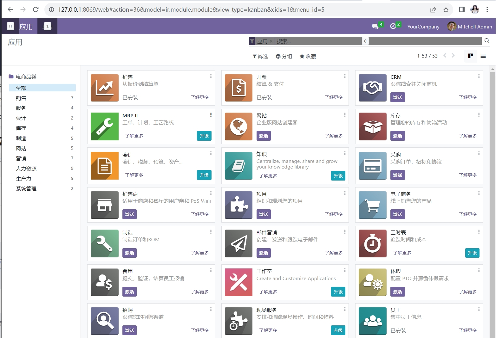

## ODOO 简介

ODOO是一款开源的企业资源计划（ERP）软件，它提供了一套全面的应用程序，涵盖了销售、采购、库存、生产、财务、人力资源等多个方面。ODOO的设计理念是提供一个集成的解决方案，以帮助企业管理和优化其各个业务流程。

ODOO具有模块化的架构，用户可以根据自己的需求选择安装和配置不同的模块。每个模块都提供了丰富的功能和工具，可以满足企业的各种需求。此外，ODOO还支持多语言和多货币，适用于全球范围内的企业使用。

ODOO的特点之一是其用户友好的界面和易于使用的功能。它提供了直观的操作界面和简化的工作流程，使用户能够快速上手并高效地使用系统。此外，ODOO还提供了丰富的报表和分析工具，帮助企业实时监控业务情况并做出明智的决策。

ODOO是一个灵活和可定制的软件，可以根据企业的需求进行定制开发。它还支持与其他系统的集成，如电子商务平台、支付网关、物流系统等，以实现更高效的业务流程。

总之，ODOO是一款功能丰富、易于使用和灵活可定制的企业资源计划软件，适用于各种规模和行业的企业使用。它可以帮助企业实现业务的集成、优化和管理，提高工作效率并增强竞争力。

## ODOO 部署

由于  odoo 依赖数据库 Postgresql，所以需要先安装 Postgresql。

### docker 部署 Postgresql

1.拉取镜像：
```bash
docker pull postgres
```

2.创建挂载目录：
```bash
mkdir -p /data/postgresql/data
```

3.启动容器：
```bash
$ docker run -d --restart=always -v /data/postgresql/data:/var/lib/postgresql/data -p 5432:5432 -e POSTGRES_USER=odoo16 -e POSTGRES_PASSWORD=odoo16 -e POSTGRES_DB=postgres --name postgresql postgres
5c58b6c3c3367767b51ecc10fedb94fe0b7c742f55bb8f13e299bc344aa670b2
```

4.查看容器运行状态：
```bash
$ docker ps -a
CONTAINER ID   IMAGE      COMMAND                   CREATED         STATUS         PORTS                    NAMES
5c58b6c3c336   postgres   "docker-entrypoint.s…"   6 seconds ago   Up 5 seconds   0.0.0.0:5432->5432/tcp   postgresql
```

### docker 部署 odoo

1.拉取镜像：
```bash
docker pull odoo
```

2.启动容器：
```bash
$ docker run -d --restart=always -v /data/odoo/data:/var/lib/odoo -v /data/odoo/extra-addons:/mnt/extra-addons -p 8069:8069 --name odoo --link=postgresql:db -t odoo
6a4831636a4d14ce888ed983e5eb62930e9225e52d8d4e921f09d5d7badab9f6
```

3.查看容器运行状态：
```bash
$ docker ps -a |egrep odoo
6a4831636a4d   odoo       "/entrypoint.sh odoo"     11 minutes ago   Up 11 minutes   0.0.0.0:8069->8069/tcp, 8071-8072/tcp   odoo
```

### 访问测试

打开浏览器，输入服务器IP:8069，即可访问（**注意**：下图中的 Database Name 不能输入 postgres, 因为该库已经在创建 postgresql 容器时指定了，所以我们这里需要额外指定名称，比如 odoo）。


进入之后，如下：
