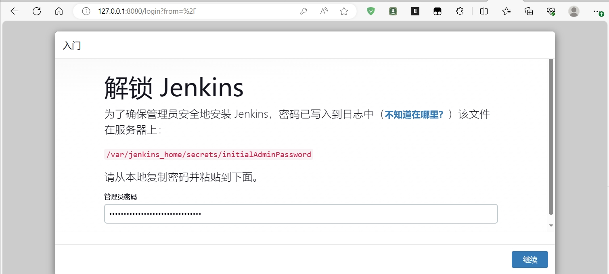

## 系统环境
- OS：kali linux 2023.03
- Kernel：6.4.0-kali3-amd64 #1 SMP PREEMPT_DYNAMIC Debian 6.4.11-1kali1 (2023-08-21) x86_64 GNU/Linux
- Docker：Docker version 20.10.25+dfsg1, build b82b9f3

## 服务部署

### 部署前的准备

1.查找 Jenkins 的镜像：
```bash
leazh@DESKTOP-VC622UG MINGW64 ~
$ docker search jenkins
NAME                           DESCRIPTION                                      STARS     OFFICIAL   AUTOMATED
jenkins                        DEPRECATED; use "jenkins/jenkins:lts" instead    5664      [OK]
jenkins/jenkins                The leading open source automation server        3728
jenkins/inbound-agent          Docker image for a Jenkins agent which can c…   118
jenkins/jnlp-slave             a Jenkins agent which can connect to Jenkins…   157                  [OK]
jenkins/ssh-agent              Docker image for Jenkins agents connected ov…   48
jenkins/slave                  base image for a Jenkins Agent, which includ…   49                   [OK]
jenkins/jnlp-agent-maven       A JNLP-based agent with Maven 3 built in         9
bitnami/jenkins                Bitnami Docker Image for Jenkins                 66                   [OK]
jenkins/ssh-slave              A Jenkins slave using SSH to establish conne…   39                   [OK]
jenkins/agent                                                                   62
jenkins/jnlp-agent-ruby                                                         1
jenkins/jnlp-agent-docker                                                       9
jenkins/jnlp-agent-node                                                         1
jenkins/ath                    Jenkins Acceptance Test Harness                  1                    [OK]
jenkins/jenkins-experimental   Experimental images of Jenkins. These images…   3                    [OK]
jenkins/jnlp-agent-python      A JNLP-based agent with Python built in          3
rancher/jenkins-jenkins                                                         1
jenkins/pct                    Plugin Compat Tester - no longer published a…   5                    [OK]
rancher/jenkins-jnlp-slave                                                      0
jenkins/jenkinsfile-runner     Jenkinsfile Runner packages                      1
jenkins/core-pr-tester         Docker image for testing pull-requests sent …   1
rancher/jenkins-slave          Jenkins Build Slave                              0                    [OK]
jenkins/jnlp-agent-alpine                                                       2
jenkins/jnlp-agent-coresdk                                                      2
jenkins/evergreen              An automatically self-updating Jenkins distr…   5
```

2.拉取 jenkins 镜像到本地：
```bash
$ docker pull jenkins/jenkins:lts
lts: Pulling from jenkins/jenkins
012c0b3e998c: Pull complete
f6154b0007a4: Pull complete
5e0093fb8d5f: Pull complete
34d373595578: Pull complete
10cad8b7dbf8: Pull complete
2471c7529ac3: Pull complete
655eafc42723: Pull complete
3145851d1a67: Pull complete
614d8a8c6a95: Pull complete
95f5dcd4e08b: Pull complete
7c8f869ed080: Pull complete
3a7be85a26d2: Pull complete
d754f693a7c2: Pull complete
Digest: sha256:b705323eaf70a7da4c1eed8b816f33dff2d5c8c3671170a2c17cf77aa4f15432
Status: Downloaded newer image for jenkins/jenkins:lts
docker.io/jenkins/jenkins:lts

What's Next?
  View summary of image vulnerabilities and recommendations → docker scout quickview jenkins/jenkins:lts
```

3.3.查看镜像详情（主要所查看监听端口和挂载目录情况）:
```bash
leazh@DESKTOP-VC622UG MINGW64 ~
$ docker inspect jenkins/jenkins:lts
[
    {
        "Id": "sha256:3d0d48f61941fc7cb5253b07efd932d06ee6e335445f6f535ac3d1d49e385a7e",
        "RepoTags": [
            "jenkins/jenkins:lts"
        ],
        "RepoDigests": [
            "jenkins/jenkins@sha256:b705323eaf70a7da4c1eed8b816f33dff2d5c8c3671170a2c17cf77aa4f15432"
        ],
        "Parent": "",
        "Comment": "buildkit.dockerfile.v0",
        "Created": "2023-09-20T11:58:51.393884542Z",
        "Container": "",
        "ContainerConfig": {
            "Hostname": "",
            "Domainname": "",
            "User": "",
            "AttachStdin": false,
            "AttachStdout": false,
            "AttachStderr": false,
            "Tty": false,
            "OpenStdin": false,
            "StdinOnce": false,
            "Env": null,
            "Cmd": null,
            "Image": "",
            "Volumes": null,
            "WorkingDir": "",
            "Entrypoint": null,
            "OnBuild": null,
            "Labels": null
        },
        "DockerVersion": "",
        "Author": "",
        "Config": {
            "Hostname": "",
            "Domainname": "",
            "User": "jenkins",
            "AttachStdin": false,
            "AttachStdout": false,
            "AttachStderr": false,
            "ExposedPorts": {
                "50000/tcp": {},
                "8080/tcp": {}
            },
            "Tty": false,
            "OpenStdin": false,
            "StdinOnce": false,
            "Env": [
                "PATH=/opt/java/openjdk/bin:/usr/local/sbin:/usr/local/bin:/usr/sbin:/usr/bin:/sbin:/bin",
                "LANG=C.UTF-8",
                "JENKINS_HOME=/var/jenkins_home",
                "JENKINS_SLAVE_AGENT_PORT=50000",
                "REF=/usr/share/jenkins/ref",
                "JENKINS_VERSION=2.414.2",
                "JENKINS_UC=https://updates.jenkins.io",
                "JENKINS_UC_EXPERIMENTAL=https://updates.jenkins.io/experimental",
                "JENKINS_INCREMENTALS_REPO_MIRROR=https://repo.jenkins-ci.org/incrementals",
                "COPY_REFERENCE_FILE_LOG=/var/jenkins_home/copy_reference_file.log",
                "JAVA_HOME=/opt/java/openjdk"
            ],
            "Cmd": null,
            "Image": "",
            "Volumes": {
                "/var/jenkins_home": {}
            },
            "WorkingDir": "",
            "Entrypoint": [
                "/usr/bin/tini",
                "--",
                "/usr/local/bin/jenkins.sh"
            ],
            "OnBuild": null,
            "Labels": {
                "org.opencontainers.image.description": "The Jenkins Continuous Integration and Delivery server",
                "org.opencontainers.image.licenses": "MIT",
                "org.opencontainers.image.revision": "8fd8b2501b26373033e1d24dc7b357e87e3dd1f6",
                "org.opencontainers.image.source": "https://github.com/jenkinsci/docker",
                "org.opencontainers.image.title": "Official Jenkins Docker image",
                "org.opencontainers.image.url": "https://www.jenkins.io/",
                "org.opencontainers.image.vendor": "Jenkins project",
                "org.opencontainers.image.version": "2.414.2"
            }
        },
        "Architecture": "amd64",
        "Os": "linux",
        "Size": 477564166,
        "VirtualSize": 477564166,
        "GraphDriver": {
            "Data": {
                "LowerDir": "/var/lib/docker/overlay2/5652413cafafea2c4cbb836b7aa7aba06dd8198c9e2e0728d6fbf99bf06af0fa/diff:/var/lib/docker/overlay2/a5ba6
4f70b3b56e7d04f8dd55735cb8ff7e31059009b94b7a6b104e9017dfb63/diff:/var/lib/docker/overlay2/8a202ce3a89ef39e2a1cffd15a2ac1c515c342d3a7d4101f55f162f2ef5073bb
/diff:/var/lib/docker/overlay2/37c76d7f8fcc333741cd4e02cfe1d2afa70e75afc955ac7fb4284d2df0fa044c/diff:/var/lib/docker/overlay2/774006cf503262e8af4fafb33d00
ad46780238c00a11eb9128fcdf2354e22c9a/diff:/var/lib/docker/overlay2/27bcd3a325144ee2ec89eab784eeec629d29aa6f2f1da12ad6f815ed01affb48/diff:/var/lib/docker/o
verlay2/4bebaeb6ce256b3539315b8d255048cd97443d4310b7c9263f58fce74d88464d/diff:/var/lib/docker/overlay2/2f62574a444719b869d1b6f00ce8a1c7d4aa035a44301193d78
53ab059736dad/diff:/var/lib/docker/overlay2/2ddf101e979018da68d004705bedddb487d10d163e9a1fb1b68ab64e84555bc3/diff:/var/lib/docker/overlay2/6a92f33d671da25
30ffeb28033ea4bca20374e8559359aad2678930c95b8cb00/diff:/var/lib/docker/overlay2/a55eb661e8299c1542bc3bdf61c5a0bd882ba52e84aef89aefe0b91367200ae0/diff:/var
/lib/docker/overlay2/de1d24838a2aeb32945a24b8dba86549df18eeef232db601d1da7452ea1c77f5/diff",
                "MergedDir": "/var/lib/docker/overlay2/34187b8d0d4224e15d4b5bdd32d1ba97c92e3c771a9dce62948dbf12752cebda/merged",
                "UpperDir": "/var/lib/docker/overlay2/34187b8d0d4224e15d4b5bdd32d1ba97c92e3c771a9dce62948dbf12752cebda/diff",
                "WorkDir": "/var/lib/docker/overlay2/34187b8d0d4224e15d4b5bdd32d1ba97c92e3c771a9dce62948dbf12752cebda/work"
            },
            "Name": "overlay2"
        },
        "RootFS": {
            "Type": "layers",
            "Layers": [
                "sha256:b8544860ba0b7d8751836ee3b386eb4faa732d87d63f6dec7d5948c520b0c181",
                "sha256:23653c4e40b961dce75576891f7aed211afe49b7db4f76fdf0af37b971e665c2",
                "sha256:91fd5e38720aa25704fffa18ffcc86097c45c582c0991881936b0f5f4c3b53b1",
                "sha256:30137bc7752caf8cc5e0f87253263aff63cc69d44d6eebb33a4e1a8abc7b4ab4",
                "sha256:3fb9cf88addffcba6808089d0797ed6f83928800eae861553f116613cf5840c9",
                "sha256:707c320d4e6df9ceed3e0a433b198b6992d0c62516ed9eb47742ded4b9e80e7b",
                "sha256:8923db4694c756ba5a11bc9c13e6fd414311f6d9cb758ff18a0ab2a27a7e9c75",
                "sha256:620a321bba076b733f29be15497dabfce1c287a8b530472054a2ddefdaaddeb8",
                "sha256:5374e8fad572e911aa3e787f1ff6682c2d87e188449ad93c9c55331f4139af87",
                "sha256:c932288697f4189381ffa2c959bccb438d9f85165550e1dbebeded85c22868f2",
                "sha256:df2329900fa70a31627a3cd84f6e195068a570857bde8deedd9dd8b7d0278ee6",
                "sha256:b27047a0aa9f57bc0b232456785ecfe57b3d7f88162ad2cc16a1bcec79216574",
                "sha256:706d553b7f2fefbbde0c91ec40a147315f3f569e4548a399aa42d2c8d3c2d082"
            ]
        },
        "Metadata": {
            "LastTagTime": "0001-01-01T00:00:00Z"
        }
    }
]
```

**说明**：
从镜像的详情可以看出,该镜像映射的端口为: 3306,只有一个可以挂载的目录： /var/lib/mysql

### 容器部署

1.执行命令：
```bash
$ docker run -d --restart=always --name jenkins -v /data/jenkins/home:/var/jenkins_home -v /etc/localtime:/etc/localtime -p 8080:8080 -p 50000:50000 jenkins/jenkins:lts
c1e9bf93a87d67d5b01e9198ca0571b6a8e5c4df36cdecb39c8ea3d557aaa99f
```

2.容器启动后，查看启动状态：
```bash
$ docker ps -a |egrep jenkins
c1e9bf93a87d   jenkins/jenkins:lts   "/usr/bin/tini -- /u…"   6 minutes ago   Up 6 minutes   0.0.0.0:8080->8080/tcp, 0.0.0.0:50000->50000/tcp   jenkins
```

3.查看挂载的目录是否有文件：


4.动态监控容器日志：
```bash
leazh@DESKTOP-VC622UG MINGW64 ~
$ docker logs jenkins -f
Running from: /usr/share/jenkins/jenkins.war
webroot: /var/jenkins_home/war
2023-10-18 07:20:32.803+0000 [id=1]     INFO    winstone.Logger#logInternal: Beginning extraction from war file
2023-10-18 07:20:34.358+0000 [id=1]     WARNING o.e.j.s.handler.ContextHandler#setContextPath: Empty contextPath
2023-10-18 07:20:34.412+0000 [id=1]     INFO    org.eclipse.jetty.server.Server#doStart: jetty-10.0.15; built: 2023-04-11T17:25:14.480Z; git: 68017dbd0023
6bb7e187330d7585a059610f661d; jvm 11.0.20.1+1
2023-10-18 07:20:34.669+0000 [id=1]     INFO    o.e.j.w.StandardDescriptorProcessor#visitServlet: NO JSP Support for /, did not find org.eclipse.jetty.jsp
.JettyJspServlet
2023-10-18 07:20:34.716+0000 [id=1]     INFO    o.e.j.s.s.DefaultSessionIdManager#doStart: Session workerName=node0
2023-10-18 07:20:35.204+0000 [id=1]     INFO    hudson.WebAppMain#contextInitialized: Jenkins home directory: /var/jenkins_home found at: EnvVars.masterEn
vVars.get("JENKINS_HOME")
2023-10-18 07:20:35.440+0000 [id=1]     INFO    o.e.j.s.handler.ContextHandler#doStart: Started w.@81b5db0{Jenkins v2.414.2,/,file:///var/jenkins_home/war
/,AVAILABLE}{/var/jenkins_home/war}
2023-10-18 07:20:35.454+0000 [id=1]     INFO    o.e.j.server.AbstractConnector#doStart: Started ServerConnector@6b53bcc2{HTTP/1.1, (http/1.1)}{0.0.0.0:808
0}
2023-10-18 07:20:35.479+0000 [id=1]     INFO    org.eclipse.jetty.server.Server#doStart: Started Server@13e547a9{STARTING}[10.0.15,sto=0] @3451ms
2023-10-18 07:20:35.481+0000 [id=25]    INFO    winstone.Logger#logInternal: Winstone Servlet Engine running: controlPort=disabled
2023-10-18 07:20:35.672+0000 [id=32]    INFO    jenkins.InitReactorRunner$1#onAttained: Started initialization
2023-10-18 07:20:35.689+0000 [id=34]    INFO    jenkins.InitReactorRunner$1#onAttained: Listed all plugins
2023-10-18 07:20:36.339+0000 [id=37]    INFO    jenkins.InitReactorRunner$1#onAttained: Prepared all plugins
2023-10-18 07:20:36.344+0000 [id=44]    INFO    jenkins.InitReactorRunner$1#onAttained: Started all plugins
2023-10-18 07:20:36.349+0000 [id=42]    INFO    jenkins.InitReactorRunner$1#onAttained: Augmented all extensions
2023-10-18 07:20:36.538+0000 [id=42]    INFO    jenkins.InitReactorRunner$1#onAttained: System config loaded
2023-10-18 07:20:36.538+0000 [id=44]    INFO    jenkins.InitReactorRunner$1#onAttained: System config adapted
2023-10-18 07:20:36.539+0000 [id=44]    INFO    jenkins.InitReactorRunner$1#onAttained: Loaded all jobs
2023-10-18 07:20:36.540+0000 [id=38]    INFO    jenkins.InitReactorRunner$1#onAttained: Configuration for all jobs updated
2023-10-18 07:20:36.559+0000 [id=58]    INFO    hudson.util.Retrier#start: Attempt #1 to do the action check updates server
WARNING: An illegal reflective access operation has occurred
WARNING: Illegal reflective access by org.codehaus.groovy.vmplugin.v7.Java7$1 (file:/var/jenkins_home/war/WEB-INF/lib/groovy-all-2.4.21.jar) to constructo
r java.lang.invoke.MethodHandles$Lookup(java.lang.Class,int)
WARNING: Please consider reporting this to the maintainers of org.codehaus.groovy.vmplugin.v7.Java7$1
WARNING: Use --illegal-access=warn to enable warnings of further illegal reflective access operations
WARNING: All illegal access operations will be denied in a future release
2023-10-18 07:20:36.954+0000 [id=37]    INFO    jenkins.install.SetupWizard#init:

*************************************************************
*************************************************************
*************************************************************

Jenkins initial setup is required. An admin user has been created and a password generated.
Please use the following password to proceed to installation:

4accd23e6f0e43cb8676fe1bd1b44fe3

This may also be found at: /var/jenkins_home/secrets/initialAdminPassword

*************************************************************
*************************************************************
*************************************************************

2023-10-18 07:21:04.327+0000 [id=58]    INFO    h.m.DownloadService$Downloadable#load: Obtained the updated data file for hudson.tasks.Maven.MavenInstalle
r
2023-10-18 07:21:04.330+0000 [id=58]    INFO    hudson.util.Retrier#start: Performed the action check updates server successfully at the attempt #1
2023-10-18 07:22:10.428+0000 [id=37]    INFO    jenkins.InitReactorRunner$1#onAttained: Completed initialization
2023-10-18 07:22:10.478+0000 [id=24]    INFO    hudson.lifecycle.Lifecycle#onReady: Jenkins is fully up and running
```

5.打开浏览器，输入 docker 服务器IP:8080 端口，访问 jenkins web 管理页面开始初始化安装：
