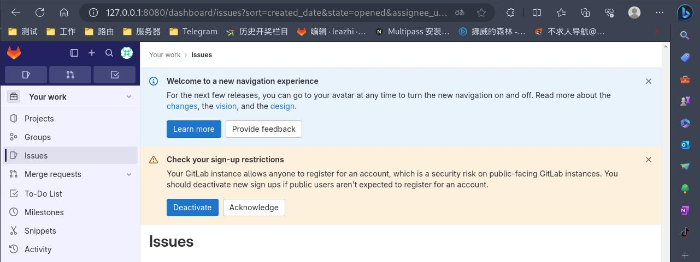

## 系统环境
- OS：kali linux 2023.03
- Kernel：6.4.0-kali3-amd64 #1 SMP PREEMPT_DYNAMIC Debian 6.4.11-1kali1 (2023-08-21) x86_64 GNU/Linux
- Docker：Docker version 20.10.25+dfsg1, build b82b9f3

## 服务部署

### 部署前的准备

1.获取 gitlab-ee 镜像：

1.1.搜索 gitlab-ee 镜像，看看需要使用哪个镜像：
```bash
┌──(leazhi㉿kali-desktop)-[~]
└─$ sudo docker search gitlab-ee         
[sudo] leazhi 的密码：
NAME                        DESCRIPTION                                     STARS     OFFICIAL   AUTOMATED
gitlab/gitlab-ee            GitLab Enterprise Edition docker image based…   461                  
tiredofit/gitlab-ee         Dockerized Gitlab EE w/Alpine Linux, Zabbix …   3                    [OK]
gsdukbh/gitlab-ee-arm64     arm64                                           3                    
gitlab/gitlab-ee-qa         GitLab QA has a test suite that allows end-t…   2                    
marq/gitlab-ee-subgit       A GitLab (Enterprise Edition) container with…   1                    [OK]
alvistack/gitlab-ee-14.0                                                    0                    
alvistack/gitlab-ee-13.10                                                   0                    
rigoford/gitlab-ee          Basic GitLab Enterprise Edition                 0                    [OK]
alvistack/gitlab-ee-14.7                                                    0                    
creative/gitlab-ee          Dockerized GitLab EE. Based on Gitlab CE ima…   0                    [OK]
1itt1eb0y/gitlab-eec        cracked gitlab-eec                              0                    
llsm/gitlab-ee              Gitlab EE forked from `sameersbn/gitlab`        0                    
leftathome/gitlab-ee        I love running sameersbn's Gitlab-CE contain…   0                    [OK]
alvistack/gitlab-ee-14.2                                                    0                    
lefty00009/gitlab-ee                                                        0                    
alvistack/gitlab-ee-14.3                                                    0                    
alvistack/gitlab-ee-14.5                                                    0                    
alvistack/gitlab-ee-14.6                                                    0                    
alvistack/gitlab-ee-13.12                                                   0                    
alvistack/gitlab-ee-13.11                                                   0                    
alvistack/gitlab-ee-14.4                                                    0                    
alvistack/gitlab-ee-13.9                                                    0                    
alvistack/gitlab-ee-13.8                                                    0                    
alvistack/gitlab-ee-13.7                                                    0                    
effitient/gitlab-ee                                                         0                    
```

1.2.将gitlab 官方打包的镜像拉去下来：
```bash
┌──(leazhi㉿kali-desktop)-[~]
└─$ sudo docker pull gitlab/gitlab-ee      
Using default tag: latest
latest: Pulling from gitlab/gitlab-ee
44ba2882f8eb: Pull complete 
52dd124a1083: Pull complete 
030eb3c8f8b4: Pull complete 
fcf6da62cd1c: Pull complete 
57129ac3ad81: Pull complete 
d67f43893e52: Pull complete 
f99c5ff351c1: Pull complete 
13706036b2e1: Pull complete 
Digest: sha256:82e5d49574964bc0a5b8942ac2b92ac7f3618832d6eb24fc9c33a41d889b8d83
Status: Downloaded newer image for gitlab/gitlab-ee:latest
docker.io/gitlab/gitlab-ee:latest
```

2.查看镜像的一些信息（比如挂在目录，端口等），为后面的启动参数作准备：
```bash
┌──(leazhi㉿kali-desktop)-[~]
└─$ sudo docker inspect gitlab/gitlab-ee:latest 
[sudo] leazhi 的密码：
[
    {
        "Id": "sha256:89a2a0f309e1250a43c29db10fd98811e098f3d2a3e6d8a1c48fa8f27b1005ce",
        "RepoTags": [
            "gitlab/gitlab-ee:latest"
        ],
        "RepoDigests": [
            "gitlab/gitlab-ee@sha256:82e5d49574964bc0a5b8942ac2b92ac7f3618832d6eb24fc9c33a41d889b8d83"
        ],
        "Parent": "",
        "Comment": "",
        "Created": "2023-09-18T15:32:23.955305339Z",
        "Container": "79da72d158bc8cc2e1af4d18ce00d1963d941add675f7887b7a29a9f9797132a",
        "ContainerConfig": {
            "Hostname": "79da72d158bc",
            "Domainname": "",
            "User": "",
            "AttachStdin": false,
            "AttachStdout": false,
            "AttachStderr": false,
            "ExposedPorts": {
                "22/tcp": {},
                "443/tcp": {},
                "80/tcp": {}
            },
            "Tty": false,
            "OpenStdin": false,
            "StdinOnce": false,
            "Env": [
                "PATH=/opt/gitlab/embedded/bin:/opt/gitlab/bin:/assets:/usr/local/sbin:/usr/local/bin:/usr/sbin:/usr/bin:/sbin:/bin",
                "LANG=C.UTF-8",
                "EDITOR=/bin/vi",
                "GITLAB_ALLOW_SHA1_RSA=false",
                "TERM=xterm"
            ],
            "Cmd": [
                "/bin/sh",
                "-c",
                "#(nop) ",
                "HEALTHCHECK &{[\"CMD-SHELL\" \"/opt/gitlab/bin/gitlab-healthcheck --fail --max-time 10\"] \"1m0s\" \"30s\" \"0s\" '\\x05'}"
            ],
            "Healthcheck": {
                "Test": [
                    "CMD-SHELL",
                    "/opt/gitlab/bin/gitlab-healthcheck --fail --max-time 10"
                ],
                "Interval": 60000000000,
                "Timeout": 30000000000,
                "Retries": 5
            },
            "Image": "sha256:8ef337d8c65f90588b2a3caeb61f3f4e3f95f069fa771d1dfa6cf4ab1914e766",
            "Volumes": {
                "/etc/gitlab": {},
                "/var/log/gitlab": {},
                "/var/opt/gitlab": {}
            },
            "WorkingDir": "",
            "Entrypoint": null,
            "OnBuild": null,
            "Labels": {
                "org.opencontainers.image.ref.name": "ubuntu",
                "org.opencontainers.image.version": "22.04"
            },
            "Shell": [
                "/bin/sh",
                "-c"
            ]
        },
        "DockerVersion": "23.0.5",
        "Author": "GitLab Inc. <support@gitlab.com>",
        "Config": {
            "Hostname": "",
            "Domainname": "",
            "User": "",
            "AttachStdin": false,
            "AttachStdout": false,
            "AttachStderr": false,
            "ExposedPorts": {
                "22/tcp": {},
                "443/tcp": {},
                "80/tcp": {}
            },
            "Tty": false,
            "OpenStdin": false,
            "StdinOnce": false,
            "Env": [
                "PATH=/opt/gitlab/embedded/bin:/opt/gitlab/bin:/assets:/usr/local/sbin:/usr/local/bin:/usr/sbin:/usr/bin:/sbin:/bin",
                "LANG=C.UTF-8",
                "EDITOR=/bin/vi",
                "GITLAB_ALLOW_SHA1_RSA=false",
                "TERM=xterm"
            ],
            "Cmd": [
                "/assets/wrapper"
            ],
            "Healthcheck": {
                "Test": [
                    "CMD-SHELL",
                    "/opt/gitlab/bin/gitlab-healthcheck --fail --max-time 10"
                ],
                "Interval": 60000000000,
                "Timeout": 30000000000,
                "Retries": 5
            },
            "Image": "sha256:8ef337d8c65f90588b2a3caeb61f3f4e3f95f069fa771d1dfa6cf4ab1914e766",
            "Volumes": {
                "/etc/gitlab": {},
                "/var/log/gitlab": {},
                "/var/opt/gitlab": {}
            },
            "WorkingDir": "",
            "Entrypoint": null,
            "OnBuild": null,
            "Labels": {
                "org.opencontainers.image.ref.name": "ubuntu",
                "org.opencontainers.image.version": "22.04"
            },
            "Shell": [
                "/bin/sh",
                "-c"
            ]
        },
        "Architecture": "amd64",
        "Os": "linux",
        "Size": 3136461686,
        "VirtualSize": 3136461686,
        "GraphDriver": {
            "Data": {
                "LowerDir": "/data/docker/overlay2/bd507c3f10b540e9563dc1bb0cf2b96ac4ab94bf3b876da02f86694ab860c6b0/diff:/data/docker/overlay2/fc610960c75cc42f95b1acd118253714f071481ddc629fb1eaa24d10e4aea993/diff:/data/docker/overlay2/cd83956bed45afc6d9646d0eaa8fe6aac14febe629a35c6e8d1bdf1e430cb9da/diff:/data/docker/overlay2/b01480e1a814d7215c49782c8ed682558393546e4daa74f8a9e2b4d0c88c89b9/diff:/data/docker/overlay2/26d5d0d30af578fff551138c798e18a34022bf22ecc0cc15b870c231480d4bab/diff:/data/docker/overlay2/6ae831776a669bc9829caf37f362d965263ad348df09d86110ef9e0536a8e9b3/diff:/data/docker/overlay2/6683fdd2d4a8ee6f185b4cd973303cb0603e3013479a5ed88a2c185d419883ee/diff",
                "MergedDir": "/data/docker/overlay2/06f14c3d5039b1817166bf990e2d1716ddff91fa375bcf6b16fb8e7dcd37443c/merged",
                "UpperDir": "/data/docker/overlay2/06f14c3d5039b1817166bf990e2d1716ddff91fa375bcf6b16fb8e7dcd37443c/diff",
                "WorkDir": "/data/docker/overlay2/06f14c3d5039b1817166bf990e2d1716ddff91fa375bcf6b16fb8e7dcd37443c/work"
            },
            "Name": "overlay2"
        },
        "RootFS": {
            "Type": "layers",
            "Layers": [
                "sha256:dc0585a4b8b71f7f4eb8f2e028067f88aec780d9ab40c948a8d431c1aeadeeb5",
                "sha256:94dd23975116e32fcaf2b39b3604a140033958d75c91ddc488fbfd9427658c43",
                "sha256:b67a04acf101906a29a52cdec3143419ac1873be77ffc92068f2ae9848714c72",
                "sha256:3ddd19adb250552d59848a209d44e22f4133b180c25c1af3c44843a2be0aa285",
                "sha256:6d084fe4816c07c2c96292b344f1cb6f8cd6307aa93cb29c9a08fdb448980234",
                "sha256:0cc240d267bf68969720b6c65b358d062de2fcd886f852373c39a875e3127754",
                "sha256:99c6614b82a0b232d2d2456626bfec9e604e4662a6da3154d3d17c863593c929",
                "sha256:17f35bea0e90281dbad9f5e11df1817c72ac80e0ddf02ed766be5753aab46f2c"
            ]
        },
        "Metadata": {
            "LastTagTime": "0001-01-01T00:00:00Z"
        }
    }
]
```

3.创建挂在目录：
```bash
┌──(leazhi㉿kali-desktop)-[~]
└─$ sudo mkdir /data/docker/gitlab/{log,data,config} -p
```

### 容器部署

1.执行命令：
```bash
┌──(leazhi㉿kali-desktop)-[~]
└─$ sudo docker run -id --name gitlab-ee --restart=always --hostname gitlab.kali.com -v /data/docker/gitlab/config:/etc/gitlab -v /data/docker/gitlab/log:/var/log/gitlab -v /data/docker/gitlab/data:/var/opt/gitlab -p 8443:443 -p 8080:80 -p 2222:22 gitlab/gitlab-ee:latest
7ce607e28f4be5cc5c8ac564cf047410d69e78d761b2c2a81373b6e1f0a73673
```

2.查看容器状态：
```bash
┌──(leazhi㉿kali-desktop)-[~]
└─$ sudo docker ps -a |egrep gitlab
7ce607e28f4b   gitlab/gitlab-ee:latest   "/assets/wrapper"        26 minutes ago   Up 26 minutes (healthy)   0.0.0.0:2222->22/tcp, :::2222->22/tcp, 0.0.0.0:8080->80/tcp, :::8080->80/tcp, 0.0.0.0:8443->443/tcp, :::8443->443/tcp   gitlab-ee
```

3.查看 gitlab-ee 默认登录密码;
```bash
┌──(leazhi㉿kali-desktop)-[~]
└─$ sudo cat /data/docker/gitlab/config/initial_root_password
# WARNING: This value is valid only in the following conditions
#          1. If provided manually (either via `GITLAB_ROOT_PASSWORD` environment variable or via `gitlab_rails['initial_root_password']` setting in `gitlab.rb`, it was provided before database was seeded for the first time (usually, the first reconfigure run).
#          2. Password hasn't been changed manually, either via UI or via command line.
#
#          If the password shown here doesn't work, you must reset the admin password following https://docs.gitlab.com/ee/security/reset_user_password.html#reset-your-root-password.

Password: WR2msFdq7PNUa6w0T/INnCmg55UjtQQzJj3zsLhay48=

# NOTE: This file will be automatically deleted in the first reconfigure run after 24 hours.
```

## 访问测试

打开浏览器，输入 docker 服务器地址+映射的端口号访问测试，并使用初始化密码进行登录：



## 参考：
- 1.[值得参考 ---> 《使用 Docker 部署 Gitlab，及常用优化项的说明》](https://www.treesir.pub/post/gitlab-deploy/#%E5%88%9B%E5%BB%BA-docker-compose-%E9%83%A8%E7%BD%B2%E6%96%87%E4%BB%B6)


