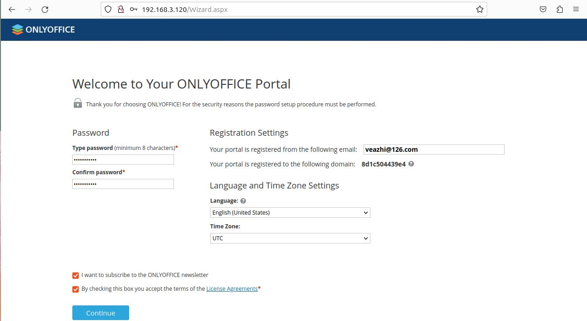
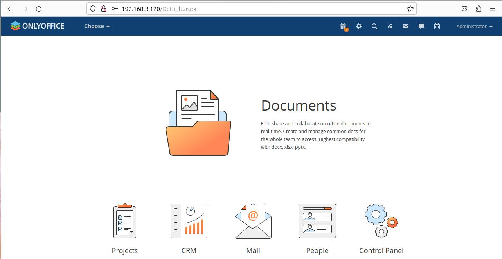
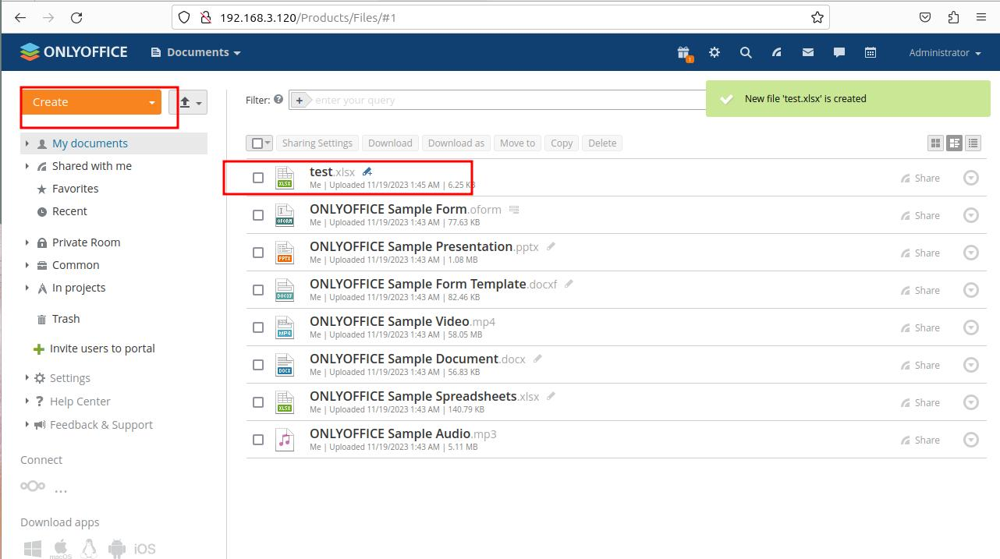

官方文档：https://helpcenter.onlyoffice.com/installation/workspace-install-docker-integrated.aspx


## 系统环境：

- 系统版本：ubuntu 23.10 (Mantic Minotaur)
- 内核版本：6.5.0-10-generic #10-Ubuntu SMP PREEMPT_DYNAMIC Fri Oct 13 13:49:38 UTC 2023 x86_64 x86_64 x86_64 GNU/Linux
- Dokcer：Docker version 24.0.7, build afdd53b
- 物理机IP：192.168.3.120


## onlyoffice workspace 部署步骤：

### 部署前的准备：

1.创建挂载目录：
```bash
# MySQL 挂载目录：
mkdir /data/docker/onlyoffice/mysql/conf.d -p
mkdir /data/docker/onlyoffice/mysql/data -p
mkdir /data/docker/onlyoffice/mysql/initdb -p

# DocumetServer 挂载目录
mkdir /data/docker/onlyoffice/documentserver/data -p
mkdir /data/docker/onlyoffice/documentserver/logs -p

# MailServer 挂载目录
mkdir /data/docker/onlyoffice/mailserver/data/certs -p
mkdir /data/docker/onlyoffice/mailserver/logs -p

# ControlPanel 挂载目录
mkdir /data/docker/onlyoffice/controlpanel/data -p
mkdir /data/docker/onlyoffice/controlpanel/logs -p

# CommunityServer 挂载目录
mkdir -p /data/docker/onlyoffice/communityserver/data
mkdir -p /data/docker/onlyoffice/communityserver/logs
mkdir -p /data/docker/onlyoffice/communityserver/letsencrypt
```

2.创建 mysql 配置及授权文件：
```bash
# MySQL 的配置：
echo "[mysqld]
sql_mode = 'NO_ENGINE_SUBSTITUTION'
max_connections = 1000
max_allowed_packet = 1048576000
group_concat_max_len = 2048" > /data/docker/onlyoffice/mysql/conf.d/onlyoffice.cnf

# MySQL 初始化权限
echo "ALTER USER 'root'@'%' IDENTIFIED WITH mysql_native_password BY 'my-secret-pw';
CREATE USER IF NOT EXISTS 'onlyoffice_user'@'%' IDENTIFIED WITH mysql_native_password BY 'onlyoffice_pass';
CREATE USER IF NOT EXISTS 'mail_admin'@'%' IDENTIFIED WITH mysql_native_password BY 'Isadmin123';
GRANT ALL PRIVILEGES ON *.* TO 'root'@'%';
GRANT ALL PRIVILEGES ON *.* TO 'onlyoffice_user'@'%';
GRANT ALL PRIVILEGES ON *.* TO 'mail_admin'@'%';
FLUSH PRIVILEGES;" > /data/docker/onlyoffice/mysql/initdb/setup.sql
```

3.创建桥接网络 onlyoffice
```bash
leazhi@ubuntu2310:~$ sudo docker network create --driver bridge onlyoffice
a2fb3eb9d238a772b062c9756e69d8d8ae963192c3743642081c174f918518e7
```


### 部署 MySQL 8.0.29 容器

1.执行下面的命令，启动 MySQL 容器：
```bash
sudo docker run --net onlyoffice -i -t -d --restart=always --name onlyoffice-mysql-server \
-v /data/docker/onlyoffice/mysql/conf.d:/etc/mysql/conf.d \
-v /data/docker/onlyoffice/mysql/data:/var/lib/mysql \
-v /data/docker/onlyoffice/mysql/initdb:/docker-entrypoint-initdb.d \
-e MYSQL_ROOT_PASSWORD=my-secret-pw -e MYSQL_DATABASE=onlyoffice \
mysql:8.0.29
```

2.启动完容器，查看下容器的状态，确保是 UP ：
```bash
leazhi@ubuntu2310:~$ sudo docker ps -a |egrep mysql
c6118e032ee2   mysql:8.0.29                       "docker-entrypoint.s…"   About a minute ago   Up About a minute   3306/tcp, 33060/tcp                          onlyoffice-mysql-server
```

### 部署 DocumentServer 容器

1.**<font color="red">至关重要的一步，决定了你部署完成后是否报 `The document security token is not correctly formed. Please contact your Document Server administrator.` 的错误。官方文档没有说明，反而在 [ onlyoffice github 项目 README](https://github.com/ONLYOFFICE/Docker-DocumentServer) 有说明</font>**：手动生成 JWT_SECRET：
```bash
JWT_SECRET=$(cat /dev/urandom | tr -dc A-Za-z0-9 | head -c 12);
```

2.执行下面的命令，启动 docuemnt-server 容器
```bash
sudo docker run --net onlyoffice -i -t -d --restart=always --name=onlyoffice-document-server \
-e JWT_ENABLED=true \
-e JWT_SECRET=${JWT_SECRET} \
-e JWT_HEADER=AuthorizationJwt \
-v /data/docker/onlyoffice/documentserver/logs:/var/log/onlyoffice \
-v /data/docker/onlyoffice/documentserver/data:/var/www/onlyoffice/Data \
-v /data/docker/onlyoffice/documentserver/fonts:/usr/share/fonts/truetype/custom \
-v /data/docker/onlyoffice/documentserver/forgotten:/var/lib/onlyoffice/documentserver/App_Data/cache/files/forgotten onlyoffice/documentserver
```

3.启动完容器，查看下容器的状态，确保是 UP ：
```bash
leazhi@ubuntu2310:~$ sudo docker ps -a |egrep  documentserver
e2b07d31227e   onlyoffice/documentserver          "/app/ds/run-documen…"   23 seconds ago   Up 22 seconds   80/tcp, 443/tcp                              onlyoffice-document-server
```

### 部署 MailServer 容器

1.执行下面的命令，启动 mail-server 容器
```bash
sudo docker run --init --net onlyoffice --privileged -i -t -d --restart=always --name onlyoffice-mail-server \
-p 25:25 -p 143:143 -p 587:587 \
-e MYSQL_SERVER=onlyoffice-mysql-server \
-e MYSQL_SERVER_PORT=3306 \
-e MYSQL_ROOT_USER=root \
-e MYSQL_ROOT_PASSWD=my-secret-pw \
-e MYSQL_SERVER_DB_NAME=onlyoffice_mailserver \
-v /data/docker/onlyoffice/mailserver/data:/var/vmail \
-v /data/docker/onlyoffice/mailserver/data/certs:/etc/pki/tls/mailserver \
-v /data/docker/onlyoffice/mailserver/logs:/var/log \
-h docs.linuser.com \
onlyoffice/mailserver
```

2.启动完容器，查看下容器的状态，确保是 UP ：
```bash
leazhi@ubuntu2310:~$ sudo docker ps -a |egrep mail
65d05c4052a9   onlyoffice/mailserver              "/bin/sh -c 'export …"   2 minutes ago    Up 2 minutes    0.0.0.0:25->25/tcp, :::25->25/tcp, 0.0.0.0:143->143/tcp, :::143->143/tcp, 465/tcp, 993/tcp, 995/tcp, 3306/tcp, 4190/tcp, 0.0.0.0:587->587/tcp, :::587->587/tcp, 8081/tcp   onlyoffice-mail-server
```


### 部署 ControlPanel 容器

1.执行下面的命令，启动 controlpanel 容器
```bash
sudo docker run --net onlyoffice -i -t -d --restart=always --name onlyoffice-control-panel \
-v /var/run/docker.sock:/var/run/docker.sock \
-v /data/docker/onlyoffice/communityserver/data:/app/onlyoffice/CommunityServer/data \
-v /data/docker/onlyoffice/controlpanel/data:/var/www/onlyoffice/Data \
-v /data/docker/onlyoffice/controlpanel/logs:/var/log/onlyoffice \
onlyoffice/controlpanel
```

2.启动完容器，查看下容器的状态，确保是 UP ：
```bash
leazhi@ubuntu2310:~$ sudo docker ps -a |egrep  control
a86ac81356e6   onlyoffice/controlpanel            "/var/www/onlyoffice…"   41 minutes ago      Up 41 minutes      80/tcp, 443/tcp                                                                                                                                                            onlyoffice-control-panel
```

### 部署 CommunityServer 容器

1.先获取 mailserver 容器的IP：
```bash
MAIL_SERVER_IP=$(sudo docker inspect -f '{{range .NetworkSettings.Networks}}{{.IPAddress}}{{end}}' onlyoffice-mail-server)
```

2.执行下面的命令，启动 communityserver 容器（需要注意的是：这里需要指定 JWT ，且密钥要和 documentserver 的一致）
```bash
sudo docker run --net onlyoffice -i -t -d --privileged --restart=always --name onlyoffice-community-server -p 80:80 -p 443:443 -p 5222:5222 --cgroupns=host \
-e MYSQL_SERVER_ROOT_PASSWORD=my-secret-pw \
-e MYSQL_SERVER_DB_NAME=onlyoffice \
-e MYSQL_SERVER_HOST=onlyoffice-mysql-server \
-e MYSQL_SERVER_USER=onlyoffice_user \
-e MYSQL_SERVER_PASS=onlyoffice_pass \
-e DOCUMENT_SERVER_PORT_80_TCP_ADDR=onlyoffice-document-server \
-e DOCUMENT_SERVER_JWT_ENABLED=true \
-e DOCUMENT_SERVER_JWT_SECRET=${JWT_SECRET} \
-e DOCUMENT_SERVER_JWT_HEADER=AuthorizationJwt \
-e MAIL_SERVER_API_HOST=${MAIL_SERVER_IP} \
-e MAIL_SERVER_DB_HOST=onlyoffice-mysql-server \
-e MAIL_SERVER_DB_NAME=onlyoffice_mailserver \
-e MAIL_SERVER_DB_PORT=3306 \
-e MAIL_SERVER_DB_USER=root \
-e MAIL_SERVER_DB_PASS=my-secret-pw \
-e CONTROL_PANEL_PORT_80_TCP=80 \
-e CONTROL_PANEL_PORT_80_TCP_ADDR=onlyoffice-control-panel \
-v /data/docker/onlyoffice/communityserver/data:/var/www/onlyoffice/Data \
-v /data/docker/onlyoffice/communityserver/logs:/var/log/onlyoffice \
-v /data/docker/onlyoffice/communityserver/letsencrypt:/etc/letsencrypt \
-v /sys/fs/cgroup:/sys/fs/cgroup:rw \
onlyoffice/communityserver
```

3.启动完容器，查看下容器的状态，确保是 UP ：
```bash
leazhi@ubuntu2310:~$ sudo docker ps -a |egrep community
8d1c504439e4   onlyoffice/communityserver   "/app/run-community-…"   27 seconds ago   Up 27 seconds   0.0.0.0:80->80/tcp, :::80->80/tcp, 0.0.0.0:443->443/tcp, :::443->443/tcp, 3306/tcp, 5280/tcp, 9865-9866/tcp, 9871/tcp, 9882/tcp, 0.0.0.0:5222->5222/tcp, :::5222->5222/tcp, 9888/tcp   onlyoffice-community-server
```

### 扩展说明

项目运行完成后，查看下整个项目所使用到的容器镜像：

```bash
leazhi@ubuntu2310:/data/docker/onlyoffice$ sudo docker images -a
REPOSITORY                   TAG       IMAGE ID       CREATED         SIZE
onlyoffice/documentserver    latest    a52fca04de77   13 days ago     3.13GB
onlyoffice/communityserver   latest    6848b5630774   5 months ago    5.12GB
onlyoffice/controlpanel      latest    26f8e663afac   7 months ago    640MB
mysql                        8.0.29    33037edcac9b   16 months ago   444MB
onlyoffice/mailserver        latest    222be3f84e5e   3 years ago     1.86GB
```

部署过程，如想重新部署，可以执行下面的命令对说有容器（注意：所有容器不仅仅是 onlyoffice workspace 项目的容器，也包含了其它容器，执行前请确保服务器没有其它运行的容器方可执行）进行删除：
```bash
sudo docker rm -f $(sudo docker ps -a |egrep -v CONTAI |awk -F ' ' '{print$1}')
```

删除所有镜像：
```bash
sudo docker rmi -f $(sudo docker images -a  |egrep -v REPOSITORY |awk -F ' ' '{print $3}')
```

## web 安装

容器部署完成后，就可以使用物理机 IP 在浏览器访问 onlyoffice workplace 项目了，如下：

1.设置访问密码、语言及时区（这个也可以在后期的使用过程中进行设置）：


2.点击上面的 确定 按钮后，进入 onlyoffice workplace 主页：


3.访问 onlyoffice web ，创建表格文件：




**<font color="red">无法容忍的是：相信很多读者根据官方的说明文档安装完成后，在创建或者浏览除了 MP3 和 MP4 正常外的其他文件时，都会出现 `The document security token is not correctly formed. Please contact your Document Server administrator.` 的故障，进而无法创建或者浏览文件。可耻的是，在网上搜索解决方法时，基本上都是复制粘贴一些没有一点作用废话，要么就提供一个连自己都没验证过的不知道从哪里搬去的解决思路误导别人。</font>**


## 采用 docker-compose 部署

部署文档：https://helpcenter.onlyoffice.com/installation/workspace-install-docker.aspx

```bash
# 切换到 root 用户
sudo su - 

# 下载官方提供的部署脚本：
wget -O /usr/local/sbin/workspace-install.sh https://download.onlyoffice.com/install/workspace-install.sh

# 部署 onlyoffice workplace,但是不部署 mail server
bash /usr/local/sbin/workspace-install.sh -ims false
```

最后部署完成后的镜像：
```bash
root@ubuntu2310:/usr/local/sbin# docker images -a
REPOSITORY                   TAG           IMAGE ID       CREATED         SIZE
onlyoffice/documentserver    7.5.1.1       a52fca04de77   11 days ago     3.13GB
onlyoffice/documentserver    latest        a52fca04de77   11 days ago     3.13GB
onlyoffice/communityserver   12.5.2.1848   6848b5630774   5 months ago    5.12GB
onlyoffice/communityserver   latest        6848b5630774   5 months ago    5.12GB
onlyoffice/controlpanel      3.5.0.516     26f8e663afac   7 months ago    640MB
onlyoffice/controlpanel      latest        26f8e663afac   7 months ago    640MB
mysql                        8.0.29        33037edcac9b   16 months ago   444MB
onlyoffice/elasticsearch     7.16.3        77bcd079c9e1   16 months ago   646MB
onlyoffice/mailserver        latest        222be3f84e5e   3 years ago     1.86GB
```