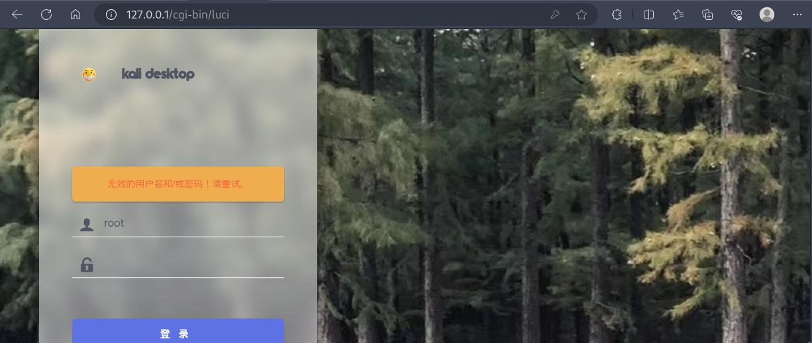
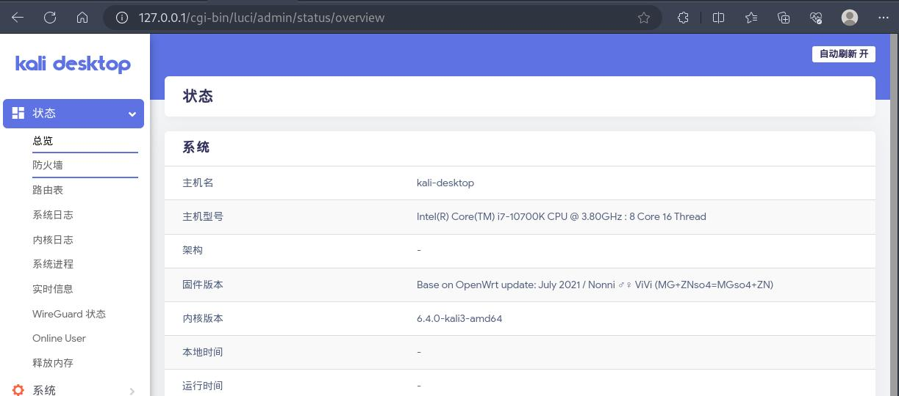

## 系统环境
- OS：kali linux 2023.03
- Kernel：6.4.0-kali3-amd64 #1 SMP PREEMPT_DYNAMIC Debian 6.4.11-1kali1 (2023-08-21) x86_64 GNU/Linux
- Docker：Docker version 20.10.25+dfsg1, build b82b9f3

## 服务部署

### 部署前的准备

1.拉去别人封装好的 openwrt 镜像到本地：
```bash
┌┌──(leazhi㉿kali-desktop)-[~]
└─$ sudo docker pull nonnichen/nonniwrt     
Using default tag: latest
latest: Pulling from nonnichen/nonniwrt
8b06f2b46525: Pull complete 
ea1292cac7fd: Pull complete 
Digest: sha256:89a26389fe5cc73bfb5379fccf93c47e80e1f3fa32061d08629c13d9f2977d77
Status: Downloaded newer image for nonnichen/nonniwrt:latest
docker.io/nonnichen/nonniwrt:latest
```

2.查看镜像详情（主要所查看监听端口和挂载目录情况）：
```bash
┌──(leazhi㉿kali-desktop)-[~]
└─$ sudo docker inspect nonnichen/nonniwrt     
[
    {
        "Id": "sha256:8a1fe55cda5bf0f49b463f01930662549954f4b5f965b863e3bf58ec68b0bc37",
        "RepoTags": [
            "nonnichen/nonniwrt:latest"
        ],
        "RepoDigests": [
            "nonnichen/nonniwrt@sha256:89a26389fe5cc73bfb5379fccf93c47e80e1f3fa32061d08629c13d9f2977d77"
        ],
        "Parent": "",
        "Comment": "ViVi",
        "Created": "2021-07-20T10:55:59.927436138Z",
        "Container": "a2b9f01e99abd283f0e062ac19282d221627280617b3a147218f3a6db041bb15",
        "ContainerConfig": {
            "Hostname": "a2b9f01e99ab",
            "Domainname": "",
            "User": "",
            "AttachStdin": false,
            "AttachStdout": false,
            "AttachStderr": false,
            "Tty": false,
            "OpenStdin": false,
            "StdinOnce": false,
            "Env": [
                "PATH=/usr/local/sbin:/usr/local/bin:/usr/sbin:/usr/bin:/sbin:/bin"
            ],
            "Cmd": [
                "/sbin/init"
            ],
            "Image": "nonnichen/nonniwrt",
            "Volumes": null,
            "WorkingDir": "/",
            "Entrypoint": null,
            "OnBuild": null,
            "Labels": {
                "Support.by": "Nonni"
            }
        },
        "DockerVersion": "19.03.13",
        "Author": "Nonni (i@nonnix.com)",
        "Config": {
            "Hostname": "a2b9f01e99ab",
            "Domainname": "",
            "User": "",
            "AttachStdin": false,
            "AttachStdout": false,
            "AttachStderr": false,
            "Tty": false,
            "OpenStdin": false,
            "StdinOnce": false,
            "Env": [
                "PATH=/usr/local/sbin:/usr/local/bin:/usr/sbin:/usr/bin:/sbin:/bin"
            ],
            "Cmd": [
                "/sbin/init"
            ],
            "Image": "nonnichen/nonniwrt",
            "Volumes": null,
            "WorkingDir": "/",
            "Entrypoint": null,
            "OnBuild": null,
            "Labels": {
                "Support.by": "Nonni"
            }
        },
        "Architecture": "amd64",
        "Os": "linux",
        "Size": 473709927,
        "VirtualSize": 473709927,
        "GraphDriver": {
            "Data": {
                "LowerDir": "/data/docker/overlay2/8f79d506567332e5814d68c27aadba99fa26bffbf78c0665b5b0701f890a3eb8/diff",
                "MergedDir": "/data/docker/overlay2/cf2e1e4180e41a14dfc39546689d0a043fd53cb1f8e8038cef449db0eaec3bf2/merged",
                "UpperDir": "/data/docker/overlay2/cf2e1e4180e41a14dfc39546689d0a043fd53cb1f8e8038cef449db0eaec3bf2/diff",
                "WorkDir": "/data/docker/overlay2/cf2e1e4180e41a14dfc39546689d0a043fd53cb1f8e8038cef449db0eaec3bf2/work"
            },
            "Name": "overlay2"
        },
        "RootFS": {
            "Type": "layers",
            "Layers": [
                "sha256:9af5853ffce4f7ad5d4d2627b0d8d69cdbde949e2139e207b6e7373b6a5cb19c",
                "sha256:13d9f48368d3aaa963dcdc47c0fd1f87ce2f3b101f4d6bf080d449de1099543d"
            ]
        },
        "Metadata": {
            "LastTagTime": "0001-01-01T00:00:00Z"
        }
    }
]
```

### 容器部署

1.执行命令：
```bash
┌──(leazhi㉿kali-desktop)-[~]
└─$ sudo docker run -id --restart=always  -p 80:80 nonnichen/nonniwrt /sbin/init
b772611095b8d795759f9dbf0e86e39869a46238927d50dfa2b8624297a60749
```

2.容器启动后，查看启动状态：
```bash
┌──(leazhi㉿kali-desktop)-[~]
└─$ sudo docker ps  -a |egrep openwrt
53237c171a94   nonnichen/nonniwrt                  "/sbin/init"             About an hour ago   Up About an hour                           openwrt
```

3.打开浏览器，输入 docker 宿主机IP 访问如下;


4.由于作者给出的密码 password 是错误的，所以我们还要登录容器，修改登陆密码：
```bash
┌──(leazhi㉿kali-desktop)-[~]
└─$ sudo docker exec -it openwrt /bin/ash
BusyBox v1.33.1 (2021-07-01 08:59:40 UTC) built-in shell (ash)

/ # passwd
Changing password for root
New password: 
Bad password: too weak
Retype password: 
passwd: password for root changed by root
/ # 

```

5.使用修改的密码进行登录：



## 重要说明

**一般我们都不会这样去玩，因为这样就失去了部署 openwrt 的意义。**

正确的做法应该是：

1.先在物理机上创建一个 macvlan 网络，并将网段分配和物理机同段（配置方法可以参考：[Docker 系列002-网络模型之 macvlan](https://hexo.linuser.com/2023/09/08/c878def52893/)）

2.然后再以独立分配IP 的方式启动 openwrt 容器；