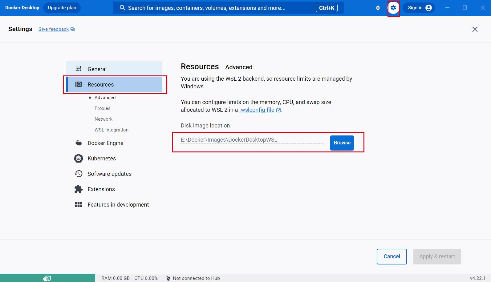

## [docker desktop](https://docs.docker.com/desktop/) 、 [docker engine](https://docs.docker.com/engine/)

### 两者的区别：

- docker desktop包含虚拟机、图形界面及其他特性比如带了一个单节点的kubernetes集群，虚拟机里有一个Docker CE (Docker Community Edition)守护进程。

- docker engine，根据官方文档包含三部分，
  - 守护进程dockerd
  - api，程序可通过api与dockerd交互
  - 命令行工具客户端docker，命令docker command中的docker

在docker desktop里，docker客户端是在宿主机中，守护进程在虚拟机里。当要访问docker desktop的ip时，要谨记一条-docker network存在于虚拟机中，即使使用docker run --net host那也是使用虚拟机的host network，而不是物理机的network。docker container运行在虚拟机中，其他一切都是结果。

在Windows和MacOS中，要想运行linux容器，必须有虚拟机，在linux中是不需要的;不过，为了一致体验，如果在linux中安装desktop也会安装一个虚拟机。

### 选 docker desktop OR docker engine

- 如果装在macOS、windows、linux等有图形的桌面电脑，则用docker desktop。比如windows电脑、macos电脑、ubuntu、fedora电脑。

- 如果装在没有图形的电脑，则用docker engine，比如公司的centos服务器、阿里云的centos服务器等


## Windows 安装 docker-desktop

官方文档：[How to install Docker Engine in Windows](https://docs.docker.com/desktop/install/windows-install/)

### 系统环境

- 操作系统：Windows 10 专业版 22H2
- Docker 版本：Docker version 24.0.5, build ced0996


**注意：** 

- 安装 Docker 之前，请确保您的 Windows 系统已经安装了 [.NET Framework 4.7.2](https://dotnet.microsoft.com/download/dotnet-framework/net472) 及以上版本。;
- 请确保您的系统不是 家庭版;
- 请确保您的系统已安装好 Hyper-V;


### docker 安装

默认情况， Docker 不支持自定义安装目录。它默认安装在 `C:\Program Files\Docker` 目录中。但是作为一个资深运维人员来说，这样的安装目录显然不符合我们的要求。

1.打开 [Docker 官网](https://www.docker.com/products/docker-desktop) ，下载 Windows 版本的 Docker 安装包。

2.在其它盘符下新建目录结构（比如 D 盘）：`D:\Program Files\Docker` ，然后**以管理员身份**打开 cmd ，执行下面的命令做个软链接：
```cmd
mklink /j "C:\Program Files\Docker" "D:\Program Files\Docker"
```

3.然后执行安装命令即可！安装完成后， docker 就会安装在 D 盘下了。

### 镜像目录

默认情况下， Docker 镜像会存储在 `C:\Users\<用户名>\AppData\Local\Docker\

1.打开 docker UI ,点击右上角的设置，按下图设置即可：


<hr class="custom-hr"> </hr>

## Linux  安装 docker-engine

官方文档：[How to install Docker Engine in Ubuntu](https://docs.docker.com/engine/install/ubuntu/)

### 系统环境
- 操作系统：Ubuntu 22.04.1 LTS
- 内核版本：5.15.0-82-generic #91-Ubuntu SMP Mon Aug 14 14:14:14 UTC 2023 x86_64 x86_64 x86_64 GNU/Linux
- Docker 版本：Docker version 24.0.5, build ced0996


### docker 安装

1.先卸载系统自带的 docker:
```bash
$ for pkg in docker.io docker-doc docker-compose podman-docker containerd runc; do sudo apt-get remove $pkg; done
```

2.安装依赖：
```bash
sudo apt-get install ca-certificates curl gnupg
```

3.添加 docker 官方的 GPG 密钥：
```bash
sudo install -m 0755 -d /etc/apt/keyrings
curl -fsSL https://download.docker.com/linux/ubuntu/gpg | sudo gpg --dearmor -o /etc/apt/keyrings/docker.gpg
sudo chmod a+r /etc/apt/keyrings/docker.gpg
```
4.添加 docker 仓库源：
```bash
echo \
  "deb [arch="$(dpkg --print-architecture)" signed-by=/etc/apt/keyrings/docker.gpg] https://download.docker.com/linux/ubuntu \
  "$(. /etc/os-release && echo "$VERSION_CODENAME")" stable" | \
  sudo tee /etc/apt/sources.list.d/docker.list > /dev/null
```

5.更新 apt 包索引：
```bash
sudo apt update -y
```

6.安装 docker:
```bash
sudo apt-get install docker-ce docker-ce-cli containerd.io docker-buildx-plugin docker-compose-plugin
```

### docker 配置

#### 配置 docker 镜像加速

在 /etc/docker/ 目录下新建 daemon.json 文件，添加如下内容：
```json
{
  "registry-mirrors": ["https://registry.docker-cn.com"]
}
```

#### 配置 docker 镜像存储路径

**注意**：在 docker 19.xx 版本以后使用 `data-root` 代替 `graph`。

1.编辑 docker 启动脚本文件 `/lib/systemd/system/docker.service`, 在 ` ExecStart=/usr/bin/dockerd -H fd:// --containerd=/run/containerd/containerd.sock` 后面添加参数 `--data-root=/data/docker/Images`. 

2.根据配置，创建目录：
```bash
mkdir -p /data/docker/Images
```

3.执行命令，重载下 docker 配置：
```bash
systemctl daemon-reload
```

4.重启 docker 服务：
```bash
systemctl restart docker
```
