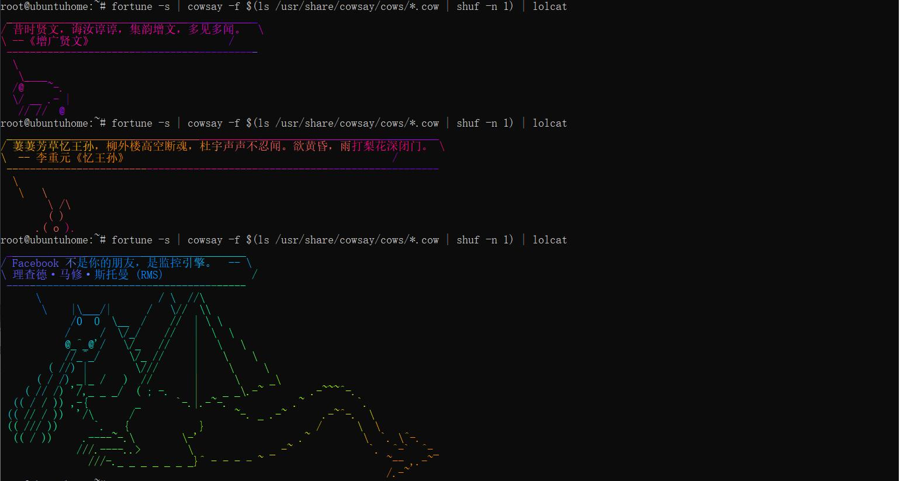

Linux下有个很好玩的控制台指令，叫做 fortune，可以随机输出一句谚语，于是就被人组合出了许多骚操作。

比较典型的用法，就是和 cowsay 结合使用。然后配合 lolcat 进行颜色输出，就可以得到酷炫的启动欢迎语。

## 安装

### fortunes-zh 安装

为什么不选择 fortune 呢？因为 fortune 输出的内容是英文，而我们需要的是中文。

fortunes-zh 是一个中文的 fortune 程序，可以随机输出一句中文谚语。且安装 fortunes-zh 的时候，会自动安装 fortune。

1.直接在命令行下执行安装命令：
```bash
sudo apt install -y fortunes-zh
```

2.在终端命令行下直接运行 `fortune-zh` 命令：
```bash
root@ubuntuhome:~# fortune-zh
细雨湿流光，芳草年年与恨长。烟锁凤楼无限事，茫茫。鸾镜鸳衾两断肠。
魂梦任悠扬，睡起杨花满绣床。薄幸不来门半掩，斜阳，负你残春泪几行。
      -- 冯延巳《南乡子》
```
### cowsay 安装

cowsay 是一个用 ASCII 字符画动物的程序，可以配合 fortune 进行输出。

cowsay 有以下参数可以携带，分别代表着动物的不同表情：
```bash
Boolean (without arguments): -b -d -g -h -l -L -n -N -p -s -t -w -y
```

还可以使用 `-f` 参数，指定目录 `/usr/share/cowsay/cows/` 下的动物名称， 默认是 `cower.cow`

1.直接在命令行下执行安装命令：
```bash
sudo apt install -y cowsay
``` 

2.在终端命令行下直接运行 `cowsay` 命令：
```bash
root@ubuntuhome:~# echo "You're Best!!!" |cowsay
echo "You're Bestfortune-zh !" |cowsay
 _________________________
< You're Bestfortune-zh ! >
 -------------------------
        \   ^__^
         \  (oo)\_______
            (__)\       )\/\
                ||----w |
                ||     ||

root@ubuntuhome:~# fortune-zh |cowsay
 ____________________________________________________________________
/ 湖海倦游客，江汉有归舟。西风千里，送我今夜岳阳楼。日落君山云气，   \
| 春到沅湘草木，远思渺难收。徒倚阑干久，缺月挂帘钩。雄三楚，吞七泽， |
| 隘九州。人间好处，何处更似此楼头？欲吊沉累无所，但有渔儿樵子，     |
| 哀此写离忧。回首叫虞舜，杜若满芳洲。  --                        |
\ 张孝祥《水调歌头-过岳阳楼作》                                 /
 --------------------------------------------------------------------
        \   ^__^
         \  (oo)\_______
            (__)\       )\/\
                ||----w |
                ||     ||
```

### lolcat 安装

lolcat 是一个用 ASCII 字符画输出彩色文本的程序。

```bash
sudo apt install -y lolcat
```

### sl 安装
sl 是一个用 ASCII 字符画输出全屏跑小火车的程序。

```bash
sudo apt install -y sl
```

## 配置

1.编辑 /etc/profile 文件，在最后添加如下内容：

```bash

...

# 自己常用的配置
fortune-zh |cowsay |lolcat -a   # -a 是动态输出

# 随机输出一句中文谚语  
# fortune -s | cowsay -f $(ls /usr/share/cowsay/cows/*.cow | shuf -n 1) | lolcat
```

2.然后执行下 `source /etc/profile` ，使配置立即生效！

效果如下图：


{% note warning simple % }
**需注意的是**：如果您安装了 zsh ，那么需要将该配置添加到 ~/.zshrc 文件中，而不是 ~/.bashrc 文件中。
