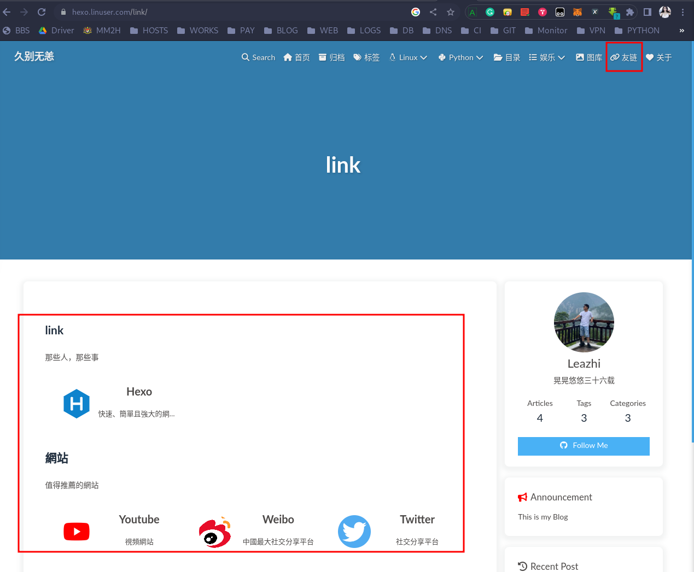

1.进入  hexo 站点根目录:
```bash
cd /data/hexo/blog/
```

2.执行命令 `hexo new page link` ,执行完成之后，会在 source/ 目录下新建一个 link 的目录并在该目录下自动创建 index.md 文件

3.编辑 source/categories/index.md 文件，在头部配置里面添加 `type: "link"` ，如下：
```bash
root@ubuntuhome:/data/hexo/blog# cat  source/link/index.md 
---
title: link
date: 2023-07-09 21:58:00
type: "link"
---
```

4.在 source 目录下新建 _data 目录：
```bash
mkdir source/_data
```

5.在创建的 _data 目录下新建 link.yml 文件，内容为：
```bash
- class_name: link
  class_desc: 那些人，那些事
  link_list:
    - name: Hexo
      link: https://hexo.io/zh-tw/
      avatar: https://d33wubrfki0l68.cloudfront.net/6657ba50e702d84afb32fe846bed54fba1a77add/827ae/logo.svg
      descr: 快速、簡單且強大的網誌框架

- class_name: 網站
  class_desc: 值得推薦的網站
  link_list:
    - name: Youtube
      link: https://www.youtube.com/
      avatar: https://i.loli.net/2020/05/14/9ZkGg8v3azHJfM1.png
      descr: 視頻網站
    - name: Weibo
      link: https://www.weibo.com/
      avatar: https://i.loli.net/2020/05/14/TLJBum386vcnI1P.png
      descr: 中國最大社交分享平台
    - name: Twitter
      link: https://twitter.com/
      avatar: https://i.loli.net/2020/05/14/5VyHPQqR6LWF39a.png
      descr: 社交分享平台
```

6.刷新下 hexo 网站，点击导航栏上的友联可以看到：



