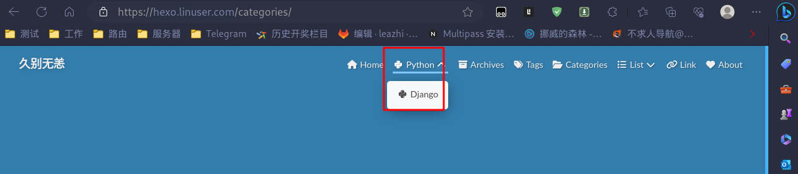

1.进入  hexo 站点根目录:
```bash
cd /data/hexo/blog/
```
2.创建导航栏一级标题 python 及二级标题 django， 目录格式如下:
```bash
python
│   ├── django
```

2.1.执行命令 `hexo new page python` (导航栏添加 python 标题), 会在当前目录下的 source 目录下新建 python 目录及在  python 目录下新建 index.md 文件：

2.2.执行命令 `hexo new page django` (将 django 导航添加到 python 下)，会在当前目录下的 source 目录下新建 django 目录及在  django 目录下新建 index.md 文件：

3.编辑主题配置文件 _config.yml,在 menu： 下面添加如下内容：
```bash
menu:
   Home: / || fas fa-home
   Python||fab fa-python:                               # 一级导航
     Django: /categories/django/ || fab fa-python       # 二级导航(前面一点要加 /categories/)
   Archives: /archives/ || fas fa-archive
   Tags: /tags/ || fas fa-tags
   Categories: /categories/ || fas fa-folder-open
   List||fas fa-list:
     Music: /music/ || fas fa-music
     Movie: /movies/ || fas fa-video
   Link: /link/ || fas fa-link
   About: /about/ || fas fa-heart
```

4.打开浏览器，输入 hexo 网址，查看效果如下图：


