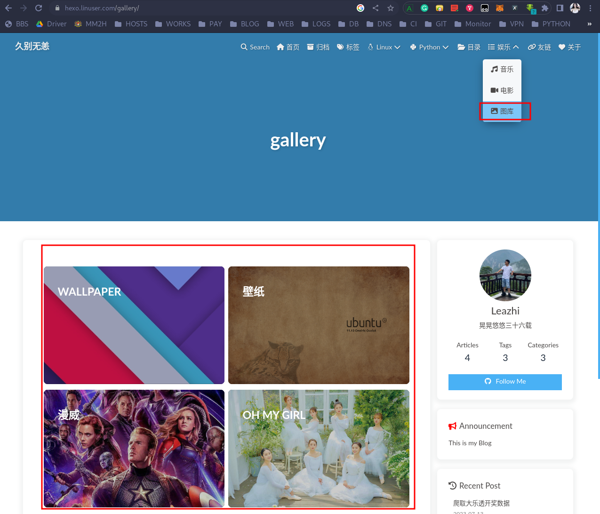


图库是多个相册的集合，相册只是图库的一个部分


## 创建图库

1.进入 hexo 工作目录（也就是博客的根目录）：
```bash
cd /data/hexo/blog
```

2.执行命令，生成图库目录及图库页面：
```bash
hexo new page gallery
```

3.编辑生成的图库页面： `vim source/gallery/index.md` ,将其修改为：
```bash
---
title: gallery
date: 2023-07-13 22:36:47
type: "gallery"                 # 主要是添加这一行
---
```

同时，在该文件中添加如下内容（外挂 gallerygroup 标签）：
```bash
<div class="gallery-group-main">
# 

# 使用本地图片作为图库的封面需要指定路径



</div>
```

- 说明： 
  - wallpaper、壁纸、漫威：图库名称
  - 收藏的一些壁纸、关于漫威的图片：图库的描述
  - /gallery/wallpaper：图库对应图片存放的子目录（相册图片存放的路径），也就是需要使用 `hexo new page wallpage` 创建的
  - 最后面是图片链接地址（可以是网络上的，也可以所本地图片<如果是用本地图片的话，那么目录要从 gallery 为根>）


4.编辑主题下的 _config.yml 文件，找到 `menu:` 关键字,将其配置成：
```bash
menu:
   首页: / || fas fa-home
   归档: /archives/ || fas fa-archive
   标签: /tags/ || fas fa-tags
   Linux||fab fa-linux:
     CentOS: /categories/centos/ || fab fa-centos
     Ubuntu: /categories/ubuntu/ || fab fa-ubuntu
   Python||fa-brands fa-python :
     Django: /categories/django/ || fa-brands fa-python
     Spiders: /categories/spider/ || fa-brands fa-python
   目录: /categories/ || fas fa-folder-open
   娱乐||fas fa-list:
     音乐: /music/ || fas fa-music
     电影: /movies/ || fas fa-video
     图库: /gallery/ || fas fa-image
   友链: /link/ || fas fa-link
   关于: /about/ || fas fa-heart
```

## 创建相册

1.执行命令 `hexo new page wallpaper` 创建图库子目录及子页面：
```bash
hexo new page wallpaper
```

2.将新生成的 wallpaper 目录移动到图库目录 gallery 中：
```bash
mv source/wallpaper source/gallery/
```

3.编辑 source/gallery/wallpaper/index.md 文件，将其修改为：
```bash
---
title: wallpaper
date: 2023-07-14 10:38:27
---

           # 由于在图库中已经定义了路径 '/gallery/wallpaper' ，所以这里只需要引入图片名称即可（不需要在跟路径）


```

说明：子页面中的头部中不用声明 `type: 'gallery'`;


4.打开 hexo 站点，根据 menu 的配置，将鼠标移动到 娱乐 导航菜单上，在下拉列表中点击图库，效果图如下：
