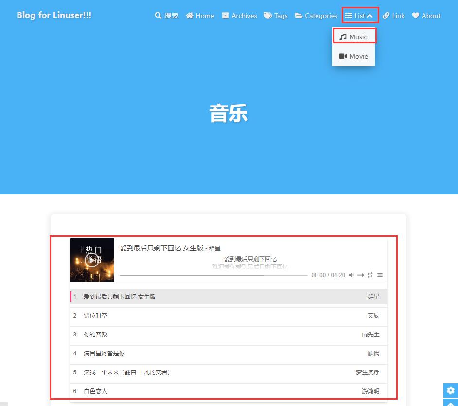
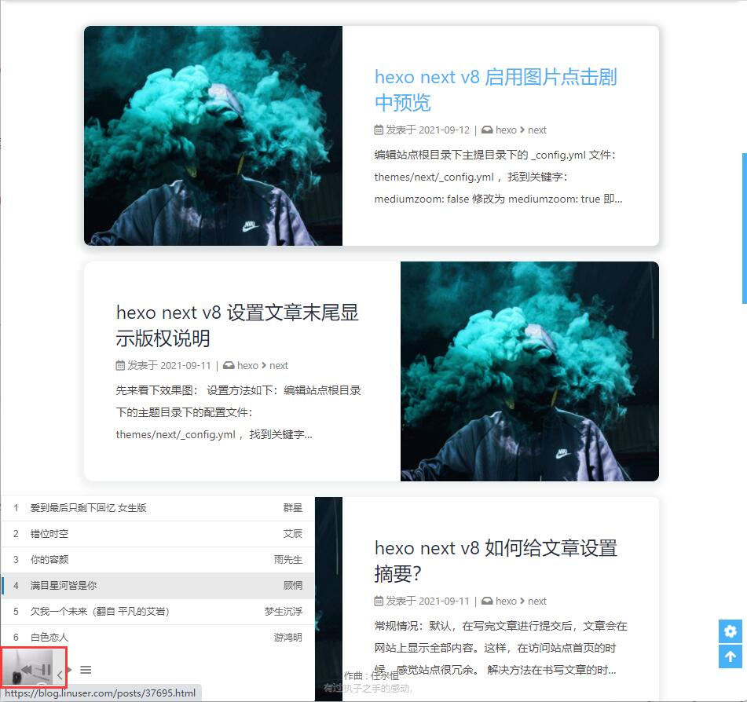

1、编辑主题目录下的 _config.yml 文件，找到关键字： menu: ，将其打开设置如下：

```
menu:
   Home: / || fas fa-home
   Archives: /archives/ || fas fa-archive
   Tags: /tags/ || fas fa-tags
   Categories: /categories/ || fas fa-folder-open
   List||fas fa-list:
     Music: /music/ || fas fa-music
     Movie: /movies/ || fas fa-video
   Link: /link/ || fas fa-link
   About: /about/ || fas fa-heart
```

保存退出！

2、在 hexo 站点根目录下安装 hexo-tag-aplayer:

```bash
[root@hexo /data/wwwroot/blog 10:48:02]#npm install --save hexo-tag-aplayer
npm WARN deprecated core-js@2.6.12: core-js@<3.3 is no longer maintained and not recommended for usage due to the number of issues. Because of the V8 engine whims, feature detection in old core-js versions could cause a slowdown up to 100x even if nothing is polyfilled. Please, upgrade your dependencies to the actual version of core-js.
npm WARN deprecated chokidar@1.7.0: Chokidar 2 will break on node v14+. Upgrade to chokidar 3 with 15x less dependencies.
npm WARN deprecated fsevents@1.2.13: fsevents 1 will break on node v14+ and could be using insecure binaries. Upgradeto fsevents 2.
npm WARN deprecated hexo-bunyan@1.0.0: Please see https://github.com/hexojs/hexo-bunyan/issues/17
npm WARN deprecated highlight.js@8.9.1: Version no longer supported. Upgrade to @latest

> core-js@2.6.12 postinstall /data/wwwroot/blog/node_modules/core-js
> node -e "try{require('./postinstall')}catch(e){}"

Thank you for using core-js ( https://github.com/zloirock/core-js ) for polyfilling JavaScript standard library!

The project needs your help! Please consider supporting of core-js on Open Collective or Patreon:
> https://opencollective.com/core-js
> https://www.patreon.com/zloirock

Also, the author of core-js ( https://github.com/zloirock ) is looking for a good job -)

npm WARN optional SKIPPING OPTIONAL DEPENDENCY: fsevents@^1.0.0 (node_modules/hexo-tag-aplayer/node_modules/chokidar/node_modules/fsevents):
npm WARN notsup SKIPPING OPTIONAL DEPENDENCY: Unsupported platform for fsevents@1.2.13: wanted {"os":"darwin","arch":"any"} (current: {"os":"linux","arch":"x64"})

+ hexo-tag-aplayer@3.0.4
added 208 packages from 351 contributors and audited 494 packages in 320.862s

20 packages are looking for funding
  run `npm fund` for details

found 3 vulnerabilities (1 low, 2 moderate)
  run `npm audit fix` to fix them, or `npm audit` for details
```

3、生成 music 页面：

```bash
[root@hexo /data/wwwroot/blog 10:59:43]#hexo new page music
INFO  Validating config
INFO 
  ===================================================================

      #####  #    # ##### ##### ###### #####  ###### #      #   #
      #    # #    #   #     #   #      #    # #      #       # #
      #####  #    #   #     #   #####  #    # #####  #        #
      #    # #    #   #     #   #      #####  #      #        #
      #    # #    #   #     #   #      #   #  #      #        #
      #####   ####    #     #   ###### #    # #      ######   #

                            3.8.3
  ===================================================================
INFO  Created: /data/wwwroot/blog/source/music/index.md
```

4、编辑生成的音乐页面文件：vim /data/wwwroot/blog/source/music/index.md ,写入如下内容

```bash
[root@hexo /data/wwwroot/blog 16:42:37]#cat  /data/wwwroot/blog/source/music/index.md
---
title: 音乐
date: 2021-09-12 11:01:17
type: music
---


```

5、编辑 hexo 站点主目录下的 _config.yml 文件，在末尾加入：

```bash
# Music
aplayer:
  asset_inject: false
  meting: true
```

保存退出！（说明：为了防止插入重复的资源，需要把asset_inject设为false）

6、编辑主题目录下的 _config.yml 文件，找到关键字：aplayerInject: ,将子属性的值都修改为 true:

```bash
aplayerInject:
  enable: true
  per_page: true
```

同时，为了切换页面音乐不中断播放，找到关键字： pjax:, 将 enable: false 修改为 enable: true:

```
pjax:
  enable: true
  exclude:
```

进阶配置：为了将播放器吸附在站点底部，还需找到关键字 inject: ，修改其配置为：

```bash
inject:
  head:
    # - '<style type="text/css">.aplayer.aplayer-fixed.aplayer-narrow .aplayer-body{left:-66px!important}.aplayer.aplayer-fixed.aplayer-narrow .aplayer-body:hover{left:0!important}</style>'
    # - <link rel="stylesheet" href="/xxx.css">
  bottom:
    # - <script src="xxxx"></script>
    - <div class="aplayer no-destroy" data-id="6808919497" data-server="netease" data-type="playlist" data-fixed="true" data-mini="true" data-listFolded="false" data-order="random" data-preload="none" data-autoplay="true" muted></div>

```

参数说明：

| option             | **default** | **description**                                              |
| ------------------ | ----------- | ------------------------------------------------------------ |
| data-id            | **require** | song id / playlist id / album id / search keyword            |
| data-server        | **require** | music platform: netease, tencent, kugou, xiami, baidu        |
| data-type          | **require** | song, playlist, album, search, artist                        |
| data-autoplay      | false       | audio autoplay                                               |
| data-theme         | #2980b9     | main color                                                   |
| data-loop          | all         | player loop play, values: ‘all’, ‘one’, ‘none’               |
| data-order         | list        | player play order, values: ‘list’, ‘random’                  |
| data-preload       | auto        | values: ‘none’, ‘metadata’, ‘auto’                           |
| data-volume        | 0.7         | default volume, notice that player will remember user setting, default volume will not work after user set volume themselves |
| data-mutex         | true        | prevent to play multiple player at the same time, pause other players when this player start play |
| data-lrctype       | 0           | 歌词来源方式，一般不更改                                     |
| data-listfolded    | false       | indicate whether list(指播放列表，不是播放器) should folded at first |
| data-listmaxheight | 340px       | list max height                                              |
| data-storagename   | metingjs    | localStorage key that store player setting                   |



示例：以我自己网易音乐列表地址：https://music.163.com/#/my/m/music/playlist?id=6808919497 ，所以上面 inject 下面子属性 bottom: 中配置的 data-id 为：6808919497 ；data-server 为：netease； data-type 为：playlist (?id=6808919497 前面的关键字)



7、最后看下效果：

7.1、点击菜单栏中的 List---Music ，进入音乐页面：

	


网站底部音乐播放：

		


写在最后的注意事项：如果你更新了你的音乐列表，那么记得在服务器上回到 hexo 站点根目录，执行下

```
hexo clean && hexo g
```


