## 配置评论

1、进入 hexo 站点根目录，安装评论组件 valine:

```bash
[root@hexo /data/wwwroot/blog 09:33:22]#npm install valine --save
npm WARN deprecated uuid@3.4.0: Please upgrade  to version 7 or higher.  Older versions may use Math.random() in certain circumstances, which is known to be problematic.  See https://v8.dev/blog/math-random for details.
npm WARN optional SKIPPING OPTIONAL DEPENDENCY: fsevents@1.2.13 (node_modules/hexo-tag-aplayer/node_modules/fsevents):
npm WARN notsup SKIPPING OPTIONAL DEPENDENCY: Unsupported platform for fsevents@1.2.13: wanted {"os":"darwin","arch":"any"} (current: {"os":"linux","arch":"x64"})

+ valine@1.4.14
added 88 packages from 135 contributors and audited 582 packages in 333.113s

24 packages are looking for funding
  run `npm fund` for details

found 3 vulnerabilities (1 low, 2 moderate)
  run `npm audit fix` to fix them, or `npm audit` for details

```


### 注册 leancloud ，获取 APP ID 和 APP key:

#### 注册 leancloud 并进行实名认证

2、获取你的

2.1、打开站点：https://console.leancloud.cn/login?from=%2Fapps，点击站点页面下的 还没有 Leanloud 账号? 点此注册：

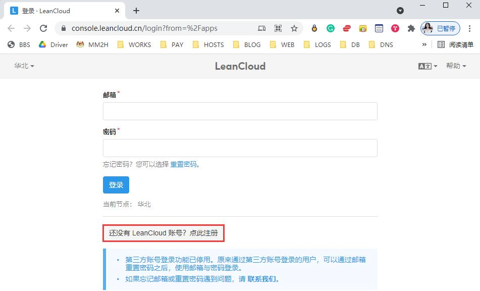	

2.2、注册页面输入注册信息：

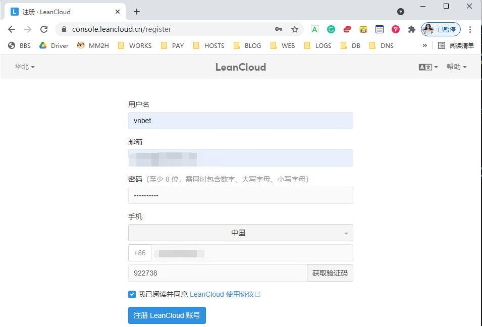	

2.3、注册完成，自动登入，点击开始认证，在弹出的列表中点击个人认证：

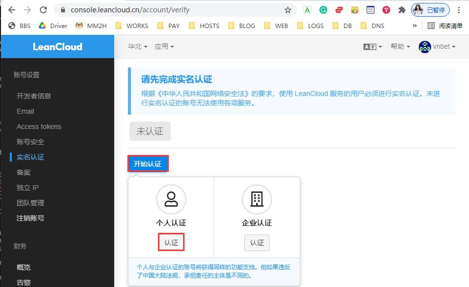	

2.4、在弹出的认证页面输入个人资料，然后使用支付宝扫码进行人脸认证，认证通过如下：

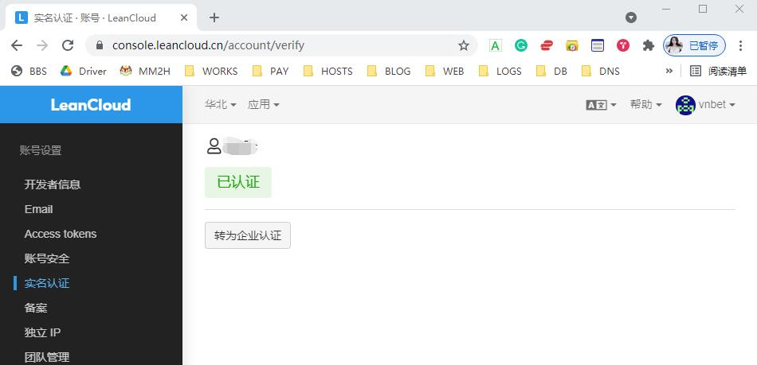	

2.5、验证邮箱：

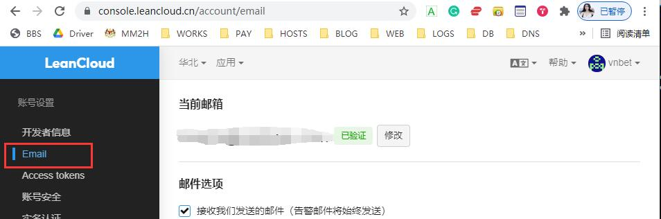	


#### 创建应用，获取 APP id 和 APP key

2.6、实名认证通过后，点击左上角的 LeanCloud 图标，进入应用管理界面：

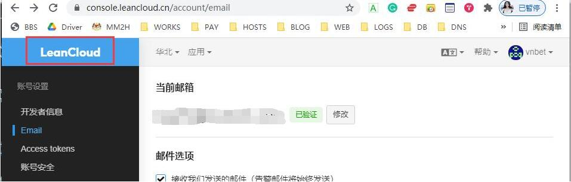	

2.7、在欢迎页面点击创建应用：

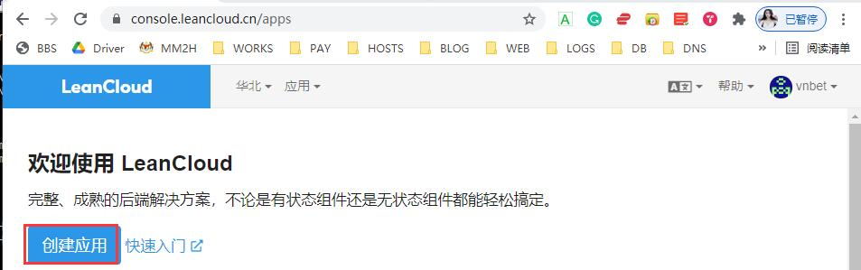	

2.8、在创建应用属性框中填入应用名称，计价方案选择开发板，然后点击创建：

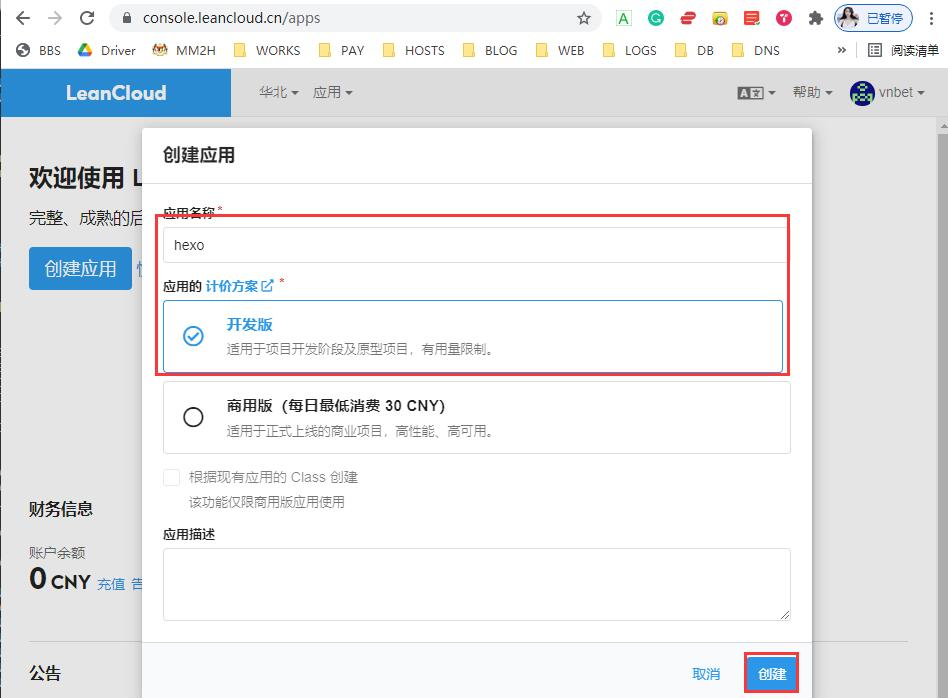	

2.9、应用创建完成后，点击设置图标

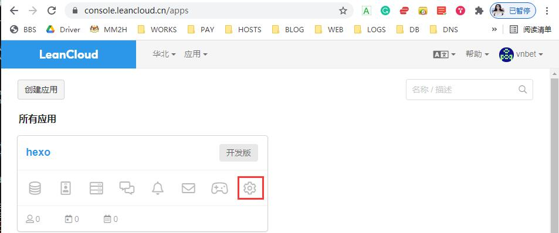	

2.10、进入设置页面后，点击左下角的应用凭证，就可以看到 APP id 和 APP Key 了：

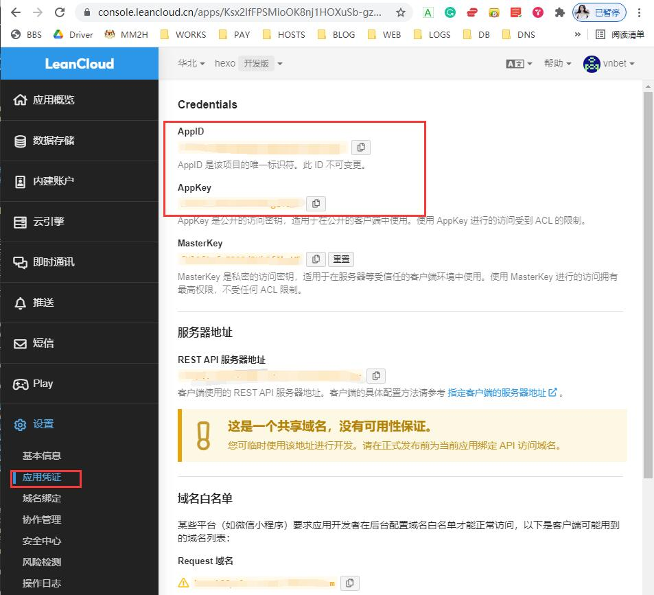	


### 配置 valine

#### 修改主题主配置文件

3、编辑主题目录下的 _config.yml 文件，找到关键 valine：，配置如下：

```bash
 valine
 https://valine.js.org
aline:
 appId: Ksx2IfFPSMioOK8nj1HOXuSb-gzGzoHsz # leancloud application app id
 appKey: ObY4tscH6SA8eD46HEgiYLOM # leancloud application app key
 pageSize: 10 # comment list page size
 avatar: monsterid # gravatar style https://valine.js.org/#/avatar
 lang: zh-CN  # i18n: zh-CN/zh-TW/en/ja
 placeholder: 请发表您的建议或意见：  # valine comment input placeholder (like: Please leave your footprints)
 guest_info: nick,mail,link # valine comment header info (nick/mail/link)
 recordIP: false # Record reviewer IP
 # 这个地址一定要配 Leancloud 提供的 REST API 服务器地址，否则有可能导致网站首页的那个评论出现：无法获取评论，请确认相关配置是否正确。
 # 解决方法参考：https://dreamhomes.top/posts/202106171704/
 serverURLs: https://ksx2iffp.lc-cn-n1-shared.com # This configuration is suitable for domestic custom domain nam users, overseas version will be automatically detected (no need to manually fill in)
 bg: # valine background
 #emojiCDN: <script src="//unpkg.com/valine@latest/dist/Valine.min.js"></script> # emoji CDN
 emojiCDN:
 enableQQ: false # enable the Nickname box to automatically get QQ Nickname and QQ Avatar
 requiredFields: nick,mail # required fields (nick/mail)
 visitor: false
 option:
```

同时，找关键字 CDN 下的 valine ，确保有配置使用 cdn（这里就可以不用在本地创建表情文件：source/_data/valine.json）

```bash
# cdnjs: https://cdnjs.cloudflare.com/ajax/libs/valine/1.4.14/Valine.min.js
# jsdelivr: https://cdn.jsdelivr.net/npm/valine@1.4.14/dist/Valine.min.js
valine: https://cdn.jsdelivr.net/npm/valine/dist/Valine.min.js
```

最后，还需要找到关键字：comments：，配置如下：

```bash
 comments:
   # Up to two comments system, the first will be shown as default
   # Choose: Disqus/Disqusjs/Livere/Gitalk/Valine/Waline/Utterances/Facebook Comments/Twikoo
   use:
    - Valine
   # - Disqus
   text: true # Display the comment name next to the button
   # lazyload: The comment system will be load when comment element enters the browser's viewport.
   # If you set it to true, the comment count will be invalid
   lazyload: false
   count: false # Display comment count in post's top_img
   card_post_count: false # Display comment count in Home Page
```

保存退出！


#### 查看效果

在浏览器中点击任意一篇文章，看底部有没有出现评论，如图：

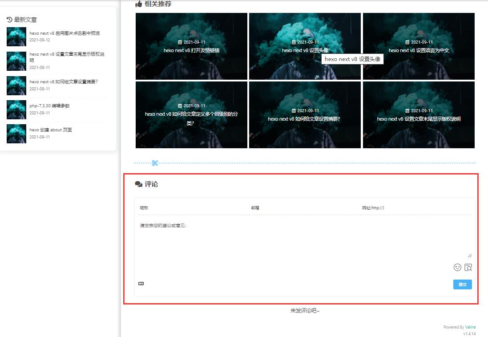

## 配置留言板

1.执行命令，生成留言板目录及 index.md 文件：
```
cd /data/hexo/blog && hexo new page messageboard
```

2.编辑 source/messageboard/index.md 文件，在标题属性中添加 type: "messageboard", 如下：
```bash
---
title: messageboard
date: 2023-07-16 17:14:55
type: "messageboard"                    # 主要所添加这一行
---
```

3.编辑主题配置文件 theme/butterfly/_config.yml,找到 menu: 关键字，在里面添加留言板页面的导航，如下：
```bash
menu:
   首页: / || fas fa-home
   运维|| fab fa-linux:
     CentOS: /categories/centos/ || fab fa-centos
     Ubuntu: /categories/ubuntu/ || fab fa-ubuntu
     Windows: /categories/windows/ || fab fa-windows
   Python3||fab fa-python:
     Python: /categories/python/ ||fab fa-python
     Django: /categories/django/ || fab fa-python
     Spider: /categories/spider/ || fab fa-python
   #Archives: /archives/ || fas fa-archive
   #Tags: /tags/ || fas fa-tags
   #Categories: /categories/ || fas fa-folder-open
   博客|| fas fa-blog:
     Hexo: /categories/hexo/ || iconfont icon-hexo
   分类|| fas fa-folder-open:
     归档: /archives/ || fas fa-archive
     标签: /tags/ || fas fa-tags
   娱乐||fas fa-list:
     图库: /gallery|| fas fa-image
     音乐: /music/ || fas fa-music
     电影: /movies/ || fas fa-video
   留言板: /messageboard/ || fas fa-comments                # 添加留言板导航
   友链: /link/ || fas fa-link
   关于: /about/ || fas fa-heart
```

4.最后，打开网页，看效果如下图：   
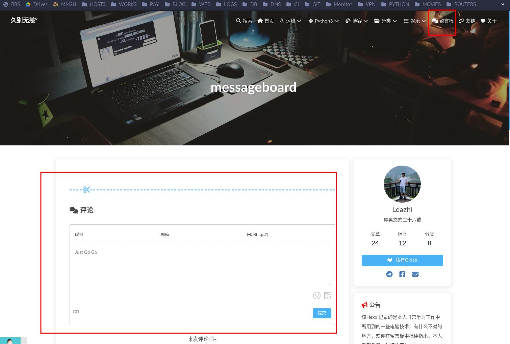