
**警告：每更新一次项目中的图标，就需要重新更新下一下在线链接，即主题配置文件中 inject 配置下 head 下的 css 代码**


## 为什么使用 iconfont 图标？

### 默认 fontawesome 图标不足

hexo butterfly 默认使用的是  [fontawesome](https://fontawesome.com/v5.15/icons) 站点提供的图标，尽管图标比较多，但是还是有些不能满足，比如作为运维人员写笔记常需要用的 Nginx 、apache 等等

### iconfont 图标多，基本满足需求

[iconfont](https://www.iconfont.cn/) 貌似是国内的图标库，图标多样化，基本能够满足我的需求


## iconfont 使用

### 注册 iconfont

1.打开 [iconfont](https://www.iconfont.cn/) 官方站点，点击注册，在弹出的注册框输入手机号进行注册：

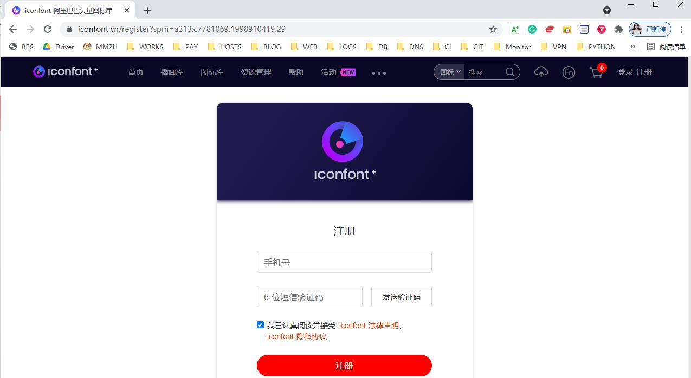

### 创建项目

1.注册好后，会自动登入 iconfont 站点。此时，我们点击菜单栏中的 资源管理---我的项目，然后点击右上角的创建图标：
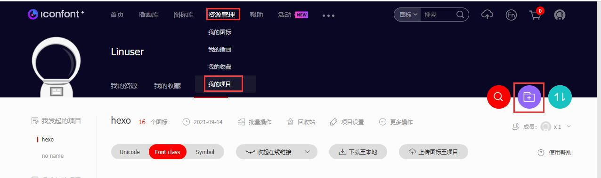

2.在弹出新建项目属性框中输入项目名称和项目描述，其它的无需改动，然后点击下面的新建：hexo 项目我已经创建过了，这里只是演示怎么创建：

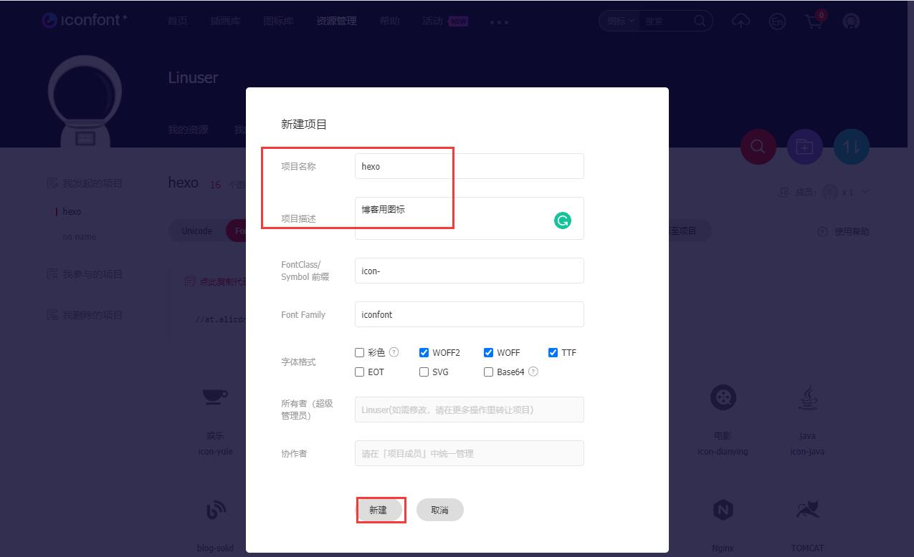

### 搜索图标，并将图标加入到创建的库中

1.在右上角的搜索栏里面输入你要使用的图标名称，比如: nginx

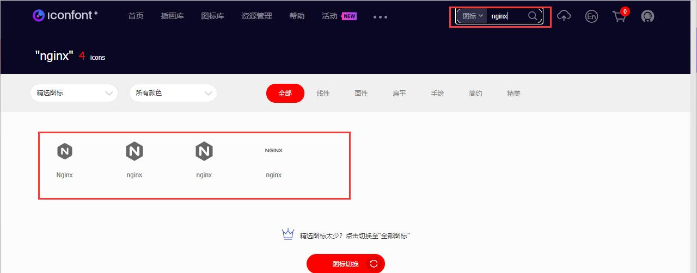

2.将鼠标移动到你想要使用的图标上，会出现：添加入库、收藏和下载三个选项，这里我们点击添加入库：

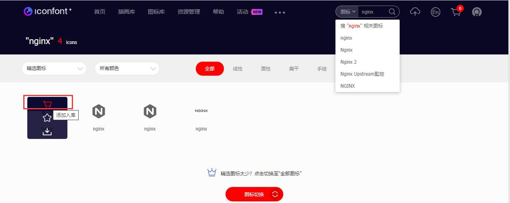

3.此时，可以在右上角的购物车图标看到数字由之前的 0 变成了 1。同时，点击该购物车图标：

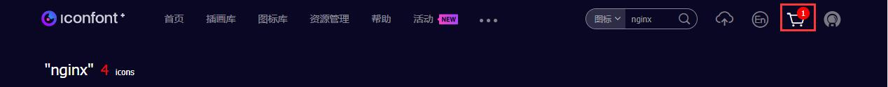

4.展开后，点击添加至项目：

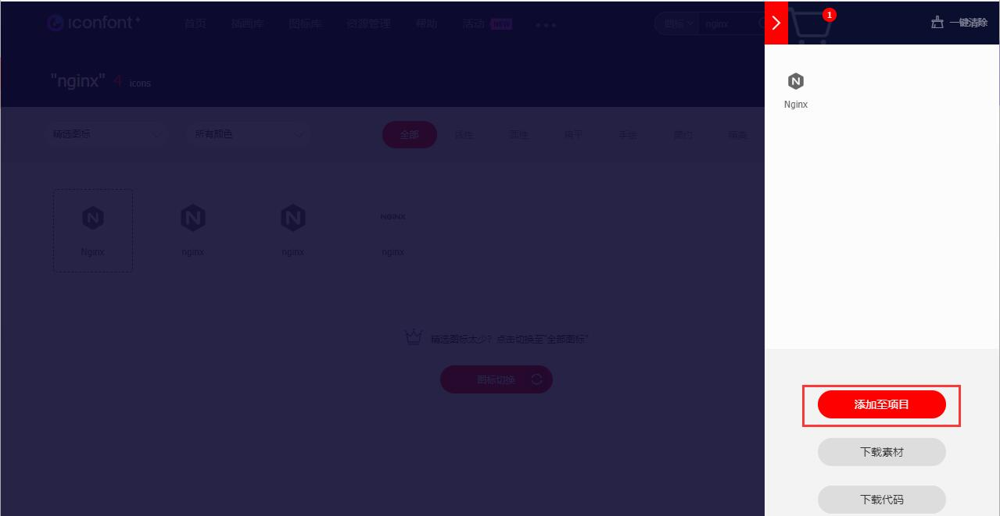

5.添加到创建的 hexo 项目中;

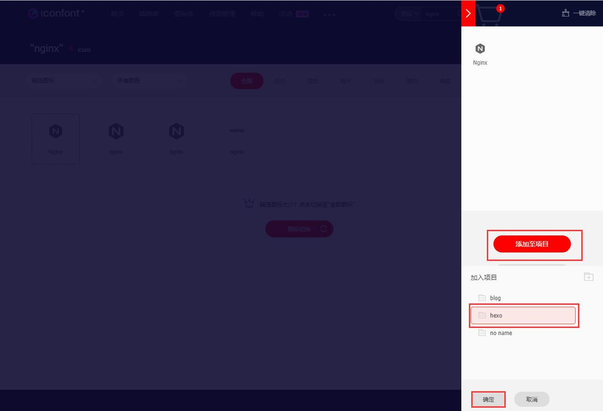

### 创建链接

1.再次点击菜单栏中的资源管理---我的项目，在我的项目页面点击左侧我发起的项目(上面创建的hexo 项目)，然后在右侧点击 Font class，接着点击右侧的 查看在线链接：

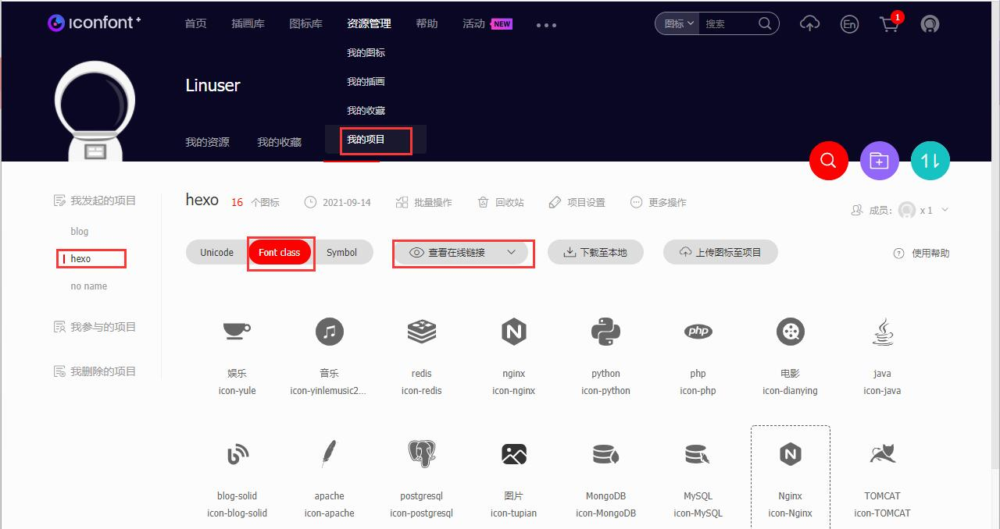

2.点击暂无代码，点此生成（我这里是点此复制代码：是因为我之前有生成过。）。生成后，点击 点此复制代码：

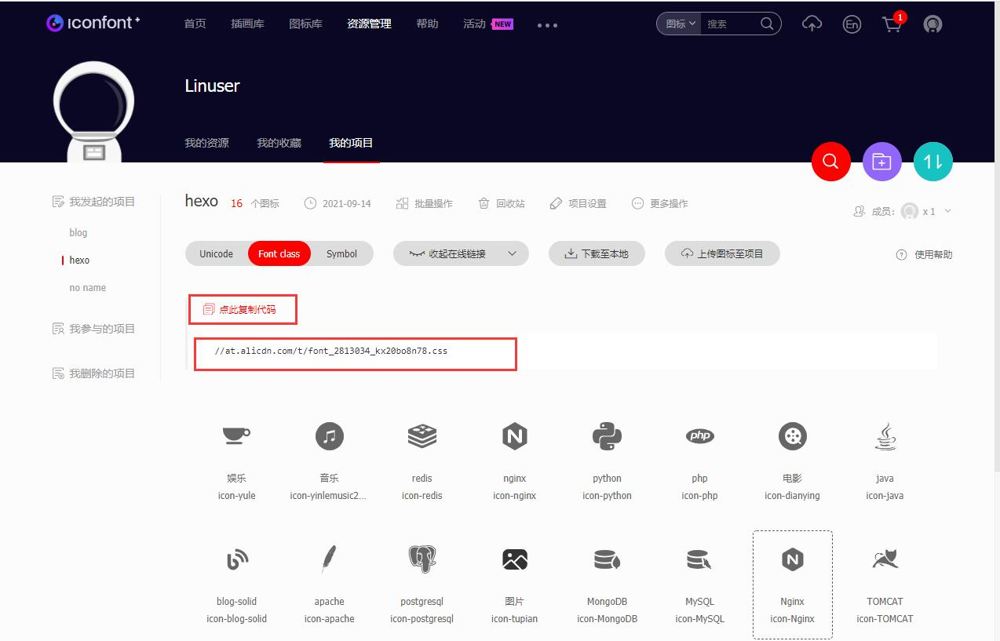

## 使用 iconfont 图标

### 生成 nginx 页面：

1.在服务器上 hexo 站点根目录执行命令：

```bash
[root@hexo /data/wwwroot/blog/source 21:30:48]#hexo new page nginx
INFO  Validating config
INFO 
  ===================================================================

      #####  #    # ##### ##### ###### #####  ###### #      #   #
      #    # #    #   #     #   #      #    # #      #       # #
      #####  #    #   #     #   #####  #    # #####  #        #
      #    # #    #   #     #   #      #####  #      #        #
      #    # #    #   #     #   #      #   #  #      #        #
      #####   ####    #     #   ###### #    # #      ######   #

                            4.9.0
  ===================================================================
INFO  Created: /data/wwwroot/blog/source/nginx/index.md
```

### 配置页面和图标

1.编辑主题目录下的 _config.yml 文件，找到关键子： menu:，配置如下：

```
menu:
   首页: / || fas fa-home
   归档: /archives/ || fas fa-archive
   标签: /tags/ || fas fa-tags
   #分类: /categories/ || fas fa-folder-open
   分类|| fas fa-folder-open:
     Blog: /categories/Blog/ || fas fa-blog
     # 注意：iconfont 为创建项目时的那个前缀； icon-nginx 为项目中 nginx 图标名称
     nginx: /categories/nginx/ || iconfont icon-nginx
     DB: /Databases/ || fas fa-database
     Java: /Java/ || fab fa-java
     Python: /Python/ || fab fa-python
     PHP: /categories/PHP/ || fab fa-php
     Html: /Html/ || fas fa-code
   娱乐||fas fa-list:
     音乐: /music/ || fas fa-music
     电影: /movies/ || fas fa-video
     图库: /Gallery/ || fas fa-images
   友链: /link/ || fas fa-link
   留言: /comments/ || fas fa-comment-dots
   关于: /about/ || fas fa-heart
```

同时，找到关键字 inject：配置如下：

```
inject:
  head:
  	# 音乐播放器的代码
    - '<style type="text/css">.aplayer.aplayer-fixed.aplayer-narrow .aplayer-body{left:-66px!important}.aplayer.aplayer-fixed.aplayer-narrow .aplayer-body:hover{left:0!important}</style>'
    # iconfont 图标使用代码
    - '<link rel="stylesheet" href="//at.alicdn.com/t/font_2813034_kx20bo8n78.css">'
     #- <link rel="stylesheet" href="/xxx.css">
  bottom:
    # - <script src="xxxx"></script>
    # 音乐播放器的代码
    - <div class="aplayer no-destroy" data-id="8161088582" data-server="tencent" data-type="playlist" data-autoplay="true" data-fixed="true" data-mini="true" data-listFolded="false" data-order="random" data-preload="none" data-autoplay="true" muted></div>
# CDN
```

保存退出！

2.在浏览器中进入站点，查看效果如下：

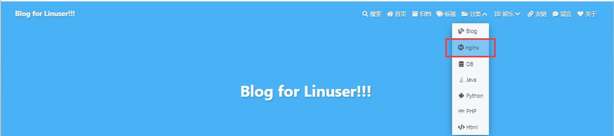