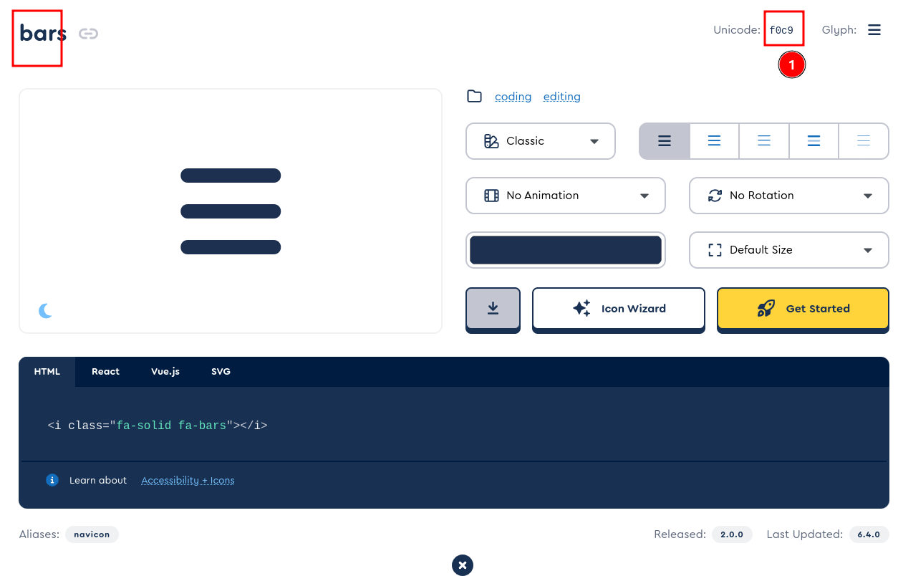
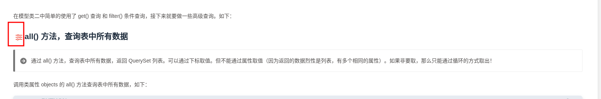

1.进入 hexo 站点根目录：
```bash
cd /data/hexo/blog
```

2.编辑主题目录下的配置文件 themes/butterfly/_config.yml ，找到关键字 `beautify: `，将其配置成：
```bash
# Beautify (美化頁面顯示)
beautify:
  enable: true
  field: post # site/post
  #title-prefix-icon: \f0c1' # '\f0c1'
  title-prefix-icon: '\f1de' # '\f0c1'
  title-prefix-icon-color: '#F47466' # '#F47466'
```

3.打开 https://fontawesome.com/icons/categories/coding 站点，找符合你自己的 ICON 图标，且不能带 PRO 字样的（因为 PRO 字样的需要收费才可以使用的），然后点击该图标,如下图：


4.复制 Unicode 代码，将其配置到主题文件中的 `title-prefix-icon: `,然后强制刷新下网页即可。如图：
