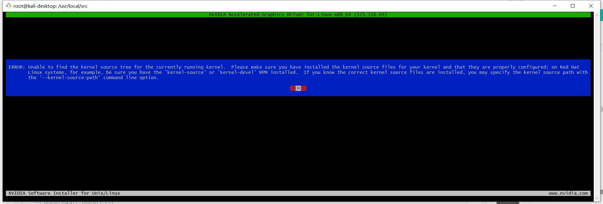

## 背景

闲来无事，发现 ping 公网任何域名，前面 11 个包都正常，一到第 12 个包就丢包，怀疑是网络问题，于是先尝试升级了系统，执行了：
```bash
sudo apt update -y && sudo apt upgrade -y
```

好，这样一升级重启进入系统后，发现显卡驱动丢了。

## 故障

按键盘上的 Ctrl + Alt + F3 ,进入命令行模式，切换到 root 用户下，进入到装系统时存放先看驱动的目录，执行命令安装显卡驱动，结果报：


### 解决方法

1.一路回车，回到命令行，先查看下当前内核版本：
```bash
┌──(root㉿kali-desktop)-[~]
└─# uname -a
Linux kali-desktop 6.5.0-kali1-amd64 #1 SMP PREEMPT_DYNAMIC Debian 6.5.3-1kali1 (2023-09-19) x86_64 GNU/Linux
```

2.接着安装以下包（注意包的版本需要和内核版本一致）：
```bash
┌──(root㉿kali-desktop)-[~]
└─# apt install -y linux-headers-6.5.0-kali1-amd64 linux-headers-6.5.0-kali1-common linux-headers-6.5.0-kali1-rt-amd64 linux-headers-6.5.0-kali1-cloud-amd64 linux-headers-6.5.0-kali1-common-rt
```

然后，重新执行显卡安装命令，结果安装失败，日志报:
```bash
/tmp/selfgz15780/NVIDIA-Linux-x86_64-530.41.03/kernel/nvidia-modeset.o: warning: objtool: _nv002999kms+0x4f: 'naked' return found in RETHUNK build 
   make[4]: Target '/tmp/selfgz15780/NVIDIA-Linux-x86_64-530.41.03/kernel/' not remade because of errors. 
   make[3]: *** [/usr/src/linux-headers-6.5.0-kali1-common/Makefile:2057: /tmp/selfgz15780/NVIDIA-Linux-x86_64-530.41.03/kernel] Error 2 
   make[3]: Target 'modules' not remade because of errors. 
   make[2]: *** [/usr/src/linux-headers-6.5.0-kali1-common/Makefile:246: __sub-make] Error 2 
   make[2]: Target 'modules' not remade because of errors. 
   make[2]: Leaving directory '/usr/src/linux-headers-6.5.0-kali1-amd64' 
   make[1]: *** [Makefile:246: __sub-make] Error 2 
   make[1]: Target 'modules' not remade because of errors. 
   make[1]: Leaving directory '/usr/src/linux-headers-6.5.0-kali1-common' 
   make: *** [Makefile:82: modules] Error 2 
-> Error.
```

## 分析
怀疑上面的报错时因为目前安装的内核版本比较新，而之前安装的显卡驱动版本比较旧，进而导致内核模块编译失败；

## 解决方法

1.进入 NVIDIA官方站点，根据自己显卡型号，下载 下载类型为生产分支的最新版本的驱动程序到服务器，然后赋予可执行权限，执行安装命令。
```bash
# 下载生产分支最新版本的驱动程序到服务器本地目录:
┌──(root㉿kali-desktop)-[~]
└─# wget https://cn.download.nvidia.com/XFree86/Linux-x86_64/535.113.01/NVIDIA-Linux-x86_64-535.113.01.run

# 赋予可执行权限：
┌──(root㉿kali-desktop)-[~]
└─# chmod +x NVIDIA-Linux-x86_64-535.113.01.run

# 安装驱动：
┌──(root㉿kali-desktop)-[~]
└─# ./NVIDIA-Linux-x86_64-535.113.01.run
```

果然，使用最新版本的驱动程序安装解决问题！