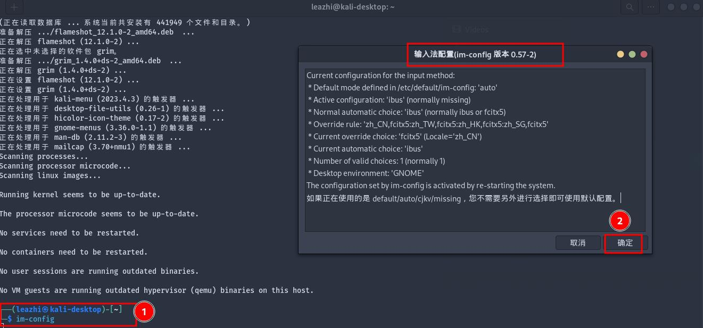
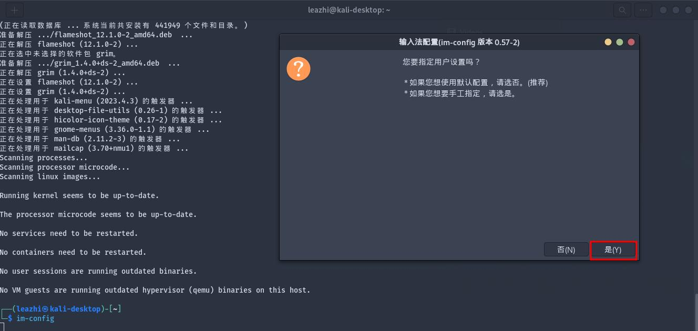
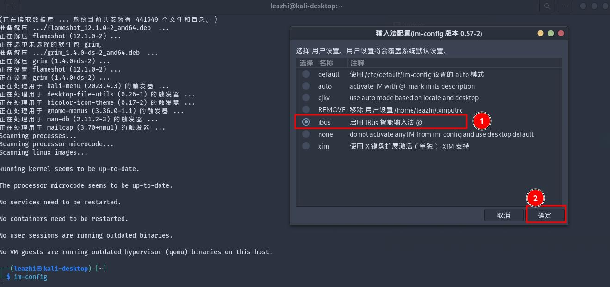

## 换源

1.先备份下默认源文件：
```bash
sudo cp /etc/apt/sources.list{,.bak}
```

2.编辑源文件，将默认的 URL 修改成国内的阿里云源或者清华源：
```bash
# 阿里云源：
┌──(leazhi㉿leazhi-kali)-[~/Downloads]
└─$ sudo cat /etc/apt/sources.list
# See https://www.kali.org/docs/general-use/kali-linux-sources-list-repositories/
#deb http://http.kali.org/kali kali-rolling main contrib non-free non-free-firmware
deb https://mirrors.aliyun.com/kali kali-rolling main contrib non-free non-free-firmware
deb-src https://mirrors.aliyun.com/kali kali-rolling main contrib non-free non-free-firmware


# 清华源
┌──(leazhi㉿leazhi-kali)-[~/Downloads]
└─$ sudo cat /etc/apt/sources.list
# See https://www.kali.org/docs/general-use/kali-linux-sources-list-repositories/
#deb http://http.kali.org/kali kali-rolling main contrib non-free non-free-firmware
deb https://mirrors.tuna.tsinghua.edu.cn/kali kali-rolling main contrib non-free non-free-firmware
```

3.配置完成后，执行 `sudo apt update` 命令更新下缓存
```bash
┌──(leazhi㉿leazhi-kali)-[~/Downloads]
└─$ sudo apt update -y  
```

<hr class="custom-hr"> </hr>

## 汉化

1.执行命令：
```bash
sudo dpkg-reconfigure locales
```

2.然后在 locales 设定界面选中：zh_CN.UTF-8。

## 安装 ibus 输入法：

<hr class="custom-hr"> </hr>

1.打开命令行终端，输入：
```bash
sudo apt install -y ibus ibus-pinyin ibus-table ibus-gtk3
```

2.安装完成后，重启系统。

3.系统重启完成。登录系统，打开 命令行工具，执行 im-config 命令，打开输入法配置窗口，将其配置成 ibus 输入源。






4.打开设置，选择 键盘，选择 输入源，选择 添加，选择 ibus，选择 确定。具体如下图：


<hr class="custom-hr"> </hr>

## 安装  rsyslog 
默认，kali linux 2023.1 没有写系统日志，也找不到系统日志文件。所以为了便于日常排错，需要我们手动安装 rsyslog:
```bash
sudo apt install -y rsyslog 
```

安装完成后，启动 rsyslog.service 服务：
```bash
sudo systemctl enable --now rsyslog.service
```

<hr class="custom-hr"> </hr>

## 设置默认编辑器

1.直接在命令行执行：
```bash
──(leazhi㉿leazhi-kali)-[~/Downloads]
└─$ sudo update-alternatives --config editor 
There are 4 choices for the alternative editor (providing /usr/bin/editor).

  Selection    Path                Priority   Status
------------------------------------------------------------
* 0            /bin/nano            40        auto mode
  1            /bin/nano            40        manual mode
  2            /usr/bin/code        0         manual mode
  3            /usr/bin/vim.basic   30        manual mode
  4            /usr/bin/vim.tiny    15        manual mode

Press <enter> to keep the current choice[*], or type selection number: 3         
update-alternatives: using /usr/bin/vim.basic to provide /usr/bin/editor (editor) in manual mode
```

<hr class="custom-hr"> </hr>

## 时区设置

设置时区命令：
```bash
┌──(leazhi㉿leazhi-kali)-[~/Downloads]
└─$ sudo dpkg-reconfigure tzdata  
[sudo] password for leazhi: 

Current default time zone: 'Asia/Singapore'
Local time is now:      Tue May  2 08:07:54 +08 2023.
Universal Time is now:  Tue May  2 00:07:54 UTC 2023.
```

<hr class="custom-hr"> </hr>

## 安装打印机

Kali 默认没有安装打印机服务，所以在配置之前，需要我们手动安装好打印服务：

1.安装打印服务：
```bash
sudo apt install -y cups cups-client foomatic-db  
```

服务安装完成后。由于我的打印机是 DocuPrint-M118-W（富士施乐 M118-W）的网络打印机。所以，我们就直接通过局域网进行配置，具体如下：

2.打开系统设置---找到左侧 Printers ，然后点击右上角的 Add Printer 安装，输入密码。然后在打开的 Add Printer 页面下面的搜索栏中输入打印机 IP ，接着选择 LPD-Printer, 如下图：


3.接着在弹出的 Select Printer Driver 界面的左侧菜单栏中找到并点击 Brother,对应的在右侧找到 Brother DCP-1510 serues, using briaser v6,最后点击右下角的 Select,如图：


4.至此，打印机就添加好了，如图：


<hr class="custom-hr"> </hr>

##  安装显卡驱动

1.查看显卡型号：
```bash
┌──(leazhi㉿kali-leazhi)-[~]
└─$ lspci | grep -i nvidia
02:00.0 VGA compatible controller: NVIDIA Corporation GP107 [GeForce GTX 1050 Ti] (rev a1)
02:00.1 Audio device: NVIDIA Corporation GP107GL High Definition Audio Controller (rev a1)
```

2.禁用 nouveau:
```bash
┌──(leazhi㉿kali-leazhi)-[~]
└─$ cat /etc/modprobe.d/blacklist.conf     
blacklist nouveau
options nouveau modeset=0
```

3.安装必要的 rnel header 组件:
```bash
# 查看内核版本：
┌──(leazhi㉿kali-leazhi)-[~]
└─$ uname -a
Linux kali-leazhi 6.1.0-kali7-amd64 #1 SMP PREEMPT_DYNAMIC Debian 6.1.20-2kali1 (2023-04-18) x86_64 GNU/Linux

# 安装内核头部信息：
──(leazhi㉿kali-leazhi)-[~]
└─$ sudo apt install -y linux-headers-6.1.0-kali7-common linux-headers-6.1.0-kali7-amd64 linux-headers-6.1.0-kali7-rt-amd64 
```

4.从 [NVIDIA 官方网站](firefox https://www.nvidia.com/Download/index.aspx)下载对应平台显卡驱动到 /usr/local/src/ 目录下：
```bash
Product Type: GeForce
Product Series: GeForce 10 Series
Product: GeForce GTX 1050 Ti
```

5.切换到命令行界面。在登录界面，按下 Ctrl+Alt+F3 进入命令行界面;

6.以普通用户登录到命令行界面，然后切换到 root 用户下，修改 root 用户密码; 接着执行 `init 3` 命令，此时会退出登录！

7.重新以 root 身份登录到系统，赋予下载的显卡驱动文件可执行权限：
```bash
chmod +x /usr/local/src/NVIDIA-Linux-x86_64-525.105.17.run
```

8.进入到显卡驱动文件所在目录，执行命令安装显卡驱动（如果这一步安装失败，提示 nouveau 在使用，则重启下系统，然后切换到命令行模式，重新以 root 身份登录系统，再次安装显卡驱动即可！）：
```bash
┌──(leazhi㉿kali-leazhi)-[/usr/local/src]
└─$ ./NVIDIA-Linux-x86_64-525.105.17.run 
```

9.安装完成，重启系统。执行：
```bash
┌──(leazhi㉿kali-leazhi)-[/usr/local/src]
└─$ nvidia-smi 
Thu Apr 20 13:10:54 2023       
+-----------------------------------------------------------------------------+
| NVIDIA-SMI 525.105.17   Driver Version: 525.105.17   CUDA Version: 12.0     |
|-------------------------------+----------------------+----------------------+
| GPU  Name        Persistence-M| Bus-Id        Disp.A | Volatile Uncorr. ECC |
| Fan  Temp  Perf  Pwr:Usage/Cap|         Memory-Usage | GPU-Util  Compute M. |
|                               |                      |               MIG M. |
|===============================+======================+======================|
|   0  NVIDIA GeForce ...  Off  | 00000000:02:00.0  On |                  N/A |
| 30%   50C    P0    N/A /  80W |     71MiB /  4096MiB |     17%      Default |
|                               |                      |                  N/A |
+-------------------------------+----------------------+----------------------+
                                                                               
+-----------------------------------------------------------------------------+
| Processes:                                                                  |
|  GPU   GI   CI        PID   Type   Process name                  GPU Memory |
|        ID   ID                                                   Usage      |
|=============================================================================|
|    0   N/A  N/A       836      G   /usr/lib/xorg/Xorg                 69MiB |
+-----------------------------------------------------------------------------+
```
