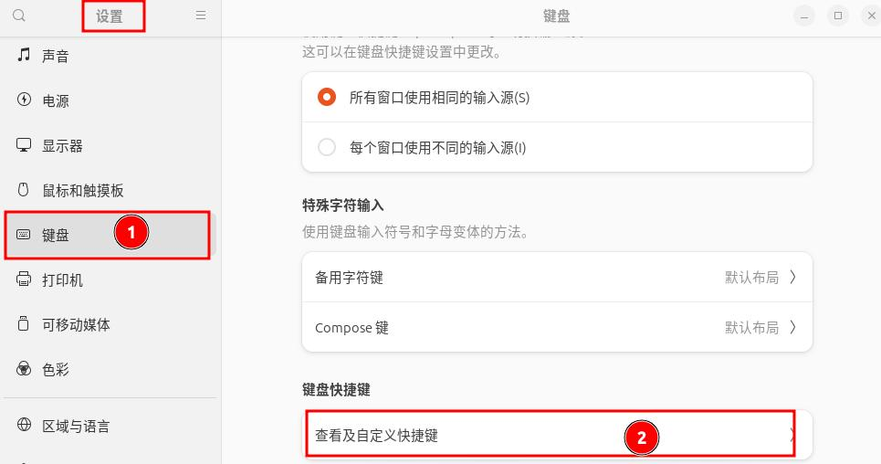
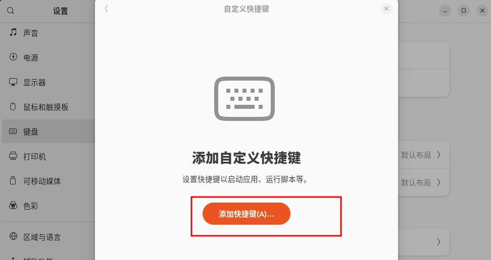
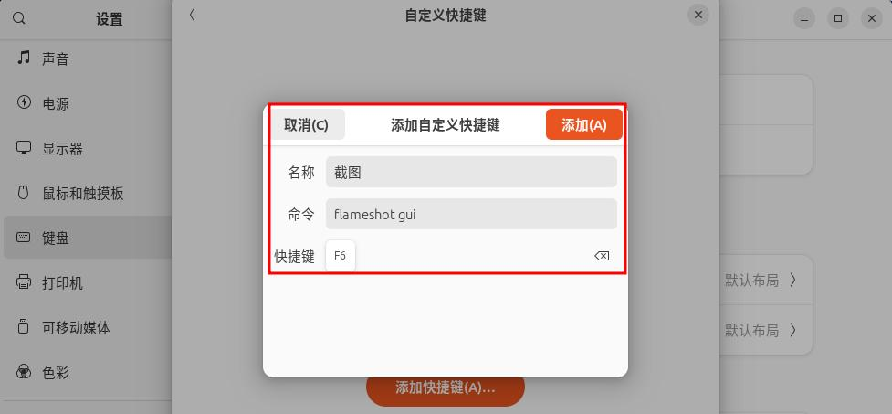

## 更换源

1.备份默认的源文件：
```bash
sudo cp /etc/apt/source.list /etc/apt/sources.list.bak
```

2.替换源地址：
```bash
sudo sed -i 's@@http://hk.archive.ubuntu.com@https://mirrors.tuna.tsinghua.edu.cn@g' /etc/apt/source.list 
```

3.重新生成源缓存数据
```bash
sudo apt update -y
```

## 必要的软件包安装

### 常用系统维护使用类
```bash
sudo apt install -y git gcc make wget curl unzip vim sysstat net-tools
```

### 安装截图工具 flameshot

#### 安装

执行下面的命令安装 flameshot:
```bash
sudo apt install -y flameshot
```

#### 配置

1.打开系统设置，在左侧设置菜单栏中找到 `键盘` ，然后将右侧的键盘属性窗口下拉到最下面，点击 `键盘快捷键` 下面的 `查看及自定义快捷键`，如图：


2.在弹出的 `键盘快捷键` 窗口将下拉条拉到最下面，点击 `自定义快捷键`:


3.在弹出的 `自定义快捷键` 窗口，点击 下面的 `添加快捷键` 按钮，如图：


4.然后在新弹出的 `添加自定义快捷键` 窗口设置 flameshot 截图快捷键，如下：


最后，点击上图中的 `添加` 即可！后期就可以使用 `F6` 快捷键进行截图了

### 视频播放工具 vlc
```bash
sudo apt install -y vlc
```

### 视频编辑及录制工具 OBS Studio
```bash
sudo apt install -y obs-studio 
```

### 安装下载工具 Motrix
系统自带的 BT 下载工具 transmission 经过测试，基本上是个摆设。

打开 [Motrix 官方站点](https://motrix.app/download) ，根据自己的平台下载对应的包到本地进行安装。安装完成后，就可以使用 motrix 进行下载了！

## 必要的系统设置

### 设置 bash 为默认的 shell
```bash
sudo dpkg-reconfigure dash 
```

### 设置 vim 为默认的编辑器

执行命令 `sudo update-alternatives --config editor` 设置：
```bash
leazhi@ubuntu2310:~$ sudo update-alternatives --config editor 
有 5 个候选项可用于替换 editor (提供 /usr/bin/editor)。

  选择       路径              优先级  状态
------------------------------------------------------------
* 0            /bin/nano            40        自动模式
  1            /bin/ed             -100       手动模式
  2            /bin/nano            40        手动模式
  3            /usr/bin/code        0         手动模式
  4            /usr/bin/vim.basic   30        手动模式
  5            /usr/bin/vim.tiny    15        手动模式

要维持当前值[*]请按<回车键>，或者键入选择的编号：4
update-alternatives: 使用 /usr/bin/vim.basic 来在手动模式中提供 /usr/bin/editor (editor)
```

### 设置系统语言为中文
```bash
sudo dpkg-reconfigure locales 
```

### 设置 Shanghai 为默认时区
```bash
sudo dpkg-reconfigure tzdata  
```

## 安装打印机 

- 打印机厂商：富士施乐；
- 型号：DocuPrint-M118-w

驱动型号使用：Brother-DCP-1510

## 安装 Nvidia 显卡驱动

1.执行命令 lspci` 查看显卡驱动：
```bash
leazhi@ubuntu2310:~$ lspci |egrep -i vga
00:02.0 VGA compatible controller: Intel Corporation CometLake-S GT2 [UHD Graphics 630] (rev 05)
02:00.0 VGA compatible controller: NVIDIA Corporation GP107 [GeForce GTX 1050 Ti] (rev a1)
```

2.编辑 `/etc/modprobe.d/blacklist.conf` 文件,在该文件的最后添加下面 2 行内容。禁用 nouveau：
```bash
blacklist nouveau
options nouveau modeset=0
```

3.从 [NVIDIA 官方网站](firefox https://www.nvidia.com/Download/index.aspx)下载对应平台显卡驱动到 /usr/local/src/ 目录下：

4.切换到命令行界面。在登录界面，按下 Ctrl+Alt+F3 进入命令行界面;

5.以普通用户登录到命令行界面，然后切换到 root 用户下，修改 root 用户密码; 接着执行 init 3 命令，此时会退出登录！

6.重新以 root 身份登录到系统，赋予下载的显卡驱动文件可执行权限：

```bash
chmod +x /usr/local/src/NVIDIA-Linux-x86_64-525.105.17.run
```

7.进入到显卡驱动文件所在目录，执行命令安装显卡驱动（如果这一步安装失败，提示 nouveau 在使用，则重启下系统，然后切换到命令行模式，重新以 root 身份登录系统，再次安装显卡驱动即可！）：
```bash
leazhi@ubuntu2310:/usr/local/src$ ./NVIDIA-Linux-x86_64-525.105.17.run 
```

8.安装完成，重启系统。执行：
```bash
┌──(leazhi㉿kali-leazhi)-[/usr/local/src]
└─$ nvidia-smi 
Thu Apr 20 13:10:54 2023       
+-----------------------------------------------------------------------------+
| NVIDIA-SMI 525.105.17   Driver Version: 525.105.17   CUDA Version: 12.0     |
|-------------------------------+----------------------+----------------------+
| GPU  Name        Persistence-M| Bus-Id        Disp.A | Volatile Uncorr. ECC |
| Fan  Temp  Perf  Pwr:Usage/Cap|         Memory-Usage | GPU-Util  Compute M. |
|                               |                      |               MIG M. |
|===============================+======================+======================|
|   0  NVIDIA GeForce ...  Off  | 00000000:02:00.0  On |                  N/A |
| 30%   50C    P0    N/A /  80W |     71MiB /  4096MiB |     17%      Default |
|                               |                      |                  N/A |
+-------------------------------+----------------------+----------------------+
                                                                               
+-----------------------------------------------------------------------------+
| Processes:                                                                  |
|  GPU   GI   CI        PID   Type   Process name                  GPU Memory |
|        ID   ID                                                   Usage      |
|=============================================================================|
|    0   N/A  N/A       836      G   /usr/lib/xorg/Xorg                 69MiB |
+-----------------------------------------------------------------------------+
```
