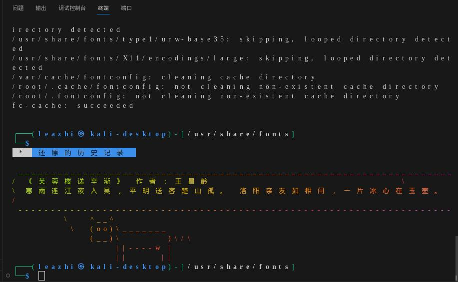
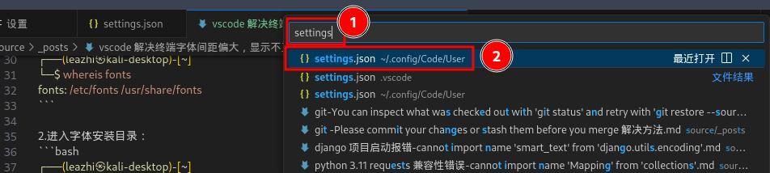
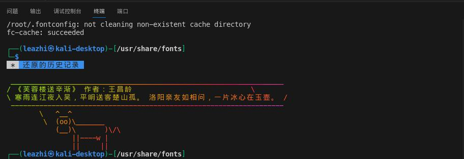

## 系统环境
- os: kali linux 2023.05
- Kernal: 6.4.0-kali3-amd64 #1 SMP PREEMPT_DYNAMIC Debian 6.4.11-1kali1 (2023-08-21) x86_64 GNU/Linux
- vscode: 1.82.2

## 问题描述

最近不知道作了什么配置，导致 vscode 终端字体显示不正常，如下图：


## 解决方案

1.打开系统终端命令行，查找系统字体安装所在目录：
```bash
┌──(leazhi㉿kali-desktop)-[~]
└─$ whereis fonts
fonts: /etc/fonts /usr/share/fonts
```

2.进入字体安装目录：
```bash
┌──(leazhi㉿kali-desktop)-[~]
└─$ cd /usr/share/fonts
```

3.克隆 `Menlo for Powerline` 字体到当前目录下：
```bash
┌──(leazhi㉿kali-desktop)-[/usr/share/fonts]
└─$ sudo git clone https://github.com/abertsch/Menlo-for-Powerline.git
```

4.执行下面的命令，刷新下字体：
```bash
┌──(leazhi㉿kali-desktop)-[/usr/share/fonts]
└─$ sudo fc-cache -f -v
```

5.按键盘上的 ctrl + p 建，在弹出的对话框中输入 settings.json , 选择带有 User 的 settings.json 文件，如下如图：


6.在打开的 settings.json 文件中，将 `terminal.integrated.fontFamily` 字体配置成刚装的 `Menlo for Powerline`：
```bash
{
    "editor.fontFamily": "Cantarell",
    // "terminal.integrated.fontFamily": "monospace",
    "terminal.integrated.fontFamily": "Menlo for Powerline",
    "terminal.integrated.fontWeightBold": "bold",
}
```

7.关闭 vscode ，重新打开即可！如下图：


## 参考：

- 1.[linux vscode设置终端字体(要求等宽字体)](https://blog.csdn.net/weixin_47021806/article/details/115746980)