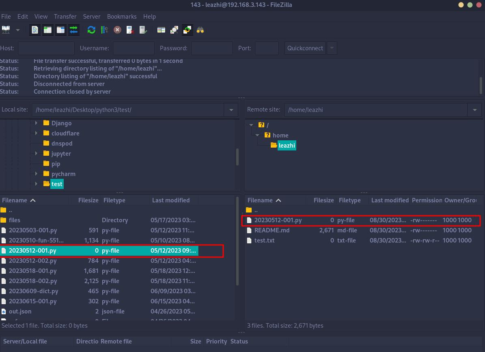

## 修改配置

系统用户模式是指能登录到系统的非 root 用户，且用户有自己的家目录，可以对家目录进行读写操作。

1.编辑 vsftpd 的主配置文件vsftpd.conf，将其修改成;
```bash
# /etc/vsftpd.conf

# 监听 IPV6
listen_ipv6=YES

# 禁用匿名用户
anonymous_enable=NO

# 启用系统用户
local_enable=YES

# 启用写
write_enable=YES
dirmessage_enable=YES

# 使用本地时间
use_localtime=YES
xferlog_enable=YES
connect_from_port_20=YES
xferlog_file=/var/log/vsftpd.log
xferlog_std_format=YES
secure_chroot_dir=/var/run/vsftpd/empty
pam_service_name=vsftpd
rsa_cert_file=/etc/ssl/certs/ssl-cert-snakeoil.pem
rsa_private_key_file=/etc/ssl/private/ssl-cert-snakeoil.key
ssl_enable=NO
```

2.重启 vsftpd 服务：
```bash
systemctl restart vsftpd
```

## 测试;

### 命令行下测试：

1.先在服务器任意非 root 用户家（这里以普通用户 leazhi 为例）目录下创建一个测试文件 test.txt

2.在其他机器上打开命令行终端，执行 ftp IP 命令，尝试连接到服务器，输入用户名和密码，连接成功后，在服务器上创建的文件 test.txt 就可以被下载到本地了。但是，上传文件就是 553 不成功。
```bash
┌──(leazhi㉿localhost)-[~]
└─$ ftp 192.168.3.143
Connected to 192.168.3.143.
220 (vsFTPd 3.0.5)
Name (192.168.3.143:leazhi): leazhi
331 Please specify the password.
Password: 
230 Login successful.                                   # 登录成功
Remote system type is UNIX.
Using binary mode to transfer files.
ftp> pwd
Remote directory: /home/leazhi                          # 根目录
ftp> put /etc/passwd                                    # 上传文件
local: /etc/passwd remote: /etc/passwd
229 Entering Extended Passive Mode (|||22278|)
553 Could not create file.                              # 上传失败                 
ftp> ls                                                 # 查看文件
229 Entering Extended Passive Mode (|||54675|)
150 Here comes the directory listing.
-rw-rw-r--    1 1000     1000            0 Aug 30 08:49 test.txt
226 Directory send OK.
ftp> get test.txt                                       # 下载文件成功
local: test.txt remote: test.txt
229 Entering Extended Passive Mode (|||39731|)
150 Opening BINARY mode data connection for test.txt (0 bytes).
     0        0.00 KiB/s 
226 Transfer complete.
```


### FileZilla 测试

测试如图：
