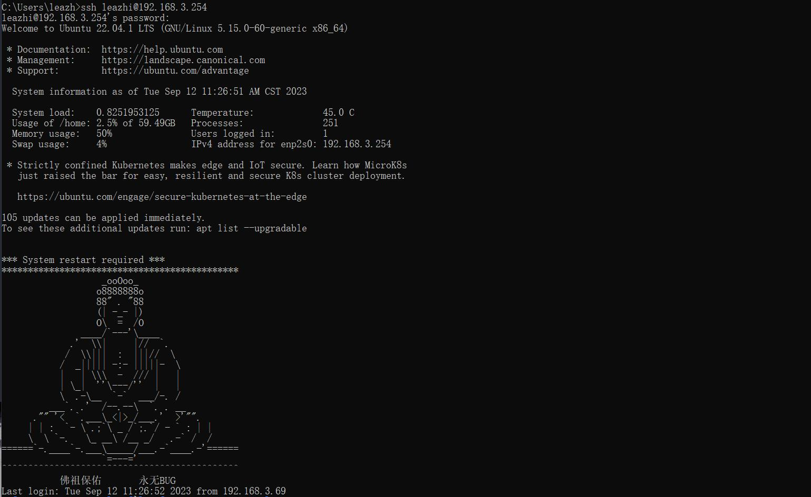

先来看下效果图：


1.在 /etc/ 目录下新建一个名为 motd 的文件，且在该文件中添加如下代码：
```code
*********************************************
                   _ooOoo_
                  o8888888o
                  88" . "88
                  (| -_- |)
                  O\  =  /O
               ____/`---'\____
             .'  \\|     |//  `.
            /  \\|||  :  |||//  \
           /  _||||| -:- |||||-  \
           |   | \\\  -  /// |   |
           | \_|  ''\---/''  |   |
           \  .-\__  `-`  ___/-. /
         ___`. .'  /--.--\  `. . __
      ."" '<  `.___\_<|>_/___.'  >'"".
     | | :  `- \`.;`\ _ /`;.`/ - ` : | |
     \  \ `-.   \_ __\ /__ _/   .-` /  /
======`-.____`-.___\_____/___.-`____.-'======
                   `=---='
^^^^^^^^^^^^^^^^^^^^^^^^^^^^^^^^^^^^^^^^^^^^^
           佛祖保佑       永不宕机
```

2.推出终端，重新登录即可！

**更多效果图可以参考**：[还敢宕机，佛祖教你做人（11副图+内附源码+效果展示）](https://blog.csdn.net/weixin_53488443/article/details/120421390)