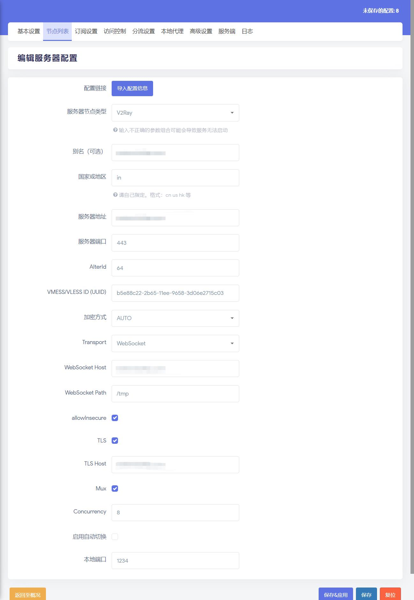

## v2ray 部署

### 安装

1.从 [github 站点](https://github.com/v2ray/v2ray-core/releases) 下载最新版本的 v2ray 压缩包文件到 /usr/local/src/ 目录：


2.将其解压到下载目录：
```bash
unzip /usr/local/src/v2ray-linux-64.zip -d /usr/local/src/v2ray
```

3.将解压目录移动到 /usr/local/ 目录下
```bash
cp -r /usr/local/src/v2ray /usr/local/
```

4.将 /usr/local/v2ray/ 目录下的可执行文件复制到 /usr/sbin/ 目录下：
```bash
cp /usr/local/v2ray/{v2ctl,v2ray} /usr/sbin/
```

5.将 /usr/local/v2ray/systemd/system/ 目录下的 v2ray.service 复制到 /lib/systemd/system/ 目录下
```bash
cp /usr/local/v2ray/systemd/system/v2ray.service /lib/systemd/system/
```

6.编辑 v2ray 启动脚本文件 /lib/systemd/system/v2ray.service, 将其修改为：
```bash
[Unit]
Description=V2Ray Service
Documentation=https://www.v2fly.org/
After=network.target nss-lookup.target

[Service]
User=nobody
CapabilityBoundingSet=CAP_NET_ADMIN CAP_NET_BIND_SERVICE
AmbientCapabilities=CAP_NET_ADMIN CAP_NET_BIND_SERVICE
NoNewPrivileges=true
ExecStart=/usr/sbin/v2ray -config /usr/local/v2ray/etc/config.json
Restart=on-failure
RestartPreventExitStatus=23

[Install]
WantedBy=multi-user.target
```

### 配置 v2ray

1.在 /usr/local/v2ray 目录下新建 etc 目录：
```bash
mkdir /usr/local/v2ray/etc
```

2.复制 /usr/local/v2ray/config.json 文件到新建的 etc 目录中：
```bash
cp /usr/local/v2ray/config.json /usr/local/v2ray/etc/
```

3.编辑 /usr/local/v2ray/etc/config.json 文件，将其配置成：
```json
{
  "log": {
    "access": "/var/log/v2ray/access.log",
    "error": "/var/log/v2ray/error.log",
    "loglevel": "warning"
  },
  "inbounds": [
    {
      "port": 26609,
      "listen": "127.0.0.1",
      "protocol": "vmess",
      "settings": {
        "clients": [
          {
            "id": "b5e88c22-2b65-11ee-9658-3d06e2715c03",
            "level": 1,
            "alterId": 64
          }
        ]
      },
      "streamSettings": {
        "network": "ws",
        "wsSettings": {
          "path": "/tmp"
        }
      }
    },
    {
    "port": 22866,
    "protocol": "shadowsocks",
    "settings": {
       "method": "chacha20-ietf",
       "password": "OXeUjl6g"
     }
  }],
  "outbounds": [
    {
      "protocol": "freedom",
      "settings": {},
      "tag": "direct"
    },
    {
      "protocol": "blackhole",
      "settings": {},
      "tag": "blocked"
    }
  ],
  "routing": {
    "rules": [
      {
        "type": "field",
        "ip": [
          "0.0.0.0/8",
          "10.0.0.0/8",
          "100.64.0.0/10",
          "127.0.0.0/8",
          "169.254.0.0/16",
          "172.16.0.0/12",
          "192.0.0.0/24",
          "192.0.2.0/24",
          "192.168.0.0/16",
          "198.18.0.0/15",
          "198.51.100.0/24",
          "203.0.113.0/24",
          "::1/128",
          "fc00::/7",
          "fe80::/10"
        ],
        "outboundTag": "blocked"
      }
    ]
  }
}
```

4.根据配置文件，我们还需要在 /var/log/ 目录下新建 v2ray 日志目录及文件：
```bash
mkdir /var/log/v2ray && touch /var/log/v2ray/access.log
```

5.赋予日志文件 777 权限：
```bash
chmod 777 /var/log/v2ray
```

### 启动 v2ray

1.执行命令 systemctl daemon-reload 加载 v2ray 启动脚本：
```bash
systemctl daemon-reload
```

2.启动 v2ray 服务，并设置为开机启动：
```bash
systemctl enable --now v2ray
```

3.启动完成后，查看是否有监听到配置文件中监听的端口：
```bash
root@vultr:~# ss -lnpt|egrep v2ray
LISTEN 0      4096       127.0.0.1:26609      0.0.0.0:*    users:(("v2ray",pid=357794,fd=7))
LISTEN 0      4096               *:22866            *:*    users:(("v2ray",pid=357794,fd=8))
```

## 反向代理配置


**确保你在本机有安装好反向代理软件：nginx 或者 caddy2.**


1.在 nginx 配置目录 conf.d 目录下创建 v2ray 反向代理文件，内容如下：
```bash
server {
  listen 80;
  listen [::]:80;
  listen 443 ssl http2;
  listen [::]:443 ssl http2;

  server_name your.damo.com;

  access_log /usr/local/nginx/logs/access.log ;

  # certs sent to the client in SERVER HELLO are concatenated in ssl_certificate
  ssl_certificate /usr/local/ssl/damo.com/your.damo.com.pem;
  ssl_certificate_key /usr/local/ssl/damo.com/your.damo.com.key;

  root /tmp;                        # 这里的目录必须和 v2ray config.json 中的 path 一致
  index index.htm index.html;

  if ( $scheme = http ) {
  #if ( $ssl_protocol = "" ) {
      rewrite ^ https://$host$request_uri?;
  }

  location /tmp {                    # 这里的目录必须和 v2ray config.json 中的 path 一致
      proxy_redirect off;
      proxy_pass http://127.0.0.1:26609;    # 代理 v2ray 中的 vmess 协议的端口
      proxy_http_version 1.1;
      proxy_set_header Upgrade $http_upgrade;
      proxy_set_header Connection "upgrade";
      proxy_set_header Host $http_host;
  }
}
```

2.检测配置，
```bash
root@vultr:~# nginx -t
nginx: the configuration file /usr/local/nginx/conf/nginx.conf syntax is ok
nginx: configuration file /usr/local/nginx/conf/nginx.conf test is successful
```

3.重载 Nginx:
```bash
root@vultr:~# nginx -s reload
```

4.在 /tmp 目录下创建一个 Index.html 文件，内容为：
```html
Bad Request!
```

5.打开浏览器，访问域名测试，如果能正常访问到 Bad Request! 则说明配置正常！

## OpenWRT 客户端配置

配置如下：
