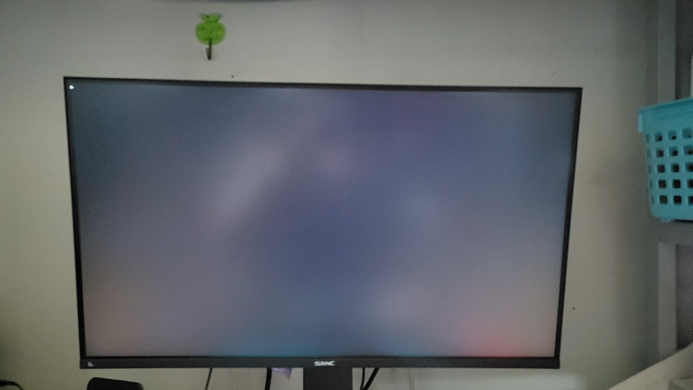
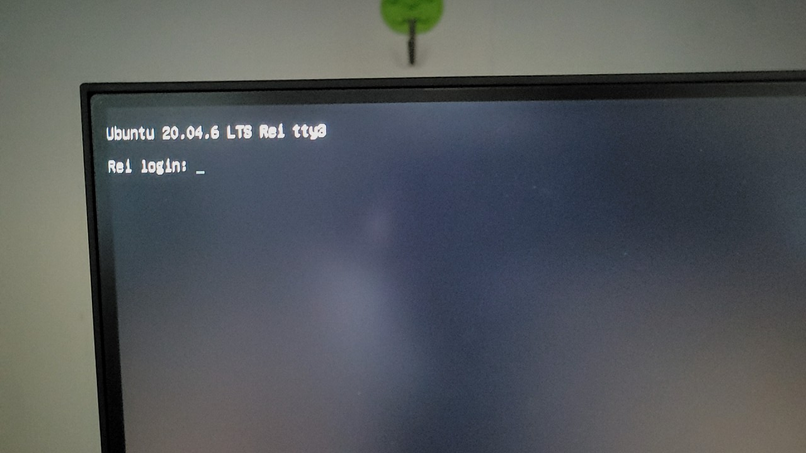
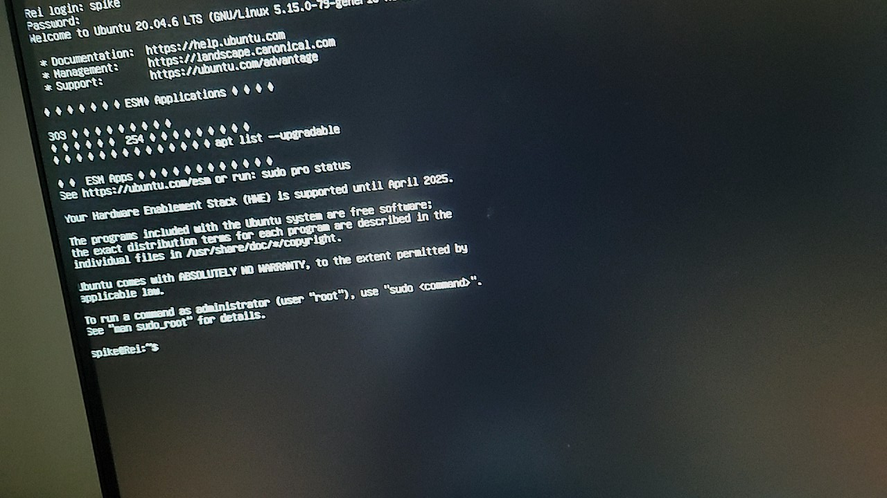

## 系统环境
- OS: Ubuntu 20.04.4 LTS
- Kernel: 5.15.0-79-generic
- 桌面环境: GNOME Shell 3.36.9
- 终端: gnome-terminal 3.36.2


## 问题描述
客户反馈，新装的 ubuntu 20.04 ,装完就无法进入系统（也就是连命令行模式都无法进入），一直停留在一个报错进面：


## 问题分析
根据问题描述中的报错信息，大致推算为显卡驱动的问题，于是开始排查。

## 解决过程

首先，可以确定的是：客户机器无法进入系统，所以无法通过 ToDesk 远程工具协助解决。只能通过我这边提供解决思路和命令以及客户手机拍照截图协助解决。

其次，通过报错的关键字 `i2c timeout error` 可以从 google 上获取大致的解决方法，具体如下：

### 进入救援模式

Ubuntu 20.04 进入救援模式的方式：https://digitalixy.com/linux/611713.html

1.引导客户进入救援模式后，敲下键盘上的回车键，然后执行挂在命令:
```bash
mount -n -o remount,rw /
```

### 禁用显卡驱动

1.执行了上面的挂在命令后，接着执行：
```bash
echo "blacklist i2c_nvidia_gpu" >> /etc/modprobe.d/blacklist_i2c-nvidia-gpu.conf
# echo "blacklist nouveau" >> /etc/modprobe.d/blacklist-nouveau.conf
# echo "options nouveau modeset=0" >> /etc/modprobe.d/blacklist-nouveau.conf
# echo "blacklist vga16fb" >> /etc/modprobe.d/blacklist-nouveau.conf
# echo "blacklist rivafb" >> /etc/modprobe.d/blacklist-nouveau.conf
# echo "blacklist nvidiafb" >> /etc/modprobe.d/blacklist-nouveau.conf
# echo "blacklist rivatv" >> /etc/modprobe.d/blacklist-nouveau.conf
# echo "blacklist nvidia" >> /etc/modprobe.d/blacklist-nouveau.conf
# echo "blacklist nvidia_drm" >> /etc/modprobe.d/blacklist-nouveau.conf
# echo "blacklist nvidia_uvm" >> /etc/modprobe.d/blacklist-nouveau.conf
# echo "blacklist nvidia_modeset" >> /etc/modprobe.d/blacklist-nouveau.conf
# echo "blacklist nvidia_drm_nouveau" >> /etc/modprobe.d/blacklist-nouveau.conf
# echo "blacklist nvidia_uvm_kms_helper" >> /etc/modprobe.d/blacklist-nouveau.conf
# echo "blacklist nvidia_egl_wayland" >> /etc/modprobe.d/blacklist-nouveau.conf
# echo "blacklist nvidia_egl_gbm" >> /etc/modprobe.d/blacklist-nouveau.conf
# echo "blacklist nvidia_egl_drv" >> /etc/modprobe.d/blacklist-nouveau.conf
# echo "blacklist nvidia_fb" >> /etc/modprobe.d/blacklist-nouveau.conf
```

2.接着执行：
```bash
sudo update-initramfs -u
```

3.接着让用户输入：
```bash
exit
```

此时，电脑应该会自动进入系统（如果进入不了，重启电脑，再次进入。）。但是，客户再次反应，已经能够正常启动，并进入到图形界面，可无法进入到登录界面，一直卡在登录之前的界面。且左上角光标一直闪烁。如下图：


4.接着让用户按键盘上的 Ctrl + Alt + F1 ~ F6 切换到命令行界面。


5.接着让用户输入安装系统时的帐号密码，然后敲回车。此时，用户反应，能够正常登入到命令行模式。


### 安装显卡驱动

可以参考该文章：[Linux-ubuntu系统查看显卡型号、显卡信息详解、显卡天梯图](https://blog.csdn.net/TFATS/article/details/109161006)
 
1.执行命令查看显卡型号：
```bash
lspci | grep -i nvidia
```

2.从获取的型号信息中提取 16 进制的显卡型号信息到 [PCI devices](https://admin.pci-ids.ucw.cz/mods/PC/10de?action=help?help=pci) 网站获取真正的型号！

3.根据得到的信号信息，直接去官方网站下载对应的驱动进行安装

4.安装完成后，执行 `nvidia-smi` 命令查看显卡驱动是否安装成功