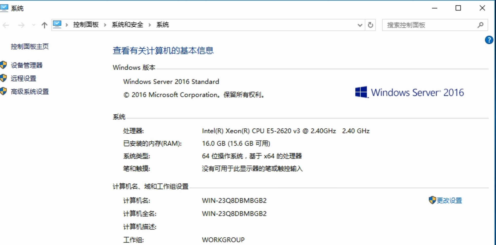
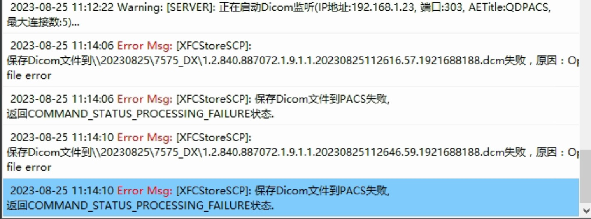
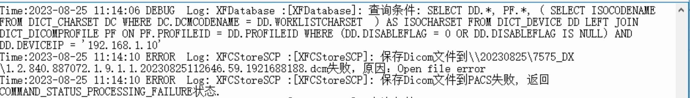
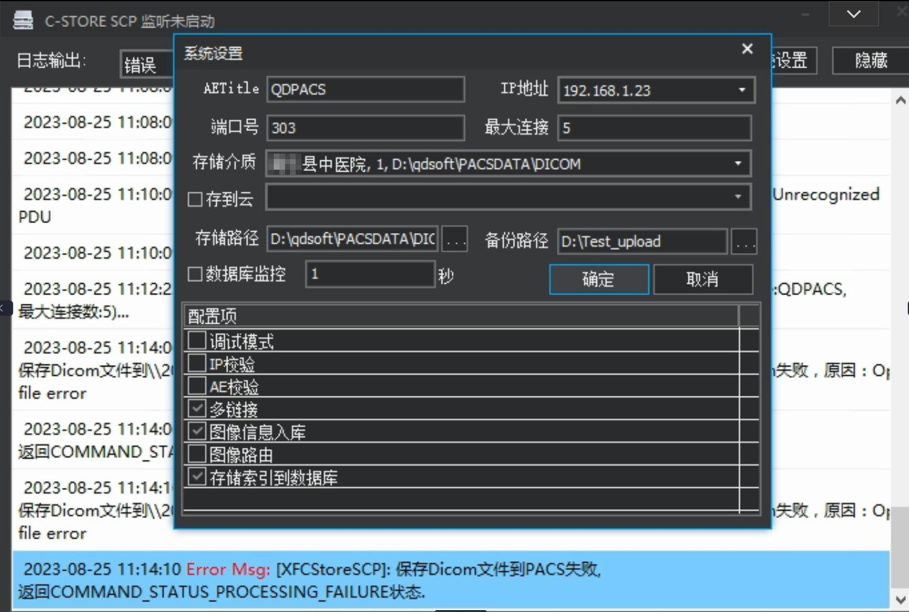

## 系统环境

系统环境如下图：

## 问题描述
客户反馈，处于同一局域网内的机器最近2天的 CT影像资料都无法上传到服务器，但是设备之间的通讯正常（服务器之间端口互通，且可以ping通）。让用户尝试发送一次数据，发现：

## 问题分析

从上图可以很明显的看到，文件上传的目录没有指定在哪个盘符里面，只是给出了一个没有盘符的路径，且报了个 Open file error 的错误。

查看日志，发现：

对比之前上传成功的日志，发现上传的日志中明显有指定盘符路径

## 解决方法

打开软件，

配置好存储介质路径，保存，重启软件。让客户再次重试上传，发现可以上传了。
