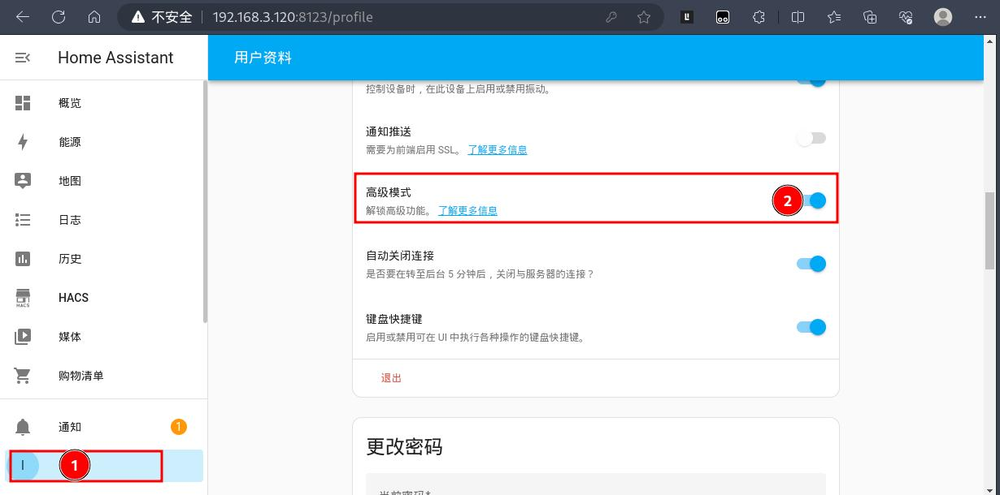
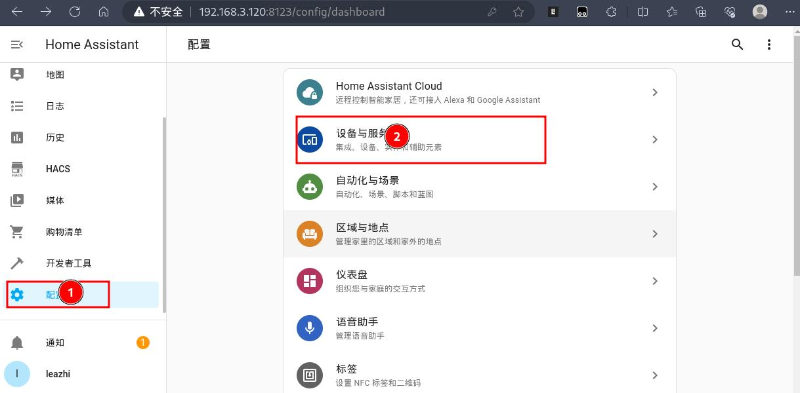
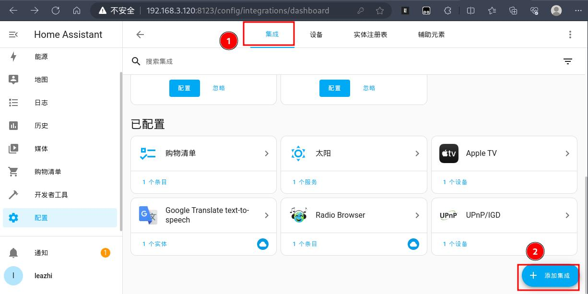
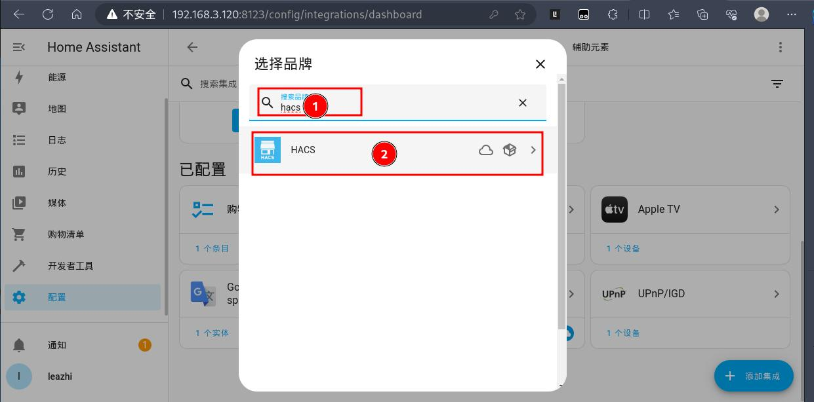
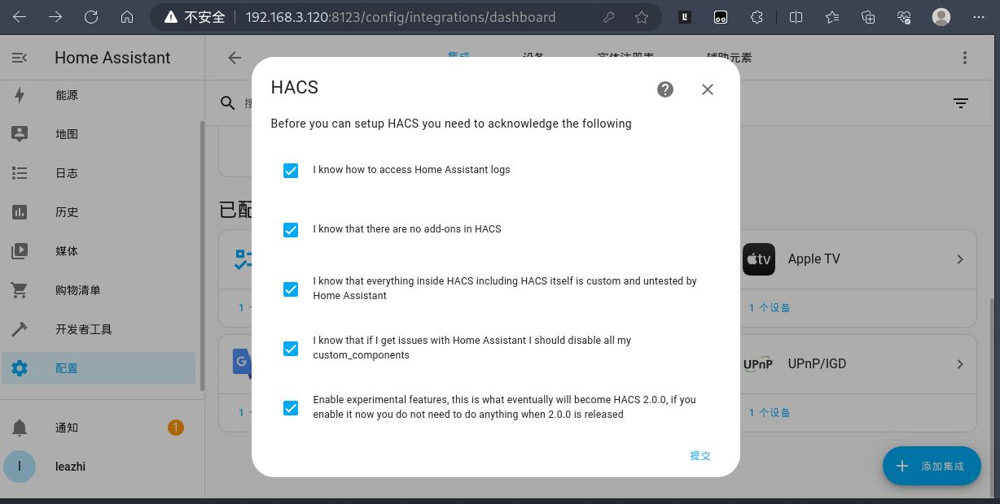
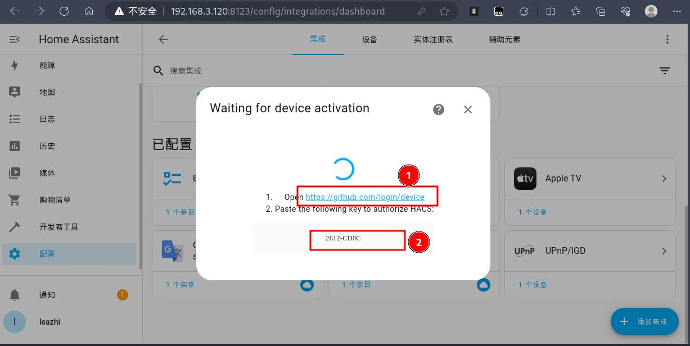
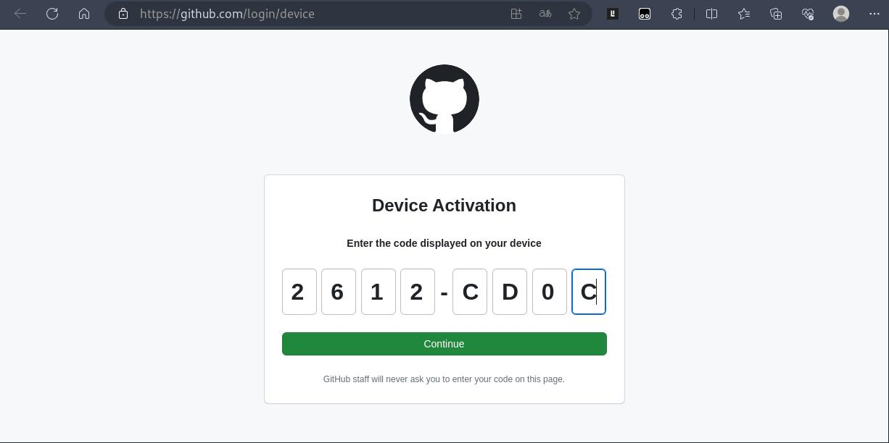
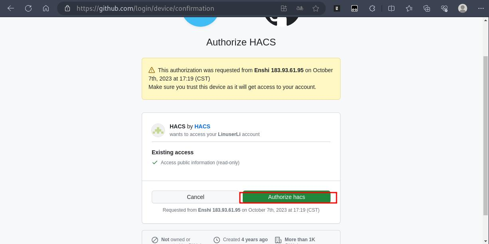
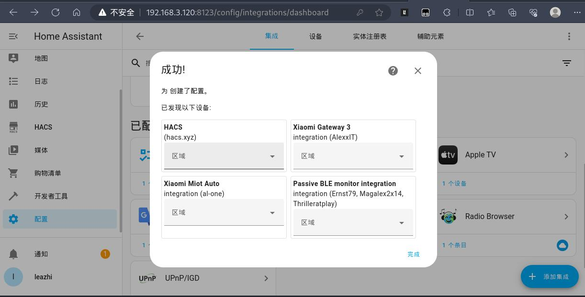

## 客户需求：

客户是一个 R4S 硬件，买的 8G 存储卡。要求在这个 8G 的存储卡上刷 OpenWRT ，然后通过 OpenWRT 自带的 Docker 环境部署 Home Assistant ！

## OpenWRT 刷入

**首先**：需要指导客户到 恩山无线论坛去下载对应的 OpenWRT 版本：[bleachwrt-plus-20231007-openwrt-rockchip-armv8-friendlyarm_nanopi-r4s-squashfs-sysupgrade](https://openwrt.mpdn.fun:8443/lede/rockchip/2023-10-07__05-39-32--multiple-devices.plus-daily/bleachwrt-plus-20231007-openwrt-rockchip-armv8-friendlyarm_nanopi-r4s-squashfs-sysupgrade.img.gz)


**其次**：指导客户使用写盘工具将下载下来的 OpenWRT 解压文件写入到存储卡。

**最后**：将刷好的存储卡装回 R4S  并启动。启动完成后，输入 OpenWRT 默认地址 192.168.1.1 打开 OpenWRT Web 管理界面，然后以默认的帐号密码: root/password 登录到 OpenWRT


## Docker 问题

### 空间不足导致镜像拉取失败

点击 OpenWRT web 管理界面左侧菜单栏 系统 ---> TTY D终端，以管理员身份登录，然后执行命令拉取镜像报：
```bash
root@BleachWrt:~# docker pull homeassistant/home-assistant
Using default tag: latest
latest: Pulling from homeassistant/home-assistant
7264a8db6415: Pull complete 
f5cfbb34cf3c: Pull complete 
...
7045b8fcb120: Downloading [==================================================>]  24.29MB/24.29MB
e03287f90c0d: Waiting 
8b51d8be7674: Waiting 
9d7f1abe824a: Waiting 
write /opt/docker/tmp/GetImageBlob2773575291: no space left on device
```

### 解决方法：

1.使用 fdisk -l 查看磁盘大小及分区情况（可以很明显看到，存储设备大小默认是 8 G 的，但实际只是用了 1G 多一点，明显还有很多剩余空间）：
```bash
root@BleachWrt:~# fdisk -l
Disk /dev/loop0: 695.06 MiB, 728825856 bytes, 1423488 sectors
Units: sectors of 1 * 512 = 512 bytes
Sector size (logical/physical): 512 bytes / 512 bytes
I/O size (minimum/optimal): 512 bytes / 512 bytes
GPT PMBR size mismatch (2130463 != 16777215) will be corrected by write.
The backup GPT table is corrupt, but the primary appears OK, so that will be used.
The backup GPT table is not on the end of the device.


Disk /dev/sda: 8 GiB, 8589934592 bytes, 16777216 sectors
Disk model: Virtual disk    
Units: sectors of 1 * 512 = 512 bytes
Sector size (logical/physical): 512 bytes / 512 bytes
I/O size (minimum/optimal): 512 bytes / 512 bytes
Disklabel type: gpt
Disk identifier: 93182384-C5B0-4453-61E7-FF7E5FECB800

Device      Start     End Sectors  Size Type
/dev/sda1     512   33279   32768   16M Linux filesystem
/dev/sda2   33280 2130431 2097152    1G Linux filesystem
/dev/sda128    34     511     478  239K BIOS boot

Partition table entries are not in disk order.
```

2.使用 fdisk 将空闲空间划分出来分区：
```bash
root@BleachWrt:~# fdisk /dev/sda

Welcome to fdisk (util-linux 2.38.1).
Changes will remain in memory only, until you decide to write them.
Be careful before using the write command.

GPT PMBR size mismatch (2130463 != 16777215) will be corrected by write.
The backup GPT table is corrupt, but the primary appears OK, so that will be used.
The backup GPT table is not on the end of the device. This problem will be corrected by write.
This disk is currently in use - repartitioning is probably a bad idea.
It's recommended to umount all file systems, and swapoff all swap
partitions on this disk.


Command (m for help): n
Partition number (3-127, default 3): 
First sector (2130432-16777182, default 2131968): 
Last sector, +/-sectors or +/-size{K,M,G,T,P} (2131968-16777182, default 16775167): 

Created a new partition 3 of type 'Linux filesystem' and of size 7 GiB.

Command (m for help): p

Disk /dev/sda: 8 GiB, 8589934592 bytes, 16777216 sectors
Disk model: Virtual disk    
Units: sectors of 1 * 512 = 512 bytes
Sector size (logical/physical): 512 bytes / 512 bytes
I/O size (minimum/optimal): 512 bytes / 512 bytes
Disklabel type: gpt
Disk identifier: 93182384-C5B0-4453-61E7-FF7E5FECB800

Device        Start      End  Sectors  Size Type
/dev/sda1       512    33279    32768   16M Linux filesystem
/dev/sda2     33280  2130431  2097152    1G Linux filesystem
/dev/sda3   2131968 16775167 14643200    7G Linux filesystem
/dev/sda128      34      511      478  239K BIOS boot

Partition table entries are not in disk order.

Command (m for help): w
The partition table has been altered.
Syncing disks.
```

3.格式化新分区：
```bash
root@BleachWrt:~# mkfs.ext4 /dev/sda3 
mke2fs 1.46.5 (30-Dec-2021)
Creating filesystem with 1830400 4k blocks and 457856 inodes
Filesystem UUID: 3c638d1e-7e1d-4488-890b-52a7b91c2b39
Superblock backups stored on blocks: 
        32768, 98304, 163840, 229376, 294912, 819200, 884736, 1605632

Allocating group tables: done                            
Writing inode tables: done                            
Creating journal (16384 blocks): done
Writing superblocks and filesystem accounting information: done 
```

4.将格式化好的新分区挂载到 /data 目录（前提是手动在 TTYD 终端创建好 data 目录）：
```bash
root@BleachWrt:~# mkdir /data

root@BleachWrt:~# mount /dev/sda3 /data/

# 实现重启系统自动挂载
root@BleachWrt:~# cat /etc/fstab 
# <file system> <mount point> <type> <options> <dump> <pass>
/dev/sda3     /data   ext4  defaults 0 2

root@BleachWrt:~# df -hT
Filesystem           Type            Size      Used Available Use% Mounted on
/dev/root            squashfs      329.0M    329.0M         0 100% /rom
tmpfs                tmpfs         996.9M     21.1M    975.8M   2% /tmp
/dev/loop0           f2fs          693.1M    289.4M    403.6M  42% /overlay
overlayfs:/overlay   overlay       693.1M    289.4M    403.6M  42% /
/dev/sda1            vfat           16.0M      5.8M     10.2M  36% /boot
/dev/sda1            vfat           16.0M      5.8M     10.2M  36% /boot
tmpfs                tmpfs         512.0K         0    512.0K   0% /dev
cgroup               tmpfs         996.9M         0    996.9M   0% /sys/fs/cgroup
overlayfs:/overlay   overlay       693.1M    289.4M    403.6M  42% /opt/docker
/dev/sda1            vfat           16.0M      5.8M     10.2M  36% /mnt/sda1
/dev/sda3            ext4            6.8G     24.0K      6.4G   0% /data
```

5.修改 docker 的数据数据目录（**注意**：这部分要到 openwrt web  里面去修改 docker 的配置项 的 Docker 根目录, 然后要在终端上执行 `/etc/init.d/dockerd restart`  才有用）

6.接下来重新获取镜像就好了！

## 部署 homeassistant
### 部署 homeassistant

1.使用 `docker search homeassistant`  查找 homeassistant 镜像

2.获取官方镜像：
```bash
┌──(leazhi㉿kali-desktop)-[~]
└─$ sudo docker pull homeassistant/home-assistant
Using default tag: latest
latest: Pulling from homeassistant/home-assistant
7264a8db6415: Pulling fs layer 
f5cfbb34cf3c: Pulling fs layer 
....
9d7f1abe824a: Pull complete 
Digest: sha256:a615c4a8ea9c6dd0fa8b0383b2d665d2bf03f31d35d7924662a355c3dca2bdd8
Status: Downloaded newer image for homeassistant/home-assistant:latest
docker.io/homeassistant/home-assistant:latest
```

3.执行部署命令进行部署
```bash
──(root㉿kali-desktop)-[~]
└─# docker run -d --name=hass --network=host --privileged -v /data/docker/mounts/hass:/config  -e TZ=Asia/Shanghai homeassistant/home-assistant:latest 
96378bd30447a33a9b18ccef98486f4d8579e5fd36011117dd16994b82669dd2
```

4.部署完成后，查看下容器状态：
```bash
┌──(root㉿kali-desktop)-[~]
└─# docker ps -a                                                                             
CONTAINER ID   IMAGE                                 COMMAND   CREATED         STATUS         PORTS     NAMES
96378bd30447   homeassistant/home-assistant:latest   "/init"   9 seconds ago   Up 8 seconds             hass
```

5.查看本地是否有监听到 homeassistant 的 8123 端口
```bash                                                                                            
┌──(root㉿kali-desktop)-[~]
└─# ss -lnpt|egrep 8123
LISTEN 0      128                                     0.0.0.0:8123       0.0.0.0:*    users:(("python3",pid=59580,fd=11))        
LISTEN 0      128                                        [::]:8123          [::]:*    users:(("python3",pid=59580,fd=12))        
```

### 安装 HACS

**HACS 项目地址**：https://github.com/hacs/integration   
**HACS 官方地址**：https://hacs.xyz/docs/setup/download  

#### 安装方法一：手动

1.在挂在目录下创建 2 个目录，分别为 www 和 custom_components:
```bash
mkdir /data/docker/mounts/hass/{www, custom_components}
```

2.打开上面**HACS 项目地址**，找到 release ，下载最新版本的 release 文件到本地

3.将下载好的 hacs 压缩文件解压到创建的 custom_components 目录下：
```bash
unzip /home/leazhi/Downloads/hacs.zip -d /data/docker/mounts/hass/custom_components/
```

4.登录 homeassistant 主页，点击左下角用户 ID，将用户资料属性页中的 `高级模式` 打开：


5.然后点击左侧菜单栏中的配置，在配置列表中点击 `设备与服务`:


6.进入集成页面后，点击右下角的添加集成：


7.弹出`选择品牌` 窗口后，在该窗口的搜索品牌栏中输入 `hacs`：


8.勾选 HACS 说明， 然后点击右下角的提交：


9.打开 [https://github.com](hjttps://github.com) ，登录自己的 github 帐号， HACS 需要认证：

9.1.按照提示，点击链接：


9.2.根据提示，在打开的 github 认证界面输入上面的认证码：


9.3.认证通过后，别忘记最后一步授权：


10.HACS 认证成功后，就会弹出成功的窗口（出现下面那么多，是因为我之前安装过以下组价in）：


#### 安装方法二：使用官方提供的脚本

这种方式可以参考：[智能家居 home-assistant 系列 002-安装 HACS 商店](https://hexo.linuser.com/2023/10/08/61e9ca5126c4/) 中的安装 HACS 下的安装方法一