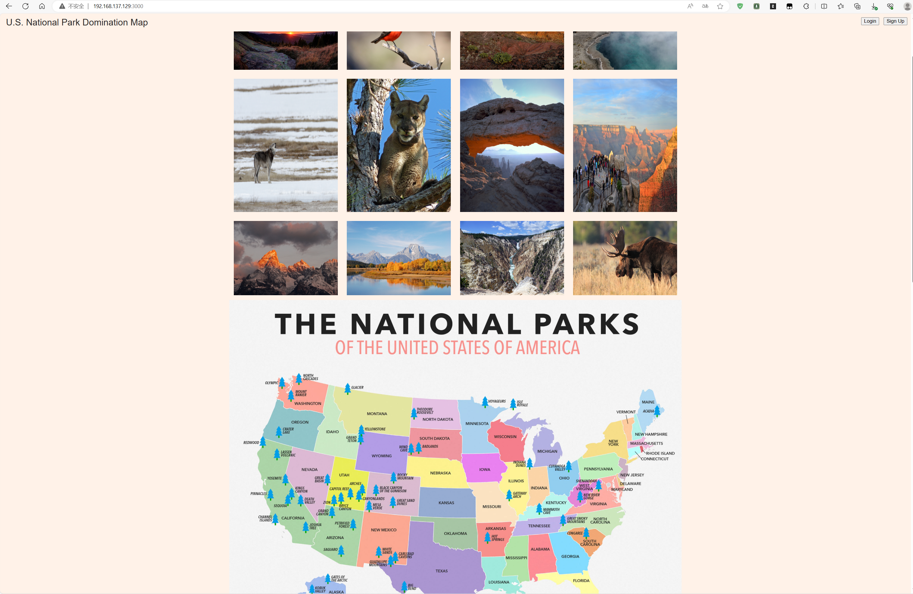

## 系统环境：
- OS：Ubuntu 22.04.3 LTS
- Kernel：5.15.0-84-generic #93-Ubuntu SMP Tue Sep 5 17:16:10 UTC 2023 x86_64 x86_64 x86_64 GNU/Linux
- NodeJS：v18.18.0
- MongoDB：v6.0.10


## MongoDB 部署：  

**安装部署过程请参考**：[ubuntu 22.04 服务部署-mongodb](https://hexo.linuser.com/2023/10/06/fc9f1de4bdd0/)

## NodeJS 部署请参考：
**安装部署过程请参考**：[nodejs 之 http-server 模块的安装](https://hexo.linuser.com/2023/09/10/a5ceef49cc78/) 的安装部分

## 项目部分部署：

1.从 github 将项目克隆到本地：
```bash
git clone https://github.com/SylviaHJY/U.S.-National-Park-Domination-Map.git
```

2.进入项目目录：
```bash
cd U.S.-National-Park-Domination-Map
```

3.执行命令：
```bash
npm -i
```

4.接着执行：
```bash
npm run seed           # 要等一会
```

5.最后启动：
```bash
npm start
```

6.打开浏览器，输入：http://Server_IP:3000 进行访问：


## 额外话题

本项目是一位留学海外的女孩所写，初衷是想将自己写的本地项目部署到 AWS 上。由于她边上学边学习编程，没有涉猎到服务器部署相关知识，所以想花钱在淘宝上找个人教她如何将本地项目部署到服务器上。