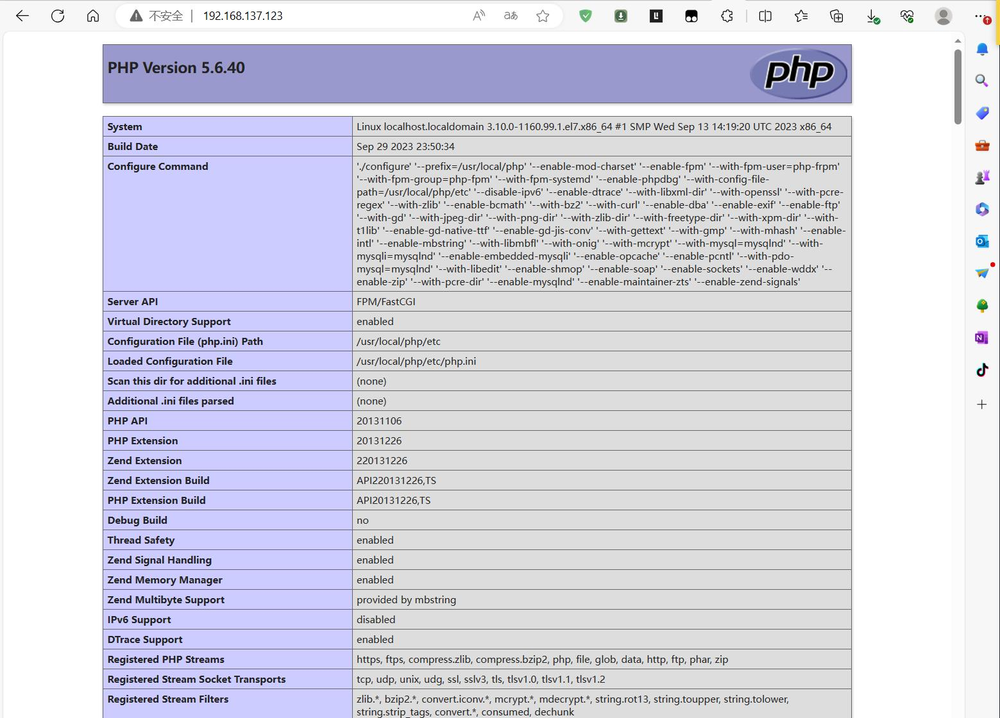


**以下所有操作均以 root 用户身份执行**


## 系统环境：
- OS：CentOS-7-x86_64-Minimal-1908
- Kernel：3.10.0-1062.el7.x86_64 #1 SMP Wed Aug 7 18:08:02 UTC 2019 x86_64 x86_64 x86_64 GNU/Linux

## LNMP 架构介绍

LNMP 架构是一种常见的 Web 服务器架构，它由 Linux、Nginx、MySQL（或MariaDB）、PHP 组成。以下是 LNMP 架构的详细介绍： 
 
1. Linux（操作系统）：LNMP 架构的基础是 Linux 操作系统。Linux 是一个开源的、免费的操作系统，具有稳定性、安全性和灵活性。您可以选择适合您需求的 Linux 发行版，如 Ubuntu、CentOS 等。 
 
2. Nginx（Web 服务器）：Nginx 是一个高性能的开源 Web 服务器和反向代理服务器。它具有低内存消耗、高并发能力和出色的性能。Nginx 可以处理静态文件、动态内容和负载均衡，并提供 SSL/TLS 加密等功能。 
 
3. MySQL（或MariaDB，数据库）：MySQL 是一个流行的关系型数据库管理系统，用于存储和管理网站或应用程序的数据。它支持事务处理、复制和高可用性。MariaDB 是 MySQL 的一个分支，提供了与 MySQL 兼容的特性，并且在某些方面性能更好。 
 
4. PHP（服务器端脚本语言）：PHP 是一种广泛使用的服务器端脚本语言，用于开发动态网页和 Web 应用程序。它与 Nginx 配合使用，可以处理用户请求并生成动态内容。PHP 具有丰富的功能和大量的开发框架，如 Laravel、Symfony 等。 
 
LNMP 架构的优点包括： 
 
- 高性能：Nginx 和 PHP-FPM（PHP FastCGI 进程管理器）的组合可以提供高性能和良好的并发处理能力。 
- 可扩展性：LNMP 架构可以轻松扩展以适应高流量和大规模应用程序的需求。 
- 灵活性：通过 Nginx 的配置，可以实现负载均衡、反向代理、静态文件缓存等功能。 
- 安全性：Nginx 提供了强大的安全功能，如访问控制、反向代理和 SSL/TLS 加密。 
 
当然，LNMP 架构也有一些注意事项，如安全性配置、性能调优和合理的服务器资源分配等。在实际使用 LNMP 架构时，您还可以根据具体需求进行定制和扩展，以满足特定的应用程序需求。

## LNMP 安装教程

### 安装前准备

1.安装扩展源 epel-release:
```bash
yum install -y epel-release && yum update -y
```

2.安装必要的 lnmp 依赖包：
```bash
yum install -y wget gcc gcc-c++ make autoconf automake unzip lrzsz vim epel-release systemd-devel systemtap-sdt-devel libxml2-devel openssl-devel bzip2-devel curl-devel libjpeg-devel libpng-devel libXpm-devel  freetype-devel   t1lib-devel   gmp-devel  libicu-devel libmcrypt-devel libedit-devel libxslt-devel gd-devel GeoIP-devel  gperftools-devel libatomic_ops-devel
```

3.下载 openssl 和 zlib 源码包到 /usr/local/src/ 目录下并解压（注意：openssl 版本要大于 1.0.2，否则会出现编译错误；且两个软件都不需要编译安装，只要解压即可！）：

3.1.openssl 下载解压：
```bash
wget -O /usr/local/src/openssl-1.1.1w.tar.gz  https://www.openssl.org/source/openssl-1.1.1w.tar.gz
tar -zxf /usr/local/src/openssl-1.1.1w.tar.gz  -C /usr/local/src/
```

3.2.zlib 下载解压：
```bash
wget -O /usr/local/src/zlib.tar.gz https://www.zlib.net/current/zlib.tar.gz
tar -zxf /usr/local/src/zlib.tar.gz -C  /usr/local/src/
```

### MySQL 安装

1.添加运行 mysql 的用户 mysql:
```bash
useradd -s /sbin/nologin mysql
```

2.创建 mysql 数据存放目录 /data/mysql 和日志存放目录 /var/lib/mysql:
```bash
mkdir -p /data/mysql /var/log/mysql
```

3.从 mysql 官方站点下载对应的 mysql 二进制版本文件到服务器的 /usr/local/src/ 目录下：
```bash
 wget -O /usr/local/src/mysql-5.6.50-linux-glibc2.12-x86_64.tar.gz https://cdn.mysql.com/archives/mysql-5.6/mysql-5.6.50-linux-glibc2.12-x86_64.tar.gz
```

4.将下载好的二进制包解压到下载目录：
```bash
tar -zxf /usr/local/src/mysql-5.6.50-linux-glibc2.12-x86_64.tar.gz -C /usr/local/src/
```

5.将解压出来的 mysql 目录移动到 /usr/local/ 目录下并重命名为 mysql:
```bash
mv /usr/local/src/mysql-5.6.50-linux-glibc2.12-x86_64 /usr/local/mysql
```

6.进入 /usr/local/mysql 目录，执行初始化数据库的命令：
```bash
cd /usr/local/mysql/&& ./scripts /mysql_install_db --datadir=/data/mysql --user=mysql --skip-name-resolve
```

7.编辑 /etc/my.cnf 文件，将 mysql 主配置内容配置内容如下：
```bash
# /etc/my.cnf

[mysqld]
# 监听地址
bind-address = 0.0.0.0

# 监听端口
port = 3306

# pid 文件
pid-file =  /data/mysql/mysql.pid

#  程序安装目录
basedir =  /usr/local/mysql/

# 数据存放目录
datadir = /data/mysql

# 该条配置需在[client]段同时配置
socket=/tmp/mysql.sock

# 设定默认字符为utf8mb4
character-set-server=utf8mb4

# 多客户访问同一数据库，该选项默认开启
symbolic-link = 0

# 此目录被 MySQL用来保存临时文件
#tmpdir =  /usr/local/mysql/tmp/

# 打开时，和max_connections对比，取大数
open_files_limit = 65535

# 错误日志
log-error = /var/log/mysql/error.log

# 开启慢查询日志相关
slow_query_log=on

# 默认10秒
long_query_time=2

# 慢查询日志路径
slow_query_log_file = /var/log/mysql/slow_query.log

# 记录没有使用索引的sql
log-queries-not-using-indexes = 1

# 指定默认的存储引擎
default_storage_engine=InnoDB

# InnoDB为独立表空间模式，每个数据库的每个表都会生成一个数据空间
innodb_file_per_table = on

# 生产中要改，建议为操作系统内存的70%-80%，需重启服务生效
innodb_buffer_pool_size=4G

# 忽略主机名解析，提高访问速度（注意配置文件中使用主机名将不能解析）
skip_name_resolve = on

# 忽略表单大小写
lower_case_table_names = 1

##  查询缓存相关
# 0表示禁用缓存，1表示会缓存所有的结果，2表示只缓存SQL_CACHE缓存
query_cache_type=1
query_cache_limit = 2M
query_cache_size = 64M  # 或32M 或128M

##  系统资源相关
# 如果系统在一个短时间内有很多连接，则需要增大该参数的值小于512
back_log = 500

# 默认100,生产则需要增大该参数值,最大连接数16384
max_connections = 1000

# 二进制日志相关
server_id=1
log_bin=mysql-bin
#log-bin-index=master-bin.index
expire_logs_days = 7
#binlog_format = row    #默认为mix，新版中设为这两项可提高安全性
#binlog_row_image = minimal
max_binlog_size = 100m   #默认是1G
binlog_cache_size = 4m
#binlog-do-db = DBNAME #指定mysql的binlog日志只记录哪个库
max_binlog_cache_size = 512m  #生产4g
#skip-slave-start


[mysqldump]
quick

[mysql]
# 允许通过 TAB 键提示
auto-rehash

#  数据库字符集
default-character-set = utf8mb4

connect-timeout = 3


[client]
default-character-set = utf8mb4
port = 3306
socket = /tmp/mysql.sock

[mysqld_safe]
# 增加每个进程的可打开文件数量.确认你已经将全系统限制设定的足够高!打开大量表需要将此值设大
open-files-limit = 8192
```

8.在 /lib/systemd/system/ 目录下创建 mysql.service 文件

```bash
[Unit]
Description=MySQL Server
Documentation=man:mysqld(8)
Documentation=http://dev.mysql.com/doc/refman/en/using-systemd.html
After=network.target
After=syslog.target

[Install]
WantedBy=multi-user.target

[Service]
User=mysql
Group=mysql
ExecStart=/usr/local/mysql/bin/mysqld --defaults-file=/etc/my.cnf
LimitNOFILE = 5000
#Restart=on-failure
#RestartPreventExitStatus=1
#PrivateTmp=false
```

9.将 mysql 的数据存放目录，日志存放目录，安装目录所属主和组都修改为 mysql:
```bash
chown -R mysql:mysql /data/mysql /var/log/mysql /usr/local/mysql
```

10.执行命令加载 mysql 启动脚本：
```bash
systemctl daemon-reload
```

11.执行命令，启动 mysql 服务并将其加入到开机启动项：
```bash
systemctl enable --now mysql.service
```

12.执行命令，查看 mysql 服务状态：
```bash
[root@localhost mysql]# systemctl status mysql.service
● mysql.service - MySQL Server
   Loaded: loaded (/usr/lib/systemd/system/mysql.service; enabled; vendor preset: disabled)
   Active: active (running) since Fri 2023-09-29 23:44:23 EDT; 29s ago
     Docs: man:mysqld(8)
           http://dev.mysql.com/doc/refman/en/using-systemd.html
 Main PID: 8494 (mysqld)
   CGroup: /system.slice/mysql.service
           └─8494 /usr/local/mysql/bin/mysqld --defaults-file=/etc/my.cnf

Sep 29 23:44:23 localhost.localdomain systemd[1]: Started MySQL Server.
Sep 29 23:44:23 localhost.localdomain mysqld[8494]: 2023-09-29 23:44:23 0 [Warning] Using unique option prefix symbolic-link instead of symbolic-links is depr... instead.
Sep 29 23:44:23 localhost.localdomain mysqld[8494]: 2023-09-29 23:44:23 0 [Warning] TIMESTAMP with implicit DEFAULT value is deprecated. Please use --explicit...details).
Sep 29 23:44:23 localhost.localdomain mysqld[8494]: 2023-09-29 23:44:23 0 [Note] --secure-file-priv is set to NULL. Operations related to importing and export... disabled
Sep 29 23:44:23 localhost.localdomain mysqld[8494]: 2023-09-29 23:44:23 0 [Note] /usr/local/mysql/bin/mysqld (mysqld 5.6.50-log) starting as process 8494 ...
Hint: Some lines were ellipsized, use -l to show in full.
```


### PHP 安装

1.添加运行 php 的用户和用户组：
```bash
useradd -s /sbin/nologin php-fpm
```

2.到 php 官方站点在对应版本的 php 源码包到 /usr/local/src 目录下：
```bash
wget -O /usr/local/src/php-5.6.40.tar.gz https://www.php.net/distributions/php-5.6.40.tar.gz
```

3.将下载好的源码包解压到下载目录：
```bash
tar -zxf /usr/local/src/php-5.6.40.tar.gz -C /usr/local/src/
```

4.进入解压后的目录，配置 configure 参数：
```bash
cd /usr/local/src/php-5.6.40 && ./configure --prefix=/usr/local/php \
--enable-mod-charset \
--enable-fpm \
--with-fpm-user=php-frpm \
--with-fpm-group=php-fpm \
--with-fpm-systemd \
--enable-phpdbg \
--with-config-file-path=/usr/local/php/etc \
--disable-ipv6 \
--enable-dtrace \
--with-libxml-dir \
--with-openssl \
--with-pcre-regex \
--with-zlib \
--enable-bcmath \
--with-bz2 \
--with-curl \
--enable-dba \
--enable-exif \
--with-pcre-dir \
--enable-ftp \
--with-gd \
--with-jpeg-dir \
--with-png-dir \
--with-zlib-dir \
--with-freetype-dir \
--with-xpm-dir \
--with-t1lib \
--enable-gd-native-ttf \
--enable-gd-jis-conv \
--with-gettext \
--with-gmp \
--with-mhash \
--enable-intl \
--enable-mbstring \
--with-libmbfl \
--with-onig \
--with-mcrypt \
--with-mysql=mysqlnd \
--with-mysqli=mysqlnd \
--enable-embedded-mysqli \
--enable-opcache \
--enable-pcntl \
--with-pdo-mysql=mysqlnd \
--with-libedit \
--enable-shmop \
--enable-soap \
--enable-sockets \
--enable-wddx \
--enable-zip \
--with-pcre-dir \
--enable-mysqlnd \
--enable-maintainer-zts \
--enable-zend-signals
```

5.执行 make 进行编译：
```bash
make -j $(nproc)
```

6.执行 make install 进行安装：
```bash
make install
```

7.复制 php 的配置文件到 /usr/local/php/etc/ 目录下：
```bash
cp php.ini-production /usr/local/php/etc/php.ini
# cp sapi/fpm/php-fpm.service /lib/systemd/system/
cp sapi/fpm/php-fpm.conf /usr/local/php/etc/php-fpm.conf
sed -i 's/php-frpm/php-fpm/' /usr/local/php/etc/php-fpm.conf
sed -i 's@;pid = run/php-fpm.pid@pid = /var/run/php-fpm.pid@' /usr/local/php/etc/php-fpm.conf
```

8.在 /lib/systemd/system/ 目录下创建 php-fpm.service 文件:
```bash
[Unit]
Description=The PHP FastCGI Process Manager
After=syslog.target network.target

[Service]
Type=forking
PIDFile=/var/run/php-fpm.pid
ExecStart=/usr/local/php/sbin/php-fpm
ExecReload=/bin/kill -USR2 $MAINPID
PrivateTmp=true

[Install]
WantedBy=multi-user.target
```

9.执行命令加载 mysql 启动脚本：
```bash
systemctl daemon-reload
```

10.执行命令，启动 mysql 服务并将其加入到开机启动项：
```bash
systemctl enable --now php-fpm.service
```

11.查看php-fpm.service 状态：
```bash
[root@localhost php-5.6.40]# systemctl status php-fpm.service
● php-fpm.service - The PHP FastCGI Process Manager
   Loaded: loaded (/usr/lib/systemd/system/php-fpm.service; enabled; vendor preset: disabled)
   Active: active (running) since Fri 2023-09-29 23:56:00 EDT; 17s ago
  Process: 13710 ExecStart=/usr/local/php/sbin/php-fpm (code=exited, status=0/SUCCESS)
 Main PID: 13711 (php-fpm)
   CGroup: /system.slice/php-fpm.service
           ├─13711 php-fpm: master process (/usr/local/php/etc/php-fpm.conf)
           ├─13712 php-fpm: pool www
           └─13713 php-fpm: pool www

Sep 29 23:56:00 localhost.localdomain systemd[1]: Starting The PHP FastCGI Process Manager...
Sep 29 23:56:00 localhost.localdomain systemd[1]: Started The PHP FastCGI Process Manager.
[root@localhost php-5.6.40]# client_loop: send disconnect: Connection reset by peer
```

### Nginx 安装

1.添加运行 nginx 的用户和用户组：
```bash
useradd -s /sbin/nologin nginx
```

2.从 nginx 官方站点下载对应版本的 nginx 源码包到 /usr/local/src/ 目录下:
```bash
wget -O /usr/local/src/nginx-1.18.0.tar.gz https://nginx.org/download/nginx-1.18.0.tar.gz
```

3.将下载好的 nginx 源码包解压到下载目录：
```bash
tar -zxf /usr/local/src/nginx-1.18.0.tar.gz -C /usr/local/src/
```

4.进入解压目录，执行 configure 命令进行配置：
```bash
cd /usr/local/src/nginx-1.18.0/  && ./configure --prefix=/usr/local/nginx \
--user=nginx \
--group=nginx \
--with-threads \
--with-http_ssl_module  \
--with-http_v2_module   \
--with-http_realip_module  \
--with-http_addition_module  \
--with-http_xslt_module=dynamic \
--with-http_image_filter_module=dynamic \
--with-http_geoip_module=dynamic \
--with-http_sub_module  \
--with-http_dav_module \
--with-http_flv_module  \
--with-http_mp4_module  \
--with-http_gunzip_module \
--with-http_gzip_static_module \
--with-http_auth_request_module \
--with-http_random_index_module \
--with-http_secure_link_module  \
--with-http_degradation_module \
--with-http_slice_module  \
--with-http_stub_status_module \
--with-stream \
--with-stream_ssl_module \
--with-stream_realip_module \
--with-stream_geoip_module  \
--with-stream_ssl_preread_module  \
--with-google_perftools_module  \
--with-compat  \
--with-zlib=/usr/local/src/zlib-1.3 \
--with-pcre \
--with-libatomic \
--with-openssl=/usr/local/src/openssl-1.1.1w
```

5.执行编译及安装命令：
```bash
make -j $(nproc ) && make install
```

6.在 /lib/systemd/system/ 目录下创建 nginx.service 文件:
```bash
[Unit]
Description=Nginx HTTP Serverlocal/nginx/
After=network.target

[Service]
Type=forking
ExecStartPre=/usr/local/nginx/sbin/nginx -t
ExecStart=/usr/local/nginx/sbin/nginx
ExecReload=/usr/local/nginx/sbin/nginx -s reload
ExecStop=/usr/local/nginx/sbin/nginx -s stop
PrivateTmp=true

[Install]
WantedBy=multi-user.target
```

7.执行命令加载 mysql 启动脚本：
```bash
systemctl daemon-reload
```

8.执行命令，启动 mysql 服务并将其加入到开机启动项：
```bash
systemctl enable --now nginx.service
```

9.设置防火墙，开放 80 端口：
```bash
[root@localhost nginx-1.18.0]# firewall-cmd --add-port=80/tcp --permanent && firewall-cmd --reload
success
success
```

## 测试

### 基于 nginx 的测试
打开浏览器，输入服务器 IP，看能否正常访问到 nginx 欢迎页面。


### 基于 lnmp 测试

1.在 /usr/local/nginx/html 目录下新建 index.php 文件，内容如下：
```php
<?php
echo phpinfo();
?>
```

2.编辑 /usr/local/nginx/conf/nginx.conf 文件，将 nginx 主配置文件修改如下：
```bash
[root@localhost nginx-1.18.0]# egrep -v '^$|#' /usr/local/nginx/conf/nginx.conf
worker_processes  1;
events {
    worker_connections  1024;
}
http {
    include       mime.types;
    default_type  application/octet-stream;
    sendfile        on;
    keepalive_timeout  65;
    server {
        listen       80;
        server_name  localhost;
        location / {
            root   html;
            index  index.php;
        }
        error_page   500 502 503 504  /50x.html;
        location = /50x.html {
            root   html;
        }
        location ~ \.php$ {
            root           html;
            fastcgi_pass   127.0.0.1:9000;
            fastcgi_index  index.php;
            fastcgi_param  SCRIPT_FILENAME  $document_root$fastcgi_script_name;
            include        fastcgi_params;
        }
    }
}
```

3.执行命令，检查 nginx 配置文件是否正确：
```bash
[root@localhost nginx-1.18.0]# /usr/local/nginx/sbin/nginx -t
nginx: the configuration file /usr/local/nginx/conf/nginx.conf syntax is ok
nginx: configuration file /usr/local/nginx/conf/nginx.conf test is successful
```

4.重启 nginx 服务：
```bash
systemctl restart nginx.service
```

5.打开浏览器，输入服务器 IP，看能否正常访问到 phpinfo() 页面。


## 参考