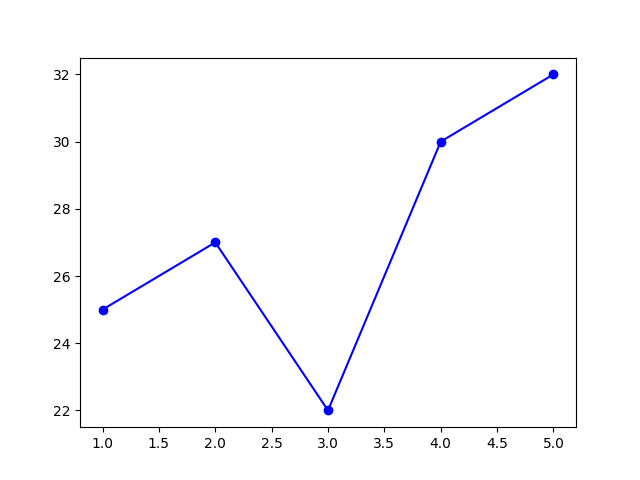
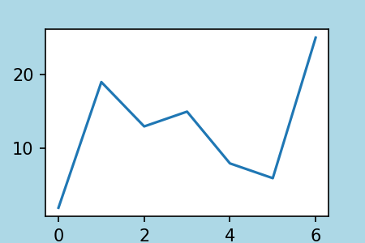
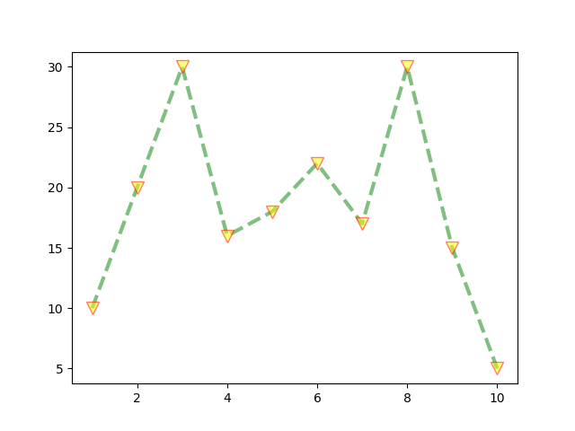
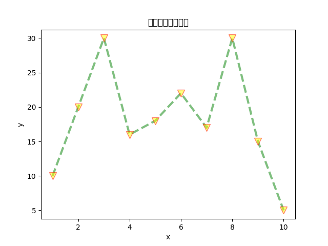
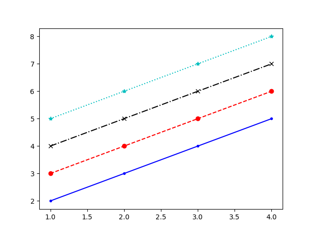
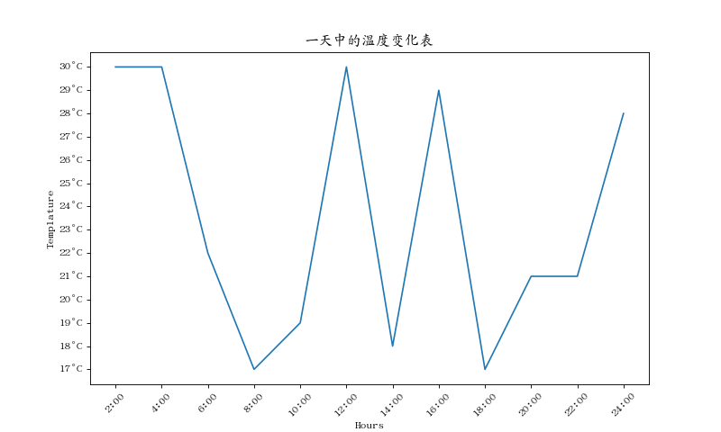
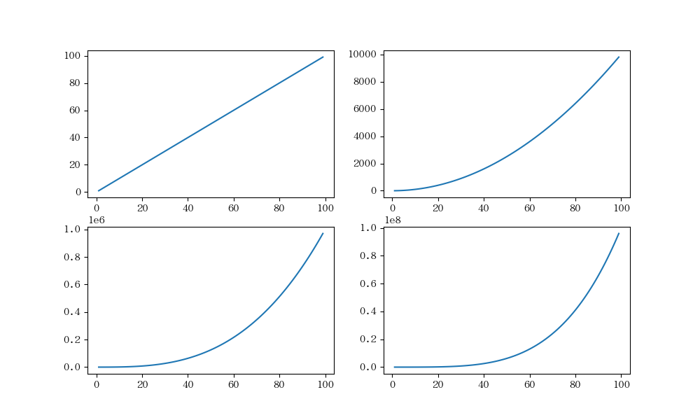

## MatPlotlib 简介
Matplotlib 是一个用于创建数据可视化的Python库。它提供了广泛的绘图选项，可以用于生成各种类型的图表，包括线图、散点图、柱状图、饼图等等。 
 
Matplotlib 的设计灵感来自于 MATLAB，因此其使用方式和 MATLAB 相似。它是一个功能强大且灵活的库，可以满足从简单的绘图需求到复杂的数据可视化任务。 
 
Matplotlib 提供了一个面向对象的接口，使得用户可以对图形进行精细的控制。同时，它也提供了一个简单的 pyplot 接口，方便快速绘制简单的图表。 
 
使用 Matplotlib，您可以自定义图表的各种属性，包括标题、标签、线型、颜色等。您还可以添加图例、网格线、注释等元素，以增强图表的可读性。 
 
除了基本的绘图功能，Matplotlib 还支持多个子图、3D 图形、动画等高级功能。此外，它还可以与其他科学计算库（如 NumPy 和 Pandas）无缝集成，方便地处理和可视化数据。 


## matplotlib 安装 
```bash
import matplotlib.pyplot as plt
import random
```

## 导入所需的库
```python
import matplotlib.pyplot as plt
import random
import numpy as np
```

##  plot 函数语法及参数含义：

### 用法：
```bash
plt.plot(x, y, linestyle, linewidth, color, marker, markersize, markeredgecolor, ...)
```
参数说明：
- x：指定度；
- y：这线图的 y 轴数据；
- linestyle：指定折线的类型，可以是实线、虚线、点虚线、点点线等，默认为实线；
- linewidth：指定折线的宽（cecolor,label,alpha）；
- marker：可以为折线图添加点，该参数是设置点的形状；
- markersize：设置点的大小；
- markeredgecolor：设置点的边框色；
- markerfacecolor：设置点的填充色；
- lable：为折线图添加标签，类似于图例的作用；

### 画图的逻辑：
- 设置画布的大小（即设置图画多大）；
- 画几个图；
- 画什么图：折线图、散点图、条形图、柱形图、饼图、...；
- 参数的调整

### 点的形状

- '.' 点标记；
- ',' 像素标记；
- 'o' 圆圈标记；
- 'v' 倒三角标记；
- '^' 正三角标记；
- '<' 左三角标记；
- '>' 右三角标记；
- '1' 向下 Y 标记；
- '2' 向上 Y 标记；
- '3' 向左 Y 标记；
- '4' 向右 Y 标记；
- 's' 正方形标记；
- 'p' 五角星标记；
- '*' * 标记；
- 'h' 六边形 1 标记；
- 'H' 六边形 2 标记；
- '+' + 标记；
- 'x' x 标记；
- 'D' 钻石标记；
- 'd' 薄钻石标记；
- '|' 垂直线标记；
- '_' 水平线标记

### 折线图

主要用来查看数据历史趋势

#### 实例一：画折线图

源数据：
```python
days = [1, 2, 3, 4, 5]
qi_wen = [25, 27, 22, 30, 32]
```

画折线图
```python
plt.plot(days, qi_wen, marker='o', color="b")       # 可以没有 x 轴数据，自动生成序号数据，默认从 0 开始
plt.show()
```

如下图:    



#### 生活案例：销售额

源数据
```python
months = ['Jan', 'Feb', 'Mar', 'Apr', 'May']
sales = [5000, 6000, 7500, 3000, 9000]
```

绘图：
```python
plt.plot(months, sales)
plt.show()
```

#### 实例二：设置画布大小
源数据：
```python
fig = plt.figure(figsize=[3,2],          # 画布大小, 3 为宽， 2 为高
                  dpi=150,              # 分辨率
                facecolor='lightblue')  # 填充的背景色

x = range(7)
y = [2, 19, 13, 15, 8, 6, 25]
```

画图：
```python
plt.plot(x, y)
plt.show()
```

如下图:    



#### 实例三：折线的颜色和形状 及

**注意**：x 和 y的个数要保持一致

源数据：
```python
x = range(1, 11)
y = [10, 20, 30, 16, 18, 22, 17, 30, 15, 5]
```

画图：
```python
plt.plot(x,
         y,
         color="green",     # 颜色
         alpha=0.5,          # 透明度，默认为 1
         linestyle = '--',   # 线的样式
         linewidth =3,          # 线的宽度
         marker = 'v',       # 折点的形状
         markeredgecolor = 'red',    # 折点边框的颜色
         markersize = '10',      # 折点大小
         markerfacecolor = 'yellow'     # 这点内部颜色
         )
plt.show()
```

如下图:  


#### 实例四：图形效果（绘制轴标签及图形标题）


源数据：
```python
x = range(1, 11)
y = [10, 20, 30, 16, 18, 22, 17, 30, 15, 5]
```

画图：
```python
plt.plot(x,
         y,
         color="green",     # 颜色
         alpha=0.5,          # 透明度，默认为 1
         linestyle = '--',   # 线的样式
         linewidth =3,          # 线的宽度
         marker = 'v',       # 折点的形状
         markeredgecolor = 'red',    # 折点边框的颜色
         markersize = '10',      # 折点大小
         markerfacecolor = 'yellow'     # 这点内部颜色
         )
# 绘制轴标签

## plt.xlabel(str_x)   绘制 x 轴标签；
plt.xlabel('x')


## plt.ylabel(str_y)   绘制 y 轴标签;
plt.xlabel('y')


#绘制图形标题（默认显示在图形上方）：plt.title(str_title)

plt.title('年度销量变化情况')
plt.show()
```

如下图：   



这里有个警告：同时，可以看到上图中的标题字体没有正常显示
```bash
UserWarning: Glyph 20917 (\N{CJK UNIFIED IDEOGRAPH-51B5}) missing from current font.
  FigureCanvasAgg.draw(self)
```

这是因为 matplotlib 库不支持中文显示


**解决方法**：在绘图代码中设置字体全局变量

```bash
# 设置字体（由于 matplotlib 不支持中文字体，所以需要单独设置）
plt.rcParams['font.family'] = 'AR PL UKai CN'
plt.rcParams['font.size'] = 12
plt.rcParams['axes.unicode_minus'] = False      # 显示负号
```

#### 实例五：同图多线

源数据：
```python
x = [1, 2, 3, 4]
y = [2, 3, 4, 5]
y1 = [e+1 for e in y]
y2 = [e+2 for e in y]
y3 = [e+3 for e in y]
```

画图：
```python
plt.plot(x, y,'b.-')            # b 代表蓝色， . 代表点的标记， - 代表折线形状（直实线）
plt.plot(x, y1, 'ro--')         # r 代表红色， o 代表点的标记， -- 代表折线形状（虚线）
plt.plot(x,y2, 'kx-.')          # k 代表黑色， x 代表点的标记， -. 代表折线性转（虚点线）
plt.plot(x,y3, 'c*:')           # c 代表青色， * 代表点的标记， ：
plt.show()
```


如下图:  



#### 实例六：设置刻度、刻度标签、轴标签、字体及图标题

源数据：
```python
x = range(2, 26, 2)
y = [random.randint(16,32) for i in x]
```

画图：
```python
# 设置字体（由于 matplotlib 不支持中文字体，所以需要单独设置）
plt.rcParams['font.family'] = 'AR PL UKai CN'
plt.rcParams['font.size'] = 12
plt.rcParams['axes.unicode_minus'] = False      # 显示负号

# 设置画布大小
plt.figure(figsize=(10, 6),dpi=80)

# x 轴的刻度标签
xticks_lable = [f'{i}:00' for i in x]

# 在图上设置刻度及刻度标签
plt.xticks(x, xticks_lable, rotation=45)

# y 轴的刻度标签
yticks_lable = [f'{i}°C' for i in range(min(y), max(y)+1)]

# 在图上设置刻度及刻度标签
plt.yticks(range(min(y), max(y)+1), yticks_lable)

# 轴标签
plt.xlabel('Hours')
plt.ylabel('Templature')

# 图标题
plt.title('一天中的温度变化表')

# 绘图
plt.plot(x, y)

# 保存图片
plt.savefig('./templature.png')

# 显示绘制的图像
plt.show()
```
**说明**：刻度标签的刻度个数（注意：是 x 轴和 y 轴的刻度个数，而不是 x 轴和 y 轴的刻度数据）可以不一样；同时，刻度标签和刻度数尽量保持一致；

如下图:  



#### 实例七：画多个子图
源数据：
```python
x = np.arange(1, 100)
```

绘图：
```python
fig = plt.figure(figsize=(10, 6), dpi=100)

# 建子图
plt.subplot(2, 2, 1)       # 总图是2行2列，图一
plt.plot(x, x)

plt.subplot(2, 2, 2)       # 总图是2行2列，图二
plt.plot(x, x**2)

plt.subplot(2, 2, 3)       # 总图是2行2列，图三
plt.plot(x, x**3)

plt.subplot(2, 2, 4)       # 总图是2行2列，图四
plt.plot(x, x**4)

plt.show()
```

如下图：    



