## 相关模块安装：
```python
pip install scikit-learn seaborn
```

## 模块导入
```python
import matplotlib.pyplot as plt
import numpy as np
import pandas as pd
import random
import seaborn as sns
from sklearn.datasets import load_iris
```

## matplotilib 绘图：
### 条形图：bar() 的用法

柱状图是用来对数据进行对比

语法：plt.bar(left, height, width=0.8, bottom=None, **kwargs)

参数说明
- left：为分类数量一致的数值序列，序列里的数值数量决定了柱子的个数，数值大小决定了距离 0 点的位置
- height：为分类变量的数值大小，决定了柱子的高度；
- width：决定了柱子的宽度，仅代表形状宽度而已；
- bottom：决定了柱子距离 x 轴的高度，默认为 None ,即表示与 x 轴距离为 0；

### 垂直条形图

源数据：
```python
CITY = ['北京', '上海', '天津', '重庆']
GDP = [random.randint(10000, 14000) for i in range(4)]
```

绘图：
```python
# 在 ubuntu 上显示中文字体
plt.rcParams['font.family'] = 'AR PL UKai CN'
plt.bar(CITY,GDP, width=0.3, alpha=0.5, color='lightgreen')
plt.show()
```

图如下：   
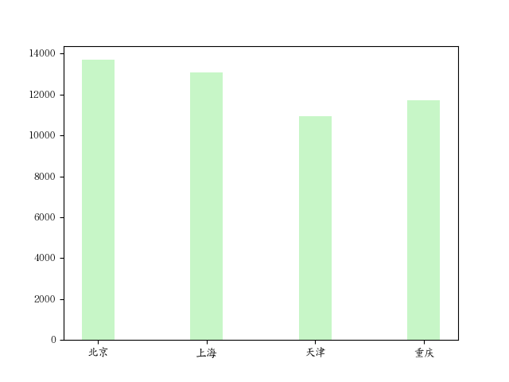


#### 缩小 y 轴范围

源数据：
```python
CITY = ['北京', '上海', '天津', '重庆']
GDP = [random.randint(10000, 14000) for i in range(4)]
```

绘图：
```python
plt.bar(CITY,GDP, width=0.3, alpha=0.5, color='lightgreen')
plt.ylim([8000, 15000])         # 缩小取值范围，让图形更直观
plt.show()
```

图如下：   
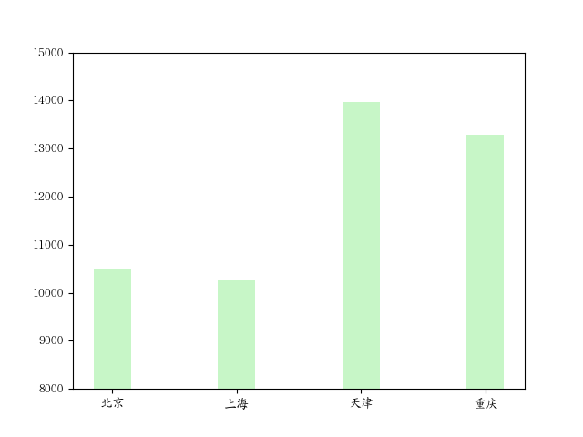


#### 打标签
源数据：
```python
CITY = ['北京', '上海', '天津', '重庆']
GDP = [random.randint(10000, 14000) for i in range(4)]
```

绘图：
```python
plt.bar(CITY,GDP, width=0.3, alpha=0.5, color='lightgreen')
plt.ylim([8000, 15000])
for x,y in enumerate(GDP):
    plt.text(x, y+100, '%s' %y, ha='center')        # (x,y) 打标签的位置坐标；y+100 表示标签和图形之间的距离； ha 表示标签显示在图形上的位置
plt.show()
```

图如下：    
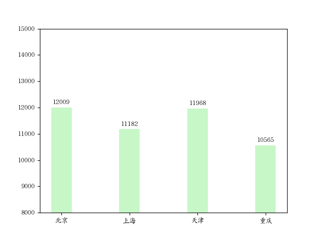


### 水平条形图

语法：plt.barh(x,y, left, height, width)

参数说明
- width：表示柱状图的高度，取值在 0～1 之间，默认为 0.8;
- 其它参数与 plt.bar() 类似；

源数据：
```python
label = ['亚马逊', '当当网', '中国图书网', '京东网', '天猫']
price = [38.8, 40.2, 48.4, 39.9, 32.34]
```

绘图：
```python
plt.figure(figsize=(16,9), dpi=140)
# plt.barh(range(5), price)
plt.barh(label, price, alpha=0.6, color='green')

plt.show()
```

图如下：   
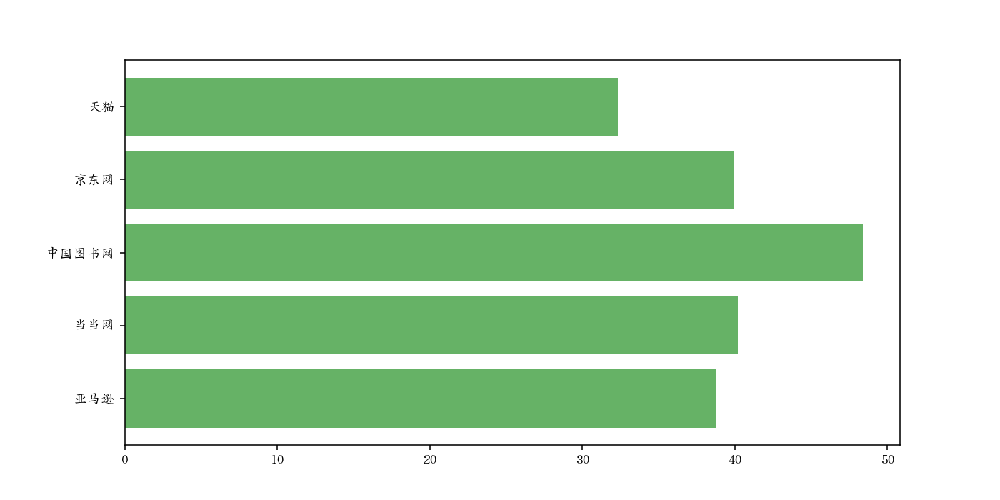

#### 打标签
源数据：
```python
label = ['亚马逊', '当当网', '中国图书网', '京东网', '天猫']
price = [38.8, 40.2, 48.4, 39.9, 32.34]
```

绘图：
```python
plt.figure(figsize=(16,9), dpi=140)
# plt.barh(range(5), price)
plt.barh(label, price, alpha=0.6, color='green')

for x, y in enumerate(price):
    plt.text(y+1, x, '%s' %y, va='center')        # va = 'center' 垂直剧中
plt.show()
```

图如下：    
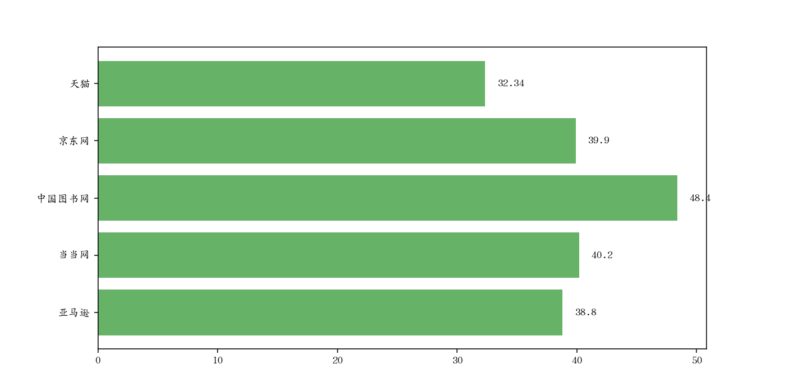


### 直方图：plt.hist()

直方图主要是显示各组数据数量分布的情况；用于观察一场或孤立数据

语法：plt.hist(x,bins, range, density, cumulative)

源数据：
```python
data = [random.randint(1, 200) for i in range(70)]
print(data)
'''
[107, 167, 34, 132, 113, 26, 58, 137, 167, 36, 84, 18, 123, 121, 92, 40, 122, 190, 55, 107, 19, 186, 12, 10, 34, 199, 105, 12, 149, 106, 29, 138, 8, 54, 155, 175, 134, 182, 185, 112, 111, 184, 35, 106, 50, 119, 198, 124, 111, 145, 183, 43, 143, 149, 170, 195, 190, 120, 110, 10, 130, 101, 71, 152, 96, 147, 122, 23, 137, 107]
'''
```

绘图：
```python
plt.figure(figsize=(10, 5))
plt.hist(data, bins=20, edgecolor='k', color='greenyellow')  # bins 表示柱子的个数
plt.show()
```

图如下：   
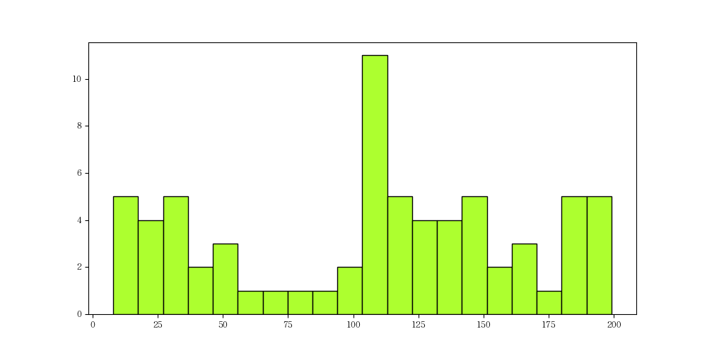


### 散点图：scatter() 的用法

散点图主要是用来查看数据的分布情况

源数据：
```python
height = [120, 161, 170, 182, 175, 173, 165, 155, 150, 110]
weight = [38, 45, 58, 80, 90, 59, 55, 45, 40, 30]
```

绘图：
```python
sizes = [i*10 for i in weight]
colors = np.random.rand(len(weight))
plt.scatter(height,weight, s=sizes, c=colors, alpha=0.5)
plt.show()
```

图如下：   
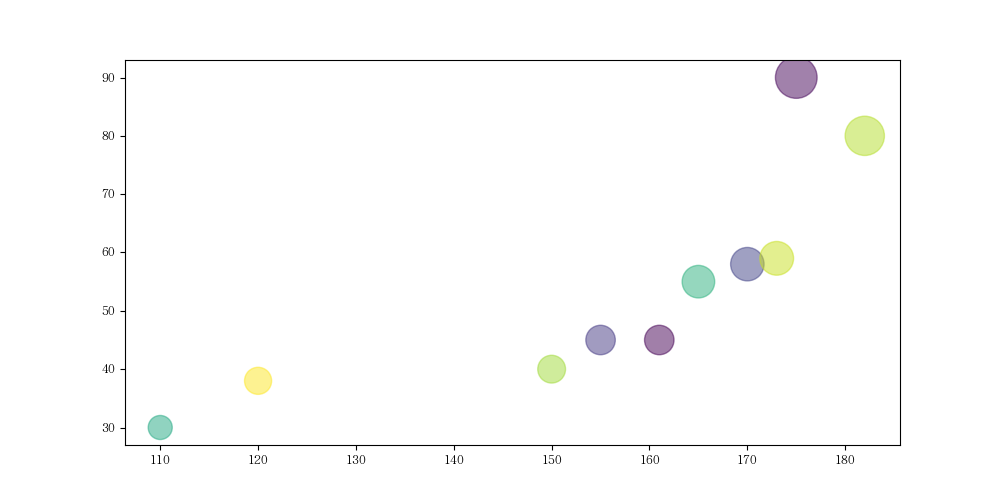

### 饼图：pie() 的用法

饼图主要是用来查看各数据在整体里的占比情况

源数据：
```python
label = ['中专', '大专', '本科', '硕士', '其它']
x = [0.3515, 0.3724, 0.2336, 0.0368, 0.0057]
colors = ['#d5610d', '#5d9ca9', '#65a509', '#a498c6', 'green']
```

绘图：
```python
# 设置画布大小
plt.figure(figsize=(6,6))
plt.pie(
    x,
    explode=[0, 0.1, 0, 0, 0],  # 非 0 块突出
    autopct='%1.1f%%',  # 设置成百分比，保留一位小数
    labels=label,
    colors=colors,
    labeldistance=1.2,
    pctdistance=0.8
)
plt.show()
```

图如下：   
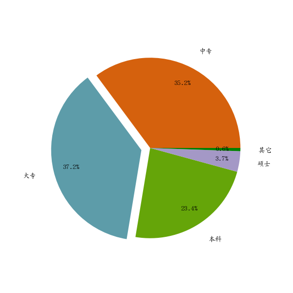

## pandas 绘制图形

### 折线图：单数据

源数据：
```python
s = pd.Series(np.random.randn(10).cumsum(), index=np.arange(0, 100, 10))
print(s)
'''
0     0.953802
10    2.237022
20    2.823467
30    4.406260
40    3.989382
50    2.401709
60    2.012727
70    0.531569
80   -0.203661
90   -1.246242
dtype: float64
'''
```

绘图：
```python
# 设置画布大小：
s.plot(figsize=(10, 6))
plt.rcParams['axes.unicode_minus']=False
s.plot()
plt.show()
```

图如下：   
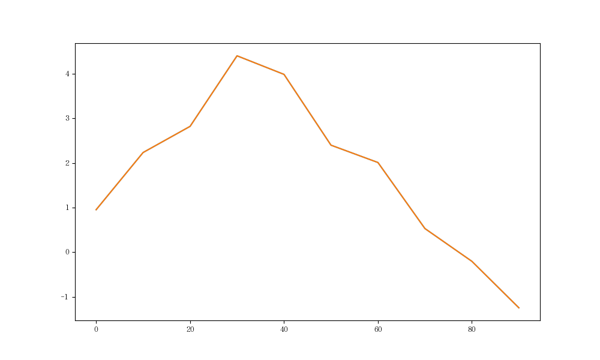

### 折线图：多个数据

源数据：
```python
df = pd.DataFrame(np.random.randn(10,4).cumsum(0),
                  columns=['one', 'two', 'three', 'four'],
                  index=np.arange(0, 100, 10)
)
```

绘图：
```python
df.plot()
plt.show()
```

图如下：   
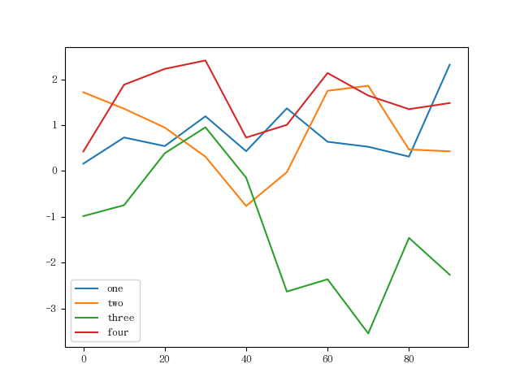


## seaborn
官方网址：https://seaborn.pydata.org/
### saeborn 简介
Seaborn 是一个基于 Matplotlib 的 Python 数据可视化库，专注于统计数据可视化。它提供了一些高级的绘图功能和美观的默认样式，使得创建各种类型的统计图表变得更加简单和直观。 
 
Seaborn 的设计目标是帮助用户快速地探索和理解数据，尤其是在数据分析和机器学习任务中。它提供了许多内置的函数和方法，可以轻松地创建常见的统计图表，如条形图、箱线图、散点图、热力图等。 
 
Seaborn 还支持对数据进行分组和聚合，以便更好地展示数据之间的关系。它提供了强大的功能，如分类数据的分布可视化、多变量数据的矩阵图、数据的线性关系可视化等。 
 
除了具有丰富的绘图功能，Seaborn 还提供了一些用于美化和定制图表的选项。您可以设置图表的主题、颜色、样式等，以及添加标签、标题、图例等元素，以增强图表的可读性和吸引力。 
 
Seaborn 还与 Pandas 和 NumPy 等其他常用的数据处理库无缝集成，使得在数据分析过程中可以更加方便地使用。 
 
总之，Seaborn 是一个功能强大且易于使用的统计数据可视化库。它提供了丰富的绘图选项和美观的默认样式，使得数据的探索和分析变得更加直观和有趣。无论是初学者还是专业用户，都可以通过 Seaborn 创建出令人印象深刻的统计图表。
### seaborn 安装
```
pip install seaborn
```
### seaborn 使用

#### 散点图：

源数据：
```python
iris = pd.read_csv(f'/data/gitlab/python3-data-analysis/012-20231102-matplotilib 进阶及 Seaborn/iris.csv')      # 该数据存放在 gitlab 数据分析仓库对应目录
print(iris)
'''
     sepal_length  sepal_width  petal_length  petal_width    species
0             5.1          3.5           1.4          0.2     setosa
1             4.9          3.0           1.4          0.2     setosa
2             4.7          3.2           1.3          0.2     setosa
3             4.6          3.1           1.5          0.2     setosa
4             5.0          3.6           1.4          0.2     setosa
..            ...          ...           ...          ...        ...
145           6.7          3.0           5.2          2.3  virginica
146           6.3          2.5           5.0          1.9  virginica
147           6.5          3.0           5.2          2.0  virginica
148           6.2          3.4           5.4          2.3  virginica
149           5.9          3.0           5.1          1.8  virginica

[150 rows x 5 columns]
'''
```

绘图：
```python
# 设置画布大小：
plt.figure(figsize=(8,5))
sns.scatterplot(data=iris, x='sepal_length', y='sepal_width', hue='species')
plt.show()
```

图如下：   
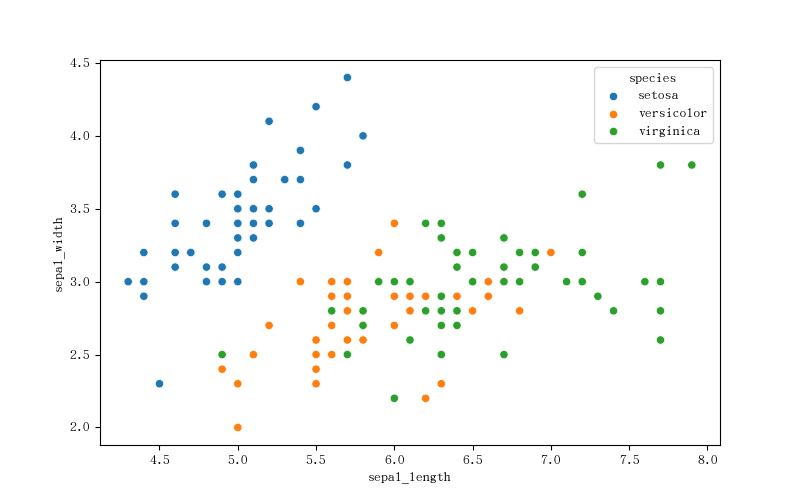


#### 箱线图

源数据：
```python
iris = pd.read_csv(f'/data/gitlab/python3-data-analysis/012-20231102-matplotilib 进阶及 Seaborn/iris.csv')      # 该数据存放在 gitlab 数据分析仓库对应目录
print(iris)
'''
     sepal_length  sepal_width  petal_length  petal_width    species
0             5.1          3.5           1.4          0.2     setosa
1             4.9          3.0           1.4          0.2     setosa
2             4.7          3.2           1.3          0.2     setosa
3             4.6          3.1           1.5          0.2     setosa
4             5.0          3.6           1.4          0.2     setosa
..            ...          ...           ...          ...        ...
145           6.7          3.0           5.2          2.3  virginica
146           6.3          2.5           5.0          1.9  virginica
147           6.5          3.0           5.2          2.0  virginica
148           6.2          3.4           5.4          2.3  virginica
149           5.9          3.0           5.1          1.8  virginica

[150 rows x 5 columns]
'''
```

绘图：
```python
# 设置画布大小：
plt.figure(figsize=(8,5))
sns.boxplot(x='species', y='petal_length', data=iris)
plt.show()
```

图如下：   
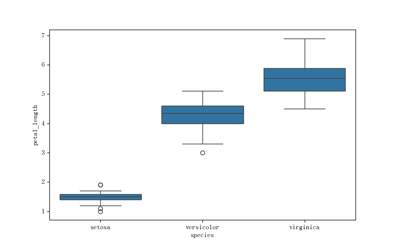


#### 直方图

源数据：
```python
iris = pd.read_csv(f'/data/gitlab/python3-data-analysis/012-20231102-matplotilib 进阶及 Seaborn/iris.csv')      # 该数据存放在 gitlab 数据分析仓库对应目录
print(iris)
'''
     sepal_length  sepal_width  petal_length  petal_width    species
0             5.1          3.5           1.4          0.2     setosa
1             4.9          3.0           1.4          0.2     setosa
2             4.7          3.2           1.3          0.2     setosa
3             4.6          3.1           1.5          0.2     setosa
4             5.0          3.6           1.4          0.2     setosa
..            ...          ...           ...          ...        ...
145           6.7          3.0           5.2          2.3  virginica
146           6.3          2.5           5.0          1.9  virginica
147           6.5          3.0           5.2          2.0  virginica
148           6.2          3.4           5.4          2.3  virginica
149           5.9          3.0           5.1          1.8  virginica

[150 rows x 5 columns]
'''
```

绘图：
```python
# 设置画布大小：
plt.figure(figsize=(8,5))
sns.histplot(data=iris, x='petal_length', hue='species', kde=True)
plt.show()
```

图如下：   
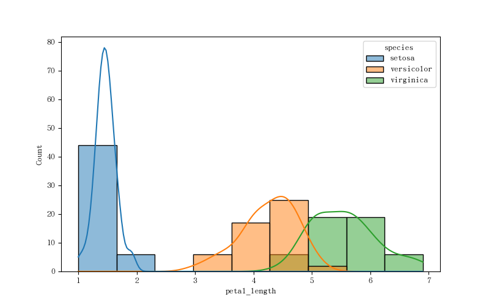


#### 热力图
源数据：
```python
iris = pd.read_csv(f'/data/gitlab/python3-data-analysis/012-20231102-matplotilib 进阶及 Seaborn/iris.csv')      # 该数据存放在 gitlab 数据分析仓库对应目录
print(iris)
'''
     sepal_length  sepal_width  petal_length  petal_width    species
0             5.1          3.5           1.4          0.2     setosa
1             4.9          3.0           1.4          0.2     setosa
2             4.7          3.2           1.3          0.2     setosa
3             4.6          3.1           1.5          0.2     setosa
4             5.0          3.6           1.4          0.2     setosa
..            ...          ...           ...          ...        ...
145           6.7          3.0           5.2          2.3  virginica
146           6.3          2.5           5.0          1.9  virginica
147           6.5          3.0           5.2          2.0  virginica
148           6.2          3.4           5.4          2.3  virginica
149           5.9          3.0           5.1          1.8  virginica

[150 rows x 5 columns]
'''
```

绘图：
```python
'''
# corr() 函数好像被弃用了，会报错：ValueError: could not convert string to float: 'setosa'
plt.figure(figsize=(8,6))
corr_matrix = iris.corr()
sns.heatmap(corr_matrix, annot=True, cmap='ocean')
plt.show()

# 运行上面的代码会报如下错误：
Traceback (most recent call last):
  File "/data/gitlab/python3-data-analysis/2023-11-02-matplotlib 进阶/实操.py", line 193, in <module>
    corr_matrix = iris.corr()
                  ^^^^^^^^^^^
  File "/home/leazhi/.local/lib/python3.11/site-packages/pandas/core/frame.py", line 10707, in corr
    mat = data.to_numpy(dtype=float, na_value=np.nan, copy=False)
          ^^^^^^^^^^^^^^^^^^^^^^^^^^^^^^^^^^^^^^^^^^^^^^^^^^^^^^^
  File "/home/leazhi/.local/lib/python3.11/site-packages/pandas/core/frame.py", line 1892, in to_numpy
    result = self._mgr.as_array(dtype=dtype, copy=copy, na_value=na_value)
             ^^^^^^^^^^^^^^^^^^^^^^^^^^^^^^^^^^^^^^^^^^^^^^^^^^^^^^^^^^^^^
  File "/home/leazhi/.local/lib/python3.11/site-packages/pandas/core/internals/managers.py", line 1656, in as_array
    arr = self._interleave(dtype=dtype, na_value=na_value)
          ^^^^^^^^^^^^^^^^^^^^^^^^^^^^^^^^^^^^^^^^^^^^^^^^
  File "/home/leazhi/.local/lib/python3.11/site-packages/pandas/core/internals/managers.py", line 1715, in _interleave
    result[rl.indexer] = arr
    ~~~~~~^^^^^^^^^^^^
ValueError: could not convert string to float: 'setosa'
'''

# 加载 iris 数据集
iris = load_iris()
iris_df = pd.DataFrame(data=iris.data, columns=iris.feature_names)

# 移除非数值型的列
numeric_columns = iris_df.select_dtypes(include=[float, int]).columns
iris_numeric = iris_df[numeric_columns]

# 计算相关系数矩阵
corr_matrix = iris_numeric.corr()

# 绘制热力图
plt.figure(figsize=(8,6))
sns.heatmap(corr_matrix, annot=True, cmap='ocean')
plt.show()
```

图如下：   
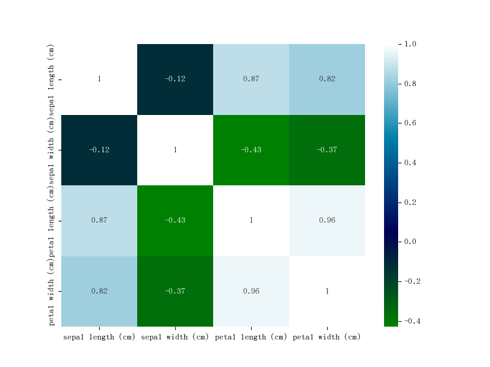