## Plotly 简介

Plotly 是一个交互式的数据可视化库，用于创建高质量的图表和可视化。它支持多种编程语言，包括 Python、R、JavaScript等。 
 
Plotly 提供了丰富的图表类型，包括折线图、散点图、柱状图、饼图、热力图、地图等等。这些图表可以通过交互方式进行探索和操作，例如缩放、平移、悬停显示数据信息等。 
 
使用 Plotly，您可以创建漂亮且具有交互性的图表，并将其嵌入到网页、Jupyter Notebook、Dash应用程序等中。它还支持生成静态图像文件，如PNG、JPEG等。 
 
Plotly 提供了一个面向对象的接口，使得用户可以对图表进行高度定制。您可以设置标题、轴标签、图例、颜色、线型等属性，以及添加注释、标记点、网格线等元素，以满足特定的可视化需求。 
 
此外，Plotly 还提供了在线的可视化工具和社区，您可以在 Plotly 的网站上保存和共享您的图表，与他人进行协作和交流。 

## Plotly 安装
```python
pip install plotly
```


## Plotly 使用

### 导入模块
```python
import os
import numpy as np
import pandas as pd
import plotly as py
import plotly.graph_objects as go
import plotly.express as px
from plotly import tools
import warnings

warnings.filterwarnings('ignore')
```


### plotly.graph_objects 模块绘图

#### 折线图

##### 单数据

源数据：
```python
t = np.linspace(0, 10, 100)
y = np.sin(t)
```

绘图：
```python
# 首先，代码创建了一个 Scatter 对象，通过调用  go.Scatter()  类来实现。在这个对象中， x  和  y  是折线图的横轴和纵轴数据。 mode='lines'  表示绘制的是折线图。 
data = go.Scatter(x = t, y = y, mode='lines')     # 调用 Scatter() 类

# 接下来，代码创建了一个 Figure 对象，通过调用  go.Figure()  类来实现。在这个对象中， data  参数传入了之前创建的 Scatter 对象，表示将 Scatter 对象添加到 Figure 中。 
fig = go.Figure(data)

# 布局（设置图片大小、背景色）
fig.update_layout(
    margin=dict(l=20, r=20, t=20, b=20),
    paper_bgcolor='pink',
    width=500,
    height=400
)

# 最后，通过调用  fig.show()  方法，显示了生成的图形。 
fig.show()
```

图如下：

**不设置布局属性的原图**：   
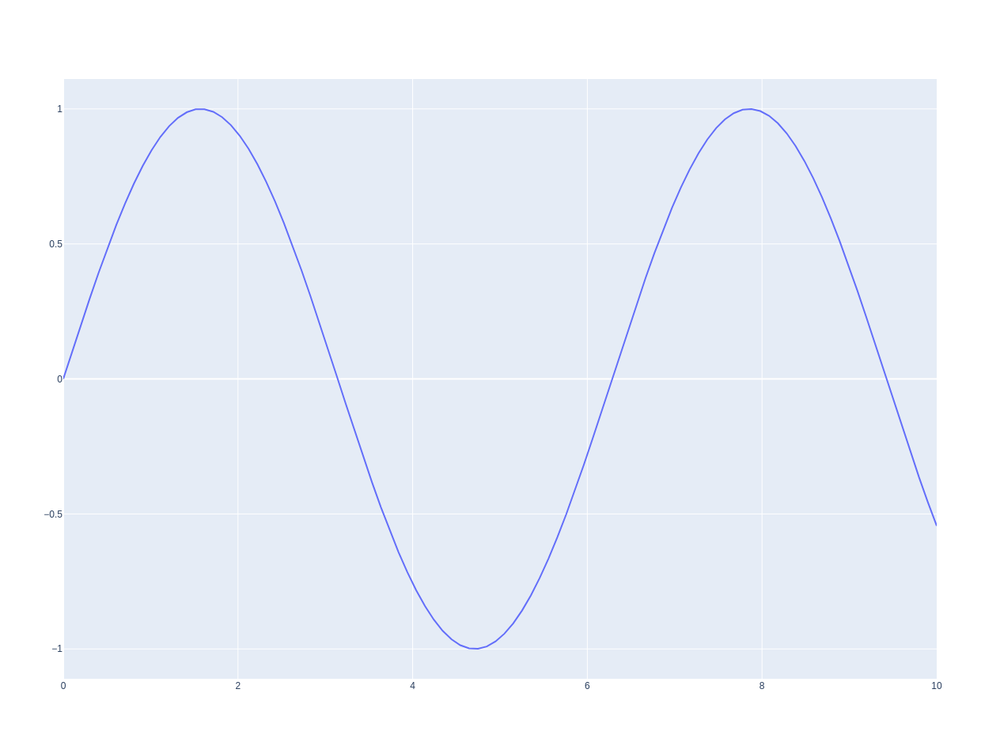

**设置图片属性后的图**：  
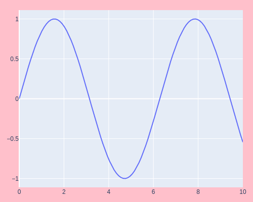


##### 多数据

源数据：
```python
t = np.linspace(0, 10, 100)
y1 = np.sin(t)
y2 = np.cos(t)*2
```

绘图：
```python
trace1 = go.Scatter(x =t, y=y1, mode='lines')
trace2 = go.Scatter(x=t, y=y2, mode='lines')

fig=go.Figure([trace1, trace2])         # 多数据的绘图，需要将数据存放到一个列表中
fig.show()
```

图如下：     
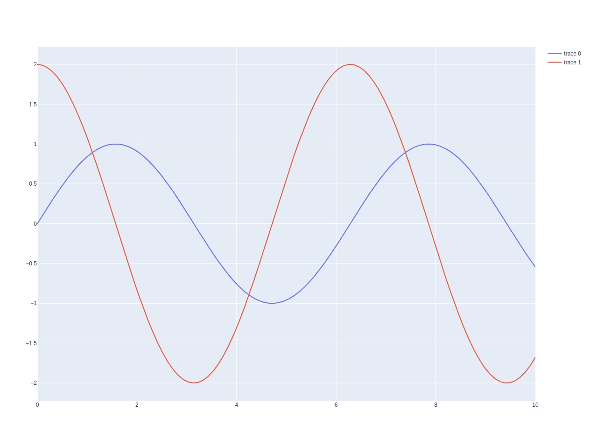


#### 柱状图

##### 单数据
源数据：
```python
friends = ['木易','小渝', '久别无恙']
data = go.Bar(x=friends, y =[99, 87, 92])
```

绘图：
```python
fig = go.Figure(data)
fig.show()
```

图如下： 
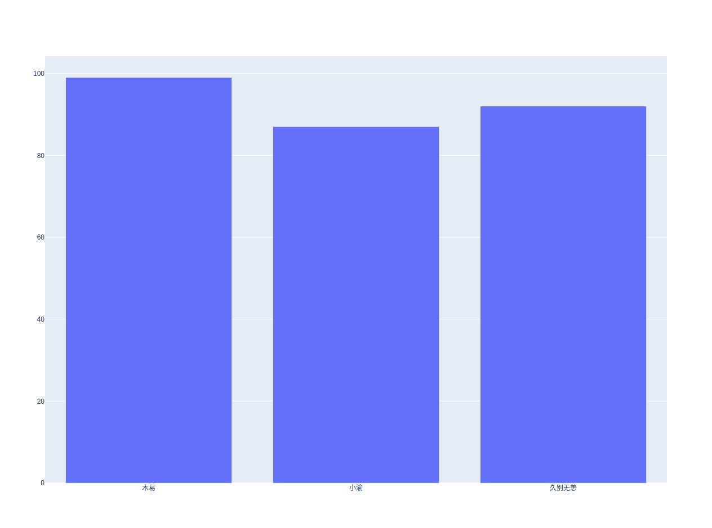

##### 多数据（并排）

源数据：
```python
friends = ['木易','小渝', '久别无恙']
data1 = go.Bar(x=friends, y =[99, 87, 92], name='英语')
data2 = go.Bar(x=friends, y =[76, 95, 95], name='数学')
```

绘图：
```python
fig = go.Figure([data1, data2])
fig.show()
```

图如下：   
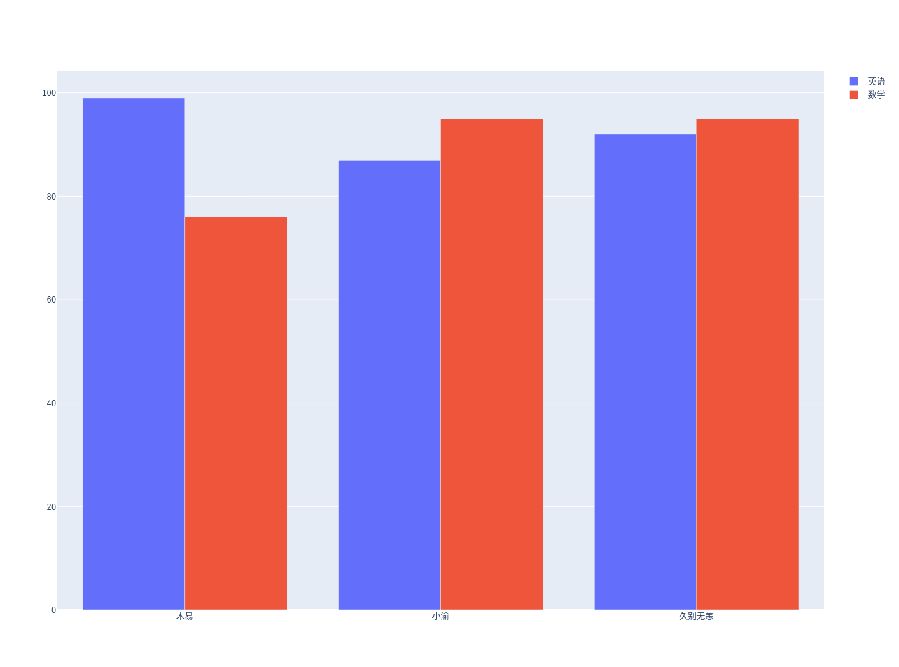


##### 多数据（叠加）

常用于数据组之间的 百分比 比较

源数据：
```python
friends = ['木易','小渝', '久别无恙']
data1 = go.Bar(x=friends, y =[99, 87, 92], name='英语')
data2 = go.Bar(x=friends, y =[76, 95, 95], name='数学')
```

绘图：
```python
fig = go.Figure([data1, data2])

# 柱子堆叠
fig.update_layout(barmode='stack')
fig.show()
```

图如下：   
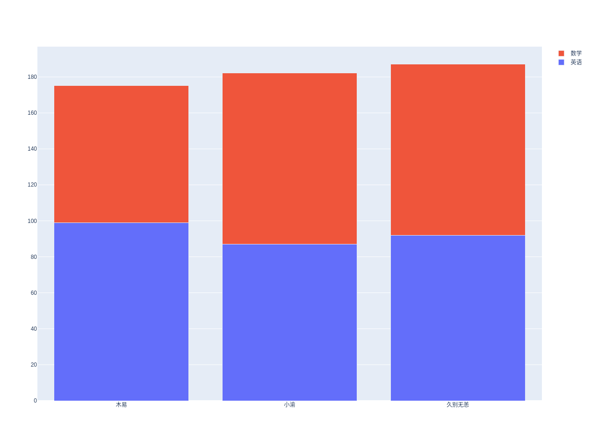

#### 点线组合

源数据：
```python
trace1 = go.Scatter(
    x = [1, 2],
    y = [1, 2],
    name='哈哈'
)

trace2= go.Scatter(
    x = [1, 2],
    y = [2, 1],
    name='呵呵',
    marker=dict(            # 设置散点的属性（大小，颜色）
        color = ['red','green'],
        size = [33, 66]
    ),
    mode='markers'          # 加这个属性就直接显示散点
)
```

绘图：
```python
fig= go.Figure([trace1, trace2])
fig.show()
```

**不设置任何属性的原图**：   
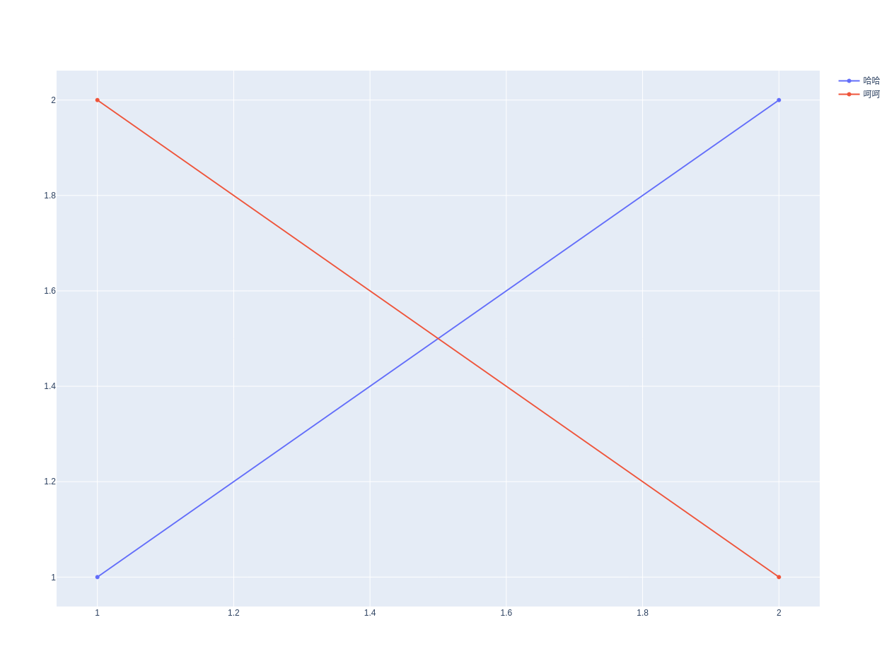

**设置 mode='markers' 属性的图**： 
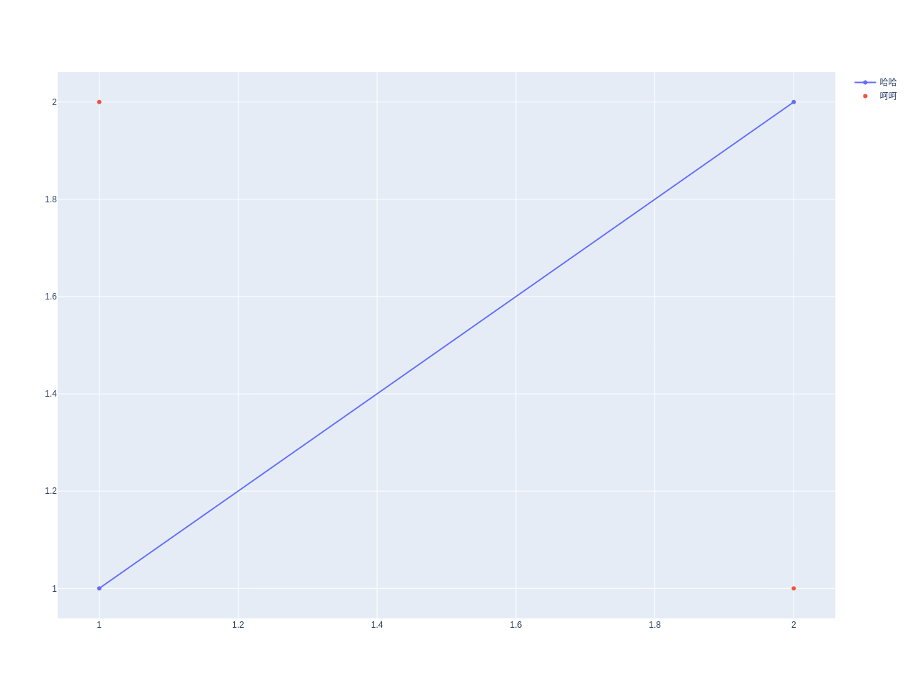

**设置 marker=dict(color = ['red','green'],size = [33, 66]) 属性的图**：  
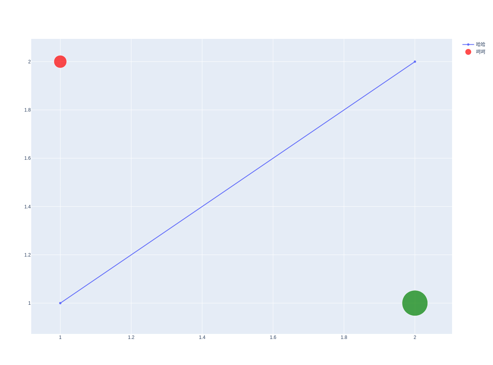

### lotly.expression 模块绘图

#### 散点图
源数据：
```python
iris = px.data.iris()
print(iris.head())
'''
   sepal_length  sepal_width  petal_length  petal_width species  species_id
0           5.1          3.5           1.4          0.2  setosa           1
1           4.9          3.0           1.4          0.2  setosa           1
2           4.7          3.2           1.3          0.2  setosa           1
3           4.6          3.1           1.5          0.2  setosa           1
4           5.0          3.6           1.4          0.2  setosa           1
'''
```

绘图：
```python
fig = px.scatter(iris, x='sepal_length', y='sepal_width', color='species')
fig.show()
```

图如下：  
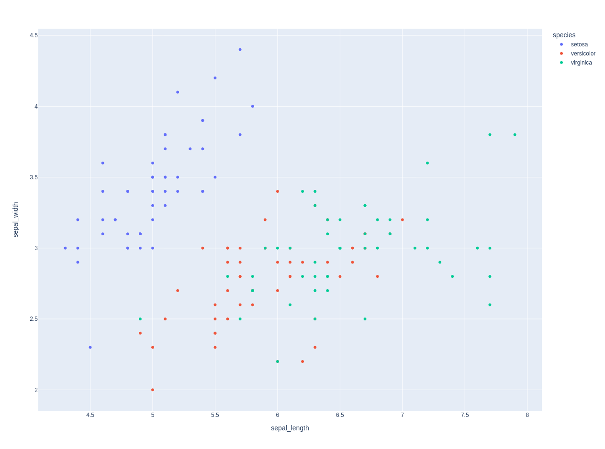


#### 饼图

源数据：
```python
df = px.data.gapminder().query("year==2007").query('continent =="Americas"')            # 内置全球各州人口寿命、GDP 数据信息
print(df)
'''
                  country continent  year  ...     gdpPercap  iso_alpha  iso_num
59              Argentina  Americas  2007  ...  12779.379640        ARG       32
143               Bolivia  Americas  2007  ...   3822.137084        BOL       68
179                Brazil  Americas  2007  ...   9065.800825        BRA       76
251                Canada  Americas  2007  ...  36319.235010        CAN      124
287                 Chile  Americas  2007  ...  13171.638850        CHL      152
311              Colombia  Americas  2007  ...   7006.580419        COL      170
359            Costa Rica  Americas  2007  ...   9645.061420        CRI      188
395                  Cuba  Americas  2007  ...   8948.102923        CUB      192
443    Dominican Republic  Americas  2007  ...   6025.374752        DOM      214
455               Ecuador  Americas  2007  ...   6873.262326        ECU      218
479           El Salvador  Americas  2007  ...   5728.353514        SLV      222
611             Guatemala  Americas  2007  ...   5186.050003        GTM      320
647                 Haiti  Americas  2007  ...   1201.637154        HTI      332
659              Honduras  Americas  2007  ...   3548.330846        HND      340
791               Jamaica  Americas  2007  ...   7320.880262        JAM      388
995                Mexico  Americas  2007  ...  11977.574960        MEX      484
1115            Nicaragua  Americas  2007  ...   2749.320965        NIC      558
1187               Panama  Americas  2007  ...   9809.185636        PAN      591
1199             Paraguay  Americas  2007  ...   4172.838464        PRY      600
1211                 Peru  Americas  2007  ...   7408.905561        PER      604
1259          Puerto Rico  Americas  2007  ...  19328.709010        PRI      630
1559  Trinidad and Tobago  Americas  2007  ...  18008.509240        TTO      780
1619        United States  Americas  2007  ...  42951.653090        USA      840
1631              Uruguay  Americas  2007  ...  10611.462990        URY      858
1643            Venezuela  Americas  2007  ...  11415.805690        VEN      862

[25 rows x 8 columns]
'''
```

绘图：
```python
fig= px.pie(df, values = 'pop', names = 'country', title="美洲人口", hover_data=['lifeExp'],hole=0.5)   # hole 设置空洞的半径
fig.update_traces(textposition="inside", textinfo="percent+label")   # textpostion 文本位置； textinfo 文本信息：百分比+标签的形式
fig.update_layout(uniformtext_minsize=12, uniformtext_mode='hide')   # uniformtext_minsize：设置字体小于 12 的隐藏 ；uniformtext_mode：隐藏
fig.show()
```

图如下：   

**不设置任何属性的原图**： 


**设置 fig.update_traces(textposition="inside", textinfo="percent+label") 属性的图**：  
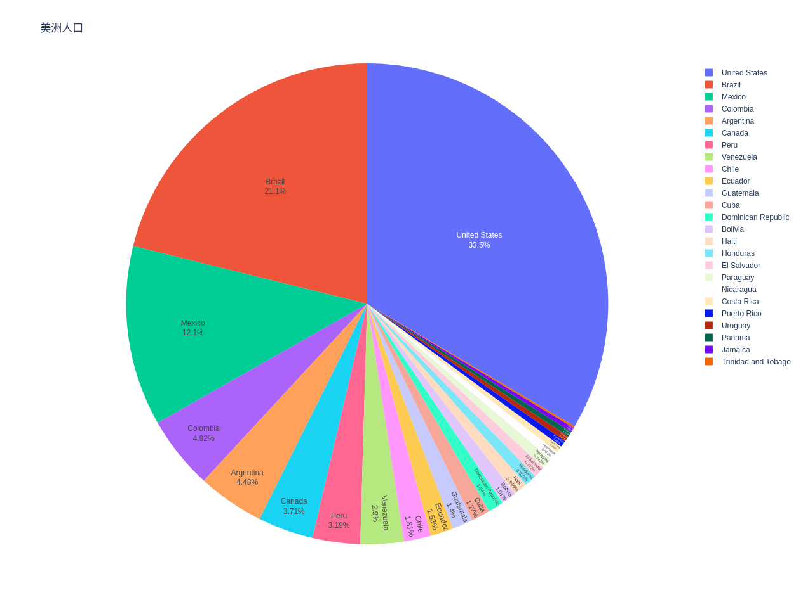

**设置 fig.update_layout(uniformtext_minsize=12, uniformtext_mode='hide') 属性的图**：  


**设置 hole=0.5 属性的图**：  
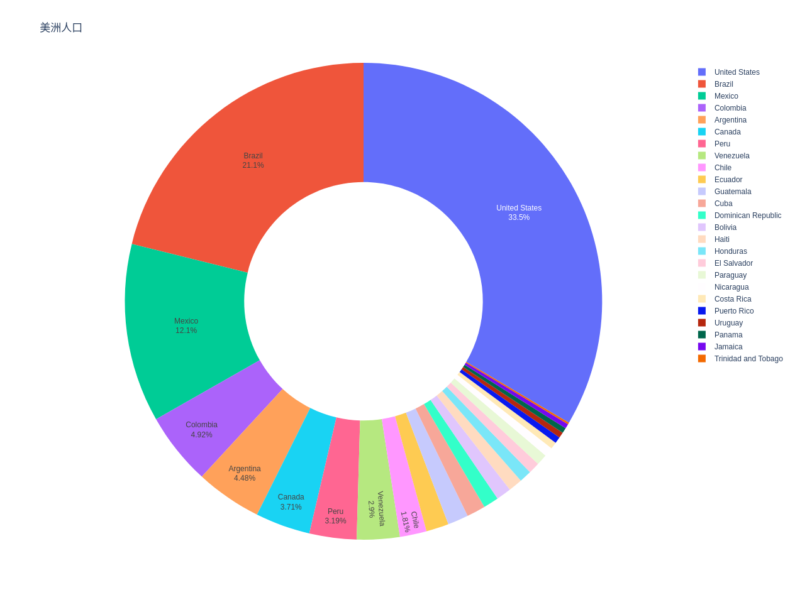


#### 气泡图
源数据：
```python
gap = px.data.gapminder().query("year == 2002")
```

绘图：
```python
fig = px.scatter(
    gap,
    x = 'gdpPercap',
    y = 'lifeExp',
    size = 'pop',
    size_max=60,
    color='continent'
)
fig.show()
```

图如下：   
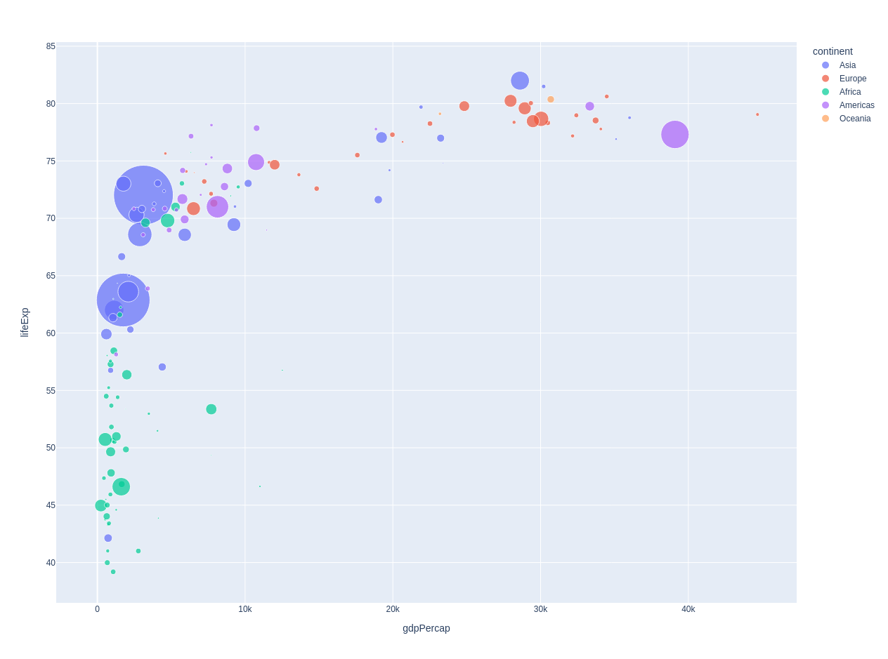

#### 旭日图
常用于层级关系
源数据：
```python
df = px.data.tips()
print(df)
'''
     total_bill   tip     sex smoker   day    time  size
0         16.99  1.01  Female     No   Sun  Dinner     2
1         10.34  1.66    Male     No   Sun  Dinner     3
2         21.01  3.50    Male     No   Sun  Dinner     3
3         23.68  3.31    Male     No   Sun  Dinner     2
4         24.59  3.61  Female     No   Sun  Dinner     4
..          ...   ...     ...    ...   ...     ...   ...
239       29.03  5.92    Male     No   Sat  Dinner     3
240       27.18  2.00  Female    Yes   Sat  Dinner     2
241       22.67  2.00    Male    Yes   Sat  Dinner     2
242       17.82  1.75    Male     No   Sat  Dinner     2
243       18.78  3.00  Female     No  Thur  Dinner     2

[244 rows x 7 columns]
'''
```

绘图;
```python
fig = px.sunburst(
    df,
    path=['day', 'time', 'sex'],
    values='total_bill'
)
fig.show()
```

图如下： 
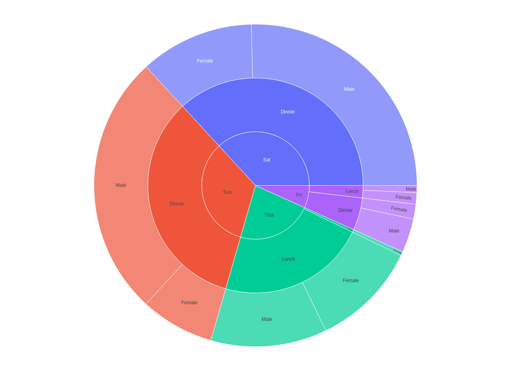


#### 动态地图
源数据：
```python
gapminder = px.data.gapminder()
```

绘图：
```python
fig = px.choropleth(
    gapminder,
    locations='iso_alpha',
    color='lifeExp',
    animation_frame='year',         # 按关键字 year 进行动态
    color_continuous_scale=px.colors.diverging.RdBu,
    projection='natural earth'
)
fig.show()
```

图如下：     
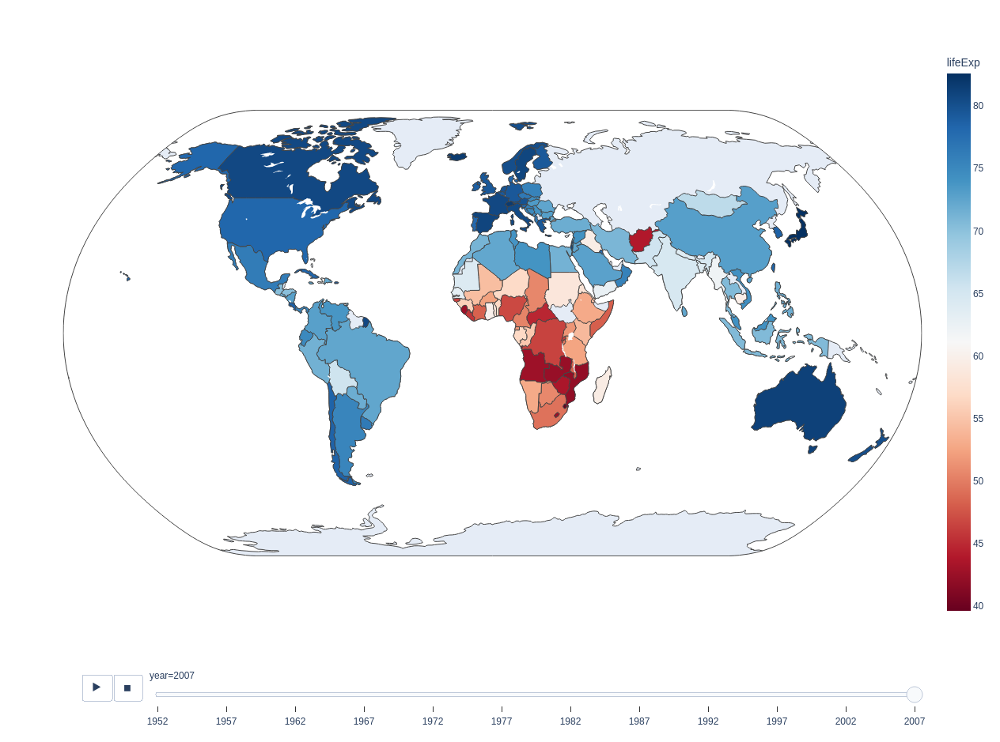


#### 双Y轴
