
**点击本文中的链接，如果图片加载不成来或者是一片空白，请重新刷新下网页**


## pyecharts 简介

pyecharts 是一个基于 Python 的数据可视化库，它提供了丰富的图表类型和交互功能，可以帮助用户快速地创建高质量的数据可视化图表。pyecharts 采用了 echarts.js 作为底层图表库，因此具有 echarts.js 的优秀特性，如丰富的图表类型、灵活的配置项、强大的数据处理能力等。同时，pyecharts 也提供了 Pythonic 的 API 接口，使得用户可以使用 Python 的方式来创建图表，非常方便易用。

pyecharts 绘图分为2个方向，分别为：直角坐标系图和非直角坐标系图


## pyecharts 安装

打开命令行终端，直接执行安装命令：
```bash
pip install pyecharts
```

## pyecharts 使用

### 导入必要的库

```python
from pyecharts import options as opts
from pyecharts.charts import *
import random
import numpy as np
```

### 绘图

#### 直角坐标图有以下类型

##### 柱状图：

源数据：
```python
months = ['一月', '二月', '三月', '四月', '五月', '六月']
cost = [1200, 1500, 1800, 1400, 1600, 2000]
``` 

绘图：
```python
bar = (
    # Bar()                               # 实例化柱状图对象
    Bar(init_opts=opts.InitOpts(            # 设置画布
        width='700px',
        height='600px'
    ))
    .add_xaxis(months)                  # 添加 x 轴数据
    .add_yaxis("消费金额（元）", cost)     # 添加 y 轴数据
)
bar.render('./pyecharts_bar03.html')      # 生成图表
# bar.render_notebook()                 # 使用 notebook 交互的化可以使用这种方式直接显示图形
```

<!-- 不加设置画布大小参数的原图,如图： [折线图 --- 点击这里查看效果图](https://hexo.linuser.com/static/img/20231109/pyecharts_bar01.html)        -->
原图,如图：   
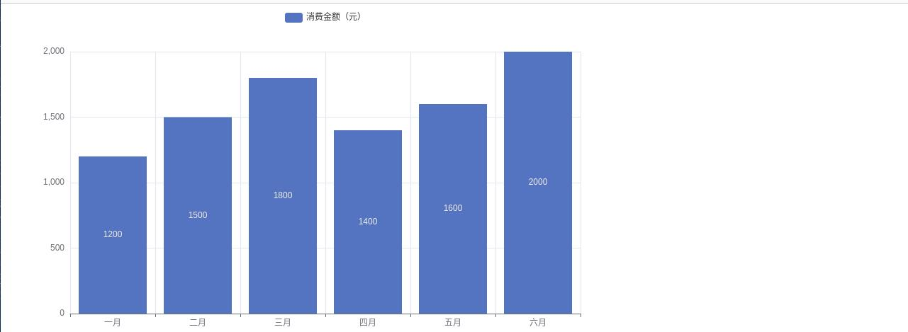

<!-- 加设置画布大小参数的图：[折线图 --- 点击这里查看效果图](https://hexo.linuser.com/static/img/20231109/pyecharts_bar03.html)     -->
设置画布大小参数的图：  
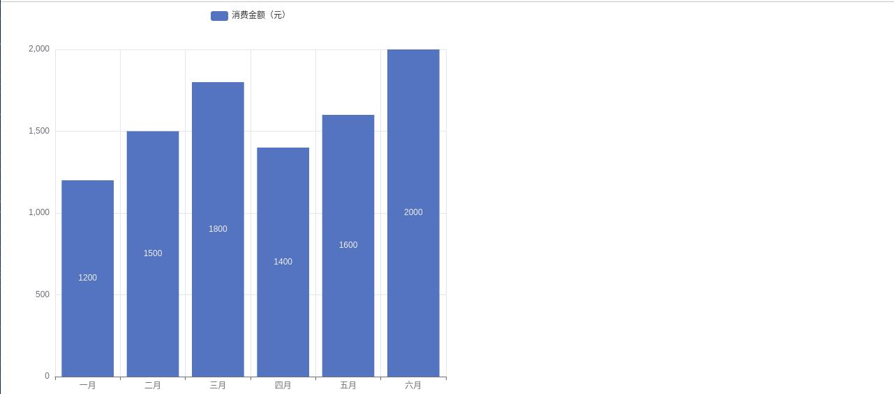


源数据：
```python
x_data = ['水笔', '铅笔', '钢笔', '圆珠笔']
y_data = [40, 30, 98, 42]
```

绘图：
```python
bar = (
    Bar()
    .add_xaxis(x_data)
    .add_yaxis("", y_data)
)
bar.render('./pyecharts_bar02.html')
```

如图：   
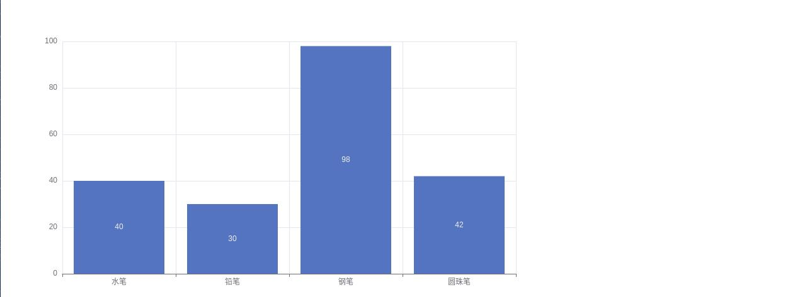


##### 折线图

源数据：
```python
days = ['星期一', '星期二', '星期三', '星期四', '星期五', '星期六','星期天']
temperatures = [28, 29, 30, 32, 31, 30, 29]
```

绘图：
```python
line = (
    Line()
    .add_xaxis(days)
    .add_yaxis('气温', temperatures)
)

line.render('./pyecharts_line01.html')
```

<!-- [折线图 --- 点击这里查看效果图](https://hexo.linuser.com/static/img/20231109/pyecharts_bar02.html) -->
如图：    
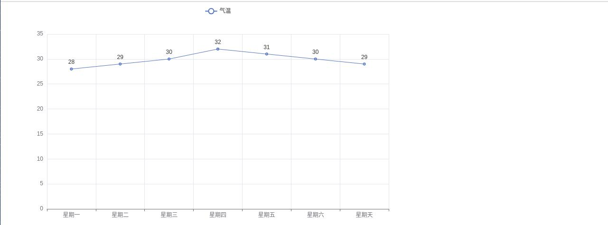


##### 散点图

源数据：
```python
cities = ['北京', '上海', '广州', '深圳', '成都', '重庆']
temperatures = [32, 33, 30, 31, 28, 30]
```

绘图：
```python
scatter = (
    Scatter()
    .add_xaxis(cities)
    .add_yaxis('城市气温', temperatures)
)
scatter.render('./pyecharts_scatter01.html')
```

<!-- [散点图 --- 点击这里查看效果图](https://hexo.linuser.com/static/img/20231109/pyecharts_bar02.html) -->

如图：    
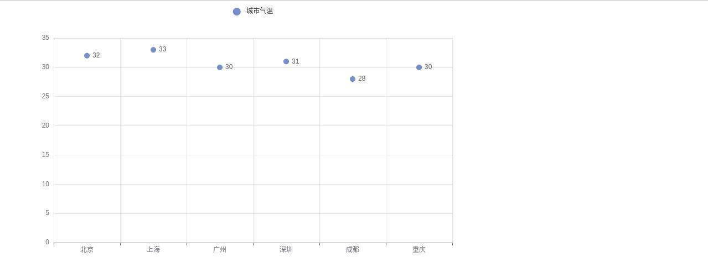


#### 非直角坐标系图有以下类型：

##### 饼图

```python
fruits = ['苹果', '香蕉', '橙子', '草莓', '葡萄']
sales = [45, 30, 25, 20, 15]
```

绘图：
```python
pie = (
    Pie()
    .add(
        series_name='水果销售占比',
        data_pair= [list(z) for z in zip(fruits, sales)], # 打包数据对
        radius=['30%', '60%'] ,# 设置半径,第一个值为内半径，第二个值为外半径
        label_opts=opts.LabelOpts(formatter="{b}:{d}%"), # 设置标签
        rosetype='radius'   # 是否设置显示南丁格尔图
    )
)
pie.render('./pyecharts_pie04.html')
```
<!-- [饼图 ---不带参数--- 点击这里查看效果图](https://hexo.linuser.com/static/img/20231109/pyecharts_pie01.html) -->
<!-- [饼图 ---带参数（radius=['30%', '60%']）--- 点击这里查看效果图](https://hexo.linuser.com/static/img/20231109/pyecharts_pie02.html) -->
<!-- [饼图 ---带参数（label_opts=opts.LabelOpts(formatter="{b}:{d}%")）--- 点击这里查看效果图](https://hexo.linuser.com/static/img/20231109/pyecharts_pie03.html) -->
<!-- [饼图 ---带参数（rosetype='radius'）--- 点击这里查看效果图](https://hexo.linuser.com/static/img/20231109/pyecharts_pie04.html) -->

不设置任何参数的原图，如图：    
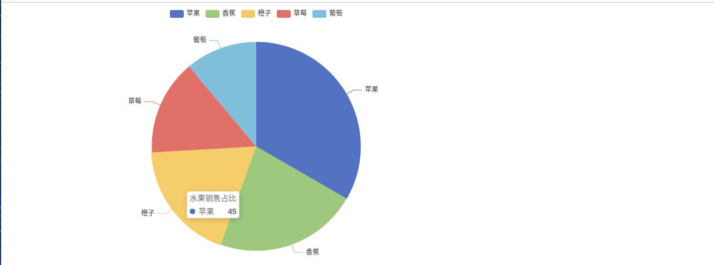   

设置参数 `radius=['30%', '60%']` 的图：
   

设置参数 `label_opts=opts.LabelOpts(formatter="{b}:{d}%"),` 的图：
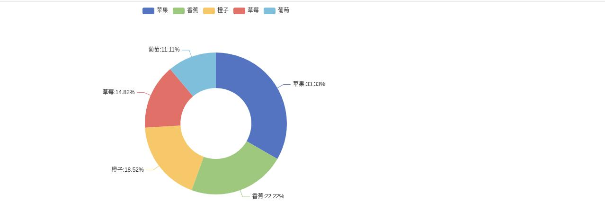   

设置参数 `rosetype='radius'` 的图：
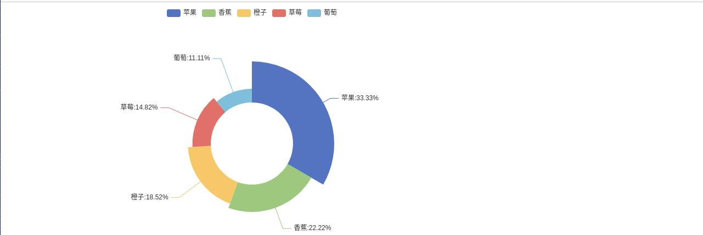  

##### 地图：

###### Geo()

源数据：
```python
province= ['湖北', '湖北','广东','广西','安徽','浙江','江苏','重庆','四川','陕西','山西','河南','河北']
data = [(i ,random.randint(50, 150)) for i in province]
```

绘图：
```python
geo = (
    Geo()
    .add_schema(maptype="china")
    .add("中国地图", data)
)
geo.render("./pyecharts_geo01.html")
```

<!-- [geo 地图 --- 点击这里查看效果图](https://hexo.linuser.com/static/img/20231109/pyecharts_geo01.html) -->
如图：    
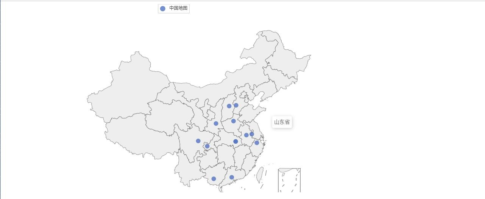 


###### Map()

源数据：
```python
province= ['湖南省', '湖北省','广东省','广西省','安徽省','浙江省','江苏省','重庆省','四川省','陕西省','山西省','河南省','河北省']
data = [(i ,random.randint(50, 150)) for i in province]
```

绘图：
```python
map = Map()
map.add("疫情地图", data, maptype='china')
# 图表实例.set_global_opts(配置项名称=opts.配置项类名({key: value}))
map.set_global_opts(
    title_opts=opts.TitleOpts(title="全国疫情地图"),
    visualmap_opts=opts.VisualMapOpts(
        is_show=True,
    )
)
map.render('./pyecharts_map02.html')
```
<!-- [map 地图 --- 不设置全局参数 --- 点击这里查看效果图](https://hexo.linuser.com/static/img/20231109/pyecharts_map01.html) -->
<!-- [map 地图 --- 设置全局参数 --- 点击这里查看效果图](https://hexo.linuser.com/static/img/20231109/pyecharts_map02.html) -->

不设置全局变量的原图：   
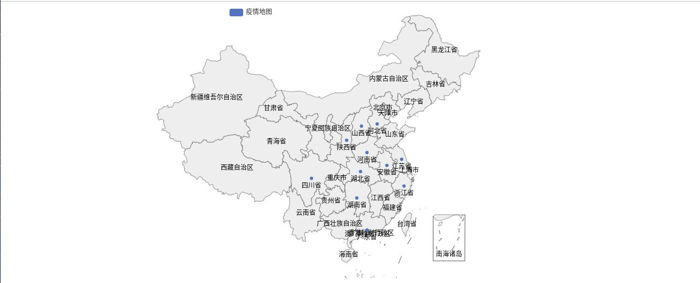 

设置全局变量的图：  
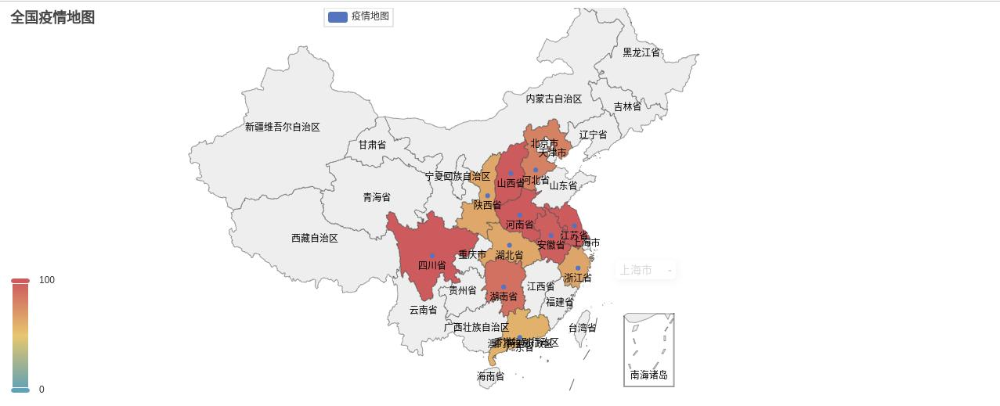 


##### 词云图
源数据：
```python
words = [
    ('hello', 2),
    ('make', 265),
    ('smart', 273),
    ('can', 282),
    ('you', 360),
    ('your', 82),
    ('heart', 172),
    ('then', 365),
    ('into', 60),
    ('her', 266),
    ('let', 162),
    ('to', 150),
    ('remember', 255),
    ('better', 182),
    ('it', 247),
    ('bad', 244),
    ('jude', 124),
    ('hey', 230),
    ('dont', 436),
]
```

绘图：
```python
wc = (
    WordCloud()
    .add("词云图", words)
)
wc.render('./pyecharts_words01.html')
```
<!-- [词云图 --- 点击这里查看效果图](https://hexo.linuser.com/static/img/20231109/pyecharts_words01.html) -->

如图：   
 


##### 仪表板

仪表板就是将多个图合并到一个页面中。它的制作稍稍麻烦，具体过程如下：

```python
def bar():
    x_data = ['水笔', '铅笔', '钢笔', '圆珠笔']
    y_data = [40, 30, 98, 42]

    bar = (
        Bar()
        .add_xaxis(x_data)
        .add_yaxis("", y_data)
    )

    return bar

def line():
    x_data = ['Apple', 'Huawei', 'Xiaomi', 'Oppo', 'Vivo', 'Meizu']
    y_data = [123, 153, 98, 107, 98, 23]
    line = (
        Line()
        .add_xaxis(x_data)
        .add_yaxis("手机排名", y_data)
    )

    return line

def scatter():
    x = np.linspace(0, 2*np.pi, 100)
    y = np.sin(x)   # 正弦
    scatter = (
        Scatter()
        .add_xaxis(x)
        .add_yaxis('正弦', y)
    )
    return scatter

def pie():
    num = [110, 136, 108, 48, 111, 112, 103]
    lab=['哈士奇', '萨莫耶', '泰迪', '金毛', '牧羊犬', '吉娃娃', '柯基']

    pie = (
        Pie()
        .add(
            series_name='犬种',
            data_pair= [list(z) for z in zip(lab, num)], # 打包数据对
            radius=['20%', '45%'],
            rosetype='radius'
        )
    )

    return  pie


# 首先：添加一个布局
page = Page(layout=Page.DraggablePageLayout, page_title="仪表板")

# 其次：在创建的画布中添加图形
page.add(
    bar(),
    line(),
    scatter(),
    pie()
)

# 接着：保存图形（这个是拼接前的图形页面，生成完成后需要注释掉）
# page.render('./pyecharts_board01.html')

# 最后：保存拼接后的图形（这个是拼接后的图形页面，chart_config.json 文件是打开拼接前的图形页面，做完图形拼接后保存生成的配置文件）
page.save_resize_html('./pyecharts_board01.html', cfg_file='./chart_config.json', dest='./pyecharts_board02.html')
```
<!-- [仪表板 --- 拼接前 --- 点击这里查看效果图](https://hexo.linuser.com/static/img/20231109/pyecharts_board01.html) -->

<!-- [仪表板 --- 拼接后 --- 点击这里查看效果图](https://hexo.linuser.com/static/img/20231109/pyecharts_board02.html) -->

拼接前在同一画布的图：  
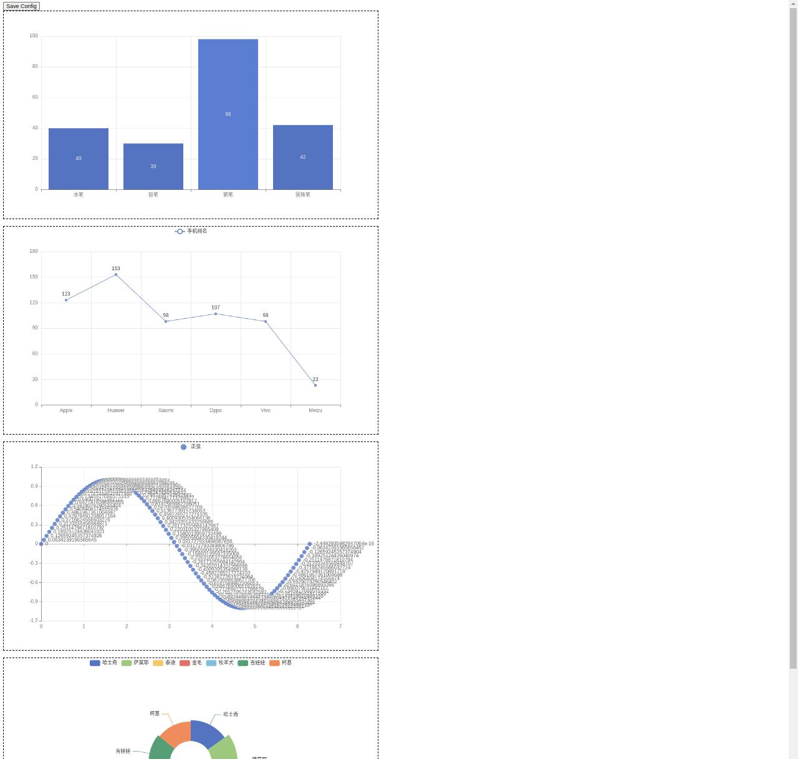 

拼接后在同一画布的图：  
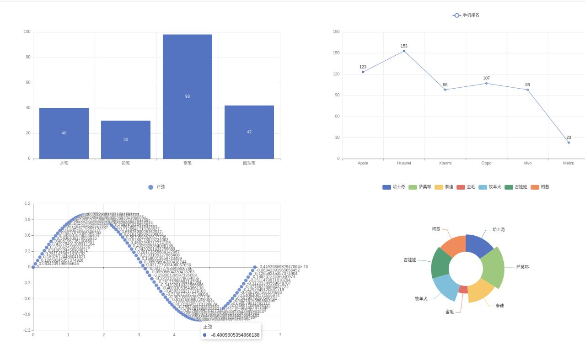 